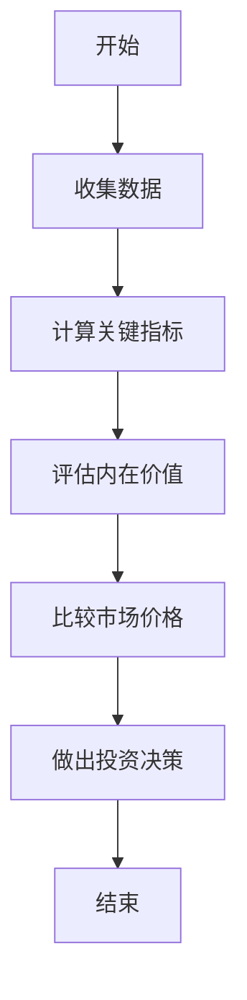

                 


# 乔尔·格林布拉特的价值投资教育

> 关键词：价值投资, 乔尔·格林布拉特, 投资教育, 股票分析, 价值评估

> 摘要：本文深入探讨了乔尔·格林布拉特的价值投资理念，分析了其核心概念、算法原理和系统架构，并通过实际案例展示了如何在投资中应用这些方法。文章结构清晰，内容详实，适合希望深入了解价值投资的读者。

---

## 第1章: 价值投资的背景与发展

### 1.1 价值投资的起源与发展

#### 1.1.1 投资学的起源与发展

投资学作为一门学科，起源于对财富增长的永恒追求。早期的投资行为主要依赖于经验和个人直觉，但随着市场的复杂化，投资者逐渐意识到需要系统化的方法来分析和决策。20世纪初，本杰明·格雷厄姆和戴维·多德等人提出了价值投资的概念，为投资领域带来了革命性的变化。

#### 1.1.2 价值投资的核心理念

价值投资的核心理念是购买低于其内在价值的资产。格雷厄姆和多德提出的“安全边际”概念强调，投资者应购买那些市场价格显著低于其内在价值的股票，以降低风险并确保长期收益。这一理念在20世纪得到了广泛应用，并在实践中取得了显著成效。

#### 1.1.3 乔尔·格林布拉特的贡献

乔尔·格林布拉特是价值投资领域的另一位重要人物。他在格雷厄姆和多德的基础上，进一步发展了价值投资的方法，提出了“三步走”策略：寻找市场低估的公司、评估管理层的质量、关注公司治理结构。格林布拉特的方法强调量化分析和风险控制，为现代价值投资提供了新的视角。

---

### 1.2 价值投资的核心概念

#### 1.2.1 投资的基本问题

投资的核心问题是如何在不确定的市场中实现资产的保值与增值。投资者需要在风险和收益之间找到平衡点，选择适合自己的投资策略。价值投资通过分析公司的基本面，帮助投资者识别被市场低估的机会。

#### 1.2.2 价值投资的定义与特点

价值投资是一种以公司基本面分析为基础的投资方法，强调购买价格低于内在价值的股票。其特点包括长期导向、注重安全边际和对管理层的信任。价值投资的核心在于识别市场错误定价的机会，并在市场反转时获利。

#### 1.2.3 格林布拉特投资方法的核心要素

格林布拉特的价值投资方法主要包括以下几个要素：
1. **量化分析**：通过市盈率（P/E）、市净率（P/B）等指标评估股票的内在价值。
2. **安全边际**：购买价格低于内在价值的股票，确保有足够的安全空间。
3. **管理层质量**：关注公司管理层的能力和诚信，避免投资管理不善的公司。
4. **公司治理**：评估公司治理结构，确保管理层与股东利益一致。

---

### 1.3 价值投资的哲学与实践

#### 1.3.1 投资的长期主义

价值投资强调长期持有优质资产，避免短期市场的波动干扰。格林布拉特认为，市场的短期波动往往反映的是投资者的非理性行为，而非公司的实际价值。因此，长期投资者应耐心等待市场回归理性。

#### 1.3.2 格林布拉特的投资策略

格林布拉特的投资策略主要包括以下步骤：
1. **筛选低估值股票**：通过量化指标筛选出市场价格低于内在价值的股票。
2. **评估管理层**：分析公司管理层的能力和诚信，确保公司具有良好的管理团队。
3. **关注公司治理**：评估公司治理结构，确保管理层与股东利益一致。

#### 1.3.3 价值投资的边界与外延

价值投资的边界在于其适用性。虽然价值投资在股票市场中表现优异，但在其他资产类别（如债券、房地产）中可能表现不佳。因此，投资者需要根据自身情况选择合适的投资策略。

---

### 1.4 价值投资与其他投资方法的对比

#### 1.4.1 股票投资的主要方法

股票投资的主要方法包括：
1. **价值投资**：通过基本面分析寻找低估股票。
2. **成长投资**：投资于高成长性的公司。
3. **技术分析**：通过价格和成交量预测未来走势。

#### 1.4.2 价值投资与成长投资的区别

价值投资与成长投资的主要区别在于投资目标和策略。价值投资者关注低估值股票，而成长投资者关注高成长性公司。价值投资注重安全边际，而成长投资更注重未来增长潜力。

#### 1.4.3 价值投资与技术分析的对比

价值投资与技术分析分别从基本面和技术面分析股票。价值投资强调内在价值，而技术分析关注价格和成交量的变化。两者各有优缺点，投资者可以根据自身情况选择合适的方法。

---

## 第2章: 价值投资的核心原理

### 2.1 价值投资的原理

#### 2.1.1 股票的内在价值

股票的内在价值是公司未来现金流的现值。计算内在价值需要考虑公司的盈利能力、成长潜力和行业地位等因素。内在价值是股票的理论价值，与市场价格可能存在差异。

#### 2.1.2 市场价格与内在价值的关系

市场价格受市场情绪和短期因素影响，可能高于或低于内在价值。价值投资的核心在于识别市场价格低于内在价值的机会。

#### 2.1.3 价值投资的基本假设

价值投资的基本假设是市场存在非效率性，即某些股票的价格可能被市场错误定价。通过分析公司基本面，投资者可以找到这些被低估的股票。

---

### 2.2 价值投资的关键指标

#### 2.2.1 市盈率（P/E）

市盈率是股价与每股收益的比率，用于衡量股票的估值。市盈率低的股票可能具有较高的投资价值。

#### 2.2.2 市净率（P/B）

市净率是股价与每股净资产的比率，用于衡量股票相对于账面价值的高低。市净率低的股票可能被市场低估。

#### 2.2.3 股息率

股息率是每股股息与股价的比率，用于衡量股票的分红能力。高股息率的股票可能具有较高的投资价值。

#### 2.2.4 其他关键指标

其他关键指标包括ROE（净资产收益率）、ROA（资产回报率）等，用于评估公司的盈利能力。

---

### 2.3 价值投资的核心模型

#### 2.3.1 格林布拉特的评估模型

格林布拉特提出了一个简单的价值评估模型，通过计算股票的内在价值与市场价格的差异来判断是否低估。

#### 2.3.2 股票估值的数学模型

股票的内在价值可以通过以下公式计算：
$$
\text{内在价值} = \frac{\text{预期股息}}{\text{折现率}}
$$

#### 2.3.3 模型的优缺点分析

格林布拉特模型的优点在于简单易用，缺点在于忽略了公司的成长性和管理层质量。

---

### 2.4 价值投资的实体关系图


---

## 第3章: 价值投资的算法原理与数学模型

### 3.1 价值投资的算法原理

#### 3.1.1 价值投资的评估流程



---

### 3.2 价值投资的关键算法

#### 3.2.1 市盈率计算

$$
\text{市盈率} = \frac{\text{股价}}{\text{每股收益}}
$$

#### 3.2.2 市净率计算

$$
\text{市净率} = \frac{\text{股价}}{\text{每股净资产}}
$$

#### 3.2.3 股息率计算

$$
\text{股息率} = \frac{\text{每股股息}}{\text{股价}}
$$

---

### 3.3 价值投资的数学模型

#### 3.3.1 股票估值公式

$$
\text{内在价值} = \frac{\text{预期股息}}{\text{折现率}}
$$

#### 3.3.2 简单案例分析

假设某公司当前股价为 $20，每股收益为 $2，市盈率为 $10。如果该公司的内在价值为 $25，则市场价格低于内在价值，具有投资价值。

---

## 第4章: 价值投资的系统架构设计

### 4.1 系统功能设计

#### 4.1.1 投资分析系统

一个简单的价值投资分析系统需要包括数据收集、估值计算、决策判断等功能。


---

### 4.2 系统架构设计

#### 4.2.1 系统架构图


---

### 4.3 系统接口设计

系统需要与数据源、数据库和用户界面进行交互，确保数据的准确性和系统的可扩展性。

---

## 第5章: 项目实战

### 5.1 环境安装

安装Python和必要的库（如pandas、numpy）。

---

### 5.2 核心实现

编写代码计算市盈率、市净率等指标。

```python
import pandas as pd

# 假设df是包含股票数据的DataFrame
df['PE'] = df['股价'] / df['每股收益']
df['PB'] = df['股价'] / df['每股净资产']
df['股息率'] = df['每股股息'] / df['股价']
```

---

### 5.3 案例分析

分析某公司股票，计算其市盈率和市净率，判断是否低估。

---

## 第6章: 最佳实践与小结

### 6.1 小结

价值投资是一种有效的投资方法，通过分析公司基本面和市场估值，寻找被低估的股票。

### 6.2 注意事项

投资者应关注市场变化，定期评估投资组合，并根据实际情况调整策略。

### 6.3 拓展阅读

推荐阅读《价值投资实战策略》和《投资学基础》等书籍，深入理解价值投资的理论与实践。

---

作者：AI天才研究院/AI Genius Institute & 禅与计算机程序设计艺术 /Zen And The Art of Computer Programming

