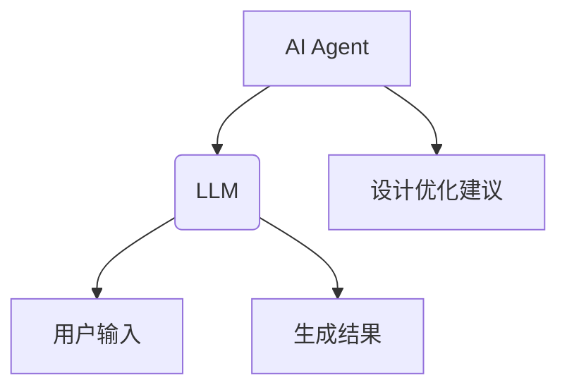
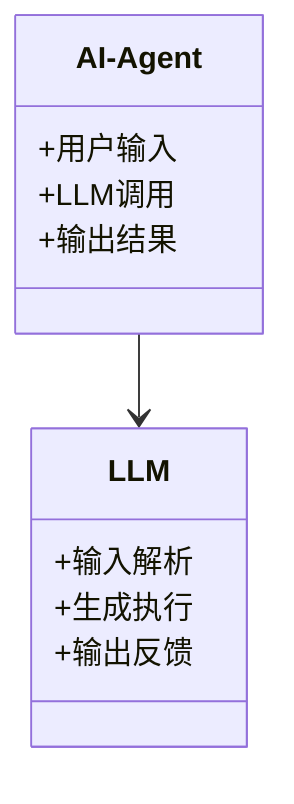

                 


# 产品设计 AI Agent：LLM 辅助创新与概念生成

## 关键词：AI Agent, LLM, 产品设计, 概念生成, 创新设计

## 摘要：  
本文深入探讨了AI Agent与大语言模型（LLM）在产品设计中的应用，特别是如何利用LLM辅助创新与概念生成。通过分析AI Agent的核心原理、LLM的数学模型，以及系统架构设计，结合实际项目实战，本文展示了如何将这些技术应用于实际的产品设计过程中。文章还总结了最佳实践，提供了未来趋势和扩展资源，为读者提供了全面的技术视角和实践指导。

---

## 第1章 产品设计中的AI Agent与LLM概述

### 1.1 问题背景与技术背景  
- 1.1.1 传统产品设计的挑战：效率低下、创意不足、协作复杂  
- 1.1.2 AI Agent与LLM的出现及其作用：自动化辅助、创意生成、实时协作  
- 1.1.3 问题描述：传统设计流程的痛点  
- 1.1.4 问题解决：AI Agent与LLM的创新应用  
- 1.1.5 边界与外延：AI Agent与LLM的应用范围  
- 1.1.6 核心要素：概念、生成、优化与协作  

### 1.2 AI Agent与LLM的核心概念与联系  
- 1.2.1 AI Agent的定义与功能：理解需求、生成创意、优化方案、实时协作  
- 1.2.2 LLM的工作原理与技术特点：基于Transformer架构、大规模预训练、生成式输出  
- 1.2.3 AI Agent与LLM的协同机制：输入解析、生成执行、结果反馈  

### 1.3 概念属性特征对比表格  
| 概念       | 属性               | 特征                                   |
|------------|--------------------|---------------------------------------|
| AI Agent   | 输入方式           | 自然语言                              |
|            | 输出方式           | 多样化（文本、图像、结构化数据）        |
| LLM        | 模型结构           | 基于Transformer架构                    |
|            | 训练目标           | 生成最大化似然                        |

### 1.4 ER实体关系图  


---

## 第2章 AI Agent的核心原理与技术实现

### 2.1 AI Agent的工作原理  
- 2.1.1 输入解析：理解用户需求  
- 2.1.2 生成执行：调用LLM生成创意  
- 2.1.3 结果反馈：优化方案  

### 2.2 LLM的内部机制  
- 2.2.1 Transformer架构：编码器与解码器的协同工作  
- 2.2.2 注意力机制：序列关系建模  

### 2.3 AI Agent与LLM的协同流程  
- 2.3.1 用户输入：描述产品需求  
- 2.3.2 AI Agent解析：提取关键信息  
- 2.3.3 LLM生成：输出创意概念  
- 2.3.4 反馈优化：迭代改进方案  

---

## 第3章 LLM的数学模型与算法原理

### 3.1 转换器架构  
- 3.1.1 编码器与解码器结构：编码器处理输入，解码器生成输出  
- 3.1.2 自注意力机制：序列关系建模  

### 3.2 注意力机制公式  
$$\text{Attention}(Q, K, V) = \text{softmax}\left(\frac{QK^T}{\sqrt{d_k}}\right)V$$  

### 3.3 损失函数  
$$\mathcal{L} = -\sum_{i=1}^{n} \text{log}(p(y_i|x_i))$$  

### 3.4 LLM的训练过程  
- 3.4.1 数据预处理：清洗与格式转换  
- 3.4.2 模型训练：优化损失函数  
- 3.4.3 超参数调整：学习率、批次大小  

---

## 第4章 系统架构与设计

### 4.1 问题场景介绍  
- 4.1.1 产品设计流程中的AI Agent应用：需求分析、创意生成、设计优化  

### 4.2 领域模型设计  


### 4.3 系统架构设计  
- 4.3.1 分层架构：前端交互、后端处理、模型服务  
- 4.3.2 接口设计：RESTful API  
- 4.3.3 交互流程：用户输入 → AI Agent解析 → LLM生成 → 反馈优化  

---

## 第5章 项目实战：LLM辅助产品设计

### 5.1 环境安装与配置  
- 5.1.1 安装Python与相关库（如transformers、torch）  
- 5.1.2 安装LLM模型（如GPT-2、GPT-3）  

### 5.2 核心代码实现  
```python
from transformers import GPT2LMHeadModel, GPT2Tokenizer

tokenizer = GPT2Tokenizer.from_pretrained('gpt2')
model = GPT2LMHeadModel.from_pretrained('gpt2')

def generate_concept(input_text):
    inputs = tokenizer.encode(input_text, return_tensors='pt')
    outputs = model.generate(inputs, max_length=50, temperature=0.7)
    return tokenizer.decode(outputs[0], skip_special_tokens=True)
```

### 5.3 代码应用解读  
- 5.3.1 输入解析：用户输入产品需求  
- 5.3.2 模型调用：生成创意概念  
- 5.3.3 输出结果：展示生成的概念  

### 5.4 案例分析  
- 5.4.1 案例背景：智能家居产品设计  
- 5.4.2 输入需求：提高用户体验  
- 5.4.3 生成结果：多种设计方案  

---

## 第6章 最佳实践与未来趋势

### 6.1 最佳实践  
- 6.1.1 数据质量：确保输入数据的准确性  
- 6.1.2 模型选择：根据需求选择合适的LLM  
- 6.1.3 交互设计：优化用户界面，提高用户体验  

### 6.2 小结  
- 本章总结了AI Agent与LLM在产品设计中的应用，展示了其在创新与概念生成中的巨大潜力  

### 6.3 注意事项  
- 模型调用的资源消耗问题  
- 数据隐私与安全问题  

### 6.4 未来趋势  
- 更加智能化的AI Agent  
- 多模态LLM的应用  
- 自适应设计流程  

---

## 附录

### 附录A 工具安装指南  
- Python安装：`python --version`  
- PyTorch安装：`pip install torch`  
- Transformers库安装：`pip install transformers`  

### 附录B 参考文献  
- 罗列相关技术论文、书籍和在线资源  

### 附录C 扩展阅读  
- 推荐相关技术博客、视频和课程  

---

## 作者：AI天才研究院/AI Genius Institute & 禅与计算机程序设计艺术 /Zen And The Art of Computer Programming

