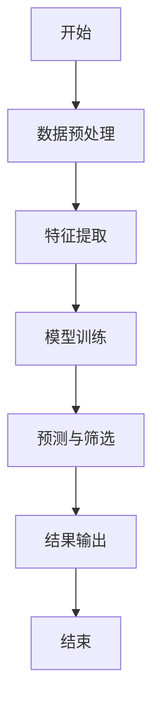

                 


# 《人力资源管理中的AI Agent筛选系统》

## 关键词：AI Agent，人力资源管理，筛选系统，算法原理，系统架构

## 摘要：本文深入探讨了AI Agent在人力资源管理中的应用，特别是其在筛选系统中的作用。文章从背景介绍、核心概念、算法原理、系统架构、项目实战到最佳实践，全面分析了AI Agent如何提升招聘效率和准确性。通过详细的技术分析和实际案例，本文为读者提供了全面的解决方案。

---

## 第一部分：背景介绍

### 第1章：AI在人力资源管理中的应用现状

#### 1.1 AI在招聘中的应用
AI技术在招聘中的应用日益广泛，从简历筛选到面试安排，AI正在改变传统的招聘流程。AI可以通过自然语言处理技术分析简历内容，快速匹配岗位需求，大幅提高招聘效率。

#### 1.2 AI在员工管理中的应用
除了招聘，AI还被用于员工培训、绩效评估和职业发展规划。例如，AI可以通过分析员工的历史表现和技能，推荐适合的培训课程，帮助员工提升职业能力。

#### 1.3 当前AI在HR中的挑战
尽管AI在HR领域的应用取得了显著进展，但仍然面临数据隐私、算法偏见和用户接受度等问题。如何解决这些问题，是当前AI在HR应用中需要克服的主要挑战。

---

### 第2章：AI Agent的基本概念

#### 2.1 AI Agent的核心特征
AI Agent是一种能够感知环境并采取行动以实现目标的智能实体。在人力资源管理中，AI Agent可以用于自动化筛选、推荐和监控等功能。其核心特征包括自主性、反应性、目标导向和社会能力。

#### 2.2 AI Agent与传统筛选系统的对比
传统筛选系统依赖人工操作，效率低且容易受到主观因素的影响。而AI Agent可以通过机器学习算法不断优化筛选策略，提高准确性和效率。

#### 2.3 实体关系图
```mermaid
er
  actor: 用户
  system: AI筛选系统
  job: 职位
  candidate: 应聘者
  rule: 筛选规则
  result: 筛选结果
  actor --> system: 提交请求
  system --> job: 获取职位需求
  system --> candidate: 获取应聘者信息
  system --> rule: 应用筛选规则
  system --> result: 生成结果
  result --> actor: 返回结果
```

---

## 第二部分：算法原理讲解

### 第3章：AI Agent的算法流程

#### 3.1 算法整体流程
AI Agent的筛选系统通常包括以下几个步骤：
1. 数据预处理：清洗和整理输入数据，确保数据的完整性和一致性。
2. 特征提取：从简历中提取关键信息，如技能、经验、教育背景等。
3. 模型训练：使用机器学习算法训练分类模型，如逻辑回归或支持向量机。
4. 预测与筛选：根据训练好的模型对简历进行分类，筛选出符合要求的候选人。
5. 结果输出：将筛选结果返回给用户，并提供改进建议。

#### 3.2 算法实现代码
以下是一个简单的Python代码示例，展示了如何使用逻辑回归模型进行简历筛选：

```python
import pandas as pd
from sklearn.model import LogisticRegression
from sklearn.preprocessing import StandardScaler

# 数据预处理
data = pd.read_csv('candidates.csv')
data = data.dropna()  # 删除缺失值
data = pd.get_dummies(data)  # 转换分类变量

# 特征提取
X = data[['experience', 'education', 'skills']]  # 特征列
y = data['suitability']  # 标签列

# 模型训练
scaler = StandardScaler()
X_scaled = scaler.fit_transform(X)
model = LogisticRegression()
model.fit(X_scaled, y)

# 预测与筛选
new_candidate = pd.DataFrame({
    'experience': [5],
    'education': ['Bachelor'],
    'skills': ['Python, AI']
})
new_candidate = pd.get_dummies(new_candidate)
new_candidate_scaled = scaler.transform(new_candidate)
predicted_suitability = model.predict(new_candidate_scaled)
```

#### 3.3 数学模型与公式
逻辑回归模型的损失函数可以表示为：
$$ L = -\sum_{i=1}^{n} [y_i \log(p_i) + (1 - y_i) \log(1 - p_i)] $$
其中，$p_i$ 是第i个样本被分类为正类的概率。

---

## 第三部分：系统分析与架构设计

### 第4章：系统架构设计

#### 4.1 系统功能模块
AI Agent筛选系统主要包含以下几个功能模块：
- 简历解析模块：解析简历内容，提取关键信息。
- 筛选规则配置模块：根据岗位需求设置筛选规则。
- 筛选结果分析模块：展示筛选结果，并提供改进建议。

#### 4.2 系统架构图


---

## 第四部分：项目实战

### 第5章：项目实战

#### 5.1 环境安装
要运行AI Agent筛选系统，首先需要安装以下环境：
- Python 3.8+
- Scikit-learn
- Pandas
- Jupyter Notebook

#### 5.2 核心代码实现
以下是一个完整的Python代码示例：

```python
import pandas as pd
from sklearn.model import SVC
from sklearn.pipeline import Pipeline
from sklearn.preprocessing import StandardScaler

# 数据加载
data = pd.read_csv('candidates.csv')

# 数据预处理
X = data[['experience', 'education', 'skills']]
y = data['suitability']

# 模型训练
pipeline = Pipeline([
    ('scaler', StandardScaler()),
    ('model', SVC())
])
pipeline.fit(X, y)

# 预测与筛选
new_candidate = pd.DataFrame({
    'experience': [5],
    'education': ['Bachelor'],
    'skills': ['Python, AI']
})
predicted_suitability = pipeline.predict(new_candidate)
```

#### 5.3 实际案例分析
通过实际案例分析，我们可以看到AI Agent在筛选系统中的优势。例如，在筛选技术岗位时，AI Agent可以根据技能匹配度、工作经验和教育背景等多方面进行综合评估，大幅提高筛选的准确性和效率。

---

## 第五部分：最佳实践

### 第6章：最佳实践

#### 6.1 小结
本文详细探讨了AI Agent在人力资源管理中的应用，特别是其在筛选系统中的作用。通过算法原理和系统架构的设计，我们展示了如何利用AI技术提升招聘效率和准确性。

#### 6.2 注意事项
在实际应用中，需要注意数据隐私和算法偏见问题。同时，要根据具体需求调整筛选规则，确保系统的公平性和透明度。

#### 6.3 拓展阅读
对于感兴趣的研究者，可以进一步研究AI在员工培训、绩效评估等其他HR领域的应用，以及如何结合自然语言处理技术提升简历筛选的准确性。

---

## 作者：AI天才研究院/AI Genius Institute & 禅与计算机程序设计艺术/Zen And The Art of Computer Programming

---

以上是《人力资源管理中的AI Agent筛选系统》的完整目录和内容概述。通过系统化的分析和实际案例的展示，本文为读者提供了全面的解决方案，帮助他们在实际应用中更好地利用AI技术提升人力资源管理的效率和准确性。

