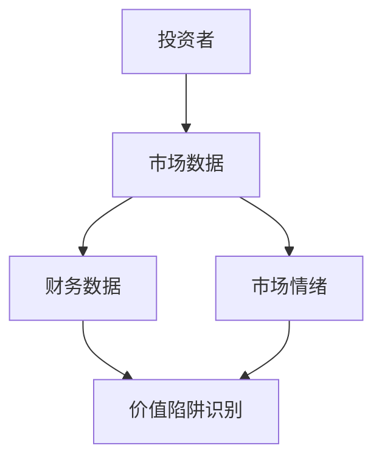
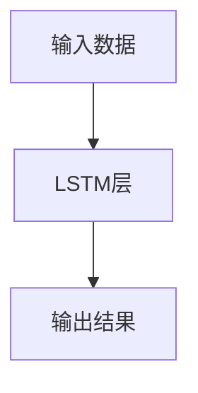
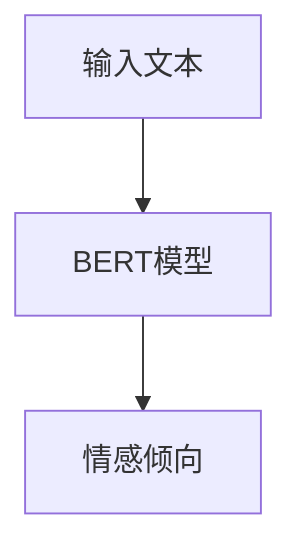
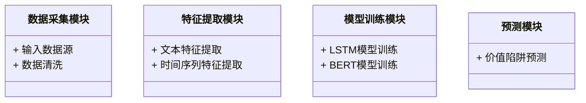
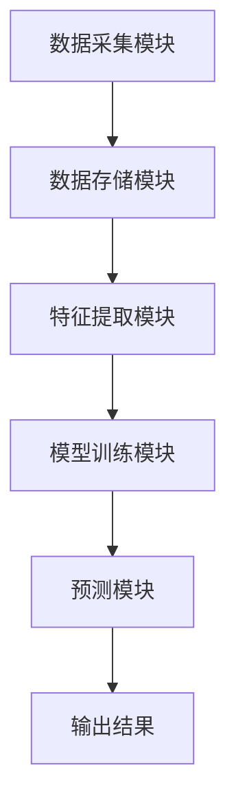
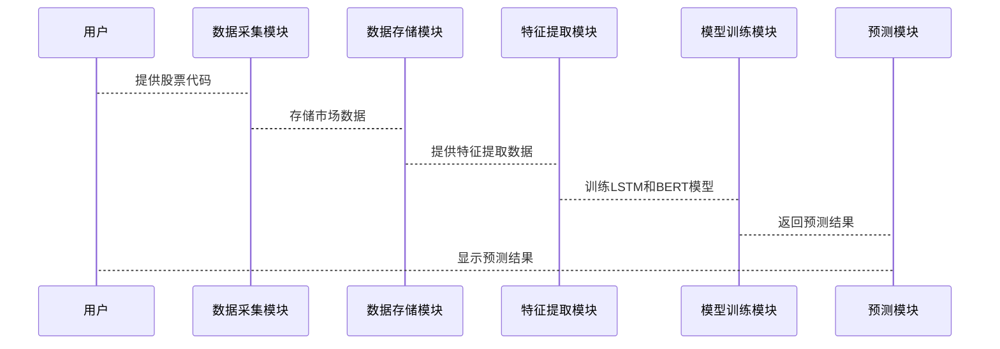

                 


# 人工智能辅助识别价值陷阱

## 关键词
- 人工智能
- 价值陷阱
- 投资分析
- LSTM
- BERT
- 时间序列分析
- 情感分析

## 摘要
在投资领域，价值陷阱是指那些看似具有吸引力但实际上隐藏着重大风险的股票或投资机会。本文将探讨如何利用人工智能技术，特别是基于LSTM的时间序列分析和基于BERT的情感分析，来辅助识别这些价值陷阱。通过系统地分析市场数据和新闻舆情，投资者可以更有效地识别潜在风险，做出更明智的投资决策。

---

## 第一部分：背景介绍

### 第1章：价值陷阱的基本概念

#### 1.1 问题背景
- **1.1.1 价值陷阱的定义**  
  价值陷阱是指那些表面上看似具有较高投资价值，但实际上由于公司基本面恶化、行业环境变化或其他因素，导致其实际价值远低于市场预期的投资标的。

- **1.1.2 价值陷阱的表现形式**  
  价值陷阱通常表现为股票价格被高估、财务数据造假、行业政策变化或公司管理问题等。

- **1.1.3 识别价值陷阱的难点**  
  识别价值陷阱的难点在于数据的复杂性和不确定性。传统的财务分析方法往往难以捕捉到隐藏的风险因素，而市场舆情和非结构化数据的分析则需要借助人工智能技术。

#### 1.2 问题描述
- **1.2.1 价值陷阱的特征分析**  
  价值陷阱的特征包括：  
  - 高市盈率或低市净率  
  - 财务数据异常（如收入增速放缓、利润率下降）  
  - 市场情绪过度乐观  

- **1.2.2 价值陷阱与基本面分析的关系**  
  价值陷阱通常与基本面分析密切相关，但仅依赖基本面分析往往难以捕捉到隐藏的风险因素。

- **1.2.3 价值陷阱对投资者的影响**  
  投资者如果误入价值陷阱，可能会导致投资损失，影响投资组合的稳定性。

#### 1.3 问题解决
- **1.3.1 人工智能在识别价值陷阱中的作用**  
  人工智能可以通过分析历史数据、市场舆情和实时新闻，帮助投资者发现隐藏的风险因素。

- **1.3.2 基于AI的价值陷阱识别方法**  
  本文将介绍两种主要方法：基于LSTM的时间序列分析和基于BERT的情感分析。

- **1.3.3 价值陷阱识别的边界与外延**  
  价值陷阱识别的边界在于数据的完整性和模型的泛化能力，而外延则包括对市场情绪、行业趋势的预测。

#### 1.4 核心概念与联系
- **1.4.1 价值陷阱的核心要素**  
  价值陷阱的核心要素包括：市场数据、财务数据、行业政策和市场情绪。

- **1.4.2 价值陷阱与市场情绪的关系**  
  市场情绪往往会导致价值陷阱的形成，而人工智能可以通过分析市场情绪来识别潜在的风险。

- **1.4.3 价值陷阱识别的多维度特征**  
  价值陷阱的识别需要结合财务数据、市场数据和舆情数据进行多维度分析。

---

## 第二部分：核心概念与联系

### 第2章：价值陷阱识别的核心原理

#### 2.1 核心概念原理
- **2.1.1 价值陷阱识别的多维度特征**  
  价值陷阱的识别需要结合财务数据、市场数据和舆情数据进行多维度分析。

- **2.1.2 人工智能在特征提取中的应用**  
  人工智能可以通过自然语言处理（NLP）技术提取市场舆情中的关键词和情感倾向。

- **2.1.3 价值陷阱识别的算法选择**  
  本文选择了LSTM和BERT两种算法进行分析，分别用于时间序列分析和情感分析。

#### 2.2 核心概念属性特征对比表格
- 表2-1：价值陷阱与非价值陷阱的特征对比

| 特征                | 价值陷阱                     | 非价值陷阱                  |
|---------------------|----------------------------|-----------------------------|
| 市盈率              | 高                          | 合理或低                     |
| 财务数据            | 异常（如收入增速放缓）       | 健康                          |
| 市场情绪            | 过度乐观                    | 中性或悲观                   |
| 行业政策            | 不利变化                    | 稳定或利好                   |

#### 2.3 ER实体关系图架构
- 图2-1：价值陷阱识别的实体关系图（Mermaid流程图）



---

## 第三部分：算法原理讲解

### 第3章：基于LSTM的时间序列分析

#### 3.1 算法原理
- **3.1.1 LSTM的基本结构**  
  LSTM（长短期记忆网络）是一种特殊的RNN（循环神经网络），通过引入记忆单元（Cell）和门控机制来解决传统RNN的梯度消失问题。

- **3.1.2 LSTM在时间序列分析中的应用**  
  LSTM适用于处理时间序列数据，可以有效捕捉数据中的趋势和周期性变化。

#### 3.2 算法流程图
- 图3-1：LSTM算法流程图（Mermaid）



#### 3.3 数学模型与公式
- **LSTM的结构方程**  
  $$ \text{遗忘门} = \sigma(W_f \cdot [h_{t-1}, x_t] + b_f) $$
  $$ \text{输入门} = \sigma(W_i \cdot [h_{t-1}, x_t] + b_i) $$
  $$ \text{记忆单元} = \text{遗忘门} \cdot \text{记忆单元上一步} + \text{输入门} \cdot \tanh(W_c \cdot [h_{t-1}, x_t] + b_c) $$
  $$ \text{输出门} = \sigma(W_o \cdot [h_{t-1}, x_t] + b_o) $$
  $$ h_t = \text{输出门} \cdot \tanh(\text{记忆单元}) $$

### 第4章：基于BERT的情感分析

#### 4.1 算法原理
- **4.1.1 BERT模型的基本原理**  
  BERT（双向Transformer）是一种基于预训练的语言模型，能够通过上下文理解情感倾向。

- **4.1.2 情感分析在价值陷阱识别中的应用**  
  通过分析市场新闻和社交媒体中的情感倾向，可以识别市场情绪的变化，从而辅助判断是否存在价值陷阱。

#### 4.2 算法流程图
- 图4-1：BERT情感分析流程图（Mermaid）



#### 4.3 数学模型与公式
- **BERT的损失函数**  
  $$ \text{损失函数} = -\frac{1}{N} \sum_{i=1}^{N} \text{log}(P(y_i|X_i)) $$

---

## 第四部分：系统分析与架构设计方案

### 第4章：系统分析与架构设计方案

#### 4.1 问题场景介绍
- 价值陷阱识别系统需要处理海量的市场数据和舆情数据，通过人工智能算法进行分析，帮助投资者识别潜在风险。

#### 4.2 系统功能设计
- **领域模型（Mermaid类图）**  
  图4-2：价值陷阱识别系统的领域模型



#### 4.3 系统架构设计
- **系统架构图（Mermaid架构图）**  
  图4-3：价值陷阱识别系统的架构图



#### 4.4 系统接口设计
- **接口1：数据采集接口**  
  接收市场数据和舆情数据，进行清洗和存储。

- **接口2：模型预测接口**  
  接收用户输入的股票代码，返回价值陷阱预测结果。

#### 4.5 系统交互流程（Mermaid序列图）
- 图4-4：系统交互流程



---

## 第五部分：项目实战

### 第5章：项目实战

#### 5.1 环境安装
- 需要安装的工具和库：
  - Python 3.8+
  - PyTorch
  - BERT库
  - LSTM库
  - Pandas
  - Matplotlib

#### 5.2 系统核心实现源代码
- **LSTM模型实现代码**  
  ```python
  import torch
  import torch.nn as nn
  import torch.optim as optim

  class LSTMModel(nn.Module):
      def __init__(self, input_size, hidden_size, output_size):
          super(LSTMModel, self).__init__()
          self.lstm = nn.LSTM(input_size, hidden_size, num_layers=1, batch_first=True)
          self.fc = nn.Linear(hidden_size, output_size)
      
      def forward(self, x):
          out, _ = self.lstm(x)
          out = self.fc(out[:, -1, :])
          return out
  ```

- **BERT模型实现代码**  
  ```python
  from transformers import BertTokenizer, BertModel

  tokenizer = BertTokenizer.from_pretrained('bert-base-uncased')
  model = BertModel.from_pretrained('bert-base-uncased')
  ```

#### 5.3 代码应用解读与分析
- **LSTM模型的应用**  
  LSTM模型用于分析股票价格的时间序列数据，捕捉价格波动的趋势和周期性。

- **BERT模型的应用**  
  BERT模型用于分析市场新闻和社交媒体中的文本数据，提取情感倾向，辅助判断市场情绪。

#### 5.4 实际案例分析
- **案例分析：假设某科技公司**  
  通过分析该公司的财务数据和市场舆情，识别是否存在价值陷阱。

#### 5.5 项目小结
- 通过实际案例分析，验证了人工智能在识别价值陷阱中的有效性。

---

## 第六部分：最佳实践

### 第6章：最佳实践

#### 6.1 小结
- 人工智能技术为价值陷阱识别提供了新的思路和方法，但其准确性依赖于数据质量和模型的泛化能力。

#### 6.2 注意事项
- 数据质量：确保数据的完整性和准确性。
- 模型调优：根据实际需求调整模型参数，优化性能。
- 风险提示：价值陷阱识别结果仅供参考，投资需谨慎。

#### 6.3 拓展阅读
- 《Deep Learning for Time Series Forecasting》
- 《BERT: Pre-training of Deep Bidirectional Transformers for NLP》

---

## 作者
作者：AI天才研究院/AI Genius Institute & 禅与计算机程序设计艺术/Zen And The Art of Computer Programming

