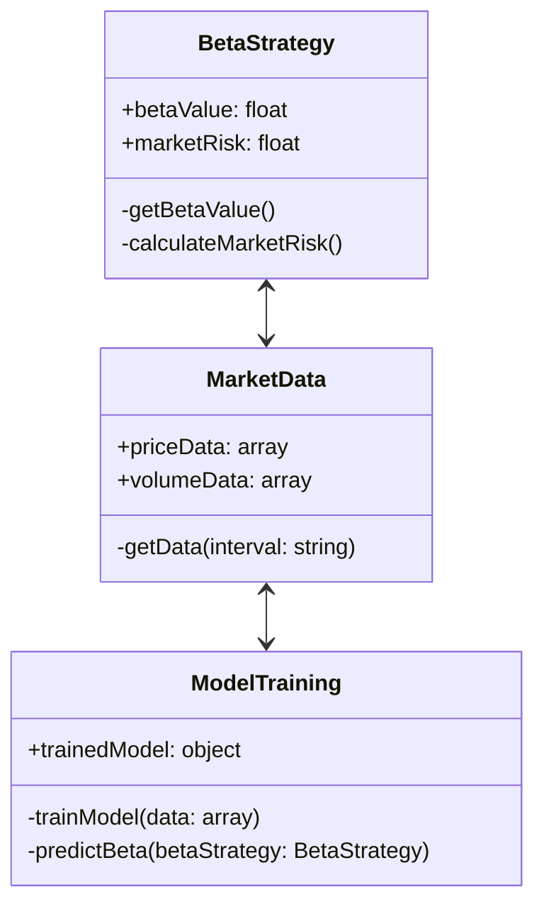
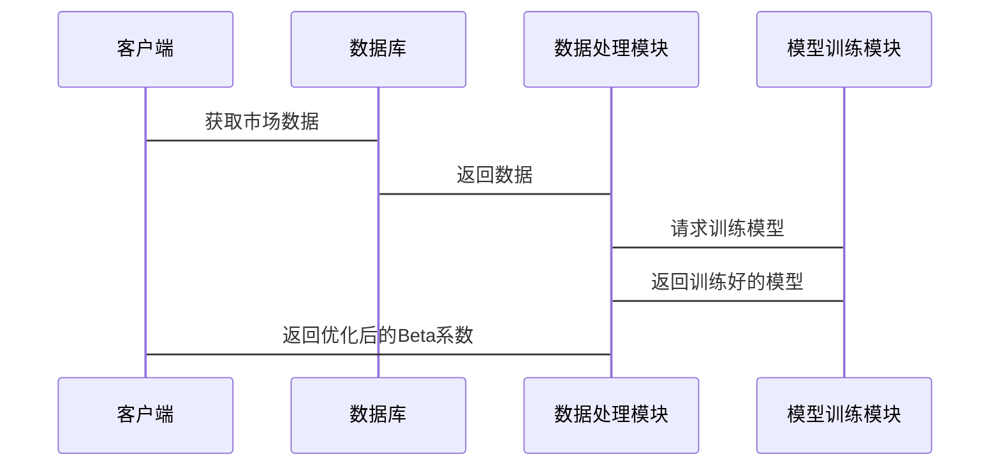

                 


# 人工智能驱动的智能Beta策略设计

> 关键词：人工智能、Beta策略、投资组合优化、机器学习、金融模型

> 摘要：本文探讨了人工智能在Beta策略设计中的应用，分析了智能Beta策略的核心概念、算法原理、系统架构及项目实现。通过结合数学模型、机器学习算法和系统设计，提出了一种基于AI的智能Beta策略优化方法，并通过实际案例展示了其优势与应用前景。

---

# 第1章: Beta策略与人工智能的结合概述

## 1.1 Beta策略的基本概念

### 1.1.1 投资组合Beta系数的定义
Beta系数是衡量资产或投资组合系统性风险的重要指标，其定义为：
$$ \beta = \frac{\text{Cov}(r_i, r_m)}{\text{Var}(r_m)} $$
其中，$r_i$为资产的收益，$r_m$为市场收益，$\text{Cov}$表示协方差，$\text{Var}$表示方差。

### 1.1.2 Beta系数在金融投资中的作用
Beta系数在资产定价、风险评估和投资组合优化中具有重要作用。通过Beta系数，投资者可以评估资产对市场波动的敏感性，从而做出更合理的投资决策。

### 1.1.3 Beta策略的核心目标与应用场景
Beta策略的核心目标是通过优化Beta系数，实现投资组合的系统性风险调整，以达到收益与风险的最佳平衡。其应用场景包括股票投资、基金组合优化、风险管理等领域。

## 1.2 人工智能在金融投资中的应用

### 1.2.1 人工智能在金融分析中的优势
人工智能技术，如机器学习和深度学习，能够处理海量金融数据，发现复杂模式，并进行实时预测和优化。

### 1.2.2 AI驱动Beta策略的必要性
传统Beta策略在数据处理和模型优化方面存在局限性，而人工智能能够通过大数据分析和自动化优化，显著提升Beta策略的效率和精度。

### 1.2.3 智能Beta策略与传统Beta策略的对比
智能Beta策略通过引入AI技术，能够动态调整Beta系数，适应市场变化，而传统Beta策略往往静态固定。

## 1.3 智能Beta策略的必要性与优势

### 1.3.1 传统Beta策略的局限性
传统Beta策略在数据处理能力、模型复杂性和实时性方面存在不足，难以应对复杂多变的市场环境。

### 1.3.2 人工智能如何优化Beta策略
人工智能通过深度学习和强化学习等技术，能够实时捕捉市场信号，优化Beta系数的计算和调整。

### 1.3.3 智能Beta策略的核心优势
智能Beta策略具有高效性、动态性和精准性，能够在复杂市场环境中实现最优投资组合。

## 1.4 本章小结
本章介绍了Beta策略的基本概念及其在金融投资中的作用，分析了人工智能在金融投资中的应用优势，并探讨了智能Beta策略的必要性和核心优势。

---

# 第2章: Beta策略的数学模型与AI驱动原理

## 2.1 Beta系数的数学模型

### 2.1.1 CAPM模型与Beta系数的公式推导
CAPM模型定义为：
$$ r_i = r_f + \beta_i (r_m - r_f) $$
其中，$r_i$为资产的预期收益，$r_f$为无风险利率，$\beta_i$为Beta系数，$r_m$为市场预期收益。

### 2.1.2 APT模型与Beta系数的扩展
APT模型通过多个因子解释资产收益，其Beta系数定义为：
$$ \beta_i = \frac{\text{Cov}(r_i, r_j)}{\text{Var}(r_j)} $$
其中，$r_j$为特定因子的收益。

## 2.2 AI驱动Beta策略的核心原理

### 2.2.1 机器学习在Beta系数计算中的应用
机器学习通过训练模型，从历史数据中学习Beta系数的模式，并进行预测和优化。

### 2.2.2 深度学习模型在Beta策略优化中的作用
深度学习模型，如LSTM，能够捕捉时间序列数据中的复杂模式，提升Beta系数预测的准确性。

### 2.2.3 AI驱动Beta策略的数学框架
AI驱动Beta策略的数学框架包括数据预处理、特征提取、模型训练和优化等步骤，形成一个完整的计算流程。

## 2.3 Beta策略与AI驱动的联系

### 2.3.1 Beta系数的动态调整机制
通过AI技术，Beta系数能够根据市场变化实时调整，确保投资组合的风险收益比最优。

### 2.3.2 AI在Beta策略中的预测与优化作用
AI通过预测市场波动和优化Beta系数，提升投资组合的收益和稳定性。

### 2.3.3 Beta策略的可解释性与AI模型的透明度
AI模型的可解释性是Beta策略应用的重要因素，需要在模型设计中注重透明度和可解释性。

## 2.4 本章小结
本章通过数学模型和AI驱动原理，详细阐述了Beta策略的核心概念和优化方法，为后续的算法设计奠定了基础。

---

# 第3章: AI驱动Beta策略的算法实现

## 3.1 数据预处理与特征选择

### 3.1.1 金融数据的获取与清洗
金融数据的获取包括从数据库或API获取历史价格、成交量等数据，并进行清洗，去除缺失值和异常值。

### 3.1.2 特征工程与Beta相关性分析
特征工程包括构建技术指标、市场情绪指标等，并分析其与Beta系数的相关性。

### 3.1.3 数据标准化与归一化处理
通过标准化和归一化处理，确保数据在模型训练中的均衡性。

## 3.2 基于机器学习的Beta策略优化算法

### 3.2.1 线性回归模型的应用
线性回归模型用于Beta系数的初步预测，提供基础的Beta值。

### 3.2.2 支持向量回归（SVR）模型的实现
SVR模型通过非线性映射，提升Beta系数预测的准确性。

### 3.2.3 随机森林模型的Beta系数预测
随机森林模型通过集成学习，进一步优化Beta系数的预测精度。

## 3.3 基于深度学习的Beta策略优化

### 3.3.1 神经网络模型的设计
神经网络模型包括输入层、隐藏层和输出层，用于捕捉数据中的复杂模式。

### 3.3.2 LSTM模型的应用
LSTM模型通过长短期记忆机制，有效捕捉时间序列数据中的长期依赖关系。

### 3.3.3 模型训练与优化
通过反向传播和梯度下降算法，优化模型参数，提升预测精度。

## 3.4 本章小结
本章详细介绍了AI驱动Beta策略的算法实现，包括数据预处理、特征选择、模型训练和优化等步骤，为实际应用提供了技术基础。

---

# 第4章: 智能Beta策略的系统分析与架构设计

## 4.1 系统功能设计

### 4.1.1 领域模型设计
领域模型通过Mermaid类图展示系统的核心实体及其关系。



### 4.1.2 系统架构设计
系统架构通过Mermaid架构图展示模块之间的关系。


### 4.1.3 系统接口设计
系统接口通过RESTful API实现数据获取、模型训练和结果返回。

## 4.2 系统交互设计

### 4.2.1 系统交互流程
系统交互流程通过Mermaid序列图展示。



## 4.3 本章小结
本章通过系统分析与架构设计，展示了智能Beta策略的实现框架和交互流程，为后续的项目实现提供了指导。

---

# 第5章: 智能Beta策略的项目实战

## 5.1 环境搭建

### 5.1.1 Python环境安装
安装Python和必要的库，如Pandas、NumPy、Scikit-learn、Keras和TensorFlow。

### 5.1.2 数据获取工具安装
安装金融数据API或数据库，如Yahoo Finance API。

## 5.2 核心实现

### 5.2.1 数据预处理代码
```python
import pandas as pd
import numpy as np

# 获取数据
data = pd.read_csv('market_data.csv')

# 数据清洗
data.dropna(inplace=True)
data = data.iloc[:, [0, 1, 2, 3]]  # 选择相关特征
```

### 5.2.2 模型训练代码
```python
from sklearn.model_selection import train_test_split
from sklearn.ensemble import RandomForestRegressor

# 划分数据集
X_train, X_test, y_train, y_test = train_test_split(data.drop('beta', axis=1), data['beta'], test_size=0.2)

# 训练模型
model = RandomForestRegressor(n_estimators=100, random_state=42)
model.fit(X_train, y_train)

# 预测
y_pred = model.predict(X_test)
```

## 5.3 案例分析

### 5.3.1 数据分析与可视化
通过可视化工具展示Beta系数的变化趋势和预测结果的准确性。

### 5.3.2 模型评估
通过均方误差（MSE）和R²评分评估模型性能。

## 5.4 结果解读

### 5.4.1 Beta系数的动态调整
展示优化后的Beta系数如何适应市场变化。

### 5.4.2 投资组合的风险收益比提升
对比优化前后的投资组合表现，验证智能Beta策略的有效性。

## 5.5 本章小结
本章通过项目实战，详细展示了智能Beta策略的实现过程和应用效果，验证了其优势和可行性。

---

# 第6章: 总结与展望

## 6.1 本章总结
总结本文的核心内容，强调人工智能在智能Beta策略设计中的重要性和优势。

## 6.2 未来展望
展望智能Beta策略的未来发展方向，如多因子模型优化、强化学习应用等。

## 6.3 注意事项与最佳实践
提醒读者在实际应用中需要注意的问题，并提供一些最佳实践的建议。

## 6.4 本章小结
本章总结了全文内容，并对未来的研究和应用进行了展望。

---

# 作者：AI天才研究院/AI Genius Institute & 禅与计算机程序设计艺术 /Zen And The Art of Computer Programming

