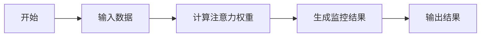
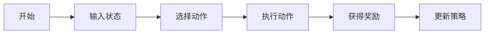
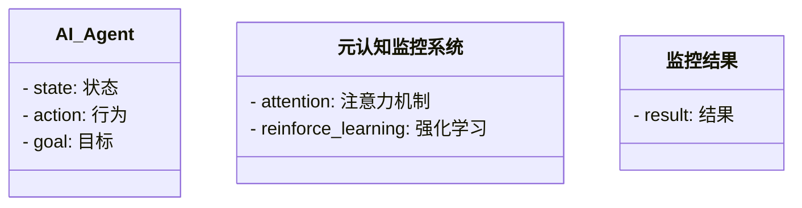
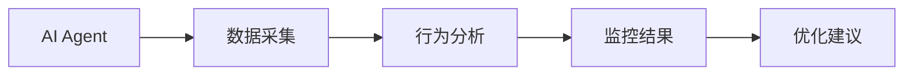
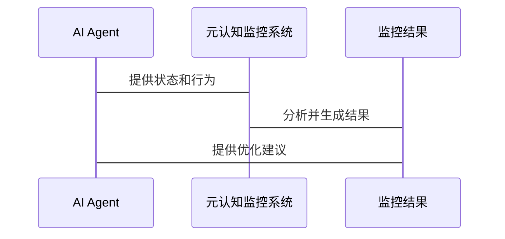

                 


# 从零开始：AI Agent的元认知监控系统

> 关键词：AI Agent, 元认知监控系统, 元认知, 元监控, 监控系统, 智能体, 系统架构

> 摘要：  
> 本文从零开始系统地介绍AI Agent的元认知监控系统，涵盖其背景、核心概念、算法原理、系统架构、项目实战及最佳实践。文章首先阐述了元认知监控系统的背景与概念，随后深入分析其核心原理与算法实现，再从系统架构的角度探讨其实现方式，最后通过项目实战和最佳实践帮助读者巩固知识。

---

# 第一部分: 元认知监控系统的背景与概念

## 第1章: 元认知监控系统的背景与概念

### 1.1 问题背景与问题描述

#### 1.1.1 AI Agent的基本概念
AI Agent（智能体）是指能够感知环境并采取行动以实现目标的实体。它可以是一个软件程序、机器人或其他形式的智能系统。AI Agent的核心能力包括感知、推理、规划和行动。

#### 1.1.2 元认知监控的必要性
随着AI Agent的应用场景越来越复杂，单纯依靠外部监控已经无法满足需求。元认知监控系统能够帮助AI Agent更好地理解自身的状态、行为和决策过程，从而实现自我优化和自我修复。

#### 1.1.3 当前AI Agent的局限性
传统的AI Agent缺乏对自身行为的深刻理解，容易在复杂环境中出现错误或低效的行为。元认知监控系统的引入，能够弥补这一缺陷。

### 1.2 元认知监控系统的定义与特点

#### 1.2.1 元认知监控的定义
元认知监控系统是一种能够对AI Agent的认知过程进行监控、评估和优化的系统。它通过分析AI Agent的内部状态和外部行为，提供反馈和建议，以提升AI Agent的整体性能。

#### 1.2.2 元认知监控的核心功能
元认知监控的核心功能包括：
1. **自我感知**：监控AI Agent的内部状态和外部环境。
2. **行为评估**：评估AI Agent的行为是否符合预期目标。
3. **决策优化**：根据监控结果优化AI Agent的决策过程。

#### 1.2.3 元认知监控与传统监控的区别
| 特性 | 元认知监控 | 传统监控 |
|------|------------|-----------|
| 监控对象 | AI Agent的认知过程 | AI Agent的行为结果 |
| 监控方式 | 主动分析和优化 | 被动记录和反馈 |
| 监控目标 | 提升AI Agent的整体性能 | 检测异常行为 |

### 1.3 元认知监控系统的边界与外延

#### 1.3.1 系统的边界
元认知监控系统的边界包括：
- **输入边界**：AI Agent的内部状态、外部环境数据。
- **输出边界**：监控结果、优化建议。

#### 1.3.2 系统的外延
元认知监控系统的外延包括：
- **上层系统**：与外部系统交互。
- **下层系统**：对AI Agent的行为进行具体优化。

#### 1.3.3 系统与其他系统的区别
元认知监控系统与传统监控系统的区别主要在于监控的对象和目标。元认知监控系统更加注重对AI Agent内部认知过程的监控，而传统监控系统则主要关注外部行为。

### 1.4 本章小结
本章从背景、定义、核心功能、边界与外延等方面介绍了元认知监控系统的基本概念，为后续章节的深入分析奠定了基础。

---

## 第2章: 元认知监控系统的核心概念与联系

### 2.1 元认知监控系统的核心原理

#### 2.1.1 元认知监控的原理
元认知监控的原理包括：
1. **自我反思**：AI Agent对自身的认知过程进行反思。
2. **行为分析**：分析AI Agent的行为是否符合预期。
3. **优化调整**：根据分析结果调整AI Agent的行为策略。

#### 2.1.2 元认知监控的机制
元认知监控的机制包括：
1. **数据采集**：采集AI Agent的内部状态和外部环境数据。
2. **数据分析**：对采集的数据进行分析，评估AI Agent的行为。
3. **反馈优化**：根据分析结果提供反馈，并优化AI Agent的行为。

#### 2.1.3 元认知监控的实现方式
元认知监控的实现方式包括：
- **基于规则的监控**：通过预定义的规则进行监控。
- **基于模型的监控**：利用机器学习模型进行监控和优化。

### 2.2 核心概念的属性特征对比

| 核心概念 | 元认知 | 认知 | 元监控 | 直接监控 |
|----------|--------|------|--------|----------|
| 对象     | 认知过程 | 行为 | 行为与认知 | 行为 |
| 监控方式 | 主动分析 | 被动记录 | 主动优化 | 被动反馈 |
| 目标     | 提升整体性能 | 检测异常 | 优化行为 | 检测错误 |

### 2.3 元认知监控系统的ER实体关系图

```mermaid
er
actor: 元认知监控系统
base: AI Agent
goal: 监控目标
action: 监控行为
result: 监控结果
```

### 2.4 本章小结
本章详细介绍了元认知监控系统的核心原理和核心概念，并通过对比和图表的方式，帮助读者更好地理解系统的结构和功能。

---

## 第3章: 元认知监控系统的算法原理

### 3.1 元认知监控系统的算法概述

#### 3.1.1 基于注意力机制的元认知监控
注意力机制是一种模仿人类注意力的机制，用于关注重要的信息。在元认知监控中，注意力机制可以帮助AI Agent专注于关键的行为和决策。

#### 3.1.2 基于强化学习的元监控
强化学习是一种通过奖励机制来优化决策的算法。在元认知监控中，强化学习可以用于优化AI Agent的行为策略。

### 3.2 基于注意力机制的元认知监控算法



```python
def attention(inputs, attention_mask=None):
    # 计算注意力权重
    attention_weights = ...
    # 生成监控结果
    output = inputs * attention_weights
    return output
```

### 3.3 基于强化学习的元监控算法



```python
def reinforce_learning(state, action, reward):
    # 更新策略
    policy = update_policy(policy, state, action, reward)
    return policy
```

### 3.4 算法的数学模型与公式

#### 3.4.1 注意力机制的数学模型
$$ \text{注意力权重} = \text{softmax}(QK^T) $$

#### 3.4.2 强化学习的数学模型
$$ \text{奖励函数} = r(s, a) $$
$$ \text{策略更新} = \theta \leftarrow \theta + \alpha \nabla_\theta J(\theta) $$

### 3.5 本章小结
本章介绍了元认知监控系统中常用的两种算法：注意力机制和强化学习，并通过mermaid图和代码示例详细讲解了其实现过程。

---

## 第4章: 元认知监控系统的系统分析与架构设计

### 4.1 系统分析

#### 4.1.1 问题场景介绍
假设我们有一个AI Agent，需要对它的行为进行监控和优化。

#### 4.1.2 系统功能设计
系统功能设计包括：
- 数据采集
- 行为分析
- 监控结果反馈

#### 4.1.3 领域模型类图


### 4.2 系统架构设计

#### 4.2.1 系统架构图


#### 4.2.2 系统接口设计
系统接口设计包括：
- 数据输入接口
- 监控结果输出接口

#### 4.2.3 系统交互序列图


### 4.3 本章小结
本章从系统分析和架构设计的角度，详细介绍了元认知监控系统的实现方式，包括类图、架构图和交互序列图。

---

## 第5章: 元认知监控系统的项目实战

### 5.1 环境安装与配置

#### 5.1.1 安装Python
```bash
python --version
pip install -r requirements.txt
```

#### 5.1.2 安装必要的库
```bash
pip install numpy
pip install matplotlib
pip install scikit-learn
```

### 5.2 核心实现

#### 5.2.1 元认知监控系统的核心代码
```python
class MetaCognitionMonitor:
    def __init__(self):
        self.attention_weights = None
        self.reinforce_policy = None

    def compute_attention(self, inputs):
        # 实现注意力机制
        pass

    def update_policy(self, state, action, reward):
        # 实现强化学习策略更新
        pass
```

#### 5.2.2 监控结果的可视化
```python
import matplotlib.pyplot as plt

def visualize_results(results):
    plt.plot(results)
    plt.show()
```

### 5.3 案例分析与代码解读

#### 5.3.1 案例分析
假设我们有一个AI Agent在进行路径规划，我们需要对它的行为进行监控和优化。

#### 5.3.2 代码解读
```python
monitor = MetaCognitionMonitor()
monitor.compute_attention(inputs)
monitor.update_policy(state, action, reward)
```

### 5.4 本章小结
本章通过实际项目的环境安装、核心实现和案例分析，帮助读者更好地理解元认知监控系统的实现过程。

---

## 第6章: 元认知监控系统的最佳实践

### 6.1 小结

#### 6.1.1 核心内容回顾
元认知监控系统是一种能够对AI Agent的认知过程进行监控、评估和优化的系统。

#### 6.1.2 关键点总结
- 元认知监控系统的核心功能包括自我感知、行为评估和决策优化。
- 元认知监控系统与传统监控系统的区别在于监控的对象和目标。

### 6.2 注意事项

#### 6.2.1 系统设计中的注意事项
- 确保元认知监控系统的实时性和准确性。
- 定期更新元认知监控系统的监控策略。

#### 6.2.2 项目开发中的注意事项
- 选择合适的算法和工具。
- 确保系统的可扩展性和可维护性。

### 6.3 拓展阅读

#### 6.3.1 推荐书籍
- 《Deep Learning》
- 《Reinforcement Learning》

#### 6.3.2 推荐论文
- "Attention Is All You Need"
- "A Tutorial on Reinforcement Learning"

### 6.4 本章小结
本章通过小结、注意事项和拓展阅读，帮助读者巩固所学知识，并提供进一步学习和实践的指导。

---

## 作者：AI天才研究院 & 禅与计算机程序设计艺术

---

以上是《从零开始：AI Agent的元认知监控系统》的完整目录大纲和文章内容。通过逐步分析和详细讲解，这篇文章系统地介绍了元认知监控系统的背景、核心概念、算法原理、系统架构、项目实战及最佳实践。

