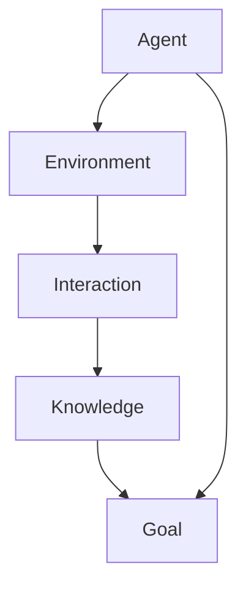
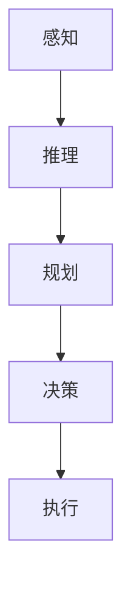
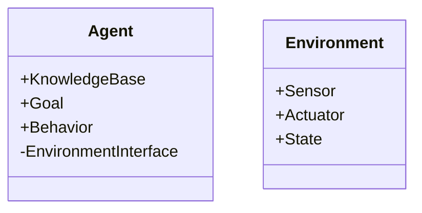
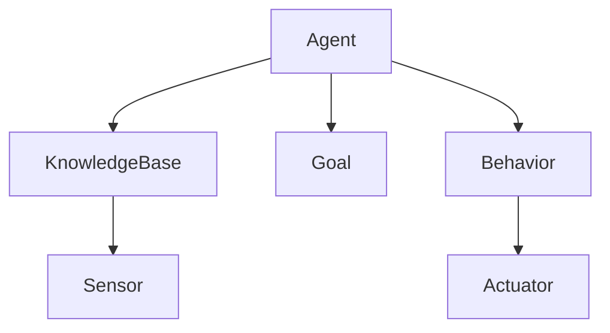
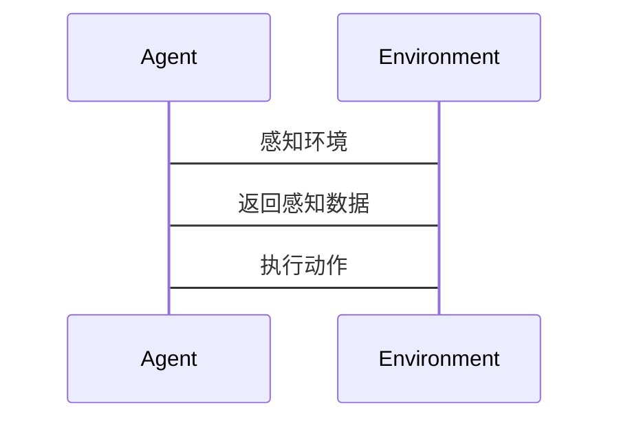

                 


# 从零开始：AI Agent的概念学习系统

> 关键词：AI Agent，人工智能，多智能体系统，知识表示，强化学习，分布式计算

> 摘要：本文从零开始系统地介绍AI Agent的概念、核心算法、系统架构及实战应用，深入剖析AI Agent的核心原理，通过丰富的案例和详细的代码实现，帮助读者全面掌握AI Agent的设计与实现。

---

# 第一部分: AI Agent的概念与背景

# 第1章: AI Agent的基本概念与背景

## 1.1 AI Agent的定义与核心概念
### 1.1.1 什么是AI Agent
AI Agent（人工智能代理）是一种能够感知环境、做出决策并采取行动以实现特定目标的智能实体。它可以是一个软件程序、机器人或其他智能系统。

### 1.1.2 AI Agent的核心属性
- **自主性**：AI Agent能够在没有外部干预的情况下自主运行。
- **反应性**：能够实时感知环境并做出反应。
- **目标导向**：所有行为都围绕实现特定目标展开。
- **社交能力**：能够与其他智能体或人类进行交互和协作。

### 1.1.3 AI Agent的分类与应用场景
- **简单反射型Agent**：基于当前感知做出简单反应，适用于规则明确的场景。
- **基于模型的反射型Agent**：利用内部模型进行推理和规划，适用于复杂环境。
- **目标驱动型Agent**：以目标为导向，主动采取行动。
- **效用驱动型Agent**：通过最大化效用函数来优化决策。
- **学习型Agent**：通过学习改进自身行为和决策能力。

应用场景包括自动驾驶、智能助手、机器人协作、游戏AI、分布式系统管理等。

## 1.2 AI Agent的发展背景
### 1.2.1 人工智能技术的演进
从早期的符号逻辑推理到现代的深度学习，AI技术的不断进步为AI Agent的发展提供了坚实的基础。

### 1.2.2 多智能体系统的兴起
随着分布式系统和多智能体协作需求的增加，AI Agent逐渐成为实现复杂任务的核心技术。

### 1.2.3 当前AI Agent的研究热点
- **强化学习**：通过试错优化决策。
- **多智能体协作**：解决复杂环境中的协作问题。
- **人机协作**：提升人与AI Agent的交互体验。

## 1.3 AI Agent的核心问题与挑战
### 1.3.1 知识表示与推理的难点
如何有效地表示和推理复杂知识是AI Agent设计中的关键问题。

### 1.3.2 多智能体协作的复杂性
多个智能体之间的协作需要解决通信、协调和冲突问题。

### 1.3.3 动态环境下的适应性问题
AI Agent需要在动态变化的环境中保持稳定性和高效性。

## 1.4 本章小结
通过本章的学习，读者可以了解AI Agent的基本概念、分类、应用场景以及当前的研究热点和挑战。

---

# 第二部分: AI Agent的核心概念与联系

# 第2章: AI Agent的概念结构与核心要素

## 2.1 AI Agent的概念结构
### 2.1.1 实体与属性的定义
AI Agent可以看作是一个实体，具有以下核心属性：
- **知识库**：存储所有相关的知识和信息。
- **目标**：驱动AI Agent行动的核心动力。
- **行为集**：AI Agent可以执行的所有动作。
- **环境接口**：与外部环境交互的接口。

### 2.1.2 行为与目标的关系
目标决定了AI Agent的行为选择，而行为是目标实现的具体动作。

### 2.1.3 环境与交互的边界
AI Agent需要与外部环境进行交互，明确交互的边界和接口是设计AI Agent的重要步骤。

## 2.2 核心概念的对比分析
### 2.2.1 AI Agent与传统AI的区别
传统AI主要关注数据处理和模式识别，而AI Agent更强调自主性和目标导向性。

### 2.2.2 AI Agent与规则引擎的对比
规则引擎基于固定的规则进行推理，而AI Agent具有更强的自主性和适应性。

### 2.2.3 AI Agent与机器学习模型的联系
AI Agent可以结合机器学习模型进行知识学习和行为优化。

## 2.3 AI Agent的ER实体关系图


## 2.4 本章小结
通过本章的学习，读者可以清晰地理解AI Agent的概念结构和核心要素，并能够将其与其他相关概念进行对比和区分。

---

# 第三部分: AI Agent的算法原理与数学模型

# 第3章: AI Agent的核心算法原理

## 3.1 感知与推理算法
### 3.1.1 知识表示的表示学习
通过向量表示法将知识转化为可计算的形式，例如Word2Vec和Graph Neural Networks。

### 3.1.2 推理过程的逻辑框架
基于符号逻辑或概率推理进行知识推理，例如一阶逻辑推理和贝叶斯推理。

### 3.1.3 基于图的推理方法
利用图结构进行知识推理，例如知识图谱和图神经网络。

## 3.2 规划与决策算法
### 3.2.1 状态空间搜索算法
通过广度优先搜索（BFS）和深度优先搜索（DFS）在状态空间中寻找最优路径。

### 3.2.2 基于Q-learning的决策过程
通过强化学习算法更新Q值，实现最优决策。

### 3.2.3 多智能体协作的分布式规划
通过分布式算法实现多智能体之间的协作规划，例如基于一致性算法和分布式约束优化。

## 3.3 学习与优化算法
### 3.3.1 基于强化学习的优化
通过强化学习算法（如DQN）优化AI Agent的行为策略。

### 3.3.2 基于监督学习的知识更新
通过监督学习算法（如SVM和神经网络）更新AI Agent的知识库。

### 3.3.3 跨模态学习的应用
通过跨模态学习实现多源信息的融合与推理，例如图像和文本的联合学习。

## 3.4 算法流程图


## 3.5 数学模型与公式
### 3.5.1 强化学习的数学模型
$$ R(s, a) = \text{奖励函数} $$
其中，\( R(s, a) \) 是在状态 \( s \) 下采取动作 \( a \) 所获得的奖励。

### 3.5.2 分布式规划的协作公式
$$ \text{分布式规划} = \sum_{i=1}^{n} \text{智能体}_i \text{的贡献} $$

---

# 第四部分: AI Agent的系统架构与设计

# 第4章: AI Agent的系统架构与设计

## 4.1 系统分析与需求定义
### 4.1.1 问题场景描述
以一个简单的自动驾驶系统为例，描述AI Agent在其中的角色和功能。

### 4.1.2 系统功能设计
- **感知模块**：通过传感器获取环境信息。
- **决策模块**：基于感知信息做出驾驶决策。
- **执行模块**：将决策转化为具体动作。

## 4.2 系统架构设计
### 4.2.1 领域模型设计


### 4.2.2 系统架构图


## 4.3 系统接口与交互设计
### 4.3.1 系统接口设计
- **输入接口**：接收传感器数据。
- **输出接口**：发送控制指令。

### 4.3.2 系统交互流程


---

# 第五部分: AI Agent的项目实战

# 第5章: AI Agent的实战开发与案例分析

## 5.1 环境安装与配置
### 5.1.1 安装Python和必要的库
```bash
pip install numpy matplotlib scikit-learn
```

### 5.1.2 安装机器学习框架
```bash
pip install tensorflow keras
```

## 5.2 核心功能实现
### 5.2.1 感知模块实现
```python
def感知环境():
    # 示例代码
    return 环境数据
```

### 5.2.2 推理与决策算法实现
```python
def决策(环境数据):
    # 示例代码
    return 动作
```

## 5.3 代码解读与分析
### 5.3.1 感知模块代码解读
```python
import numpy as np

def感知环境():
    环境数据 = np.random.rand(10)
    return 环境数据
```

### 5.3.2 推理与决策算法解读
```python
def决策(环境数据):
    if 环境数据[0] > 0.5:
        return '动作A'
    else:
        return '动作B'
```

## 5.4 实际案例分析
### 5.4.1 案例描述
以自动驾驶为例，描述AI Agent在感知、决策和执行过程中的具体应用。

### 5.4.2 案例分析
分析AI Agent在自动驾驶中的具体实现和优化过程。

## 5.5 项目小结
总结项目开发的经验和教训，提出改进建议。

---

# 第六部分: AI Agent的最佳实践与总结

# 第6章: AI Agent的最佳实践与总结

## 6.1 最佳实践
### 6.1.1 知识表示的选择
根据具体需求选择合适的知识表示方法，例如符号逻辑、向量表示等。

### 6.1.2 多智能体协作的实现
在多智能体系统中，选择合适的通信协议和协作算法，例如一致性算法和分布式优化。

### 6.1.3 动态环境的适应
通过自适应算法和在线学习技术提高AI Agent在动态环境中的适应性。

## 6.2 本章小结
通过总结和最佳实践，帮助读者更好地理解和应用AI Agent技术。

## 6.3 注意事项
- **数据质量**：确保感知数据的准确性和完整性。
- **算法选择**：根据具体场景选择合适的算法。
- **系统优化**：注重系统的可扩展性和可维护性。

## 6.4 拓展阅读
推荐相关书籍和论文，供读者深入学习。

---

# 结语

通过本文的学习，读者可以系统地理解AI Agent的概念、算法、架构及实战应用。从理论到实践，全面掌握AI Agent的设计与实现。

---

# 作者：AI天才研究院/AI Genius Institute & 禅与计算机程序设计艺术 /Zen And The Art of Computer Programming

