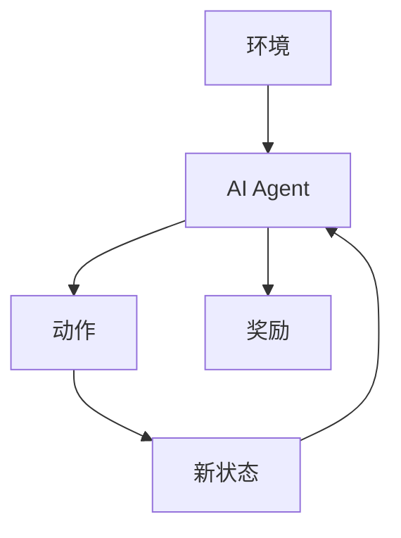
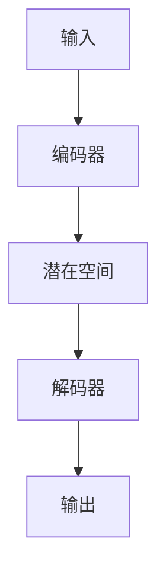
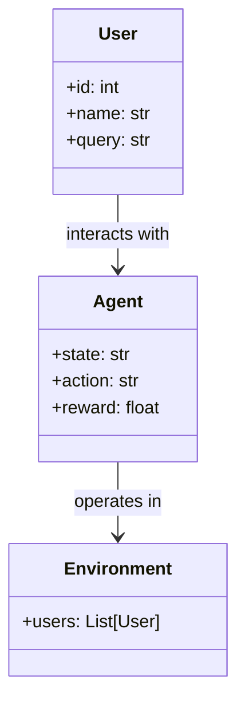
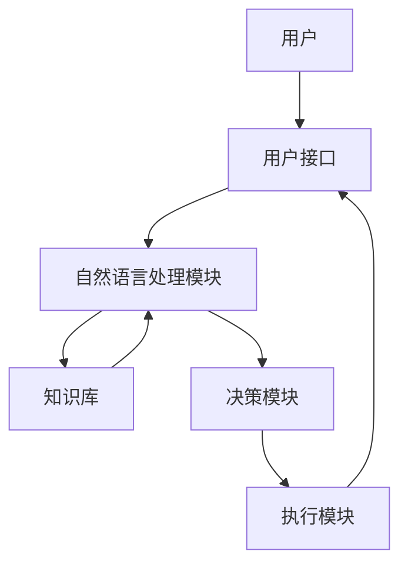
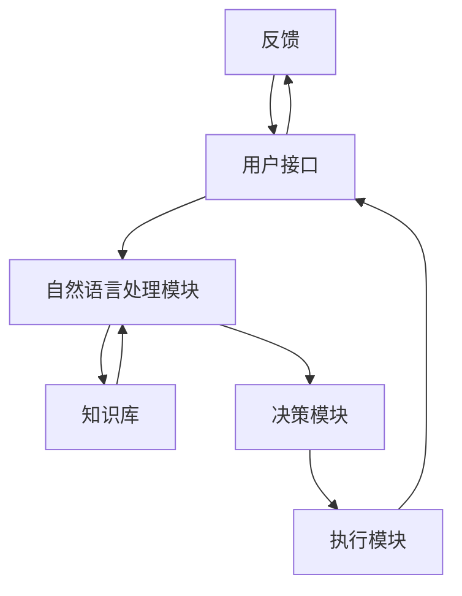

                 


# 《从零开始：AI Agent的自我意识模拟》

## 关键词：AI Agent, 自我意识, 人工智能, 强化学习, 生成式模型, 系统架构设计

## 摘要：  
本文深入探讨了AI Agent的自我意识模拟这一前沿技术，从基本概念到核心算法，再到系统架构设计和实际案例，层层剖析，帮助读者全面理解并掌握AI Agent的自我意识模拟的核心原理和实现方法。通过本文的学习，读者能够从理论到实践，逐步掌握构建具备自我意识的AI Agent的能力。

---

# 第一章: AI Agent的基本概念与背景

## 1.1 AI Agent的定义与特点

### 1.1.1 什么是AI Agent  
AI Agent（人工智能代理）是指能够感知环境、自主决策并采取行动的智能体。它能够通过与环境的交互，主动实现目标，具有一定的智能性和适应性。

### 1.1.2 AI Agent的核心特点  
1. **自主性**：AI Agent能够自主决策，无需外部干预。  
2. **反应性**：能够实时感知环境并做出反应。  
3. **目标导向**：所有行为都以实现特定目标为导向。  
4. **学习能力**：能够通过经验不断优化自身的决策能力。  

### 1.1.3 AI Agent与传统AI的区别  
传统AI（如专家系统）依赖于规则和知识库，而AI Agent则具备更强的自主性和适应性，能够主动与环境交互并动态调整行为。

---

## 1.2 自我意识模拟的背景与意义

### 1.2.1 自我意识的定义  
自我意识是指个体对自己存在状态的认知和理解，包括对自身目标、动机、情感等的反思和调控能力。

### 1.2.2 自我意识模拟的必要性  
随着AI Agent的应用场景越来越复杂，单纯依赖规则和预设行为已无法满足需求。具备自我意识的AI Agent能够更好地适应动态变化的环境，主动调整策略，甚至进行自我反思和优化。

### 1.2.3 自我意识模拟的应用场景  
1. **智能助手**：如虚拟助手，能够更好地理解用户需求并提供个性化服务。  
2. **自动驾驶**：具备自我意识的自动驾驶系统能够更灵活地应对复杂的交通环境。  
3. **机器人**：在工业或服务领域，具备自我意识的机器人能够更好地与人类协作。  

---

## 1.3 本章小结  
本章从AI Agent的基本概念出发，介绍了其核心特点与传统AI的区别，并分析了自我意识模拟的背景和意义，为后续内容奠定了基础。

---

# 第二章: 自我意识模拟的核心概念

## 2.1 自我意识模拟的理论基础

### 2.1.1 意识与认知的定义  
意识是自我意识的核心，涉及对自身状态、环境和行为的认知与理解。认知是通过感知和推理来获取知识的过程。

### 2.1.2 自我意识的层次结构  
1. **感知层**：对外部环境和自身状态的感知。  
2. **认知层**：对感知信息的处理和理解。  
3. **决策层**：基于认知做出决策和行动。  
4. **反思层**：对自身行为的反思与优化。  

### 2.1.3 自我意识模拟的实现路径  
1. **感知与理解**：通过传感器或数据输入获取信息。  
2. **决策与行动**：基于感知信息做出决策并执行行动。  
3. **学习与进化**：通过经验不断优化自身行为。  

---

## 2.2 自我意识模拟的核心要素

### 2.2.1 感知与理解  
AI Agent需要通过多种传感器或数据源感知环境，并对这些信息进行理解和解析。例如，图像识别、语音识别等技术都属于感知层的实现。

### 2.2.2 决策与行动  
基于感知到的信息，AI Agent需要做出决策并采取相应的行动。这通常涉及到强化学习、决策树等算法。

### 2.2.3 学习与进化  
通过与环境的交互，AI Agent能够不断学习和优化自身的决策策略。这包括监督学习、无监督学习和强化学习等多种学习方式。

---

## 2.3 自我意识模拟的边界与外延

### 2.3.1 与人类意识的差异  
AI Agent的自我意识模拟与人类意识存在本质差异，AI Agent不具备人类的情感和主观体验。

### 2.3.2 自我意识模拟的局限性  
1. **伦理问题**：AI Agent的自主性可能引发伦理争议。  
2. **复杂性**：高度复杂的环境可能超出当前AI Agent的能力范围。  

### 2.3.3 自我意识模拟的未来发展  
随着技术的进步，AI Agent的自我意识模拟将更加智能化和人性化，逐步实现更复杂的认知和决策能力。

---

## 2.4 本章小结  
本章详细阐述了自我意识模拟的核心概念，包括其理论基础、核心要素以及边界与外延，为后续的算法实现奠定了理论基础。

---

# 第三章: 自我意识模拟的算法原理

## 3.1 基于强化学习的自我意识模拟

### 3.1.1 强化学习的基本原理  
强化学习是一种通过试错机制来优化决策的算法。AI Agent通过与环境交互，不断尝试不同的动作，并根据反馈的奖励或惩罚来调整策略。

### 3.1.2 基于强化学习的自我意识模拟框架  
以下是强化学习的基本流程图：



### 3.1.3 算法实现示例  
以下是一个简单的强化学习算法实现示例：

```python
import numpy as np
import gym

env = gym.make('CartPole-v0')
env.seed(42)
np.random.seed(42)

# 初始化参数
learning_rate = 0.01
gamma = 0.99

# 策略函数
def policy(state, theta):
    return np.tanh(np.dot(state, theta))

# 状态值函数
def value_function(state, theta_v):
    return np.tanh(np.dot(state, theta_v))

# 初始化参数
theta = np.random.randn(4, 1) / np.sqrt(4)
theta_v = np.random.randn(4, 1) / np.sqrt(4)

# 策略梯度算法
for _ in range(1000):
    state = env.reset()
    done = False
    episode_rewards = []
    while not done:
        action = policy(state, theta)
        next_state, reward, done, _ = env.step(action)
        episode_rewards.append(reward)
        # 计算梯度并更新参数
        # ...
```

---

## 3.2 基于生成式模型的自我意识模拟

### 3.2.1 生成式模型的基本原理  
生成式模型（如GPT、Diffusion模型）通过生成与真实数据分布相似的样本，能够模拟人类的创造力和表达能力。

### 3.2.2 基于生成式模型的自我意识模拟  
通过生成式模型，AI Agent可以生成具有创造性思维的文本或决策方案，从而实现某种程度的自我意识模拟。

### 3.2.3 生成式模型的流程图  
以下是生成式模型的基本流程图：



---

## 3.3 本章小结  
本章详细介绍了自我意识模拟的核心算法，包括强化学习和生成式模型的基本原理和实现方法，为后续的系统设计和项目实战奠定了基础。

---

# 第四章: 自我意识模拟的系统分析与架构设计

## 4.1 问题场景分析

### 4.1.1 项目背景  
以开发一个具备自我意识的智能客服AI Agent为例，探讨其系统架构设计。

### 4.1.2 功能需求  
1. **用户交互**：能够与用户进行自然语言对话。  
2. **问题理解**：准确理解用户需求并提供解决方案。  
3. **自我优化**：根据用户反馈不断优化服务质量。  

---

## 4.2 系统功能设计

### 4.2.1 领域模型设计  
以下是智能客服AI Agent的领域模型类图：



### 4.2.2 系统架构设计  
以下是系统的总体架构图：



### 4.2.3 接口设计  
1. **用户接口**：提供自然语言输入和输出。  
2. **知识库接口**：提供领域知识查询服务。  
3. **决策模块接口**：接收输入并返回决策结果。  

### 4.2.4 交互流程设计  
以下是交互流程图：



---

## 4.3 本章小结  
本章通过问题场景分析和系统架构设计，详细阐述了具备自我意识的AI Agent的系统实现方案，为后续的项目实战奠定了基础。

---

# 第五章: 自我意识模拟的项目实战

## 5.1 环境配置与安装

### 5.1.1 开发环境  
建议使用Python 3.8及以上版本，安装必要的库，如TensorFlow、Keras、OpenAI API等。

### 5.1.2 安装依赖  
```bash
pip install numpy gym tensorflow keras matplotlib
```

---

## 5.2 系统核心实现

### 5.2.1 自然语言处理模块  
使用预训练的模型（如GPT）进行自然语言理解与生成。

### 5.2.2 决策模块  
基于强化学习算法实现决策逻辑。

### 5.2.3 知识库接口  
集成第三方知识库服务，如维基百科、FAQ库等。

---

## 5.3 代码实现与解读

### 5.3.1 自然语言处理模块实现  
```python
import openai

def generate_response(prompt):
    response = openai.ChatCompletion.create(
        model="gpt-3.5-turbo",
        messages=[{"role": "user", "content": prompt}]
    )
    return response.choices[0].message.content
```

### 5.3.2 决策模块实现  
```python
import gym
import numpy as np

env = gym.make('CartPole-v0')
env.seed(42)
np.random.seed(42)

theta = np.random.randn(4, 1) / np.sqrt(4)
learning_rate = 0.01
gamma = 0.99

# 策略梯度算法实现（简化版）
for _ in range(1000):
    state = env.reset()
    episode_rewards = []
    while True:
        action = np.dot(state, theta)
        action = np.tanh(action)
        next_state, reward, done, _ = env.step(action)
        episode_rewards.append(reward)
        # 更新参数（简化版）
        if done:
            break
```

---

## 5.4 实际案例分析

### 5.4.1 案例背景  
以智能客服AI Agent为例，展示其在处理用户咨询时的自我意识模拟过程。

### 5.4.2 案例分析  
1. **用户输入**：用户提出问题。  
2. **自然语言理解**：AI Agent理解用户需求并生成回应。  
3. **决策优化**：基于用户反馈优化回答策略。  

---

## 5.5 本章小结  
本章通过一个实际案例，详细展示了具备自我意识的AI Agent的实现过程，帮助读者更好地理解理论与实践的结合。

---

# 第六章: 总结与展望

## 6.1 本章总结  
本文从AI Agent的基本概念出发，详细探讨了自我意识模拟的核心概念、算法原理和系统架构设计，并通过实际案例展示了其具体实现方法。

## 6.2 未来展望  
随着技术的进步，具备更强自我意识的AI Agent将在更多领域得到应用，如智能助手、自动驾驶、机器人等。未来的研究方向可能包括更复杂的情感理解和多模态交互。

## 6.3 最佳实践Tips  
1. 在实际应用中，需注意AI Agent的伦理问题。  
2. 结合具体场景选择合适的算法和模型。  
3. 定期优化和更新AI Agent的决策策略。  

---

# 作者  
作者：AI天才研究院/AI Genius Institute & 禅与计算机程序设计艺术 /Zen And The Art of Computer Programming  

---

感谢您的阅读！希望本文能为您的技术探索之路提供有价值的参考与启发。

