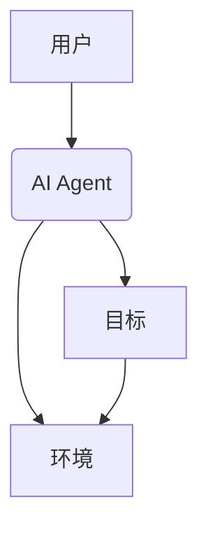
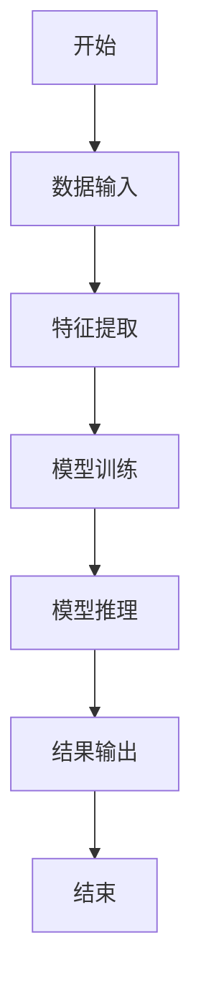
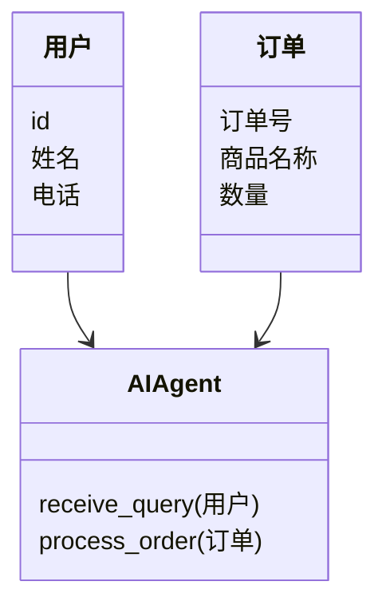
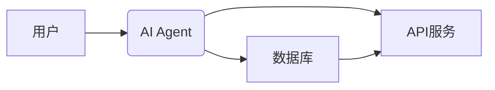
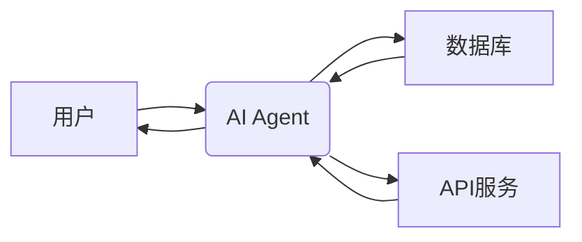

                 


# 从零开始：搭建AI Agent开发环境

## 关键词：AI Agent、开发环境、机器学习、深度学习、算法设计、系统架构、项目实战

## 摘要：  
本文旨在为读者提供一个系统化的指导，从零开始搭建一个完整的AI Agent开发环境。文章首先介绍AI Agent的基本概念和重要性，然后深入探讨其核心算法原理，接着详细讲解系统架构设计，最后通过实际项目实战，帮助读者掌握AI Agent开发的关键步骤。通过本文的学习，读者将能够从零开始，逐步搭建并优化自己的AI Agent开发环境，为后续的AI开发打下坚实的基础。

---

# 第1章: AI Agent概述

## 1.1 AI Agent的基本概念

### 1.1.1 什么是AI Agent  
AI Agent（人工智能代理）是一种能够感知环境、自主决策并执行任务的智能实体。它能够通过传感器获取信息，利用算法进行分析和推理，并通过执行器与环境交互。AI Agent可以是软件程序，也可以是硬件设备，其目标是实现特定任务或目标。

### 1.1.2 AI Agent的核心属性  
AI Agent的核心属性包括：  
1. **自主性**：能够自主决策，无需外部干预。  
2. **反应性**：能够实时感知环境并做出响应。  
3. **目标导向**：具有明确的目标，所有行为都围绕目标展开。  
4. **学习能力**：能够通过数据和经验不断优化自身性能。  

### 1.1.3 AI Agent的分类与应用场景  
AI Agent可以根据功能和应用场景分为以下几类：  
1. **简单反射型Agent**：基于规则进行简单响应，适用于环境变化小的场景。  
2. **基于模型的反射型Agent**：利用内部模型进行决策，适用于复杂环境。  
3. **目标驱动型Agent**：以目标为导向，优化行为以实现目标。  
4. **效用驱动型Agent**：通过最大化效用函数来实现最优决策。  

应用场景包括：智能助手、自动驾驶、智能客服、机器人控制等。

---

## 1.2 AI Agent的现状与发展

### 1.2.1 AI Agent的历史发展  
AI Agent的概念可以追溯到20世纪60年代，随着人工智能技术的发展，AI Agent逐渐从理论走向实际应用。早期的AI Agent主要用于学术研究，近年来，随着深度学习和大数据技术的进步，AI Agent的应用场景越来越广泛。

### 1.2.2 当前AI Agent的技术趋势  
当前，AI Agent的核心技术主要集中在以下几个方面：  
1. **感知技术**：包括自然语言处理、计算机视觉等。  
2. **决策技术**：包括机器学习、强化学习等。  
3. **执行技术**：包括机器人控制、自动化执行等。  

### 1.2.3 AI Agent的未来展望  
未来，AI Agent将朝着以下方向发展：  
1. **更强大的学习能力**：通过强化学习和自监督学习，提升AI Agent的自主决策能力。  
2. **多模态交互**：支持文本、语音、图像等多种交互方式。  
3. **人机协作**：AI Agent将与人类更加无缝协作，提升用户体验。  

---

## 1.3 搭建AI Agent开发环境的重要性

### 1.3.1 为什么需要搭建AI Agent开发环境  
AI Agent的开发需要一个完整的开发环境，包括硬件、软件、数据和算法等。一个良好的开发环境能够显著提高开发效率，降低开发成本，并为后续的优化和扩展提供便利。

### 1.3.2 开发环境对AI Agent性能的影响  
开发环境的选择和配置直接影响AI Agent的性能。例如，选择合适的编程语言和框架能够提升代码的运行效率，而优化硬件配置则能够提升模型的训练速度。

### 1.3.3 AI Agent开发环境的选择与优化  
选择开发环境时，需要综合考虑以下因素：  
1. **开发目标**：明确AI Agent的目标和应用场景。  
2. **技术栈**：选择适合的编程语言和框架。  
3. **硬件配置**：根据模型复杂度选择合适的硬件。  
4. **数据来源**：确保数据的质量和多样性。  

---

## 1.4 本章小结  
本章主要介绍了AI Agent的基本概念、分类、应用场景以及搭建开发环境的重要性。通过理解这些内容，读者可以为后续的开发工作打下坚实的基础。

---

# 第2章: AI Agent的核心概念与联系

## 2.1 AI Agent的核心概念原理

### 2.1.1 感知层原理  
感知层负责获取环境中的信息，包括文本、图像、语音等。常用的技术包括自然语言处理（NLP）和计算机视觉（CV）。  

### 2.1.2 决策层原理  
决策层负责根据感知到的信息进行分析和推理，选择最优的行动方案。常用算法包括机器学习、深度学习和强化学习。  

### 2.1.3 执行层原理  
执行层负责将决策层的决策转化为实际的行动，例如调用API、控制机器人等。  

---

## 2.2 核心概念属性特征对比表格  

| 概念 | 属性 | 特征 |
|------|------|------|
| 感知层 | 数据输入 | 文本、图像、语音等 |
| 决策层 | 算法选择 | 机器学习、深度学习等 |
| 执行层 | 输出方式 | API调用、消息队列等 |

---

## 2.3 ER实体关系图架构  



---

## 2.4 本章小结  
本章详细讲解了AI Agent的核心概念及其之间的关系，通过对比表格和实体关系图，帮助读者更好地理解AI Agent的组成部分。

---

# 第3章: AI Agent开发环境的算法原理讲解

## 3.1 算法原理概述

### 3.1.1 算法选择的原则  
选择算法时，需要考虑任务需求、数据规模、计算资源等因素。常用的算法包括线性回归、支持向量机（SVM）、神经网络等。

### 3.1.2 算法实现的关键点  
算法实现的关键点包括数据预处理、模型训练、模型评估和优化。  

### 3.1.3 算法优化的策略  
算法优化的策略包括参数调优、模型剪枝、分布式计算等。  

---

## 3.2 算法流程图  



---

## 3.3 算法实现代码示例  

```python
def ai_agent_algorithm(input_data):
    # 特征提取
    features = extract_features(input_data)
    # 模型训练
    model = train_model(features)
    # 模型推理
    result = model.predict(features)
    return result
```

---

## 3.4 算法的数学模型与公式  

### 3.4.1 损失函数  
$$L = \frac{1}{n}\sum_{i=1}^{n}(y_i - \hat{y_i})^2$$  

### 3.4.2 优化算法  
$$\theta = \theta - \eta \frac{\partial L}{\partial \theta}$$  

---

## 3.5 算法的举例说明  

### 3.5.1 线性回归案例  
线性回归是一种简单但有效的算法，适用于回归任务。  

### 3.5.2 支持向量机案例  
支持向量机适用于分类任务，能够在高维空间中找到最优分隔超平面。  

### 3.5.3 神经网络案例  
神经网络是一种强大的模型，适用于复杂的非线性任务。  

---

## 3.6 本章小结  
本章详细讲解了AI Agent开发环境中的算法原理，包括流程图、代码实现和数学公式，帮助读者理解算法的核心思想和实现步骤。

---

# 第4章: AI Agent开发环境的系统分析与架构设计

## 4.1 系统分析

### 4.1.1 问题场景介绍  
假设我们需要开发一个智能客服AI Agent，能够自动回答用户的问题并处理订单。  

### 4.1.2 项目介绍  
本项目旨在开发一个基于自然语言处理的智能客服系统，提升用户体验和工作效率。  

---

## 4.2 系统功能设计

### 4.2.1 领域模型（mermaid类图）  



---

## 4.3 系统架构设计

### 4.3.1 系统架构图  



---

## 4.4 系统接口设计

### 4.4.1 接口描述  
AI Agent需要与数据库和API服务进行交互，具体接口包括：  
1. 查询用户信息接口：`get_user_info(user_id)`  
2. 处理订单接口：`process_order(order_id)`  

---

## 4.5 系统交互流程图  



---

## 4.6 本章小结  
本章详细讲解了AI Agent开发环境的系统分析与架构设计，包括领域模型、架构图和交互流程图，帮助读者理解系统的整体结构和各部分之间的关系。

---

# 第5章: 项目实战

## 5.1 环境搭建

### 5.1.1 安装必要的库  
```bash
pip install numpy
pip install pandas
pip install scikit-learn
pip install tensorflow
```

---

## 5.2 核心代码实现

### 5.2.1 感知层代码  

```python
def extract_features(text):
    # 文本处理代码
    return features
```

### 5.2.2 决策层代码  

```python
def train_model(features):
    # 模型训练代码
    return model
```

### 5.2.3 执行层代码  

```python
def execute_action(result):
    # 执行动作代码
    return response
```

---

## 5.3 案例分析

### 5.3.1 案例描述  
假设我们开发了一个智能客服系统，用户输入一个问题，AI Agent需要自动回答。  

### 5.3.2 代码实现  

```python
def process_query(query):
    features = extract_features(query)
    model = train_model(features)
    result = model.predict(features)
    response = execute_action(result)
    return response
```

---

## 5.4 项目总结

### 5.4.1 经验总结  
1. 确保数据质量是关键。  
2. 选择合适的算法能够显著提升性能。  
3. 系统架构设计需要充分考虑扩展性。  

### 5.4.2 注意事项  
1. 代码注释要清晰，便于维护。  
2. 定期进行系统优化，提升性能。  

---

## 5.5 本章小结  
本章通过一个实际项目，详细讲解了AI Agent开发环境的搭建过程，包括环境搭建、代码实现和案例分析，帮助读者掌握AI Agent开发的关键步骤。

---

# 第6章: 最佳实践与拓展阅读

## 6.1 最佳实践 tips

### 6.1.1 代码规范  
1. 保持代码简洁，避免重复代码。  
2. 使用模块化设计，便于维护。  

### 6.1.2 数据处理  
1. 确保数据清洗和预处理的质量。  
2. 使用交叉验证评估模型性能。  

### 6.1.3 系统优化  
1. 优化算法性能，降低计算成本。  
2. 使用分布式架构提升系统扩展性。  

---

## 6.2 小结  
通过本文的学习，读者能够从零开始搭建一个完整的AI Agent开发环境，并掌握相关的开发技巧和优化方法。

---

## 6.3 注意事项

1. 在开发过程中，要注意保护用户隐私和数据安全。  
2. 确保系统的可扩展性和可维护性。  

---

## 6.4 拓展阅读

1. 《深度学习实战》  
2. 《机器学习算法解析》  
3. 《系统架构设计的艺术》  

---

## 作者：AI天才研究院/AI Genius Institute & 禅与计算机程序设计艺术 /Zen And The Art of Computer Programming  

---

通过本文的系统学习，读者将能够从零开始，逐步搭建并优化自己的AI Agent开发环境，为后续的AI开发打下坚实的基础。

