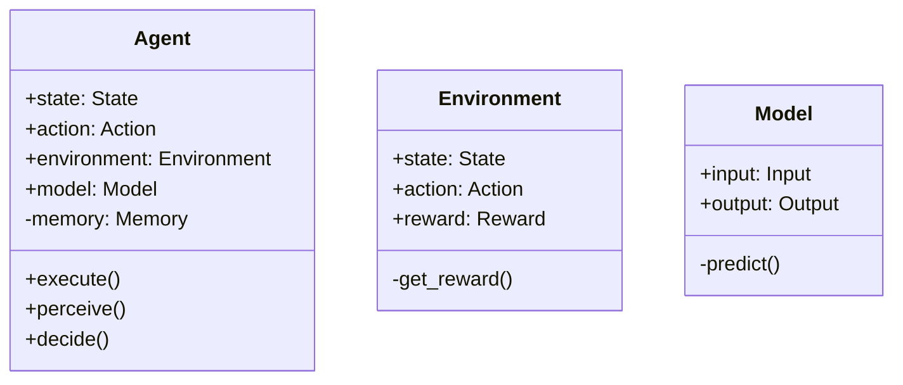

                 


# 《从零构建AI Agent的情境感知系统》

> 关键词：AI Agent，情境感知，智能系统，算法，系统架构

> 摘要：本文从零开始，系统地介绍AI Agent的情境感知系统的构建过程。从基本概念到核心算法，从系统架构到项目实战，详细解析情境感知系统的设计与实现。通过本文，读者可以掌握从理论到实践的核心技术与方法。

---

# 第一部分: AI Agent与情境感知系统概述

## 第1章: AI Agent的基本概念与背景

### 1.1 AI Agent的定义与特点
AI Agent（智能体）是一种能够感知环境并采取行动以实现目标的实体。它可以是一个软件程序，也可以是一个物理设备。AI Agent的核心特点包括：
- **自主性**：能够在没有外部干预的情况下运行。
- **反应性**：能够实时感知环境并做出反应。
- **目标导向**：所有行为都围绕实现特定目标展开。
- **社会能力**：能够与其他Agent或人类进行交互与协作。

### 1.2 情境感知系统的核心概念
情境感知系统是一种能够理解当前环境状态并据此做出智能决策的系统。它依赖于多模态数据（如视觉、听觉、文本等）的处理与融合，结合上下文信息进行推理与判断。

### 1.3 AI Agent在情境感知中的作用
AI Agent在情境感知系统中扮演着关键角色，负责数据的采集、处理、理解与决策。通过情境感知，AI Agent能够更好地理解用户需求，提供更精准的服务。

---

## 第2章: 情境感知系统的需求分析

### 2.1 情境感知的背景分析
随着AI技术的快速发展，情境感知技术逐渐成为智能系统的核心能力。它广泛应用于自动驾驶、智能助手、增强现实等领域，能够显著提升系统的智能化水平。

### 2.2 情境感知系统的应用需求
- **智能交互**：用户与系统之间的自然交互需求。
- **多模态数据处理**：整合多种数据源以提高准确性。
- **实时性与响应性**：系统需要快速处理并反馈结果。

### 2.3 情境感知系统的边界与外延
情境感知系统的边界定义为从数据采集到最终决策的全过程。其外延包括与之相关的技术支持（如传感器、网络）和应用场景（如智能家居、医疗健康）。

---

## 第3章: 情境感知的核心概念原理

### 3.1 感知数据的处理与融合
- **多模态数据的采集与预处理**：通过传感器或API获取数据，并进行标准化处理。
- **数据融合的方法**：包括基于统计的方法（如加权融合）和基于深度学习的方法（如神经网络融合）。
- **数据融合的挑战**：数据异质性、实时性等问题。

### 3.2 情境理解与推理
- **情境理解的基本原理**：基于知识图谱和深度学习模型进行语义理解。
- **基于知识图谱的推理方法**：利用图结构数据进行关联推理。
- **基于深度学习的推理模型**：如Transformer模型在自然语言处理中的应用。

### 3.3 行为决策与执行
- **决策算法的分类与选择**：包括基于规则的决策、基于模型的决策和基于强化学习的决策。
- **基于情境的决策模型**：如马尔可夫决策过程（MDP）。
- **决策执行的实现方式**：通过API调用或硬件控制执行决策。

---

## 第4章: 核心概念的属性特征对比与ER实体关系图

### 4.1 核心概念的属性特征对比
- **感知数据的特征对比**：包括数据类型、时间戳、来源等。
- **情境理解的特征对比**：包括语义、上下文、情感等因素。
- **决策行为的特征对比**：包括目标、优先级、约束条件等。

### 4.2 ER实体关系图
以下是情境感知系统的核心实体关系图：

```mermaid
erDiagram
    customer[客户] {
        id : integer
        name : string
        age : integer
    }
    device[设备] {
        id : integer
        type : string
        status : string
    }
    environment[环境] {
        id : integer
        location : string
        condition : string
    }
    interaction[交互] {
        id : integer
        customer_id : integer
        device_id : integer
        timestamp : datetime
    }
    relationship: customer - interaction
    relationship: device - interaction
    relationship: environment - interaction
```

---

## 第5章: 算法原理讲解

### 5.1 算法原理的数学模型
以下是基于强化学习的决策算法模型：

$$ R(s, a) = \sum_{i=1}^{n} \alpha_i s_i a_i $$

其中，$R$ 是奖励函数，$s$ 是状态，$a$ 是动作，$\alpha_i$ 是权重。

### 5.2 算法实现代码示例
以下是强化学习算法的Python代码示例：

```python
import numpy as np

class Agent:
    def __init__(self, state_space, action_space):
        self.state_space = state_space
        self.action_space = action_space
        self.Q = np.zeros((state_space, action_space))

    def act(self, state):
        return np.argmax(self.Q[state, :])

    def update(self, state, action, reward):
        self.Q[state, action] += reward

# 初始化环境和代理
state_space = 5
action_space = 3
agent = Agent(state_space, action_space)

# 训练过程
for episode in range(100):
    state = env.reset()
    while not env.done:
        action = agent.act(state)
        reward = env.get_reward(action)
        agent.update(state, action, reward)
        state = env.next_state(action)
```

---

## 第6章: 系统架构设计

### 6.1 系统功能设计
以下是系统功能的领域模型：



### 6.2 系统架构设计
以下是系统的总体架构：


---

## 第7章: 项目实战与拓展

### 7.1 项目环境安装
安装所需的依赖库：

```bash
pip install numpy matplotlib scikit-learn
```

### 7.2 系统核心实现源代码
以下是核心实现代码：

```python
import numpy as np
from sklearn import preprocessing

class PerceptionSystem:
    def __init__(self, data_sources):
        self.data_sources = data_sources
        self.preprocessor = preprocessing.StandardScaler()

    def perceive(self):
        data = []
        for source in self.data_sources:
            data.extend(source.get_data())
        return self.preprocessor.fit_transform(data)

# 示例数据源
class DataSource:
    def __init__(self, data):
        self.data = data

    def get_data(self):
        return self.data

# 使用示例
data_sources = [
    DataSource([[1, 2], [3, 4], [5, 6]]),
    DataSource([[7, 8], [9, 10], [11, 12]])
]

perception = PerceptionSystem(data_sources)
print(perception.perceive())
```

### 7.3 代码应用解读与分析
以上代码实现了多数据源的感知与预处理功能。通过`PerceptionSystem`类，我们可以整合多个数据源的数据，并进行标准化处理，为后续的分析和决策提供支持。

### 7.4 实际案例分析
以智能助手为例，系统可以根据用户的语音指令和当前环境数据（如位置、时间）提供个性化的服务，如提醒、信息查询等。

### 7.5 项目小结
通过实际项目的实现，我们可以看到情境感知系统的核心在于数据的处理与融合，以及基于此的智能决策。

---

## 第8章: 最佳实践与小结

### 8.1 最佳实践
- 数据预处理是关键，尤其是多模态数据的融合。
- 使用合适的算法模型，根据场景选择强化学习或监督学习。
- 系统架构设计要模块化，便于扩展和维护。

### 8.2 注意事项
- 数据隐私与安全问题需要重点关注。
- 系统的实时性和响应性需要优化。
- 测试与验证是确保系统稳定性的关键步骤。

### 8.3 拓展阅读
推荐书籍：
- 《深度学习》—— Ian Goodfellow
- 《强化学习》—— Richard S. Sutton

---

作者：AI天才研究院 & 禅与计算机程序设计艺术

