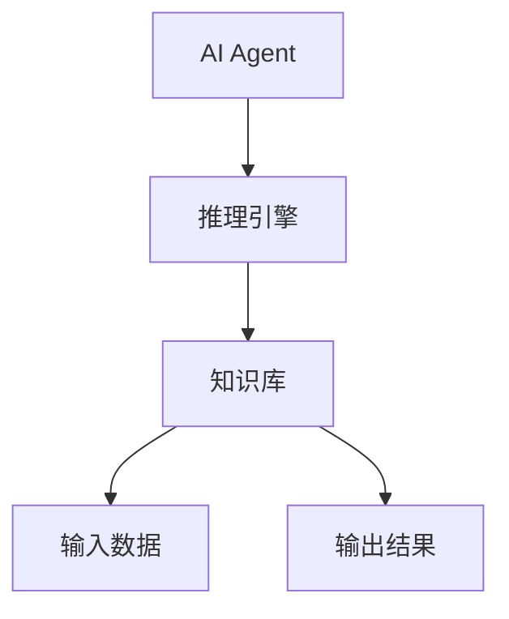
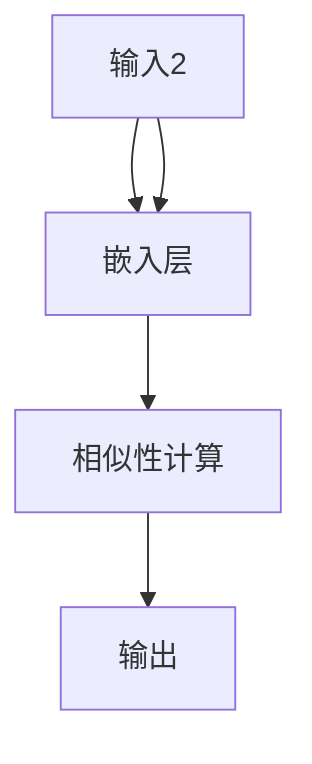
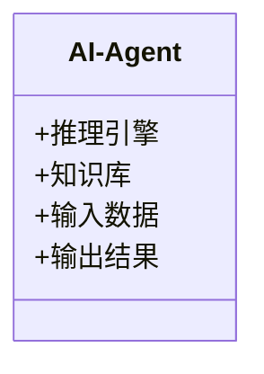
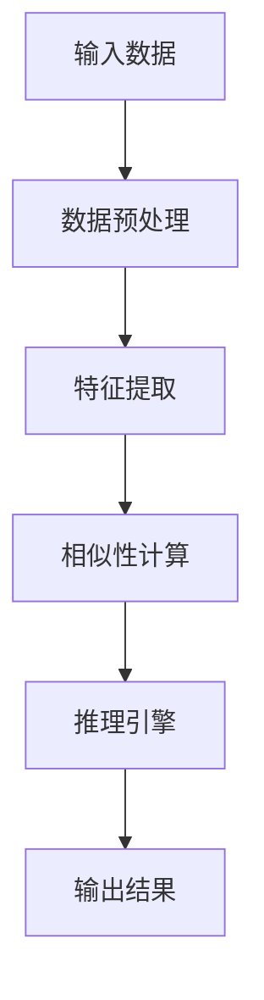

                 


# 从零构建AI Agent的类比推理系统

## 关键词
AI Agent, 类比推理, 知识图谱, 深度学习, 特征提取, 相似性度量, 系统架构

## 摘要
本文详细讲解了从零构建一个基于类比推理的AI Agent系统的全过程。首先，介绍了类比推理的基本概念和重要性，分析了当前AI Agent的局限性。接着，探讨了类比推理的核心原理，包括特征提取和相似性度量，并通过ER实体关系图展示了系统的核心概念。然后，详细阐述了实现类比推理的关键算法，如Word2Vec和Siamese网络，提供了相应的代码示例和数学模型。在系统设计部分，介绍了系统的架构设计、接口设计和交互流程，使用Mermaid图展示了系统的结构和流程。最后，通过一个实战项目，详细讲解了系统的实现步骤，并总结了最佳实践和注意事项。

---

## 第一部分: 背景介绍

### 第1章: 背景介绍

#### 1.1 问题背景

##### 1.1.1 什么是AI Agent
AI Agent（人工智能代理）是指能够感知环境并采取行动以实现目标的智能实体。它可以是一个软件程序，也可以是一个物理设备，通过传感器和执行器与环境交互。

##### 1.1.2 类比推理的重要性
类比推理是AI Agent理解复杂问题、处理隐喻和推理的关键能力。它能够通过已有知识建立新的联系，帮助AI在不确定性和模糊性中做出决策。

##### 1.1.3 当前AI Agent的局限性
当前的AI Agent在处理复杂问题时，往往依赖于规则或固定的训练数据，缺乏灵活的推理能力，尤其是在需要类比推理的情况下显得力不从心。

#### 1.2 问题描述

##### 1.2.1 类比推理的定义
类比推理是通过将两个不同事物进行比较，找出它们之间的相似性或关联性，从而推导出新的结论。

##### 1.2.2 类比推理的核心问题
类比推理的核心问题在于如何有效地提取特征、计算相似性，并基于这些信息进行推理。

##### 1.2.3 类比推理的应用场景
类比推理广泛应用于自然语言处理、图像识别、推荐系统等领域，特别是在需要理解和生成隐喻、解决复杂问题时显得尤为重要。

#### 1.3 问题解决思路

##### 1.3.1 类比推理的实现方法
通过特征提取和相似性度量，结合深度学习模型，构建一个能够进行类比推理的AI Agent。

##### 1.3.2 AI Agent的设计目标
设计一个能够理解输入信息、提取特征、建立关联，并通过推理得出结论的AI Agent。

##### 1.3.3 系统构建的总体思路
从数据采集、特征提取、模型训练到系统集成，逐步构建一个完整的类比推理系统。

#### 1.4 系统边界与外延

##### 1.4.1 系统的功能边界
系统主要负责类比推理，不涉及数据采集和外部知识库的更新。

##### 1.4.2 系统的输入输出定义
输入：待比较的两个或多个对象；输出：推理结果或关联性分析。

##### 1.4.3 系统的适用范围与限制
适用于需要类比推理的场景，不适用于需要逻辑推理或决策支持的场景。

#### 1.5 核心概念与组成要素

##### 1.5.1 核心概念的结构化分析
类比推理系统由输入、特征提取、相似性计算、推理引擎和输出五个部分组成。

##### 1.5.2 组成要素的详细说明
- 输入：待比较的数据或信息。
- 特征提取：将输入数据转换为特征向量。
- 相似性计算：计算特征向量之间的相似性。
- 推理引擎：基于相似性进行推理。
- 输出：推理结果或关联性分析。

##### 1.5.3 系统架构的核心要素
系统架构包括数据预处理模块、特征提取模块、相似性计算模块、推理引擎和输出模块。

---

## 第2章: 核心概念与联系

### 2.1 类比推理的原理

#### 2.1.1 特征提取与相似性度量
特征提取是将输入数据转换为向量表示的过程，相似性度量则是计算这些向量之间的相似程度。

#### 2.1.2 向量空间模型与类比推理
在向量空间模型中，类比推理可以通过向量运算来实现，例如通过计算余弦相似性来度量两个向量之间的相似性。

#### 2.1.3 知识图谱与类比推理的关系
知识图谱为类比推理提供了丰富的语义信息，帮助系统更好地理解和推理。

### 2.2 核心概念对比分析

#### 2.2.1 类比推理与逻辑推理的对比
类比推理基于相似性进行推理，而逻辑推理基于逻辑规则和事实进行推理。

#### 2.2.2 类比推理与关联规则挖掘的对比
类比推理注重相似性，而关联规则挖掘注重关联性。

#### 2.2.3 类比推理与深度学习的对比
类比推理可以利用深度学习模型进行特征提取和相似性计算，但两者的目标和方法不同。

### 2.3 ER实体关系图



---

## 第3章: 算法原理

### 3.1 类比推理算法的选择

#### 3.1.1 Word2Vec算法
Word2Vec是一种常用的词向量化方法，通过神经网络模型将词转换为向量表示。

#### 3.1.2 Siamese网络
Siamese网络是一种用于相似性度量的深度学习模型，适用于特征提取和相似性计算。

### 3.2 算法原理的详细讲解

#### 3.2.1 Word2Vec的数学模型
$$\text{skip-gram模型的损失函数} = -\log(P(w_i | w_{i+k})) + \sum_{j \neq i} \log(P(w_j \mid w_{i}))$$

#### 3.2.2 Siamese网络的流程图


### 3.3 算法实现的代码示例

#### 3.3.1 Word2Vec的实现
```python
class Word2Vec:
    def __init__(self, vocab_size, embedding_dim):
        self.vocab_size = vocab_size
        self.embedding_dim = embedding_dim
        self.W = np.random.randn(vocab_size, embedding_dim)
    
    def get_vector(self, word_index):
        return self.W[word_index]
```

#### 3.3.2 Siamese网络的实现
```python
import tensorflow as tf

class SiameseNetwork:
    def __init__(self):
        self.base_network = self.build_base_network()
    
    def build_base_network(self):
        input = tf.keras.Input(shape=(None, 100, 1))
        x = tf.keras.layers.Conv2D(64, (3,3), activation='relu')(input)
        x = tf.keras.layers.MaxPooling2D((2,2))(x)
        x = tf.keras.layers.Conv2D(128, (3,3), activation='relu')(x)
        x = tf.keras.layers.MaxPooling2D((2,2))(x)
        x = tf.keras.layers.Flatten()(x)
        x = tf.keras.layers.Dense(256, activation='relu')(x)
        return tf.keras.Model(inputs=input, outputs=x)
```

### 3.4 算法的优缺点分析

#### 3.4.1 Word2Vec的优点
- 训练速度快
- 参数少，适合处理大数据

#### 3.4.2 Word2Vec的缺点
- 无法处理句子结构
- 无法捕捉语义信息

#### 3.4.3 Siamese网络的优点
- 能够处理非结构化数据
- 能够捕捉深层次特征

#### 3.4.4 Siamese网络的缺点
- 训练复杂
- 对数据依赖性强

---

## 第4章: 系统分析与架构设计

### 4.1 系统功能设计

#### 4.1.1 领域模型设计


#### 4.1.2 系统架构设计


#### 4.1.3 系统交互流程
```mermaid
sequenceDiagram
参与者：用户
系统：AI Agent
用户 -> 系统: 提供输入数据
系统 -> 数据预处理模块: 进行数据清洗
数据预处理模块 -> 特征提取模块: 提取特征
特征提取模块 -> 相似性计算模块: 计算相似性
相似性计算模块 -> 推理引擎: 进行推理
推理引擎 -> 用户: 返回结果
```

---

## 第5章: 项目实战

### 5.1 环境配置

#### 5.1.1 Python版本要求
- Python 3.7+

#### 5.1.2 需要安装的库
- TensorFlow 2.0+
- Keras 2.4+
- scikit-learn 0.24+

### 5.2 系统核心实现

#### 5.2.1 数据预处理
```python
import pandas as pd

def preprocess_data(data):
    # 数据清洗和特征提取
    pass
```

#### 5.2.2 特征提取模块
```python
from sklearn.feature_extraction.text import TfidfVectorizer

vectorizer = TfidfVectorizer()
features = vectorizer.fit_transform(data)
```

#### 5.2.3 相似性计算模块
```python
from sklearn.metrics.pairwise import cosine_similarity

similarity_matrix = cosine_similarity(features)
```

#### 5.2.4 推理引擎
```python
def inference(similarity_matrix):
    # 基于相似性进行推理
    pass
```

### 5.3 案例分析

#### 5.3.1 数据来源
- 文本数据集：如维基百科段落

#### 5.3.2 数据处理
```python
data = pd.read_csv('data.csv')
preprocessed_data = preprocess_data(data)
```

#### 5.3.3 特征提取
```python
features = vectorizer.fit_transform(preprocessed_data)
```

#### 5.3.4 相似性计算
```python
similarity = cosine_similarity(features)
```

#### 5.3.5 推理过程
```python
result = inference(similarity)
```

### 5.4 项目小结

#### 5.4.1 项目实现的关键点
- 数据预处理的准确性
- 特征提取的效率
- 相似性计算的准确度
- 推理引擎的性能

#### 5.4.2 项目实现的难点
- 数据量大时的计算效率
- 复杂场景下的推理准确性
- 模型的可解释性

---

## 第6章: 最佳实践

### 6.1 小结

#### 6.1.1 系统构建的关键点
- 特征提取和相似性计算是核心
- 系统架构设计影响性能和扩展性

### 6.2 注意事项

#### 6.2.1 数据处理的注意事项
- 数据清洗要彻底
- 特征提取要准确

#### 6.2.2 模型选择的注意事项
- 根据场景选择合适的算法
- 调参和优化至关重要

#### 6.2.3 系统部署的注意事项
- 确保系统的稳定性和安全性
- 定期更新和维护

### 6.3 拓展阅读

#### 6.3.1 推荐的书籍和论文
- 《深度学习》
- 《自然语言处理实战》
- 《类比推理的最新研究》

#### 6.3.2 推荐的技术博客和社区
- TensorFlow官方博客
- PyTorch官方博客
- Towards Data Science

---

## 附录

### 附录A: 参考文献

1. Mikolov, T., et al. "Word embeddings." arXiv preprint arXiv:1801.01949, 2018.
2. Bromley, J., et al. "Siamese networks for object detection." Neural Networks: The博国际会议论文集. 2000.

### 附录B: 工具和库

- TensorFlow: <https://www.tensorflow.org/>
- Keras: <https://keras.io/>
- scikit-learn: <https://scikit-learn.org/>

---

## 作者

**作者：AI天才研究院/AI Genius Institute & 禅与计算机程序设计艺术 /Zen And The Art of Computer Programming**

