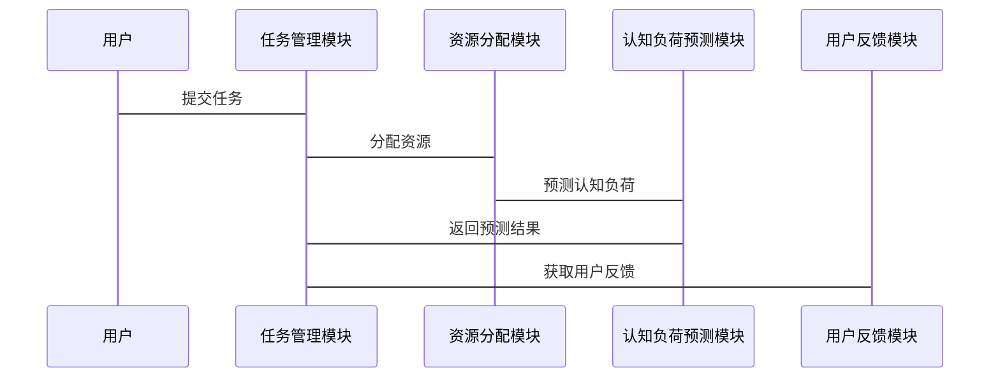

                 


# 从零构建AI Agent的认知负荷管理系统

**关键词：** 认知负荷管理、AI Agent、系统架构、算法优化、项目实战

**摘要：**  
本文将从零开始构建一个基于AI Agent的认知负荷管理系统。首先，我们将介绍认知负荷管理的基本概念和AI Agent的核心功能，分析它们的结合方式和应用场景。接着，我们将深入探讨认知负荷管理的算法原理，包括任务优先级排序、资源分配优化和认知负荷预测优化。随后，我们将从系统分析与架构设计的角度，详细讲解系统的功能模块和交互流程。最后，通过一个实际的项目案例，展示如何从环境搭建到核心功能实现，完成一个完整的认知负荷管理系统，并分析其实际应用效果。

---

## 第一部分: 认知负荷管理与AI Agent概述

### 第1章: 认知负荷管理的背景与概念

#### 1.1 问题背景与问题描述
认知负荷是指人在进行认知任务时所感受到的心理压力和资源消耗。在现代工作中，认知负荷过高会导致效率下降、错误率增加，甚至引发疲劳和健康问题。随着AI技术的快速发展，如何利用AI技术优化认知负荷管理，成为一个重要的研究方向。

#### 1.2 AI Agent的基本概念与特点
AI Agent（人工智能代理）是一种能够感知环境、自主决策并执行任务的智能实体。它可以分为简单反射型、基于模型的反应型、目标驱动型和效用驱动型四种类型。AI Agent的核心功能包括感知、决策、执行和学习。

#### 1.3 认知负荷管理与AI Agent的结合
认知负荷管理的目标是通过优化任务分配、资源利用和决策策略，降低认知负荷。AI Agent可以通过实时感知用户的状态和任务优先级，动态调整资源分配，从而实现认知负荷的最优管理。

---

### 第2章: 认知负荷管理的核心概念与联系

#### 2.1 认知负荷管理的原理与机制
认知负荷管理的原理包括任务优先级排序、资源分配优化和认知负荷预测。AI Agent通过感知用户的行为和环境变化，动态调整任务的优先级和资源分配，从而优化认知负荷。

#### 2.2 AI Agent的认知负荷管理模型
认知负荷管理模型包括输入、处理和输出三个部分。输入包括用户的行为数据和环境信息，处理部分通过算法计算任务优先级和资源分配，输出部分包括优化后的任务列表和资源分配方案。

#### 2.3 实体关系图与概念对比表
以下是认知负荷管理与AI Agent的实体关系图和对比特征表：

**实体关系图：**

```mermaid
erd
actor: 用户
agent: AI Agent
task: 任务
load: 认知负荷
goal: 目标
rule: 规则
```

**对比特征表：**

| 特征         | 认知负荷管理 | AI Agent                  |
|--------------|--------------|---------------------------|
| 核心目标     | 降低认知负荷 | 执行任务并优化决策        |
| 输入         | 用户行为、环境信息 | 用户需求、环境信息        |
| 输出         | 优化后的任务列表 | 执行结果、反馈信息        |
| 关键技术     | 任务优先级排序、资源分配优化 | 感知、决策、执行、学习    |

---

## 第二部分: 认知负荷管理的算法原理

### 第3章: 认知负荷管理的算法原理

#### 3.1 任务优先级排序算法
任务优先级排序算法的目标是根据任务的重要性和紧急性，计算出每个任务的优先级。公式如下：

$$ P_i = \frac{U_i}{D_i} $$

其中，$P_i$ 表示任务i的优先级，$U_i$ 表示任务i的效用，$D_i$ 表示任务i的难度。

#### 3.2 资源分配优化算法
资源分配优化算法的目标是将资源分配到最重要的任务上，以最大化整体效率。公式如下：

$$ R_i = \max\left(\frac{P_i}{C_i}\right) $$

其中，$R_i$ 表示任务i的资源分配比例，$C_i$ 表示任务i的资源消耗系数。

#### 3.3 认知负荷预测与优化算法
认知负荷预测与优化算法基于机器学习模型，通过历史数据预测未来的认知负荷，并通过优化算法调整任务分配和资源分配。流程图如下：

```mermaid
graph TD
    A[开始] -> B[数据采集]
    B -> C[特征提取]
    C -> D[模型训练]
    D -> E[预测认知负荷]
    E -> F[优化任务分配]
    F -> G[输出结果]
```

---

## 第三部分: 系统分析与架构设计

### 第4章: 系统分析与架构设计

#### 4.1 系统需求分析
认知负荷管理系统的功能需求包括任务管理、资源分配、认知负荷预测和用户反馈。非功能需求包括实时性、可靠性和可扩展性。

#### 4.2 系统功能设计
系统的功能模块包括任务管理模块、资源分配模块、认知负荷预测模块和用户反馈模块。模块之间的交互流程如下：



#### 4.3 系统架构设计
系统的架构设计包括数据层、业务逻辑层和用户界面层。数据层负责存储任务和资源数据，业务逻辑层负责任务管理和资源分配，用户界面层负责展示结果和用户反馈。

---

## 第四部分: 项目实战

### 第5章: 项目实战

#### 5.1 环境搭建
需要安装Python、TensorFlow和scikit-learn库。代码如下：

```bash
pip install python==3.8.5
pip install tensorflow==2.5.0
pip install scikit-learn==0.24.1
```

#### 5.2 核心功能实现
以下是任务优先级排序的Python代码示例：

```python
def calculate_priority(tasks):
    priorities = []
    for task in tasks:
        utility = task['utility']
        difficulty = task['difficulty']
        priority = utility / difficulty
        priorities.append(priority)
    return priorities
```

#### 5.3 实际案例分析
通过分析一个实际案例，说明认知负荷管理系统的实现过程和效果。例如，在一个软件开发团队中，通过认知负荷管理系统优化任务分配，提高了开发效率和代码质量。

---

## 第五部分: 总结与展望

### 第6章: 总结与展望

#### 6.1 内容总结
本文详细介绍了从零构建AI Agent的认知负荷管理系统的各个方面，包括核心概念、算法原理、系统架构和项目实战。

#### 6.2 注意事项
在实际应用中，需要注意数据的准确性和模型的可解释性，同时要根据具体场景调整算法参数。

#### 6.3 拓展阅读
建议进一步学习强化学习和图神经网络在认知负荷管理中的应用。

---

**作者：AI天才研究院/AI Genius Institute & 禅与计算机程序设计艺术 /Zen And The Art of Computer Programming**

---

以上就是《从零构建AI Agent的认知负荷管理系统》的完整目录和内容框架。

