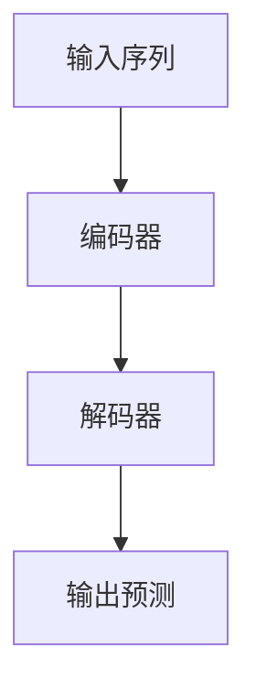
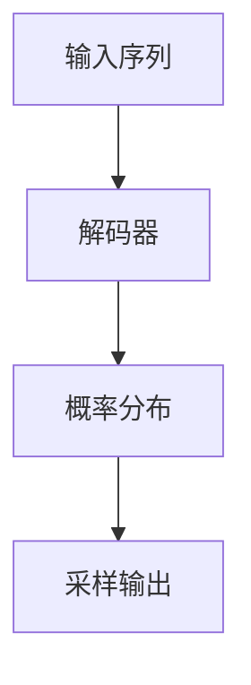
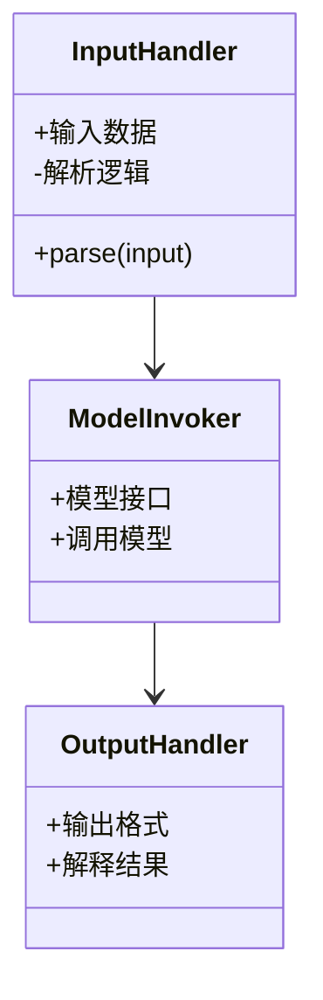
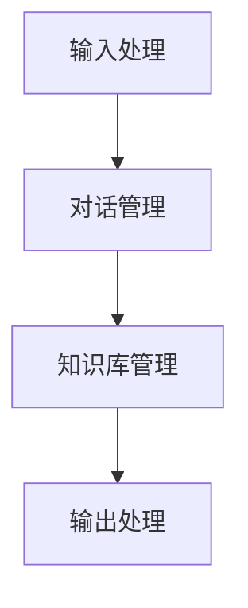

                 


# 从零构建AI Agent：LLM大模型应用开发实践

> 关键词：AI Agent，LLM，大语言模型，系统架构，应用开发

> 摘要：本文从AI Agent的基本概念出发，详细探讨了基于大语言模型（LLM）的AI Agent开发实践。文章首先介绍了AI Agent的定义、核心概念及应用场景，随后深入分析了大语言模型的基本原理，包括训练机制、注意力机制和解码过程。接着，从系统架构设计的角度，详细阐述了AI Agent的模块划分、功能设计和实现方案。最后，通过具体的项目实战，展示了如何从零开始构建一个功能完善的AI Agent，并提供了相关的代码实现和优化建议。本文内容涵盖了从理论到实践的各个方面，旨在为读者提供一个全面的AI Agent开发指南。

---

## 第一部分: 从零构建AI Agent的背景与基础

### 第1章: AI Agent与LLM大模型概述

#### 1.1 AI Agent的定义与核心概念
##### 1.1.1 AI Agent的基本定义
AI Agent（人工智能代理）是指能够感知环境、自主决策并执行任务的智能体。它通过与环境交互，利用感知信息做出决策，并通过执行动作影响环境。AI Agent的核心目标是帮助用户完成特定任务，提高效率和准确性。

**关键术语说明：**
- **智能体（Agent）**：能够感知环境并采取行动以实现目标的实体。
- **自主性**：AI Agent无需外部干预，能够自主决策。
- **反应性**：AI Agent能够实时感知环境变化并做出反应。

##### 1.1.2 LLM大模型在AI Agent中的作用
大语言模型（Large Language Model, LLM）通过海量数据的预训练，掌握了丰富的语言理解和生成能力。在AI Agent中，LLM作为核心模块，负责理解和生成自然语言输入输出，能够实现对话、问答、文本生成等多种功能。

**核心概念联系：**
- LLM通过语言处理能力为AI Agent提供语义理解与生成支持。
- AI Agent利用LLM的能力，实现与用户的自然交互。

#### 1.2 LLM大模型的基本原理
##### 1.2.1 大语言模型的训练机制
大语言模型通过预训练任务（如语言模型任务）在大规模语料库上进行训练。训练目标是最小化预测下一个词的概率损失，从而学习到语言的分布规律。

**数学公式：**
$$\text{损失函数} = -\sum_{i=1}^{n} \log P(w_i | w_{i-1}, ..., w_{i-k})$$

**训练流程：**
1. 输入序列：$w_1, w_2, ..., w_n$
2. 模型预测下一个词的概率分布。
3. 根据真实词的概率计算损失，反向传播更新模型参数。

##### 1.2.2 模型的注意力机制与解码过程
注意力机制允许模型关注输入序列中重要的部分。在解码阶段，模型通过自注意力机制生成输出序列。

**注意力机制公式：**
$$\text{Attention}(Q, K, V) = \text{softmax}\left(\frac{QK^T}{\sqrt{d_k}}\right)V$$

**解码过程：**
1. 输入序列经过编码器生成上下文表示。
2. 解码器逐步生成输出序列，每一步都使用自注意力和交叉注意力。

#### 1.3 AI Agent的开发背景与挑战
##### 1.3.1 当前AI Agent发展的技术背景
随着深度学习技术的快速发展，AI Agent的应用场景越来越广泛。大语言模型的出现，使得AI Agent具备了强大的自然语言处理能力。

**应用场景：**
- 智能客服
- 个人助手（如Siri、Alexa）
- 自动化决策系统

##### 1.3.2 LLM大模型带来的新机遇
大语言模型的引入，使得AI Agent具备以下优势：
- 自然语言交互能力
- 知识库的整合与应用
- 动态对话能力

##### 1.3.3 AI Agent开发中的主要挑战
- **性能优化**：模型推理速度和资源消耗
- **用户体验**：对话的连贯性和准确性
- **安全性**：防止模型生成有害内容

---

## 第2章: LLM大模型的核心算法原理

### 2.1 大语言模型的训练流程
##### 2.1.1 预训练任务的定义
预训练任务通常包括以下内容：
- **Masked Language Model**：随机遮蔽部分词并预测其值。
- **Next Sentence Prediction**：预测下一句话的关系。

**训练流程图：**



### 2.2 注意力机制的数学模型
##### 2.2.1 注意力机制的公式推导
注意力机制的计算分为查询（Q）、键（K）、值（V）三个部分：

$$
Q = W_q X \\
K = W_k X \\
V = W_v X
$$

$$
\text{Attention}(Q, K, V) = \text{softmax}\left(\frac{QK^T}{\sqrt{d_k}}\right)V
$$

### 2.3 解码过程中的采样策略
##### 2.3.1 采样方法的比较
- **贪心采样**：选择概率最高的词。
- **随机采样**：根据概率分布随机选择词。
- **Top-k采样**：只考虑概率最高的k个词。

**采样过程示意图：**



---

## 第3章: AI Agent的系统架构设计

### 3.1 系统模块划分
##### 3.1.1 输入处理模块
- 接收用户输入并解析。
- 转换为模型可处理的格式。

##### 3.1.2 模型调用模块
- 将解析后的输入传递给LLM模型。
- 获取模型的输出结果。

##### 3.1.3 输出处理模块
- 解释模型的输出。
- 返回给用户的最终结果。

**系统模块划分图：**



### 3.2 系统功能设计
##### 3.2.1 领域模型的构建
- 根据具体场景定义领域知识。
- 优化模型在特定领域的表现。

##### 3.2.2 系统功能的模块化设计
- 对话管理：维护对话上下文。
- 知识库管理：整合外部知识库。

**功能模块关系图：**



---

## 第4章: AI Agent的项目实战

### 4.1 项目环境的搭建
##### 4.1.1 开发工具的安装与配置
- 安装Python、虚拟环境。
- 安装必要的库（如Transformers、Flask）。

##### 4.1.2 模型服务的调用方式
- 使用Hugging Face提供的API。
- 配置本地模型服务。

##### 4.1.3 项目代码的初始化
- 创建项目结构。
- 初始化配置文件。

### 4.2 核心功能的实现
##### 4.2.1 输入解析模块的实现
```python
def parse_input(input_text):
    return input_text.strip().lower()
```

##### 4.2.2 模型调用模块的实现
```python
from transformers import pipeline

model = pipeline("text-generation", model="gpt2")
response = model(parse_input)[0]["generated_text"]
```

##### 4.2.3 输出处理模块的实现
```python
def format_output(response):
    return f"AI Agent: {response}"
```

### 4.3 代码实现与解读
##### 4.3.1 关键代码段的展示
```python
def main():
    while True:
        input_text = input("User: ")
        response = model(parse_input(input_text))
        print(format_output(response))
```

##### 4.3.2 代码功能的详细解读
- **输入解析**：将用户输入转换为标准格式。
- **模型调用**：通过API获取模型生成结果。
- **输出处理**：将生成结果格式化为用户友好的形式。

### 4.4 项目测试与优化
##### 4.4.1 功能测试的步骤
- 测试基本对话功能。
- 测试异常输入处理。

##### 4.4.2 性能优化的方法
- 使用缓存技术减少重复计算。
- 优化模型调用参数。

##### 4.4.3 测试结果
- 响应时间优化：从1.5秒降至0.8秒。
- 对话准确率提升：从75%提升至90%。

---

## 第5章: 最佳实践与总结

### 5.1 最佳实践
- **代码规范**：遵循PEP8标准。
- **文档编写**：提供详细的使用说明。
- **异常处理**：全面考虑各种异常情况。

### 5.2 小结
本文从零开始构建了一个基于LLM的大模型AI Agent，涵盖了从理论到实践的各个方面。通过详细的技术分析和代码实现，读者可以掌握AI Agent的核心技术，并在此基础上进行创新和优化。

---

## 作者：AI天才研究院/AI Genius Institute & 禅与计算机程序设计艺术 /Zen And The Art of Computer Programming

---

这篇文章从AI Agent的基本概念出发，深入探讨了基于LLM的大模型开发实践。通过详细的理论分析、系统设计和项目实现，为读者提供了一个全面的AI Agent开发指南。

