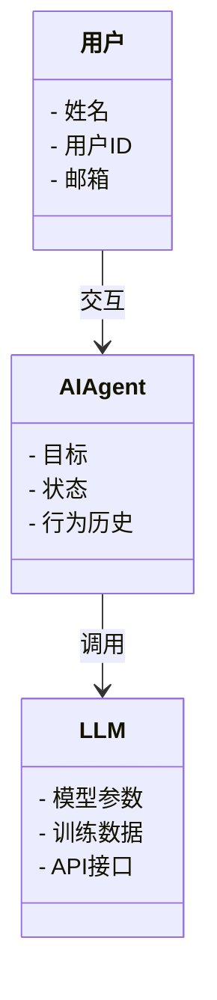
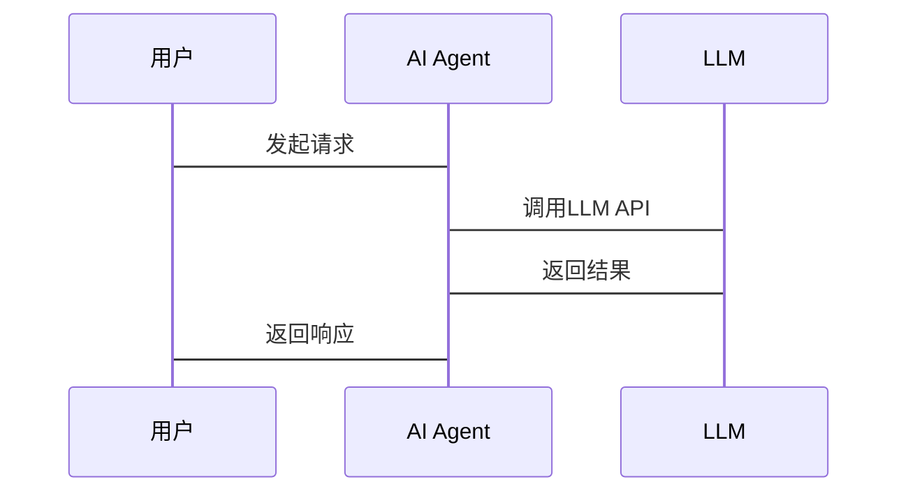

                 


# 从零构建AI Agent：LLM大模型应用开发实践概述

> 关键词：AI Agent，LLM，大语言模型，自然语言处理，人工智能，应用开发

> 摘要：本文将详细介绍从零开始构建AI Agent所需的知识和技能，结合大语言模型（LLM）的应用开发实践。通过系统分析AI Agent与LLM的核心概念、算法原理、系统架构以及实际项目开发，本文旨在为开发者提供一个清晰的技术路线图，帮助他们在实践中掌握AI Agent的构建与优化。

---

## 第1章: AI Agent与LLM大模型概述

### 1.1 AI Agent的基本概念
#### 1.1.1 什么是AI Agent
AI Agent（人工智能代理）是指能够感知环境、执行任务并做出决策的智能实体。它可以是一个软件程序、机器人或任何能够自主行动以实现目标的智能系统。

#### 1.1.2 AI Agent的核心特征
- **自主性**：能够在没有外部干预的情况下自主运作。
- **反应性**：能够实时感知环境并做出反应。
- **目标导向**：所有行动都围绕特定目标展开。
- **学习能力**：能够通过经验优化自身行为。

#### 1.1.3 AI Agent的应用场景
- **智能助手**：如Siri、Alexa等。
- **自动驾驶**：通过AI Agent实时感知和决策。
- **智能客服**：通过自然语言处理与用户交互。

### 1.2 LLM大模型的定义与特点
#### 1.2.1 大语言模型的基本概念
大语言模型（LLM，Large Language Model）是指基于大规模数据训练的深度学习模型，能够理解和生成人类语言。

#### 1.2.2 LLM与传统NLP模型的区别
- **数据规模**：LLM通常使用百万级别的训练数据。
- **模型复杂度**：采用更深的网络结构，如Transformer。
- **生成能力**：能够生成更自然、连贯的文本。

#### 1.2.3 LLM的主要应用场景
- **文本生成**：内容创作、代码生成。
- **问答系统**：知识问答、对话系统。
- **文本理解**：情感分析、信息提取。

### 1.3 AI Agent与LLM的结合
#### 1.3.1 AI Agent的智能化升级
通过集成LLM，AI Agent能够实现更复杂的语言理解和生成能力。

#### 1.3.2 LLM在AI Agent中的角色
- **自然语言理解**：帮助AI Agent理解用户的输入。
- **生成决策建议**：通过LLM生成可能的行动方案。
- **多轮对话**：实现更自然的用户交互。

#### 1.3.3 AI Agent与LLM的协同工作模式
AI Agent通过调用LLM API，将用户输入转化为具体行动，同时根据LLM的反馈调整自身行为。

---

## 第2章: AI Agent与LLM的核心概念与联系

### 2.1 核心概念原理
#### 2.1.1 AI Agent的决策机制
AI Agent通过感知环境信息，结合内部知识库和目标，生成决策。

#### 2.1.2 LLM的语言生成原理
LLM通过编码器-解码器结构，将输入文本映射为输出文本。

#### 2.1.3 AI Agent与LLM的交互流程
1. 用户输入请求。
2. AI Agent调用LLM生成回复。
3. AI Agent根据回复结果执行行动。

### 2.2 概念属性特征对比表格
表2-1: AI Agent与LLM的属性对比

| 属性       | AI Agent                     | LLM                       |
|------------|-------------------------------|---------------------------|
| 核心功能    | 执行目标、决策、行动          | 生成或理解人类语言         |
| 数据需求   | 结构化数据、任务相关数据      | 大规模非结构化文本数据     |
| 交互方式    | 多模态（文本、语音、视觉）    | 文本输入输出               |
| 应用场景    | 智能助手、自动驾驶、智能客服   | 文本生成、问答、翻译       |

### 2.3 ER实体关系图
```mermaid
er
actor: 用户
agent: AI Agent
llm: 大语言模型
action: 行为
message: 消息
goal: 目标
rule: 规则
```

---

## 第3章: LLM大模型的算法原理与数学模型

### 3.1 LLM的训练过程
#### 3.1.1 数据预处理
- **清洗数据**：去除噪音数据，提取有用信息。
- **分词与标注**：对文本进行分词和语法标注。

#### 3.1.2 模型训练
- **编码器-解码器结构**：编码器将输入文本映射到向量空间，解码器根据编码结果生成输出。
- **自注意力机制**：模型能够关注输入文本中重要的部分。

#### 3.1.3 微调与优化
- **微调模型**：在特定任务上进行微调，优化模型性能。
- **参数优化**：通过梯度下降等方法优化模型参数。

### 3.2 模型结构与数学公式
#### 3.2.1 Transformer架构
- **编码器结构**：将输入序列编码为固定长度的向量。
- **解码器结构**：根据编码结果生成输出序列。

#### 3.2.2 注意力机制公式
$$\text{Attention}(Q, K, V) = \text{softmax}(\frac{QK^T}{\sqrt{d_k}})V$$

#### 3.2.3 损失函数与优化
- **交叉熵损失函数**：衡量生成结果与真实结果的差异。
- **Adam优化器**：常用的优化算法。

### 3.3 实际案例分析
#### 3.3.1 案例1: 生成文本
- **输入**：用户输入一段文本。
- **输出**：模型生成相关文本。

#### 3.3.2 案例2: 问题解答
- **输入**：用户提出一个问题。
- **输出**：模型生成答案。

---

## 第4章: AI Agent系统的系统分析与架构设计

### 4.1 问题场景介绍
#### 4.1.1 项目目标
构建一个基于LLM的AI Agent，能够实现自然语言交互和任务执行。

#### 4.1.2 使用场景
- **用户交互**：用户通过自然语言与AI Agent交互。
- **任务执行**：AI Agent根据用户指令执行任务。

#### 4.1.3 用户角色
- **用户**：与AI Agent交互的主体。
- **开发者**：负责系统的设计与实现。

### 4.2 系统功能设计
#### 4.2.1 领域模型


#### 4.2.2 系统架构设计


#### 4.2.3 接口设计
- **输入接口**：接收用户输入。
- **输出接口**：返回生成结果。
- **状态接口**：维护AI Agent的状态。

#### 4.2.4 交互流程


---

## 第5章: 项目实战

### 5.1 环境安装
- **Python**：3.8及以上版本。
- **TensorFlow**或**PyTorch**：用于模型训练。
- **Hugging Face Transformers**：用于加载预训练模型。

### 5.2 系统核心实现
#### 5.2.1 加载模型
```python
from transformers import AutoTokenizer, AutoModelForCausalLM
tokenizer = AutoTokenizer.from_pretrained('gpt2')
model = AutoModelForCausalLM.from_pretrained('gpt2')
```

#### 5.2.2 生成文本
```python
def generate_text(prompt, max_length=50):
    inputs = tokenizer.encode(prompt, return_tensors='np')
    outputs = model.generate(inputs, max_length=max_length)
    return tokenizer.decode(outputs[0], skip_special_tokens=True)
```

#### 5.2.3 交互流程
```python
def main():
    while True:
        prompt = input("用户输入:")
        response = generate_text(prompt)
        print("AI Agent:", response)

if __name__ == "__main__":
    main()
```

### 5.3 代码应用解读与分析
- **加载模型**：使用Hugging Face库加载预训练模型。
- **生成文本**：定义生成文本的函数，根据输入生成输出。
- **交互流程**：实现用户与AI Agent之间的交互。

### 5.4 实际案例分析
#### 5.4.1 案例1: 生成文本
- **输入**：用户输入“写一首诗”。
- **输出**：AI Agent生成一首诗。

#### 5.4.2 案例2: 问题解答
- **输入**：用户输入“什么是量子计算？”。
- **输出**：AI Agent生成详细解释。

### 5.5 项目小结
通过实际项目，我们了解了从零构建AI Agent的完整流程，包括环境搭建、模型加载、交互实现等。

---

## 第6章: 最佳实践与总结

### 6.1 项目经验总结
- **模块化设计**：将系统功能模块化，便于维护和扩展。
- **错误处理**：在实际应用中，需要处理各种异常情况。
- **性能优化**：优化模型推理速度和资源消耗。

### 6.2 小结
通过本文的介绍，我们了解了从零构建AI Agent所需的理论知识和实践技能，掌握了AI Agent与LLM的核心概念与实现方法。

### 6.3 注意事项
- **数据安全**：确保用户数据的安全性。
- **模型优化**：优化模型性能，减少资源消耗。
- **用户体验**：注重用户体验，提升交互流畅度。

### 6.4 拓展阅读
- **《Deep Learning》**：Ian Goodfellow等著。
- **《Natural Language Processing with PyTorch》**：Elliot Newman著。

---

## 附录: 代码和技术细节

### 附录A: 环境配置
- **Python**：3.9.7
- **TensorFlow**：2.5.0
- **Hugging Face Transformers**：4.6.1

### 附录B: 详细代码实现
```python
# 加载模型
from transformers import AutoTokenizer, AutoModelForCausalLM
tokenizer = AutoTokenizer.from_pretrained('gpt2')
model = AutoModelForCausalLM.from_pretrained('gpt2')

# 生成文本
def generate_text(prompt, max_length=50):
    inputs = tokenizer.encode(prompt, return_tensors='np')
    outputs = model.generate(inputs, max_length=max_length)
    return tokenizer.decode(outputs[0], skip_special_tokens=True)

# 交互流程
def main():
    while True:
        prompt = input("用户输入:")
        response = generate_text(prompt)
        print("AI Agent:", response)

if __name__ == "__main__":
    main()
```

---

## 作者：AI天才研究院/AI Genius Institute & 禅与计算机程序设计艺术 /Zen And The Art of Computer Programming

---

通过本文的详细讲解，我们从零开始构建了一个基于LLM的AI Agent系统，涵盖了理论知识、算法实现、系统设计和项目实战。希望本文能为开发者提供有价值的参考和启发。

