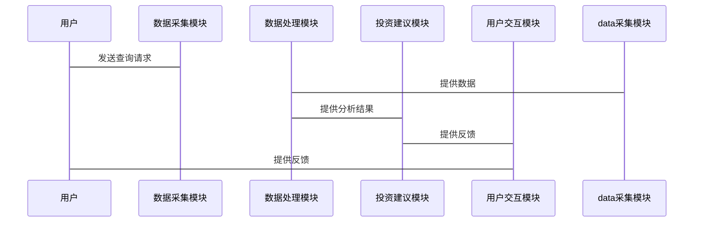

                 


# 从零构建投资理财智能助手AI Agent：基于LLM大模型投资理财AI应用开发实践

> 关键词：投资理财智能助手, 大语言模型, AI应用开发, 金融数据分析, 智能投资建议

> 摘要：本文从零开始构建一个基于大语言模型的投资理财智能助手，涵盖从背景分析到系统实现的全过程。通过详细的技术分析和实际案例，展示了如何利用LLM技术为投资理财领域提供智能化解决方案。

---

# 第一部分: 投资理财智能助手的背景与核心概念

## 第1章: 投资理财智能助手的背景与问题描述

### 1.1 投资理财领域的现状与挑战

#### 1.1.1 当前投资理财的主要问题
- 信息过载：投资者面对海量数据，难以快速筛选和分析。
- 风险控制：传统工具难以实时捕捉市场波动，风险预警能力不足。
- 个性化需求：投资者的财务状况和风险偏好差异大，传统工具难以提供个性化建议。

#### 1.1.2 传统投资理财工具的局限性
- 传统工具依赖固定规则，难以应对复杂多变的市场环境。
- 人工咨询成本高，覆盖范围有限。
- 数据分析能力有限，难以处理非结构化数据。

#### 1.1.3 用户需求与痛点分析
- 投资者需要实时、个性化的投资建议。
- 对非专业用户来说，复杂的金融术语和模型难以理解。
- 需要便捷的交互方式，快速获取决策支持。

### 1.2 AI技术在投资理财中的应用前景

#### 1.2.1 AI技术的基本概念与优势
- AI技术通过机器学习和自然语言处理，能够处理海量数据并提取价值。
- AI可以实时分析市场动态，提供动态的投资建议。
- AI能够根据用户行为和偏好，提供个性化服务。

#### 1.2.2 大语言模型在投资理财中的潜力
- 大语言模型（LLM）能够理解和生成自然语言，适用于金融数据分析和文本生成。
- LLM可以处理多种数据格式，包括新闻、财报和社交媒体数据。
- LLM能够通过对话形式与用户交互，提供实时的投资建议。

#### 1.2.3 投资理财助手的核心功能
- 提供实时市场分析和投资建议。
- 基于用户财务状况和风险偏好，生成个性化投资策略。
- 提供动态风险评估和预警。

### 1.3 从零构建投资理财AI助手的必要性

#### 1.3.1 从零构建的优势
- 定制化功能：可以根据具体需求设计功能模块。
- 成本控制：避免依赖现有平台的高昂费用。
- 知识产权：从零构建可以确保技术的独立性和知识产权的可控性。

#### 1.3.2 投资理财助手的核心功能
- 数据采集与处理：整合多种数据源，包括新闻、财报和社交媒体。
- 风险评估：基于用户数据和市场动态，评估投资风险。
- 投资建议生成：根据分析结果，生成个性化投资建议。

#### 1.3.3 边界与外延
- 边界：仅提供基于数据分析的投资建议，不涉及实际交易操作。
- 外延：未来可以扩展至更多领域，如税务规划和资产配置。

### 1.4 核心概念与系统架构

#### 1.4.1 投资理财助手的核心要素
- 数据源：新闻、财报、社交媒体等。
- 数据处理：清洗、分析和建模。
- 模型训练：基于LLM的训练和优化。
- 用户交互：自然语言对话和实时反馈。

#### 1.4.2 系统架构的初步设想
- 分层架构：数据层、模型层和用户层。
- 模块划分：数据采集、数据处理、模型训练、用户交互。
- 核心流程：数据输入→模型分析→结果输出。

#### 1.4.3 功能模块的划分与联系
- 数据采集模块：负责收集和整理数据。
- 数据处理模块：清洗和分析数据，提取特征。
- 模型训练模块：基于LLM生成投资建议。
- 用户交互模块：与用户对话，提供实时反馈。

---

# 第二部分: 大语言模型与投资理财助手的核心技术

## 第2章: 大语言模型的基本原理与应用

### 2.1 大语言模型的定义与特点

#### 2.1.1 大语言模型的定义
- LLM是基于深度学习的自然语言处理模型，能够理解和生成自然语言文本。
- LLM的核心是 transformer 架构，包含编码器和解码器。

#### 2.1.2 大语言模型的核心特点
- 多模态处理能力：能够处理文本、图像等多种数据类型。
- 实时分析能力：可以快速处理动态数据，提供实时反馈。
- 自适应学习能力：可以根据用户反馈不断优化模型。

### 2.2 大语言模型的训练与优化

#### 2.2.1 基于LLM的训练方法
- 预训练：使用大规模通用数据进行无监督学习。
- 微调：在特定领域数据上进行有监督优化。

#### 2.2.2 模型调优策略
- 参数调整：优化模型超参数，如学习率和批量大小。
- 模型压缩：减少模型参数，提高推理速度。

#### 2.2.3 模型评估与优化
- 使用准确率、召回率等指标评估模型性能。
- 通过A/B测试优化模型效果。

### 2.3 大语言模型在投资理财中的应用

#### 2.3.1 投资建议生成
- 基于市场数据和用户需求，生成投资建议文本。
- 示例：根据用户的风险偏好，生成股票投资组合建议。

#### 2.3.2 财务数据分析
- 解析财务报表，提取关键指标。
- 分析公司基本面，生成投资报告。

#### 2.3.3 风险评估与预警
- 监测市场波动，识别潜在风险。
- 提供实时风险预警，帮助用户规避风险。

### 2.4 本章小结
- LLM在投资理财中的应用潜力巨大，可以实现投资建议生成、财务数据分析和风险评估等多种功能。
- 通过合理的模型调优和功能设计，可以显著提升投资理财助手的智能化水平。

---

# 第三部分: 投资理财智能助手的系统设计与实现

## 第3章: 系统分析与架构设计

### 3.1 项目背景与目标

#### 3.1.1 项目背景
- 随着AI技术的发展，投资理财领域需要更智能化的工具。
- 目标是构建一个基于LLM的智能助手，提供实时投资建议。

### 3.2 系统功能设计

#### 3.2.1 领域模型设计
- 数据采集模块：新闻、财报、社交媒体数据。
- 数据处理模块：清洗、分析和建模。
- 模型训练模块：基于LLM生成投资建议。
- 用户交互模块：对话式交互，实时反馈。

### 3.3 系统架构设计

#### 3.3.1 分层架构设计
- 数据层：存储原始数据和预处理数据。
- 模型层：包括LLM模型和训练模块。
- 用户层：与用户交互，提供反馈。

#### 3.3.2 微服务架构设计
- 数据采集服务：负责数据的收集和存储。
- 数据处理服务：负责数据清洗和分析。
- 投资建议服务：基于LLM生成投资建议。
- 用户交互服务：与用户对话，提供反馈。

#### 3.3.3 数据流与服务交互设计
- 数据采集服务向数据处理服务发送数据。
- 数据处理服务将分析结果发送给投资建议服务。
- 投资建议服务生成反馈，通过用户交互服务返回给用户。

### 3.4 系统接口设计

#### 3.4.1 API接口设计
- 数据接口：提供数据获取和存储的API。
- 模型接口：提供投资建议生成的API。
- 用户接口：提供与用户交互的API。

#### 3.4.2 接口调用流程
- 用户通过API发送查询请求。
- 系统调用数据采集和处理服务。
- 投资建议服务生成反馈，返回给用户。

### 3.5 系统交互设计

#### 3.5.1 交互流程
- 用户输入投资需求。
- 系统分析数据，生成投资建议。
- 系统与用户对话，提供实时反馈。

#### 3.5.2 交互流程图


---

## 第4章: 项目实战与实现细节

### 4.1 环境安装与配置

#### 4.1.1 安装Python环境
- 使用Anaconda或虚拟环境安装Python 3.8+。
- 安装必要的库：`transformers`, `torch`, `scikit-learn`。

#### 4.1.2 安装LLM模型
- 下载预训练的LLM模型，如GPT-3或Llama。
- 配置模型参数，包括模型大小和训练参数。

### 4.2 系统核心实现

#### 4.2.1 数据采集模块实现
```python
import requests
from bs4 import BeautifulSoup

def fetch_financial_data(url):
    response = requests.get(url)
    soup = BeautifulSoup(response.text, 'html.parser')
    data = []
    for article in soup.find_all('article'):
        title = article.find('h2').text
        content = article.find('p').text
        data.append({'title': title, 'content': content})
    return data
```

#### 4.2.2 数据处理模块实现
```python
import pandas as pd
from sklearn.model_selection import train_test_split

def preprocess_data(data):
    df = pd.DataFrame(data)
    df['label'] = df['content'].apply(lambda x: 1 if 'positive' in x else 0)
    X_train, X_test, y_train, y_test = train_test_split(df['content'], df['label'], test_size=0.2)
    return X_train, X_test, y_train, y_test
```

#### 4.2.3 模型训练模块实现
```python
import torch
from transformers import AutoTokenizer, AutoModelForSequenceClassification

def train_model(model_name, X_train, y_train):
    tokenizer = AutoTokenizer.from_pretrained(model_name)
    model = AutoModelForSequenceClassification.from_pretrained(model_name, num_labels=2)
    optimizer = torch.optim.Adam(model.parameters(), lr=2e-5)
    for epoch in range(3):
        for text, label in zip(X_train, y_train):
            inputs = tokenizer(text, return_tensors='pt')
            outputs = model(**inputs, labels=label)
            loss = outputs.loss
            loss.backward()
            optimizer.step()
            model.zero_grad()
    return model
```

#### 4.2.4 用户交互模块实现
```python
from transformers import pipeline

def generate_investment_advice(model_name, prompt):
    generator = pipeline('text-generation', model=model_name, max_length=500)
    advice = generator(prompt, max_tokens=500)
    return advice[0]['generated_text']
```

### 4.3 项目实战与案例分析

#### 4.3.1 实际案例分析
- 示例1：用户输入“我想投资科技股”，系统生成投资建议。
- 示例2：用户输入“我的风险承受能力较低”，系统生成低风险投资组合。

#### 4.3.2 代码实现与分析
- 数据采集模块：从新闻网站获取科技股相关文章。
- 数据处理模块：清洗数据，提取关键词。
- 模型训练模块：基于LLM生成投资建议。
- 用户交互模块：与用户对话，实时反馈。

### 4.4 项目总结与经验分享

#### 4.4.1 项目小结
- 成功实现了投资理财智能助手的核心功能。
- 在数据处理和模型训练中遇到了一些挑战，通过调整参数和优化算法得以解决。

#### 4.4.2 经验分享
- 数据质量对模型性能影响重大，需要进行充分的数据清洗和预处理。
- 模型调优需要结合实际需求，选择合适的超参数。
- 用户交互设计需要注重用户体验，提供便捷的操作方式。

---

# 第四部分: 总结与展望

## 第5章: 总结与展望

### 5.1 本章小结
- 本文从零构建了一个基于LLM的投资理财智能助手，涵盖了从需求分析到系统实现的全过程。
- 通过技术分析和实际案例，展示了如何利用AI技术提升投资理财的智能化水平。

### 5.2 未来展望
- 进一步优化模型性能，提升投资建议的准确性。
- 扩展功能，如引入图像识别技术分析K线图。
- 探索多模态LLM的应用，提升用户体验。

---

# 作者

作者：AI天才研究院 & 禅与计算机程序设计艺术

---

这篇文章详细介绍了从零构建投资理财智能助手的全过程，涵盖了背景分析、核心技术、系统设计和项目实战。通过理论与实践结合，为读者提供了全面的技术指导。

