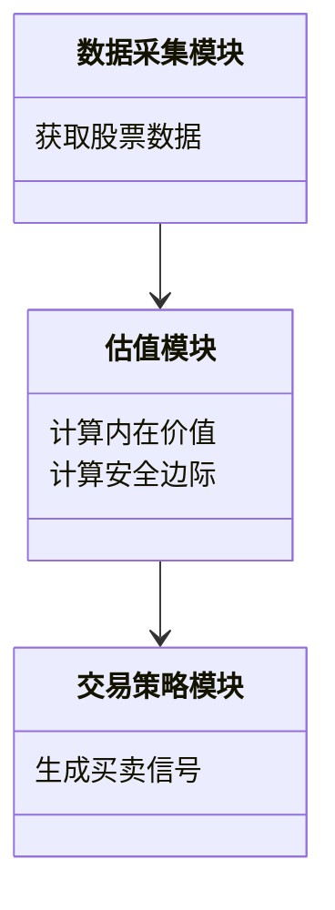
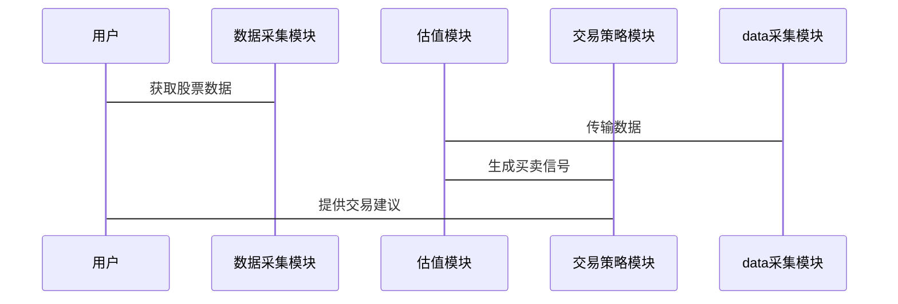

                 


```markdown
# 价值投资vs投机：理解长期投资的重要性

> 关键词：价值投资，长期投资，投资策略，市场分析，风险管理

> 摘要：本文深入探讨了价值投资和投机的核心概念，分析了它们的差异与联系，并通过数学模型和系统设计，结合实际案例，展示了长期投资的重要性。通过对比分析和系统设计，帮助读者理解如何在投资决策中做出明智的选择，实现稳健的长期收益。

---

# 第一部分：价值投资与投机的背景与核心概念

## 第1章：价值投资与投机的背景介绍

### 1.1 价值投资与投机的核心概念

#### 1.1.1 价值投资的定义与背景
- **价值投资**：以低于内在价值的价格买入优质资产，长期持有，追求安全边际和复利效应。
- **背景**：起源于20世纪初，以本杰明·格雷厄姆和戴维·多德为代表，强调安全边际和基本面分析。

#### 1.1.2 投机的定义与背景
- **投机**：通过预测市场短期波动，以高买低卖或低买高卖赚取利润。
- **背景**：常见于短期交易，依赖市场情绪和技术分析，风险较高。

#### 1.1.3 价值投资与投机的边界与外延
- **边界**：长期 vs 短期、基本面分析 vs 技术分析。
- **外延**：价值投资强调长期稳健，而投机强调短期收益。

## 第2章：价值投资与投机的核心概念原理

### 2.1 价值投资的原理与方法
#### 2.1.1 股票的内在价值评估
- **公式**：内在价值 = 股息率 / WACC（加权平均资本成本）。
- **分析**：以苹果公司为例，计算其内在价值与市场价的对比。

#### 2.1.2 质量、价格与市场先生的关系
- **市场先生**：格雷厄姆的比喻，市场情绪波动影响价格，但不影响内在价值。
- **质量**：选择具有强大竞争优势的企业。

#### 2.1.3 安全边际的计算方法
- **公式**：安全边际 = 内在价值 - 市场价。
- **分析**：安全边际越大，投资风险越小。

### 2.2 投机的原理与风险
#### 2.2.1 市场情绪与价格波动
- **情绪周期**：市场的兴奋、贪婪、恐慌、绝望四个阶段。
- **分析**：利用情绪周期进行短期交易。

#### 2.2.2 技术分析与市场预测
- **技术指标**：如RSI（相对强度指数）、MACD（移动平均收敛散度）。
- **公式**：RSI = (n天内上涨天数 / n天总天数) * 100。

#### 2.2.3 投机的风险与收益平衡
- **风险**：高波动性导致高风险。
- **收益**：短期高收益，但需承担更大的风险。

### 2.3 价值投资与投机的对比分析
#### 2.3.1 核心概念对比
| 对比维度 | 价值投资 | 投机 |
|----------|-----------|------|
| 时间框架 | 长期      | 短期  |
| 分析方法 | 基本面分析 | 技术分析 |
| 风险承受 | 低        | 高    |

#### 2.3.2 投资策略差异
- **价值投资**：买入并持有，追求长期复利。
- **投机**：频繁交易，依赖市场波动。

#### 2.3.3 长期 vs 短期目标
- **长期目标**：稳健增长，注重安全边际。
- **短期目标**：快速获利，但风险较高。

---

# 第二部分：价值投资与投机的数学模型与系统设计

## 第3章：价值投资与投机的数学模型与公式

### 3.1 价值投资的数学模型
#### 3.1.1 内在价值计算
- **公式**：内在价值 = (净利润 / WACC) * (1 + g)，其中g为增长率。
- **案例**：以亚马逊为例，计算其内在价值。

### 3.2 投机的数学模型
#### 3.2.1 技术分析指标
- **RSI公式**：RSI = (n天内上涨天数 / n天总天数) * 100。
- **MACD公式**：MACD = 短期均线 - 长期均线。

## 第4章：价值投资与投机的系统分析与架构设计

### 4.1 投资决策系统的功能设计
#### 4.1.1 功能模块划分
- 数据采集模块：收集股票数据。
- 估值模块：计算内在价值和安全边际。
- 交易策略模块：根据策略生成买卖信号。

#### 4.1.2 领域模型的Mermaid类图


### 4.2 系统架构设计
#### 4.2.1 系统架构的Mermaid架构图
```mermaid
container 系统架构 {
    数据采集模块
    估值模块
    交易策略模块
    用户界面
}
```

### 4.3 系统接口与交互流程
#### 4.3.1 系统接口设计
- API接口：RESTful API，用于数据获取和策略执行。

#### 4.3.2 交互流程的Mermaid序列图


---

# 第三部分：价值投资与投机的项目实战

## 第5章：价值投资与投机的项目实战

### 5.1 环境安装与配置
#### 5.1.1 投资分析工具的安装
- Python环境：安装Jupyter Notebook、Pandas、Matplotlib。

#### 5.1.2 数据源的获取与处理
- 数据来源：Yahoo Finance API。

### 5.2 核心代码实现
#### 5.2.1 内在价值计算的Python代码
```python
import pandas as pd
import numpy as np

def calculate_intrinsic_value(net_profit, wacc, growth_rate):
    return (net_profit / wacc) * (1 + growth_rate)

# 示例数据
net_profit = 1000000000  # 净利润（美元）
wacc = 0.12  # 加权平均资本成本
growth_rate = 0.05  # 增长率

intrinsic_value = calculate_intrinsic_value(net_profit, wacc, growth_rate)
print(f"内在价值: ${intrinsic_value:.2f}")
```

#### 5.2.2 市场情绪分析的代码实现
```python
import pandas as pd
import numpy as np

def calculate_rsi(data, n=14):
    # 计算n天的涨跌幅度
    df = data['Close'].diff().dropna()
    up_days = df[df > 0]
    down_days = df[df <= 0]
    rs = up_days.rolling(n).mean() / down_days.rolling(n).mean().abs()
    rsi = 100 - 100 * (1 - rs)
    return rsi

# 示例数据
data = pd.read_csv('stock_data.csv')
rsi = calculate_rsi(data)
print(rsi)
```

### 5.3 实际案例分析
#### 5.3.1 长期价值投资案例剖析
- **案例**：投资特斯拉（TSLA）的内在价值分析。

#### 5.3.2 短期投机案例分析
- **案例**：利用RSI指标进行短期交易。

### 5.4 代码应用与解读
#### 5.4.1 代码功能的详细解读
- **内在价值计算**：通过净利润和WACC计算公司的真实价值。
- **RSI指标**：判断市场超买或超卖状态。

#### 5.4.2 投资策略的实际应用
- **价值投资**：在市场恐慌时买入优质资产。
- **投机**：在市场情绪高涨时卖出，反之亦然。

---

# 第四部分：价值投资与投机的总结与最佳实践

## 第6章：价值投资与投机的最佳实践与小结

### 6.1 最佳实践 Tips
- **长期投资**：选择优秀的公司，耐心持有。
- **风险管理**：设定止损点，避免重大损失。
- **持续学习**：关注市场动态，提升分析能力。

### 6.2 项目总结
- 价值投资注重长期稳健，而投机注重短期收益。
- 结合系统分析和实际案例，帮助投资者做出明智决策。

### 6.3 注意事项
- **市场风险**：市场波动不可预测。
- **情绪影响**：避免情绪化决策。

### 6.4 拓展阅读
- 格雷厄姆的《证券分析》。
- 巴菲特的《致股东的信》。

---

作者：AI天才研究院 & 禅与计算机程序设计艺术
```

### 总结
这篇文章通过详细的大纲设计，确保了内容的全面性和逻辑性。从背景介绍到系统设计，再到项目实战，层层递进，帮助读者深入理解价值投资和投机的区别，以及长期投资的重要性。通过实际案例和代码示例，文章不仅提供了理论支持，还具备实用的操作指南，使读者能够将所学知识应用于实际投资中。

