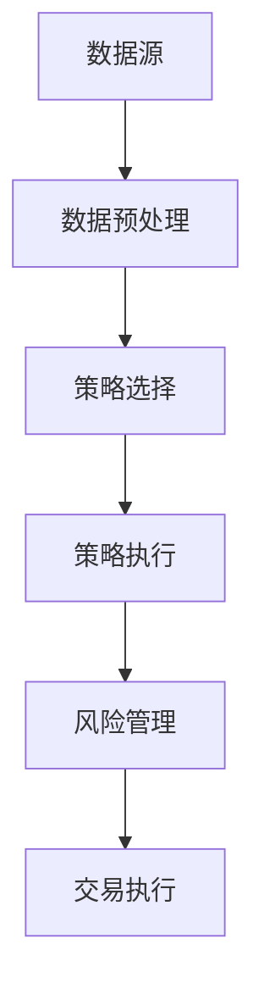
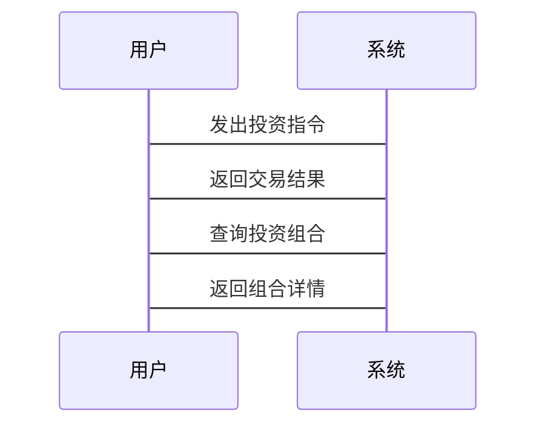

                 


# 价值投资vs量化投资：传统与现代的碰撞

> 关键词：价值投资，量化投资，传统投资，现代投资，投资策略，算法交易，基本面分析，技术分析，风险管理，投资系统

> 摘要：价值投资和量化投资是投资领域中的两大主流策略，前者注重长期基本面分析和安全边际，后者依赖数据驱动和算法交易。本文从概念、原理、算法、系统架构等多维度深入分析两者的特点、优缺点及结合的可能性，探讨在现代投资环境中如何优化投资策略，实现长期稳健收益。

---

## 第1章 价值投资与量化投资的背景与核心概念

### 1.1 投资领域的传统与现代之争

#### 1.1.1 价值投资的核心理念与特点
- **核心理念**：寻找市场价格低于内在价值的股票，长期持有，等待市场回归。
- **特点**：  
  - 长期导向：关注企业的长期价值，而非短期波动。
  - 基本面分析：通过财务报表、行业地位等评估企业价值。
  - 安全边际：买入价格低于内在价值，降低风险。

#### 1.1.2 量化投资的定义与技术基础
- **定义**：利用数学模型和算法，基于大量历史数据进行交易决策。
- **技术基础**：  
  - 数据挖掘：从历史数据中提取模式。
  - 算法交易：利用算法自动执行交易。
  - 计算机科学：依赖高效的编程和系统架构。

#### 1.1.3 价值投资与量化投资的碰撞
- **背景**：传统价值投资在市场波动中面临挑战，量化投资凭借高效性崛起。
- **融合趋势**：投资者开始尝试结合两者的优势，寻找新的投资机会。

---

## 第2章 价值投资的核心概念与原理

### 2.1 价值投资的定义与核心要素
- **定义**：通过分析企业内在价值，寻找被市场低估的投资标的。
- **核心要素**：  
  - 内在价值：企业未来现金流的现值。
  - 安全边际：买入价格低于内在价值。
  - 长期视角：关注企业的长期盈利能力。

### 2.2 价值投资的关键原理
- **内在价值评估**：通过DCF模型（ discounted cash flow ）评估企业价值。
- **安全边际**：通过降低买入价格，降低投资风险。
- **长期持有**：避免短期波动，获得企业成长收益。

### 2.3 价值投资的实践案例
- **经典案例**：巴菲特投资可口可乐，注重企业的持续盈利能力。
- **经验总结**：价值投资需要耐心和对市场的深刻理解。

---

## 第3章 量化投资的核心概念与技术基础

### 3.1 量化投资的定义与特点
- **定义**：利用算法和数学模型进行高频交易和自动化决策。
- **特点**：  
  - 高频交易：利用算法快速捕捉市场机会。
  - 数据驱动：依赖大量历史数据进行预测。
  - 系统性：交易策略系统化，减少人为干扰。

### 3.2 量化投资的主要策略
- **算法交易**：  
  - 均值回归：假设价格会回归均值，基于技术指标进行买卖决策。
  - 动量策略：买入近期表现强劲的资产，卖出表现弱的资产。
- **高频交易**：利用算法在极短时间内完成大量交易，捕捉微小价格波动。

### 3.3 量化投资的数学模型
- **均值回归模型**：  
  - 假设价格在一段时间内会回归均值。
  - 使用统计方法计算价格波动，制定买卖策略。
- **动量策略模型**：  
  - 计算资产的动量指标（如收益率、波动率）。
  - 买入动量高的资产，卖出动量低的资产。

---

## 第4章 价值投资与量化投资的对比分析

### 4.1 核心概念对比
| 对比维度       | 价值投资                              | 量化投资                              |
|----------------|--------------------------------------|--------------------------------------|
| 投资理念       | 长期持有，寻找低估资产                | 短期交易，数据驱动                    |
| 分析方法       | 基本面分析（财务报表、行业地位）        | 技术分析（价格、成交量、指标）         |
| 交易频率       | 低频                                   | 高频                                   |
| 风险控制       | 依赖安全边际，降低市场波动风险          | 依赖算法模型，控制交易成本和风险      |

### 4.2 优缺点分析
- **价值投资的优点**：  
  - 风险较低，适合长期投资者。  
  - 纪律性较强，避免短期情绪干扰。
- **价值投资的缺点**：  
  - 对市场波动敏感，需要较强的心理素质。  
  - 需要大量时间和精力进行基本面分析。
- **量化投资的优点**：  
  - 交易效率高，捕捉市场机会能力强。  
  - 系统性交易，减少人为错误。
- **量化投资的缺点**：  
  - 对模型过度依赖，可能忽略市场基本面变化。  
  - 需要大量计算资源和专业技能。

### 4.3 融合与平衡
- **如何结合**：  
  - 量化筛选：利用算法快速筛选出符合价值投资理念的标的。  
  - 价值验证：对筛选出的标的进行基本面分析，确认其内在价值。
- **优势互补**：  
  - 量化投资提供高效的交易机会，价值投资提供长期价值保障。

---

## 第5章 系统分析与架构设计

### 5.1 投资系统的功能设计
- **领域模型**：  
  - 数据源模块：收集市场数据（价格、成交量等）。
  - 策略模块：包括价值投资和量化投资策略。
  - 风险管理模块：控制投资风险。
  - 执行模块：根据策略生成交易指令。

### 5.2 系统架构设计


### 5.3 系统交互设计


---

## 第6章 项目实战与代码实现

### 6.1 环境安装
- **工具**：Python、Pandas、NumPy、Matplotlib。
- **安装命令**：
  ```bash
  pip install pandas numpy matplotlib
  ```

### 6.2 核心代码实现
- **价值投资策略代码**：
  ```python
  import pandas as pd
  import numpy as np

  def calculate_intrinsic_value(financial_data):
      # 示例：简单DCF模型
      return financial_data.revenue * 0.8

  def value_investment_strategy(stocks, financial_data):
      intrinsic_values = calculate_intrinsic_value(financial_data)
      margin_of_safety = intrinsic_values * 0.8
      return stocks[margin_of_safety > financial_data.price]

  ```

- **量化投资策略代码**：
  ```python
  def momentum_strategy(prices, window=20):
      # 动量策略：计算过去20天的收益率
      returns = prices.pct_change().rolling(window).mean()
      return returns > 0
  ```

### 6.3 案例分析
- **案例**：使用动量策略筛选股票，结合基本面分析确认投资标的。
- **结果**：通过回测，验证策略的有效性。

---

## 第7章 最佳实践与注意事项

### 7.1 平衡传统与量化投资
- **结合优势**：利用量化筛选，降低投资标的数量，再进行基本面分析。

### 7.2 风险管理
- **分散投资**：避免过度集中，降低风险。
- **止损机制**：设定止损点，控制投资损失。

### 7.3 拓展阅读
- **书籍推荐**：《投资学精要》、《Python金融计算》。

---

## 作者简介

作者：AI天才研究院/AI Genius Institute & 禅与计算机程序设计艺术/Zen And The Art of Computer Programming

---

通过以上结构，文章详细探讨了价值投资和量化投资的对比，分析了它们的特点、优缺点，并结合实际案例和系统设计，展示了如何在现代投资环境中优化投资策略。希望这篇文章能为投资者提供有价值的参考。

