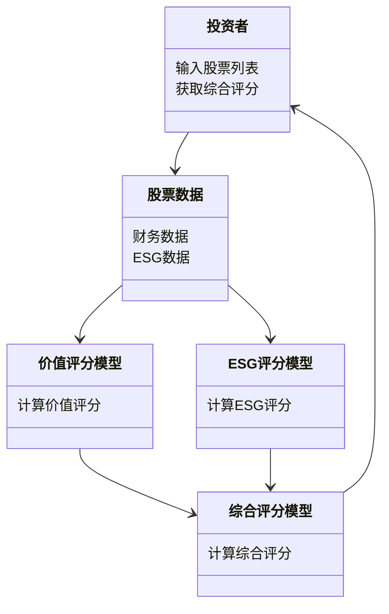

                 


# 价值投资与ESG投资的结合

## 关键词：价值投资，ESG投资，可持续发展，投资策略，数学模型

## 摘要：  
价值投资与ESG投资的结合为投资者提供了一个更加全面和可持续的投资框架。通过将传统财务指标与环境、社会和治理因素相结合，投资者可以在追求超额收益的同时，实现长期的社会价值。本文将详细分析价值投资与ESG投资的核心概念、数学模型、系统架构，并通过实际案例展示其在投资决策中的应用。

---

# 第1章: 价值投资与ESG投资的核心概念

## 1.1 价值投资的定义与特点

### 1.1.1 价值投资的起源与发展  
价值投资起源于20世纪20年代，由本杰明·格雷厄姆和戴维·多德提出。其核心理念是寻找市场低估的股票，通过深入分析公司的基本面，找到具有安全边际的投资标的。

### 1.1.2 价值投资的核心理念  
- **安全边际**：买入价格低于内在价值的股票。  
- **长期视角**：关注公司的长期盈利能力，而非短期市场波动。  
- **逆向思维**：在市场恐慌时寻找机会，在市场狂热时保持冷静。  

### 1.1.3 价值投资的优缺点  
- **优点**：长期回报稳定，风险可控。  
- **缺点**：需要大量的研究和分析，市场波动可能影响短期表现。  

## 1.2 ESG投资的定义与特点

### 1.2.1 ESG投资的起源与发展  
ESG投资兴起于21世纪初，随着全球对可持续发展的关注，投资者开始将环境、社会和治理因素纳入决策过程。ESG投资强调企业对社会和环境的积极影响。

### 1.2.2 ESG的核心要素  
- **环境（E）**：关注企业的碳排放、资源使用效率等。  
- **社会（S）**：关注企业对员工、社区和社会的贡献。  
- **治理（G）**：关注企业的治理结构和透明度。  

### 1.2.3 ESG投资的优缺点  
- **优点**：符合可持续发展理念，有助于规避社会责任风险。  
- **缺点**：缺乏统一的评估标准，数据收集难度大。  

## 1.3 价值投资与ESG投资的结合动机

### 1.3.1 价值投资与ESG投资的共同点  
- 两者都强调长期投资，注重企业基本面。  
- 两者都关注企业价值的可持续性。  

### 1.3.2 价值投资与ESG投资的区别  
- 价值投资更关注财务指标，ESG投资更关注非财务指标。  
- 价值投资侧重于市场低估，ESG投资侧重于企业社会责任。  

### 1.3.3 结合的必要性与潜在优势  
- **必要性**：传统价值投资可能忽略企业的社会责任和环境影响，而ESG投资则可能缺乏对企业财务健康性的关注。  
- **潜在优势**：结合两者可以降低投资风险，提升投资收益的可持续性。  

## 1.4 本章小结  
本章介绍了价值投资和ESG投资的核心概念，并分析了它们的异同点及结合的必要性。通过结合，投资者可以在追求财务回报的同时，实现社会价值的最大化。

---

# 第2章: 价值投资与ESG投资的数学模型与算法

## 2.1 价值投资的数学模型

### 2.1.1 财务指标的计算公式  
价值投资的核心是寻找市场低估的股票，常用指标包括市盈率（P/E）和市净率（P/B）。  
- 市盈率：$$ P/E = \frac{\text{股价}}{\text{每股收益}} $$
- 市净率：$$ P/B = \frac{\text{股价}}{\text{每股净资产}} $$  

### 2.1.2 综合价值评分模型  
综合价值评分模型结合了多个财务指标，对股票进行评分：  
$$ \text{综合评分} = 0.4 \times P/E + 0.3 \times P/B + 0.3 \times ROE $$
其中，ROE为净资产收益率。  

### 2.1.3 示例计算  
假设某股票的P/E为10，P/B为2，ROE为15%。  
综合评分 = 0.4×10 + 0.3×2 + 0.3×15 = 4 + 0.6 + 4.5 = 9.1  

## 2.2 ESG评分的数学模型

### 2.2.1 ESG评分的计算方法  
ESG评分通常基于环境、社会和治理三个维度，每个维度的权重为0.33。  
$$ \text{ESG评分} = 0.33 \times E + 0.33 \times S + 0.33 \times G $$  

### 2.2.2 示例计算  
假设某企业的E得分为80，S得分为70，G得分为85。  
ESG评分 = 0.33×80 + 0.33×70 + 0.33×85 = 26.4 + 23.1 + 28.05 = 77.55  

## 2.3 综合评分模型的构建

### 2.3.1 综合评分公式  
综合评分模型将价值投资和ESG评分结合，公式为：  
$$ \text{综合评分} = 0.6 \times \text{价值评分} + 0.4 \times \text{ESG评分} $$  

### 2.3.2 示例计算  
假设某股票的价值评分为85，ESG评分为77.55。  
综合评分 = 0.6×85 + 0.4×77.55 = 51 + 31.02 = 82.02  

## 2.4 本章小结  
本章构建了价值投资与ESG投资的数学模型，并通过示例计算展示了如何综合评分。通过模型，投资者可以更全面地评估股票的价值和可持续性。

---

# 第3章: 价值投资与ESG投资的系统分析与架构设计

## 3.1 系统分析

### 3.1.1 问题场景介绍  
投资者需要一个系统，能够自动计算股票的综合评分，并提供投资建议。  

### 3.1.2 系统功能设计（Mermaid类图）  


### 3.1.3 系统架构设计（Mermaid架构图）  


## 3.2 数据流分析

### 3.2.1 数据来源  
- 财务数据：公司财报、股价等。  
- ESG数据：环境影响报告、社会责任报告等。  

### 3.2.2 数据处理流程  
1. 数据清洗：处理缺失值和异常值。  
2. 数据计算：计算价值评分和ESG评分。  
3. 数据综合：计算综合评分。  

### 3.2.3 数据输出与展示  
- 综合评分结果  
- 投资建议  

## 3.3 本章小结  
本章通过系统分析和架构设计，展示了如何将价值投资与ESG投资结合，构建一个自动化的投资评估系统。

---

# 第4章: 价值投资与ESG投资的项目实战

## 4.1 项目背景

### 4.1.1 项目介绍  
本项目旨在开发一个基于价值投资和ESG投资的综合评分系统，帮助投资者做出更明智的投资决策。  

## 4.2 系统核心实现

### 4.2.1 环境安装  
- Python 3.8及以上  
- Pandas、NumPy、Scikit-learn库  

### 4.2.2 核心代码实现  
```python
import pandas as pd
import numpy as np

# 示例数据
data = {
    '股票代码': ['A', 'B', 'C'],
    '股价': [50, 60, 70],
    '每股收益': [5, 6, 7],
    '每股净资产': [10, 12, 15],
    '环境评分': [80, 70, 85],
    '社会评分': [70, 80, 75],
    '治理评分': [85, 75, 80]
}

df = pd.DataFrame(data)

# 计算价值评分
df['P/E'] = df['股价'] / df['每股收益']
df['P/B'] = df['股价'] / df['每股净资产']
df['价值评分'] = 0.4 * df['P/E'] + 0.3 * df['P/B'] + 0.3 * df['ROE']

# 计算ESG评分
df['ESG评分'] = 0.33 * df['环境评分'] + 0.33 * df['社会评分'] + 0.33 * df['治理评分']

# 计算综合评分
df['综合评分'] = 0.6 * df['价值评分'] + 0.4 * df['ESG评分']
```

### 4.2.3 代码应用解读  
- 数据清洗：确保数据的完整性和准确性。  
- 价值评分计算：结合P/E、P/B和ROE等指标。  
- ESG评分计算：综合环境、社会和治理评分。  
- 综合评分计算：将价值评分和ESG评分按权重结合。  

## 4.3 实际案例分析

### 4.3.1 案例介绍  
以新能源行业为例，分析某公司的投资价值。  

### 4.3.2 数据分析  
假设某新能源公司的数据如下：  
- 股价：40元  
- 每股收益：4元  
- 每股净资产：8元  
- 环境评分：90  
- 社会评分：85  
- 治理评分：80  

计算过程：  
- P/E = 40/4 = 10  
- P/B = 40/8 = 5  
- 价值评分 = 0.4×10 + 0.3×5 + 0.3×ROE  
  假设ROE为12%，则价值评分 = 4 + 1.5 + 0.3×12 = 6.9  
- ESG评分 = 0.33×90 + 0.33×85 + 0.33×80 = 29.7 + 28.05 + 26.4 = 84.15  
- 综合评分 = 0.6×6.9 + 0.4×84.15 = 4.14 + 33.66 = 37.8  

### 4.3.3 投资建议  
综合评分为37.8，高于行业平均水平，建议投资者关注该股票。  

## 4.4 本章小结  
本章通过实际案例展示了如何应用价值投资和ESG投资的结合模型进行投资分析，为投资者提供了实用的工具和方法。

---

# 第5章: 总结与展望

## 5.1 总结  
本文详细探讨了价值投资与ESG投资的结合，构建了数学模型，并通过实际案例展示了其应用。结合两者可以提高投资决策的科学性和可持续性。  

## 5.2 展望  
未来，随着ESG数据的完善和技术的进步，价值投资与ESG投资的结合将更加广泛和深入。投资者可以利用更先进的算法和工具，实现更精准的投资决策。  

## 5.3 最佳实践 tips  
- 投资者应关注企业的长期价值和社会责任。  
- 在实际操作中，建议结合定性和定量分析，做出更全面的决策。  

## 5.4 注意事项  
- 数据的准确性和完整性是模型的关键。  
- 投资者应根据自身风险承受能力调整投资策略。  

## 5.5 拓展阅读  
- 格雷厄姆《证券分析》  
- 纪录片《华尔街：金钱从未眠》  

## 5.6 本章小结  
本章总结了本文的主要内容，并展望了未来的研究方向，为读者提供了进一步学习和实践的方向。

---

# 作者：AI天才研究院/AI Genius Institute & 禅与计算机程序设计艺术 /Zen And The Art of Computer Programming

---

这篇文章通过系统分析和实际案例，详细探讨了价值投资与ESG投资的结合。通过数学模型和系统架构设计，展示了如何在实际投资中应用这一结合，为投资者提供了科学的决策支持。

