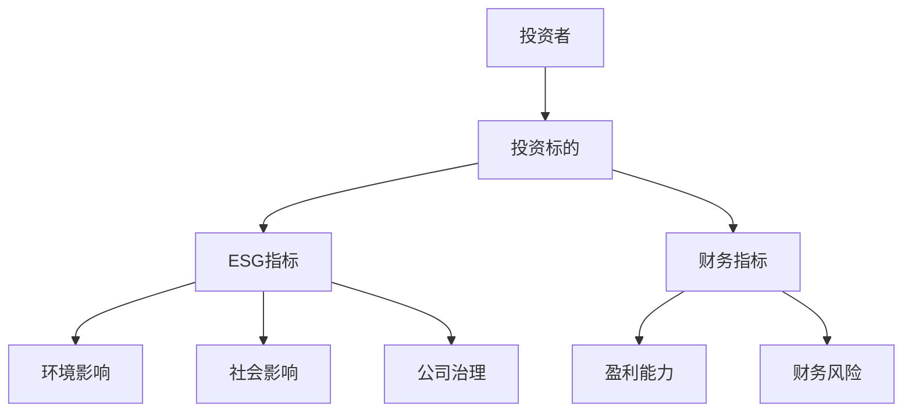
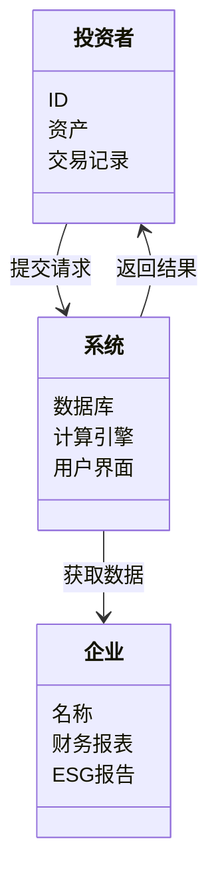

                 


# 价值投资与ESG：社会责任投资的融合

---

## 关键词

- 价值投资
- ESG
- 社会责任投资
- 投资策略
- 可持续发展

---

## 摘要

本文探讨了价值投资与ESG（环境、社会、治理）的融合，分析了ESG投资的核心概念、算法原理、系统架构及实际案例。通过结合价值投资的长期稳健理念与ESG的可持续发展评估，提出了一种新的投资策略框架，帮助投资者在追求财务回报的同时，实现社会责任目标。

---

## 第一部分：引言

### 1.1 价值投资与ESG的背景介绍

#### 1.1.1 价值投资的核心理念

价值投资是一种以基本面分析为基础的投资策略，强调以低于内在价值的价格买入优质资产。其核心理念是寻找市场低估的企业，长期持有以获得超额收益。这种策略强调企业的财务健康、管理团队和行业地位，注重长期价值而非短期波动。

#### 1.1.2 ESG的定义与内涵

ESG是环境（Environment）、社会（Social）和公司治理（Governance）的缩写，是评估企业可持续发展能力的重要指标。环境维度关注企业的碳排放、资源利用效率等；社会维度关注企业与员工、社区的关系，以及社会责任的履行；治理维度关注公司治理结构、高管薪酬和透明度等。

#### 1.1.3 价值投资与ESG的融合背景

随着全球可持续发展理念的兴起，越来越多的投资者开始关注企业的社会责任表现。价值投资的传统方法注重财务指标，而忽视了企业对环境和社会的影响。通过将ESG因素融入价值投资，投资者可以在评估企业价值时，更全面地考虑其社会和环境表现，从而实现长期稳健回报与社会责任的双重目标。

### 1.2 问题背景与问题描述

#### 1.2.1 传统投资的局限性

传统投资方法往往忽视企业的社会责任和环境影响，可能导致投资组合的长期风险增加。例如，高碳排放的企业可能面临政策风险和声誉风险，而忽视社会责任的企业可能因员工关系紧张或供应链问题影响业绩。

#### 1.2.2 ESG投资的兴起

随着气候变化、社会不平等和治理问题的加剧，ESG投资逐渐成为主流。越来越多的投资者意识到，企业对环境和社会的贡献不仅影响其声誉，还可能直接关系到企业的长期盈利能力。

#### 1.2.3 价值投资与ESG的融合意义

将ESG融入价值投资，可以弥补传统价值投资的不足，帮助投资者识别那些在财务稳健的同时具备社会责任感的企业。这种融合不仅有助于提升投资组合的长期表现，还能推动企业和社会的可持续发展。

### 1.3 问题解决与边界

#### 1.3.1 如何将ESG融入价值投资

通过在企业基本面分析中加入ESG指标，评估企业的可持续发展潜力。例如，在评估制造业企业时，不仅要考虑其盈利能力，还要考虑其碳排放强度和员工满意度。

#### 1.3.2 ESG投资的边界与外延

ESG投资的边界在于其核心评估指标，而外延则包括企业供应链、产品生命周期等更广泛的社会和环境影响。投资者需要明确ESG评估的范围和权重，以确保评估的准确性和可操作性。

#### 1.3.3 价值投资与ESG的融合框架

融合框架包括以下几个步骤：1）企业基本面分析；2）ESG指标评估；3）综合评分；4）投资决策。这种框架既保留了价值投资的长期稳健性，又加入了社会责任的考量。

### 1.4 核心概念与联系

#### 1.4.1 核心概念原理

价值投资关注企业的内在价值，而ESG关注企业的可持续发展潜力。两者的融合在于将ESG因素作为评估企业内在价值的重要组成部分。

#### 1.4.2 ESG与价值投资的对比表格

| 维度 | 价值投资 | ESG投资 |
|------|-----------|----------|
| 核心 | 财务表现   | 环境、社会、治理 |
| 目标 | 长期稳健回报 | 可持续发展 |
| 方法 | 基本面分析 | ESG评估 |

#### 1.4.3 ER实体关系图（Mermaid流程图）



---

## 第二部分：价值投资与ESG的核心概念

### 2.1 价值投资的理论基础

#### 2.1.1 价值投资的起源与发展

价值投资由本杰明·格雷厄姆和戴维·多德提出，强调以低于内在价值的价格买入优质资产。这种方法在20世纪初兴起，后来被 Warren Buffett 等投资者发扬光大。

#### 2.1.2 价值投资的核心原则

- 以合理价格买入优质资产。
- 长期持有，避免频繁交易。
- 重点关注企业的财务健康和管理团队。

#### 2.1.3 价值投资的评估方法

价值投资通过分析企业的财务报表、行业地位和竞争优势，估算其内在价值。常用指标包括市盈率、市净率和股息率等。

### 2.2 ESG的理论基础

#### 2.2.1 ESG的定义与维度

ESG包括环境、社会和治理三个维度，分别对应企业的环境表现、社会责任和公司治理结构。

#### 2.2.2 ESG评估的核心指标

- 环境：碳排放、资源利用效率。
- 社会：员工满意度、社区关系。
- 治理：董事会结构、高管薪酬透明度。

#### 2.2.3 ESG投资的策略与框架

ESG投资策略包括负面筛选、正面筛选和整合分析。负面筛选排除表现不佳的企业，正面筛选选择表现优异的企业，整合分析将ESG因素融入投资决策。

### 2.3 价值投资与ESG的融合机制

#### 2.3.1 ESG对价值投资的影响

ESG因素可以影响企业的长期盈利能力和社会声誉。例如，高碳排放企业可能面临政策风险，而员工关系紧张的企业可能影响生产效率。

#### 2.3.2 价值投资对ESG的整合

在价值投资中加入ESG评估，可以更全面地评估企业的内在价值。例如，在评估能源企业时，不仅要考虑其盈利能力，还要考虑其碳排放强度和可再生能源投资。

#### 2.3.3 融合模型的构建与应用

融合模型包括以下几个步骤：1）企业基本面分析；2）ESG指标评估；3）综合评分；4）投资决策。这种模型既保留了价值投资的长期稳健性，又加入了社会责任的考量。

---

## 第三部分：ESG投资的分析框架与方法论

### 3.1 ESG评估的系统分析

#### 3.1.1 ESG评估的核心指标

- 环境：碳排放、资源利用效率。
- 社会：员工满意度、社区关系。
- 治理：董事会结构、高管薪酬透明度。

#### 3.1.2 ESG评估的权重分配

根据行业特点和投资目标，合理分配各维度的权重。例如，对于能源企业，环境指标权重较大；对于科技企业，治理指标权重较大。

#### 3.1.3 ESG评估的流程与方法

1. 数据收集：收集企业的财务报表、ESG报告和其他公开信息。
2. 指标评估：根据ESG指标体系，对各维度进行评分。
3. 综合评估：根据权重分配，计算综合评分。
4. 投资决策：根据评分结果，选择优质标的。

### 3.2 价值投资与ESG的融合模型

#### 3.2.1 融合模型的算法原理

融合模型通过将ESG评分与财务指标相结合，计算企业的综合价值。公式如下：

$$
\text{综合价值} = \text{财务价值} \times \alpha + \text{ESG评分} \times (1-\alpha)
$$

其中，α是财务指标的权重，通常在0.6到0.8之间。

#### 3.2.2 融合模型的实现步骤

1. 数据收集：收集企业的财务报表和ESG报告。
2. 财务评估：计算企业的内在价值。
3. ESG评估：根据指标体系，计算ESG评分。
4. 综合评估：根据公式计算综合价值。
5. 投资决策：选择综合价值高于市场价的企业。

### 3.3 融合模型的数学模型与公式

$$
\text{综合价值} = \text{财务价值} \times \alpha + \text{ESG评分} \times (1-\alpha)
$$

其中，α是财务指标的权重，通常在0.6到0.8之间。ESG评分范围为0到1。

#### 3.3.1 举例说明

假设某企业的财务价值为10元，ESG评分为0.8，α=0.7。则综合价值为：

$$
\text{综合价值} = 10 \times 0.7 + 0.8 \times 0.3 = 7 + 0.24 = 7.24
$$

如果市场价为7元，则该企业具有投资价值。

---

## 第四部分：系统分析与架构设计方案

### 4.1 问题场景介绍

投资者希望通过一个系统，实现对企业的ESG评估，并将其融入价值投资决策。

### 4.2 项目介绍

开发一个基于ESG的融合投资系统，帮助投资者实现价值投资与社会责任的双重目标。

### 4.3 系统功能设计

#### 4.3.1 领域模型（Mermaid类图）



### 4.4 系统架构设计

#### 4.4.1 系统架构图（Mermaid架构图）


### 4.5 系统接口设计

- 投资者通过用户界面提交投资标的请求。
- 系统从数据库获取企业数据。
- 计算引擎调用ESG评估模块和财务评估模块，计算综合价值。
- 系统将结果返回给投资者。

### 4.6 系统交互流程（Mermaid序列图）

```mermaid
sequenceDiagram
    投资者 -> 系统: 提交请求
    系统 -> 数据库: 获取企业数据
    并发
    系统 -> ESG评估模块: 计算ESG评分
    系统 -> 财务评估模块: 计算财务价值
    系统 -> 计算引擎: 综合评估
    系统 -> 投资者: 返回结果
```

---

## 第五部分：项目实战

### 5.1 环境安装

需要安装Python、数据库和相关开发工具。推荐使用MySQL作为数据库，Flask框架开发系统。

### 5.2 系统核心实现源代码

```python
# 计算引擎代码
def calculate_esg综合价值(财务价值, esg评分, alpha=0.7):
    return financial_value * alpha + esg_rating * (1 - alpha)
```

### 5.3 代码应用解读与分析

代码实现融合模型的计算，根据企业财务价值和ESG评分，计算综合价值。alpha参数可以根据具体需求调整。

### 5.4 实际案例分析

以某能源企业为例，假设其财务价值为15元，ESG评分为0.7，alpha=0.7。则综合价值为：

$$
\text{综合价值} = 15 \times 0.7 + 0.7 \times 0.3 = 10.5 + 0.21 = 10.71
$$

如果市场价为10元，则该企业具有投资价值。

### 5.5 项目小结

通过实际案例分析，验证了融合模型的有效性。投资者可以根据企业的综合价值，做出更科学的投资决策。

---

## 第六部分：结论与展望

### 6.1 结论

价值投资与ESG的融合，不仅提升了投资决策的科学性，还推动了企业的可持续发展。通过本文提出的融合模型，投资者可以在追求财务回报的同时，实现社会责任目标。

### 6.2 未来展望

未来，随着ESG评估体系的完善和人工智能技术的发展，融合投资模型将更加精准和智能化。投资者可以利用大数据和机器学习技术，进一步优化投资决策。

---

## 作者：AI天才研究院/AI Genius Institute & 禅与计算机程序设计艺术 /Zen And The Art of Computer Programming

---

**附录**：

- ESG指标体系详细介绍
- 融合模型的代码实现
- 系统架构设计图
- 项目实战案例数据

