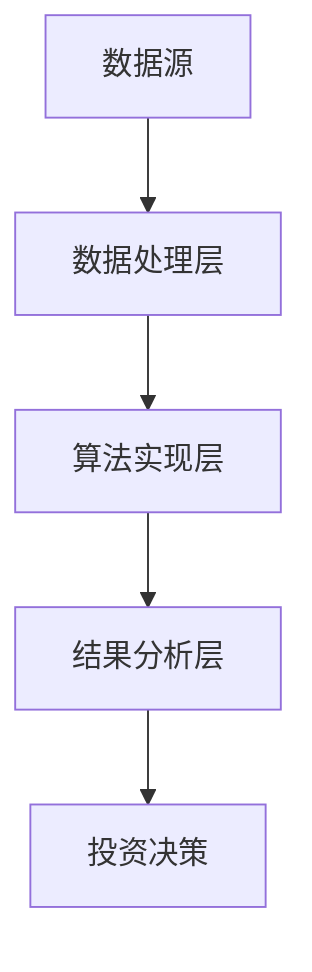

                 

# 《价值投资与人工智能：AI辅助决策的潜力与局限》

> **关键词**：价值投资、人工智能、投资决策、机器学习、深度学习、数据分析

> **摘要**：  
> 随着人工智能技术的快速发展，其在金融领域的应用日益广泛。本文探讨了价值投资与人工智能的结合，分析了人工智能在投资决策中的潜力与局限性。通过理论分析、算法原理、系统设计和案例研究，本文详细阐述了人工智能如何辅助价值投资决策，并提出了未来的发展方向。文章旨在为投资者和技术创新者提供有价值的参考，帮助他们更好地理解人工智能在金融领域的应用前景。

---

## 第一部分：引言

### 第1章：价值投资与人工智能的结合

#### 1.1 价值投资的基本概念  
- 价值投资是一种基于对公司内在价值评估的投资策略，强调以低于内在价值的价格买入优质资产。  
- 核心理念包括：安全边际、长期视角和逆人性决策。  

#### 1.2 人工智能的基本概念  
- 人工智能（AI）是模拟人类智能的计算机系统，涵盖机器学习、自然语言处理和计算机视觉等领域。  
- 在金融领域，AI主要用于数据分析、模式识别和预测建模。  

#### 1.3 价值投资与人工智能的结合背景  
- 传统投资决策的局限性：主观性、情绪化和信息处理能力有限。  
- 人工智能的潜力：高效数据处理、复杂模式识别和实时决策支持。  

---

## 第二部分：价值投资的理论基础

### 第2章：价值投资的基本原理

#### 2.1 股票的内在价值  
- 内在价值是基于公司财务状况和行业前景计算的理论价值。  
- 核心公式：$V = \text{未来现金流的现值}$  
- 示例：使用DCF模型评估公司价值。  

#### 2.2 市场先生的概念  
- 格拉罕姆提出“市场先生”概念，强调市场情绪的波动性。  
- 投资者应利用市场先生的错误，进行逆向投资。  

#### 2.3 安全边际的重要性  
- 安全边际 = 内在价值 - 市场价格  
- 通过安全边际降低投资风险，确保收益的可持续性。  

### 第3章：人工智能在投资中的潜力

#### 3.1 人工智能的基本原理  
- 机器学习：通过数据训练模型，识别潜在规律。  
- 深度学习：基于神经网络，提取复杂特征。  
- 自然语言处理：分析新闻、财报等文本数据。  

#### 3.2 人工智能在金融领域的应用  
- 股票价格预测：基于历史数据和市场情绪，构建预测模型。  
- 风险评估：通过AI分析财务数据，识别潜在风险。  
- 情绪分析：利用NLP技术，分析社交媒体和新闻的情绪倾向。  

#### 3.3 人工智能的优势  
- 数据处理能力：AI能够快速分析海量数据，发现人类难以察觉的规律。  
- 预测准确性：通过机器学习模型，提高投资决策的科学性。  

---

## 第三部分：人工智能的局限性

### 第4章：人工智能在投资中的局限性

#### 4.1 数据质量与完整性  
- 数据偏差：历史数据可能无法反映未来的真实情况。  
- 数据稀疏性：某些行业或公司的数据不足，导致模型失效。  

#### 4.2 模型的可解释性  
- 黑箱问题：深度学习模型难以解释其决策逻辑。  
- 透明性不足：投资者难以理解AI的决策依据。  

#### 4.3 市场复杂性与不确定性  
- 市场情绪：AI难以完全捕捉市场的非理性波动。  
- 黑天鹅事件：极端事件可能导致模型失效。  

#### 4.4 人性的不可替代性  
- 情感与直觉：价值投资中的“安全边际”需要人类的判断。  
- 长期视角：AI难以完全模拟人类的长期价值判断。  

---

## 第四部分：案例分析与系统设计

### 第5章：案例分析

#### 5.1 构建一个AI选股模型  
- 数据收集：收集历史股价、财务数据和行业信息。  
- 特征选择：提取关键指标，如市盈率、市净率和ROE。  
- 模型训练：使用机器学习算法（如随机森林）进行训练。  
- 模型验证：通过回测检验模型的稳定性与准确性。  

#### 5.2 案例分析：AI在价值投资中的应用  
- 案例1：通过AI识别被低估的股票。  
- 案例2：AI预测行业周期性拐点。  

### 第6章：系统架构设计

#### 6.1 系统功能设计  
- 数据处理层：清洗、整合和预处理数据。  
- 算法实现层：构建机器学习模型，进行预测与分类。  
- 结果分析层：生成投资建议，评估模型表现。  

#### 6.2 系统架构图  

---

## 第五部分：挑战与未来展望

### 第7章：挑战与对策

#### 7.1 数据质量问题  
- 解决方案：数据清洗、特征选择和数据增强。  

#### 7.2 模型可解释性问题  
- 解决方案：简化模型结构，引入可解释性算法（如线性回归）。  

### 第8章：未来展望

#### 8.1 人工智能的未来发展方向  
- 强化学习：动态环境中优化投资策略。  
- 多模态数据融合：结合文本、图像和时间序列数据。  
- 可解释性研究：提高AI决策的透明性与可信度。  

---

## 结语

人工智能为价值投资带来了新的可能性，但其局限性也不容忽视。投资者需要结合AI的优势与人性的判断，构建更加科学的投资决策体系。未来，随着技术的进步，AI在投资中的应用将更加广泛，但也需要我们不断探索与优化。

---

## 作者信息

作者：AI天才研究院/AI Genius Institute & 禅与计算机程序设计艺术 /Zen And The Art of Computer Programming

