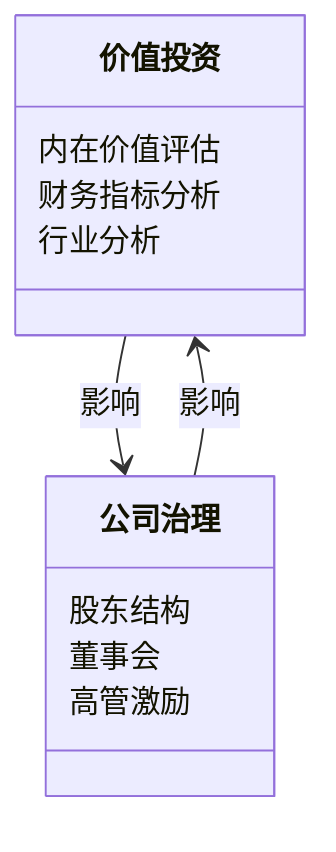

                 


# 价值投资与公司治理的关系

> **关键词**：价值投资、公司治理、内在价值、治理结构、投资策略

> **摘要**：本文探讨了价值投资与公司治理之间的关系，从理论基础、核心要素、数学模型到系统架构设计，详细分析了两者如何相互影响，以及如何通过科学的方法实现投资与治理的最优结合。

---

## 第一章: 价值投资的理论基础

### 1.1 价值投资的核心概念

#### 1.1.1 价值投资的起源与发展
价值投资是一种长期投资策略，起源于20世纪初，由本杰明·格雷厄姆和戴维·多德提出。其核心思想是通过分析企业的内在价值，寻找被市场低估的投资标的。这种方法强调安全边际，即买入价格低于内在价值，以降低投资风险。

#### 1.1.2 价值投资的核心原则
- **安全边际**：买入价格低于内在价值。
- **长期视角**：关注企业的长期盈利能力。
- **基本面分析**：通过财务报表等信息评估企业价值。

#### 1.1.3 价值投资与基本面分析的关系
基本面分析是价值投资的核心工具，包括对企业财务状况、行业地位、竞争优势等方面的研究。通过基本面分析，投资者可以识别出具有持续竞争优势的企业，从而做出明智的投资决策。

---

### 1.2 公司治理的基本概念

#### 1.2.1 公司治理的定义与内涵
公司治理是通过一系列制度和机制，确保企业决策的科学性、合理性和有效性。良好的公司治理能够优化资源配置、提升企业价值、降低经营风险。

#### 1.2.2 公司治理的主要参与者及其角色
- **股东**：作为所有者，享有收益权和决策权。
- **董事会**：负责制定战略、监督管理层。
- **管理层**：执行战略，管理日常运营。
- **利益相关者**：包括员工、客户、债权人等。

#### 1.2.3 公司治理的目标与意义
- **目标**：确保企业长期稳定发展，实现股东价值最大化。
- **意义**：良好的公司治理能够提升企业信用评级、降低融资成本，同时增强投资者信心。

---

## 第二章: 价值投资与公司治理的相互关系

### 2.1 价值投资如何影响公司治理

#### 2.1.1 投资者在公司治理中的角色
投资者不仅是资金提供者，更是企业治理的重要参与者。通过股东大会、董事会提名等方式，投资者可以影响企业的战略方向和管理层决策。

#### 2.1.2 价值投资对治理结构的优化作用
价值投资者倾向于投资治理结构完善的企业，这促使企业优化治理结构，提高透明度和决策效率。

#### 2.1.3 价值投资如何推动企业长期价值
价值投资者关注企业的长期盈利能力，这促使企业注重研发投入、市场拓展和品牌建设，从而推动企业长期价值的增长。

### 2.2 公司治理如何影响投资价值

#### 2.2.1 良好的治理如何提升企业价值
良好的公司治理能够降低代理成本、提高管理效率，从而提升企业内在价值。

#### 2.2.2 治理不善对企业价值的负面影响
治理不善可能导致企业战略失误、内控失效，进而影响企业价值，甚至引发财务危机。

#### 2.2.3 治理结构对企业内在价值的评估影响
治理结构的优劣直接影响企业的财务状况和经营效率，从而影响内在价值的评估结果。

---

## 第三章: 价值投资与公司治理的核心要素

### 3.1 价值投资的核心要素

#### 3.1.1 企业内在价值的评估
内在价值是企业未来现金流的现值，可以通过DCF模型计算。公式如下：

$$
\text{内在价值} = \sum_{t=1}^{n} \frac{\text{现金流}_t}{(1+r)^t} + \frac{\text{残值}}{(1+r)^n}
$$

其中，$r$为折现率，$n$为永续年份。

#### 3.1.2 财务指标分析
常用的财务指标包括市盈率（P/E）、市净率（P/B）、股息率等。这些指标可以帮助投资者评估企业的盈利能力、成长性和分红能力。

#### 3.1.3 行业分析与竞争优势
行业分析帮助企业确定市场地位，竞争优势分析则帮助企业评估企业的核心竞争力。

### 3.2 公司治理的核心要素

#### 3.2.1 股东结构与权力分配
合理的股东结构能够确保股东权益，防止一股独大或股权过于分散的问题。

#### 3.2.2 董事会的构成与职责
董事会是连接股东与管理层的桥梁，负责制定战略、监督管理层、评估重大决策。

#### 3.2.3 高管激励机制与道德风险
有效的激励机制可以激发管理层的积极性，但过度激励可能导致道德风险和短期行为。

---

## 第四章: 价值投资与公司治理的数学模型与算法原理

### 4.1 价值投资的数学模型

#### 4.1.1 内在价值的计算公式
$$
\text{内在价值} = \frac{\text{净利润} \times (1+g)}{r - g}
$$
其中，$g$为净利润增长率，$r$为折现率。

#### 4.1.2 现金流折现模型（DCF）的实现
通过Python代码实现DCF模型：

```python
def calculate_intrinsic_value(cash_flows, discount_rate, perpetuity_rate):
    intrinsic_value = 0
    for t in range(len(cash_flows)):
        if t < len(cash_flows) - 1:
            intrinsic_value += cash_flows[t] / (1 + discount_rate) ** t
        else:
            terminal_value = cash_flows[t] / (discount_rate - perpetuity_rate)
            intrinsic_value += terminal_value / (1 + discount_rate) ** t
    return intrinsic_value
```

#### 4.1.3 财务指标的量化分析
通过量化分析财务指标，可以帮助投资者更好地评估企业的内在价值。

### 4.2 公司治理的架构设计

#### 4.2.1 公司治理的层次结构
- **高层治理**：董事会、股东大会。
- **中层治理**：监事会、独立董事。
- **基层治理**：部门负责人、团队管理。

#### 4.2.2 治理机制的数学模型
通过层次分析法（AHP）评估治理效率：

$$
\text{治理效率} = \sum_{i=1}^{n} w_i \times f_i
$$

其中，$w_i$为权重，$f_i$为功能评分。

---

## 第五章: 价值投资与公司治理的系统架构设计

### 5.1 系统功能设计

#### 5.1.1 领域模型（Mermaid类图）


#### 5.1.2 系统架构设计（Mermaid架构图）


---

## 第六章: 价值投资与公司治理的项目实战

### 6.1 环境安装

#### 6.1.1 系统环境
- 操作系统：Windows/Mac/Linux
- 开发工具：Python、Jupyter Notebook
- 依赖库：pandas、numpy、matplotlib

### 6.2 核心实现源代码

#### 6.2.1 内在价值计算代码
```python
import pandas as pd
import numpy as np

def calculate_intrinsic_value(fcf, discount_rate, perpetuity_rate):
    # 计算DCF模型的内在价值
    n = len(fcf)
    if n == 0:
        return 0
    terminal_value = fcf[-1] / (discount_rate - perpetuity_rate)
    intrinsic_value = 0
    for t in range(n):
        if t < n - 1:
            cash_flow = fcf[t]
        else:
            cash_flow = terminal_value
        intrinsic_value += cash_flow / (1 + discount_rate) ** t
    return intrinsic_value

# 示例数据
fcf = [100, 120, 150, 200]
discount_rate = 0.1
perpetuity_rate = 0.05

intrinsic_value = calculate_intrinsic_value(fcf, discount_rate, perpetuity_rate)
print(f"内在价值为：{intrinsic_value:.2f}")
```

---

## 第七章: 总结与最佳实践

### 7.1 总结
价值投资与公司治理密切相关，良好的公司治理能够提升企业价值，而价值投资者则通过优化治理结构来实现长期收益。

### 7.2 最佳实践 tips
- 投资者应关注企业的治理结构，选择治理完善的企业。
- 企业应优化治理机制，提升管理效率。
- 投资者应结合基本面分析和治理评估，制定科学的投资策略。

---

## 作者：AI天才研究院 & 禅与计算机程序设计艺术

---

本文通过理论分析、数学建模和系统设计，深入探讨了价值投资与公司治理的关系，为投资者和企业管理者提供了科学的决策依据。

