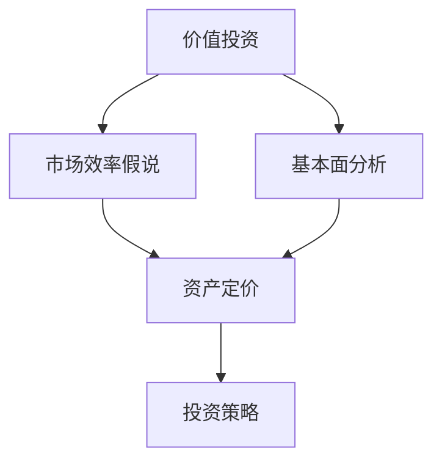

                 

# 价值投资与市场效率假说的关系

> 关键词：价值投资，市场效率假说，资产定价，有效市场假说，理性预期理论

> 摘要：本文探讨了价值投资与市场效率假说之间的关系，分析了它们在不同市场环境下的互动，以及对投资策略的影响。通过对比分析和实证研究，揭示了两者在理论与实践中的互补性。

---

## 第一部分：价值投资与市场效率假说的背景与基础

### 第1章：价值投资的核心概念与理论基础

#### 1.1 价值投资的定义与核心理念
- **定义**：价值投资是一种投资策略，强调以低于内在价值的价格买入优质股票并长期持有。
- **核心理念**：市场短期可能 irrational，但长期会回归基本面。
- **与基本面分析的关系**：基本面分析是价值投资的核心工具，关注企业的盈利能力、财务状况和行业地位。

#### 1.2 价值投资的历史发展与主要流派
- **起源与发展**：起源于20世纪初，格雷厄姆和多德是主要倡导者。
- **主要流派**：包括深度价值投资、趋势投资、成长投资等。
- **与其他投资策略的对比**：与技术分析不同，价值投资更关注企业的内在价值。

#### 1.3 价值投资的理论基础
- **股价与内在价值的关系**：股价围绕内在价值波动，市场短期可能偏离，但长期会回归。
- **市场情绪与投资者心理**：市场情绪波动导致价格偏离价值，价值投资者利用这种偏差。
- **长期视角**：价值投资强调长期持有，避免频繁交易。

#### 1.4 价值投资的成功案例分析
- **著名价值投资者的案例**：如巴菲特、彼得·林奇等。
- **在不同市场环境下的表现**：在市场低估时表现优异，但在高效市场中可能受限。
- **风险与挑战**：需要足够的耐心和纪律，市场波动可能导致短期亏损。

### 第2章：市场效率假说的理论基础与分类

#### 2.1 市场效率假说的定义与内涵
- **定义**：市场效率假说认为市场价格反映了所有相关信息，市场参与者无法通过分析获得超额收益。
- **内涵**：价格合理反映信息，市场参与者理性。
- **与资产定价的关系**：市场效率影响资产定价，高效市场中价格反映所有信息。

#### 2.2 市场效率的分类与层次
- **弱有效市场**：价格反映历史信息，技术分析无效。
- **半强有效市场**：价格反映公开信息，基本面分析无效。
- **强有效市场**：价格反映所有信息，包括内部信息，价值投资无效。

#### 2.3 市场效率假说的理论基础
- **理性预期理论**：投资者基于理性预期做出决策，市场反映所有信息。
- **数学模型**：Fama的三因素模型，CAPM模型。
- **市场效率与信息传播**：信息传播速度影响市场效率，延迟导致价格偏差。

#### 2.4 市场效率假说的实证研究与争议
- **实证证据**：部分市场接近有效，但现实中可能存在低效情况。
- **局限性**：假设投资者理性，现实中存在情绪影响。
- **市场效率与市场结构**：市场结构影响效率，如信息不对称。

### 第3章：价值投资与市场效率假说的核心概念对比与联系

#### 3.1 核心概念对比分析
- **定义对比**：价值投资关注内在价值，市场效率假说关注价格反映信息。
- **核心假设**：价值投资假设市场短期 irrational，市场效率假说假设市场理性。
- **联系与区别**：两者关注点不同，但在实际市场中存在交集。

#### 3.2 核心概念的属性特征对比表格
| **属性**         | **价值投资**                     | **市场效率假说**               |
|------------------|----------------------------------|------------------------------|
| 核心假设         | 市场短期 irrational               | 市场参与者理性                |
| 投资策略         | 寻找低估股票                     | 利用市场信息进行交易           |
| 适用市场         | 低效市场                        | 强有效市场                    |
| 风险             | 价格波动可能导致短期亏损        | 信息不对称可能导致错误定价    |

#### 3.3 实体关系图（ER图）与流程图

---

## 第二部分：价值投资与市场效率假说的关系分析

### 第4章：价值投资与市场效率假说的互动与互补性

#### 4.1 不同市场条件下的价值投资应用
- **低效市场**：价值投资有效，寻找低估股票。
- **高效市场**：价值投资受限，需结合其他策略。

#### 4.2 市场效率对价值投资的影响
- **低效市场**：价值投资表现优异。
- **高效市场**：价值投资可能难以获得超额收益。

#### 4.3 价值投资对市场效率的影响
- **信息传播**：价值投资者挖掘信息，推动价格发现。
- **市场结构**：促进市场效率提升。

### 第5章：价值投资与市场效率假说的数学模型与实证分析

#### 5.1 数学模型对比
- **CAPM模型**：$$E(R_i) = R_f + \beta_i (R_m - R_f)$$
  - 描述资产定价，与市场效率假说相关。
- **Fama的三因素模型**：$$E(R_i) = R_f + \beta_1 (R_m - R_f) + \beta_2 SMB + \beta_3 HML$$
  - 用于检验市场效率。

#### 5.2 实证分析方法
- **回归分析**：检验价值投资策略在不同市场条件下的表现。
- **数据来源**：使用历史股票数据，分析价值投资组合与市场指数的收益对比。

---

## 第三部分：价值投资与市场效率假说的实际应用

### 第6章：结合价值投资与市场效率假说的投资策略

#### 6.1 投资策略的设计
- **策略一**：在低效市场中进行价值投资。
- **策略二**：在高效市场中结合技术分析。

#### 6.2 策略实现步骤
1. 识别市场效率级别。
2. 根据效率级别选择策略。
3. 执行交易并监控结果。

### 第7章：风险管理与优化

#### 7.1 风险管理策略
- 分散投资：降低特定风险。
- 定期再平衡：保持投资组合的有效性。
- 使用衍生工具：对冲市场风险。

#### 7.2 优化方法
- 基于市场效率假说的动态调整。
- 结合价值投资的长期视角。

---

## 第四部分：案例分析与结论

### 第8章：案例分析

#### 8.1 案例背景
- 市场环境：低效市场。
- 投资标的：低估股票。

#### 8.2 案例分析
- 买入低估股票，长期持有。
- 结果：获得超额收益。

### 第9章：结论与展望

#### 9.1 结论
- 价值投资与市场效率假说在不同条件下互补。
- 组合策略可以提高投资效果。

#### 9.2 展望
- 进一步研究市场效率与价值投资的动态关系。
- 开发结合两者的新投资策略。

---

## 作者：AI天才研究院/AI Genius Institute & 禅与计算机程序设计艺术 /Zen And The Art of Computer Programming

---

### 总结
本文通过系统分析价值投资与市场效率假说的关系，揭示了它们在理论与实践中的互动与互补。价值投资在低效市场中表现优异，而市场效率假说为投资策略提供了理论框架。通过结合两者，投资者可以制定更有效的投资策略，提升投资收益。

