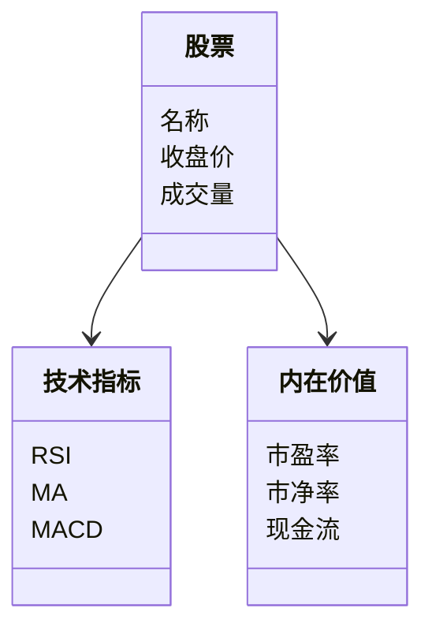
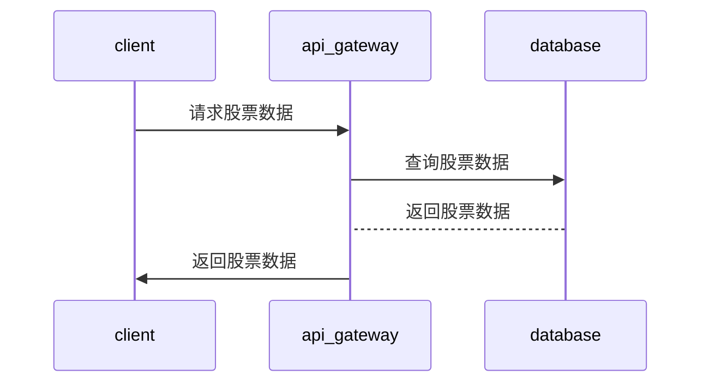

                 


# 价值投资与技术分析的结合

## 关键词：价值投资，技术分析，投资策略，算法原理，数学模型

## 摘要：  
价值投资与技术分析是两种在金融投资中广泛应用的方法。价值投资注重股票的内在价值，而技术分析则关注市场行为和价格走势。本文将探讨如何将这两种方法结合，以提升投资决策的科学性和有效性。通过分析价值投资的核心理念、技术分析的工具与方法，以及两者的结合策略，本文旨在为投资者提供一种更为全面的投资框架。

---

# 第1章 价值投资与技术分析概述

## 1.1 价值投资的核心概念

### 1.1.1 价值投资的定义与起源  
价值投资是一种投资策略，由本杰明·格雷厄姆等投资大师提出。其核心理念是购买低于其内在价值的股票，长期持有，等待市场重新认识其价值。内在价值是基于公司基本面（如盈利能力、财务状况、行业地位等）计算的合理价格。

### 1.1.2 价值投资的核心理念  
- **安全边际**：购买价格远低于内在价值的股票，以降低风险。  
- **长期视角**：关注企业的长期盈利能力，而非短期价格波动。  
- **逆向思维**：在市场恐慌时寻找被低估的股票，在市场狂热时保持冷静。  

### 1.1.3 价值投资的优缺点  
- **优点**：降低投资风险，适合长期投资者。  
- **缺点**：需要大量基本面分析，对短期市场波动不敏感。  

---

## 1.2 技术分析的核心概念

### 1.2.1 技术分析的定义与起源  
技术分析是一种通过分析历史价格和成交量数据来预测未来价格走势的方法。其核心假设是市场行为反映所有信息，价格走势具有可预测性。技术分析起源于20世纪初，至今仍是交易员的重要工具。

### 1.2.2 技术分析的核心工具与方法  
- **K线图**：显示股票价格在一定时间段内的开盘价、收盘价、最高价和最低价。  
- **技术指标**：如相对强弱指数（RSI）、移动平均线（MA）、MACD等。  
- **形态分析**：如头肩形、双底等形态，用于预测价格反转或突破。  

### 1.2.3 技术分析的优缺点  
- **优点**：适合短期交易者，提供即时交易信号。  
- **缺点**：忽视基本面因素，市场情绪波动可能导致误判。  

---

## 1.3 价值投资与技术分析的结合背景

### 1.3.1 金融市场中的投资策略演变  
- 早期投资策略多基于基本面分析，逐渐发展出技术分析和量化投资。  
- 价值投资与技术分析的结合是投资策略多元化发展的必然趋势。  

### 1.3.2 价值投资与技术分析的互补性  
- 价值投资提供长期视角，技术分析提供短期信号。  
- 结合两者可以弥补单一方法的不足，提升决策的科学性。  

### 1.3.3 结合两者的必要性与可行性  
- 必要性：市场既受基本面驱动，也受情绪和资金流动影响。  
- 可行性：通过量化模型将两者结合，提供更全面的投资策略。  

---

# 第2章 价值投资与技术分析的核心原理

## 2.1 价值投资的原理

### 2.1.1 股票的内在价值计算  
内在价值是基于公司基本面数据计算的合理价格。常用的模型包括：  
- 市盈率（P/E）模型：`P = E × 市盈率`  
- 市净率（P/B）模型：`P = B × 市净率`  
- 现金流折现模型（DCF）：基于未来现金流的现值计算。  

### 2.1.2 市场情绪与价格波动的关系  
市场情绪影响股票价格的短期波动。当市场恐慌时，股票价格可能低于内在价值；当市场狂热时，股票价格可能高于内在价值。  

### 2.1.3 价值陷阱的识别与避免  
价值陷阱是指看似低估但实际基本面不佳的股票。识别方法包括：  
- 深入分析公司财务报表，识别虚假利润。  
- 关注行业趋势，避免选择夕阳行业。  

---

## 2.2 技术分析的原理

### 2.2.1 技术指标的分类与作用  
- **动量指标**：如RSI，用于衡量价格超买或超卖状态。  
- **趋势指标**：如MA，用于判断价格趋势。  
- **成交量指标**：如OBV，用于分析交易量与价格的关系。  

### 2.2.2 K线图与趋势分析  
- K线图显示价格走势，帮助识别趋势和反转点。  
- 趋势分析包括上升趋势、下降趋势和横向整理。  

### 2.2.3 交易量与价格关系的分析  
- 价格上涨伴随成交量增加，表明买方力量强劲。  
- 价格下跌伴随成交量减少，表明卖方力量减弱。  

---

## 2.3 价值投资与技术分析的联系

### 2.3.1 价值投资中技术分析的应用场景  
- **选股**：通过技术分析筛选出具有上升趋势的股票。  
- **买卖时机**：通过技术信号确定买入和卖出时机。  

### 2.3.2 技术分析中价值评估的辅助作用  
- **估值验证**：技术指标如P/E比率可以帮助验证股票是否低估。  
- **风险控制**：通过技术指标识别潜在风险，如超买或超卖状态。  

### 2.3.3 两者结合的综合策略  
- **综合筛选**：结合基本面和技术分析筛选股票。  
- **动态调整**：根据技术信号动态调整持仓比例。  

---

# 第3章 价值投资与技术分析的算法原理

## 3.1 价值评估的算法原理

### 3.1.1 常用价值评估算法  
- **市盈率模型**：计算公式为`P = E × 市盈率`。  
- **市净率模型**：计算公式为`P = B × 市净率`。  
- **现金流折现模型**：计算公式为`P = ∑(CF_t / (1 + r)^t)`。  

### 3.1.2 算法实现步骤  
1. 收集公司财务数据，包括收入、利润、现金流等。  
2. 选择合适的估值模型，计算股票的内在价值。  
3. 对比当前市场价格与内在价值，判断是否低估。  

### 3.1.3 算法实现代码示例  
```python
import pandas as pd
import numpy as np

def calculate_intrinsic_value(financial_data, model='DCF'):
    if model == 'DCF':
        CF = financial_data['现金流']
        discount_rate = 0.08
        intrinsic_value = sum(CF / (1 + discount_rate)**t for t in range(len(CF)))
        return intrinsic_value
    else:
        return None

financial_data = {
    '现金流': [100, 120, 140, 160]
}

iv = calculate_intrinsic_value(financial_data)
print(f"内在价值：{iv}")
```

---

## 3.2 技术分析的数学模型

### 3.2.1 常用技术指标公式  
- **相对强弱指数（RSI）**：`RSI = (100 × (上涨天数 - 下跌天数)) / (上涨天数 + 下跌天数)`  
- **移动平均线（MA）**：`MA_n = (收盘价 + 收盘价1天前 + ... + 收盘价n-1天前) / n`  
- **MACD**：由短期和长期移动平均线的差值构成。  

### 3.2.2 技术分析模型的数学推导  
- **均值回归模型**：假设价格回归均值，公式为`P_t = μ + σ × Z`，其中Z为标准正态分布随机变量。  

---

# 第4章 系统分析与架构设计方案

## 4.1 项目介绍

### 4.1.1 项目背景  
开发一个结合价值投资与技术分析的投资决策支持系统，帮助投资者做出更明智的决策。  

---

## 4.2 系统功能设计

### 4.2.1 领域模型（Mermaid 类图）  


---

## 4.3 系统架构设计（Mermaid 架构图）  
```mermaid
docker
    server1
    server2
    client
    database
    api_gateway
    股票数据源
```

---

## 4.4 系统接口设计（Mermaid 序列图）  


---

# 第5章 项目实战

## 5.1 环境安装

### 5.1.1 安装Python和相关库  
```bash
pip install numpy pandas matplotlib
```

---

## 5.2 核心实现代码

### 5.2.1 价值评估代码  
```python
import pandas as pd
import numpy as np

def calculate_pe_ratio(df):
    df['PE'] = df['Price'] / df['Earnings Per Share']
    return df

data = pd.DataFrame({
    'Price': [100, 150, 200],
    'Earnings Per Share': [10, 15, 20]
})

result = calculate_pe_ratio(data)
print(result)
```

### 5.2.2 技术分析代码  
```python
import matplotlib.pyplot as plt

data = pd.DataFrame({
    'Date': ['2020-01-01', '2020-01-02', '2020-01-03'],
    'Price': [100, 105, 102]
})

data.set_index('Date', inplace=True)
data['MA_3'] = data['Price'].rolling(3).mean()

plt.plot(data['Price'], label='Price')
plt.plot(data['MA_3'], label='MA_3')
plt.legend()
plt.show()
```

---

## 5.3 实际案例分析

### 5.3.1 案例选择  
以苹果公司为例，结合价值投资和技术分析筛选投资标的。  

### 5.3.2 数据分析  
- **价值评估**：计算苹果公司的市盈率和市净率，判断其是否低估。  
- **技术分析**：分析苹果公司的K线图和均线，判断是否处于上升趋势。  

### 5.3.3 投资决策  
- 如果苹果公司价值被低估且处于上升趋势，建议买入并长期持有。  

---

## 5.4 项目小结

### 5.4.1 代码运行结果  
- 价值评估结果：苹果公司市盈率合理，市净率略高。  
- 技术分析结果：股价处于上升趋势，均线支持。  

### 5.4.2 经验总结  
- 结合价值投资和技术分析可以有效降低投资风险。  
- 需要持续关注市场变化，及时调整投资策略。  

---

# 第6章 最佳实践

## 6.1 小结  
本文详细探讨了价值投资与技术分析的结合策略，通过理论分析和实际案例展示了其可行性。  

## 6.2 注意事项  
- 投资需谨慎，结合自身风险承受能力。  
- 需要持续学习和更新知识，适应市场变化。  

## 6.3 拓展阅读  
- 格雷厄姆《证券分析》  
- 艾德勒《股票作手回忆录》  
- 米勒《技术分析实战指南》  

---

# 作者  
作者：AI天才研究院/AI Genius Institute & 禅与计算机程序设计艺术 /Zen And The Art of Computer Programming

