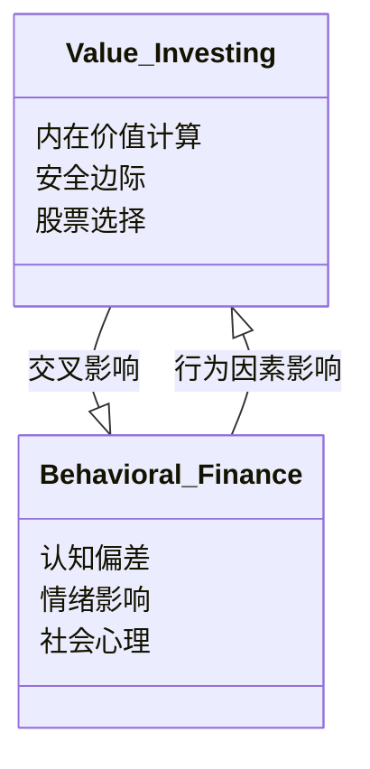
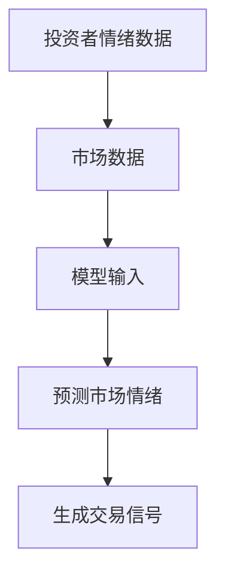
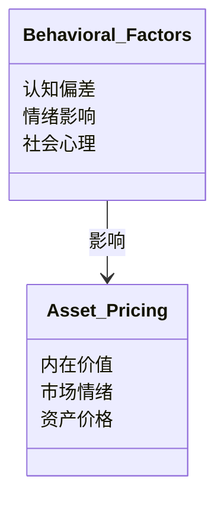

                 

# 价值投资与行为金融学的交叉

> 关键词：价值投资、行为金融学、交叉分析、认知偏差、市场情绪、投资策略、数学模型

> 摘要：本文探讨了价值投资与行为金融学的交叉点，分析了行为因素如何影响价值评估和投资决策，结合数学模型和实际案例，展示了两者结合在投资策略中的应用。

---

## 第一部分：价值投资与行为金融学的背景介绍

### 第1章：价值投资的理论基础

#### 1.1 价值投资的起源与发展
- **1.1.1 价值投资的起源**
  - 价值投资起源于20世纪初，由本杰明·格雷厄姆和戴维·多德提出，强调以低于内在价值的价格买入股票。
- **1.1.2 价值投资的核心观点**
  - 股票价格与内在价值的差异是投资机会的来源。
  - 强调安全边际，即买入价格远低于内在价值。
- **1.1.3 价值投资在现代金融中的应用**
  - 价值投资策略在机构投资、个人投资中广泛应用，尤其是在市场波动中寻找低估资产。

#### 1.2 价值投资的核心理论
- **1.2.1 股票的内在价值计算**
  - 内在价值 = 股息贴现模型（DDM）或自由现金流贴现模型（DCF）。
  - 例如，使用DDM计算：V = D / (r - g)，其中D为股息，r为贴现率，g为股息增长率。
- **1.2.2 安全边际的概念**
  - 安全边际 = 内在价值 - 市场价格，提供缓冲以应对市场波动和错误评估。
- **1.2.3 价值投资的选股策略**
  - 寻找具有低市盈率、低市净率、高股息率的公司。

#### 1.3 价值投资与传统金融学的差异
- **1.3.1 价值投资与有效市场假说的对比**
  - 有效市场假说认为价格反映所有信息，而价值投资认为市场经常无效，存在低估资产。
- **1.3.2 价值投资与现代资产组合理论的差异**
  - 现代资产组合理论强调分散投资和风险收益 trade-off，而价值投资更关注个别资产的低估。

### 第2章：行为金融学的基本概念

#### 2.1 行为金融学的起源与发展
- **2.1.1 行为金融学的起源**
  - 20世纪80年代兴起，挑战有效市场假说，强调心理因素对市场的影响。
- **2.1.2 行为金融学的核心观点**
  - 投资者行为受认知偏差和情绪影响，导致市场波动和定价偏差。
- **2.1.3 行为金融学在现代金融中的应用**
  - 用于解释市场泡沫、崩盘和投资者决策偏差。

#### 2.2 行为金融学的核心理论
- **2.2.1 认知偏差与决策**
  - 认知偏差（如确认偏差、锚定效应）影响投资者决策。
  - 例如，确认偏差导致投资者忽视不利信息。
- **2.2.2 情绪与市场波动**
  - 情绪周期（贪婪与恐惧）导致市场过度波动。
  - 例如，投资者情绪指数（I Sentiment）用于预测市场走势。
- **2.2.3 行为模型的构建**
  - 结合心理学和经济学，构建行为模型解释市场现象。

#### 2.3 行为金融学与传统金融学的差异
- **2.3.1 行为金融学与有效市场假说的对比**
  - 有效市场假说认为价格反映所有信息，而行为金融学认为价格受心理因素影响。
- **2.3.2 行为金融学与现代资产组合理论的差异**
  - 现代资产组合理论基于理性假设，而行为金融学考虑非理性因素。

---

## 第二部分：价值投资与行为金融学的交叉分析

### 第3章：价值投资中的行为因素

#### 3.1 行为因素对价值评估的影响
- **3.1.1 认知偏差对价值评估的影响**
  - 认知偏差导致投资者对信息的选择性处理，影响内在价值计算。
  - 例如，投资者可能低估高增长公司的风险。
- **3.1.2 情绪波动对价值评估的影响**
  - 情绪波动导致市场对资产定价的偏差。
  - 例如，恐慌性抛售导致股票价格低于内在价值。
- **3.1.3 社会心理对价值评估的影响**
  - 社会心理影响投资者群体行为，进而影响资产价格。

#### 3.2 行为因素对投资决策的影响
- **3.2.1 认知偏差对投资决策的影响**
  - 认知偏差导致投资者做出非理性决策。
  - 例如，过度自信导致高位买入。
- **3.2.2 情绪波动对投资决策的影响**
  - 情绪波动导致投资者在市场高点卖出，在低点买入。
- **3.2.3 社会心理对投资决策的影响**
  - 社会心理影响投资者的从众行为，导致市场趋势。

#### 3.3 行为因素对投资结果的影响
- **3.3.1 认知偏差对投资结果的影响**
  - 认知偏差导致投资失误，如低估风险。
- **3.3.2 情绪波动对投资结果的影响**
  - 情绪波动导致投资组合波动加剧。
- **3.3.3 社会心理对投资结果的影响**
  - 社会心理影响投资者行为，进而影响投资结果。

---

## 第三部分：价值投资与行为金融学的交叉应用

### 第4章：行为因素对价值投资策略的优化

#### 4.1 行为偏差对价值评估的修正
- **4.1.1 认知偏差的识别与修正**
  - 识别确认偏差、锚定效应等，修正价值评估。
- **4.1.2 情绪周期的利用**
  - 利用市场情绪周期，优化买入和卖出时机。
- **4.1.3 社会心理的利用**
  - 利用从众心理，寻找市场共识外的机会。

#### 4.2 行为金融学对投资组合管理的启示
- **4.2.1 行为因素对风险控制的启示**
  - 建立心理账户，控制风险敞口。
- **4.2.2 行为因素对资产配置的启示**
  - 考虑投资者情绪，动态调整资产配置。
- **4.2.3 行为因素对投资纪律的启示**
  - 建立严格的交易纪律，避免情绪干扰。

---

## 第四部分：价值投资与行为金融学的数学模型

### 第5章：数学模型与算法实现

#### 5.1 基于行为偏差的市场情绪预测模型
- **5.1.1 模型概述**
  - 使用投资者情绪数据和市场数据，预测市场情绪。
- **5.1.2 模型实现**
  - 使用Python和机器学习算法（如LSTM）预测情绪指数。
  - 代码示例：预测市场情绪指数，生成交易信号。
- **5.1.3 模型验证**
  - 验证模型在不同市场周期的预测准确性。

#### 5.2 行为因素对资产定价的影响模型
- **5.2.1 模型概述**
  - 结合行为因素和基本面因素，构建资产定价模型。
- **5.2.2 模型实现**
  - 使用Python和回归分析，量化行为因素对资产定价的影响。
  - 代码示例：回归分析，量化情绪指数对股价的影响。
- **5.2.3 模型验证**
  - 验证模型在实际市场中的表现。

---

## 第五部分：结论与展望

### 第6章：结论与展望

#### 6.1 结论
- 价值投资与行为金融学的交叉为投资决策提供了新的视角。
- 行为因素对价值评估和投资决策有重要影响。
- 数学模型和算法的应用为投资者提供了新的工具。

#### 6.2 展望
- 未来研究可以进一步结合行为金融学和大数据技术，开发更精准的投资策略。
- 探索更多行为因素对价值投资的影响，优化投资组合管理。

---

## 附录

### 附录A：术语表
- 价值投资：一种投资策略，强调以低于内在价值的价格买入资产。
- 行为金融学：研究投资者心理和行为对市场的影响。

### 附录B：数据来源
- 数据来源包括市场数据、投资者情绪数据等。

### 附录C：参考文献
- 列出相关书籍和学术论文。

### 附录D：索引
- 索引按主题和术语排列，方便查阅。

---

## 图表

### 图1：价值投资与行为金融学的核心要素对比

### 图2：市场情绪预测模型流程图

### 图3：资产定价模型类图

---

作者：AI天才研究院/AI Genius Institute & 禅与计算机程序设计艺术 /Zen And The Art of Computer Programming

---

**本文结合了价值投资和行为金融学的核心理论，通过数学模型和实际案例分析，展示了两者交叉在投资策略中的应用。希望本文能为投资者提供新的视角和工具，帮助他们在复杂市场中做出更明智的决策。**

