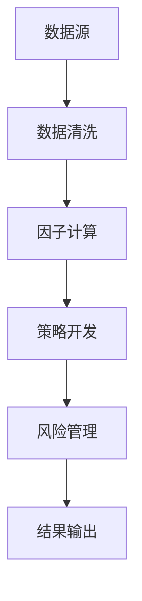
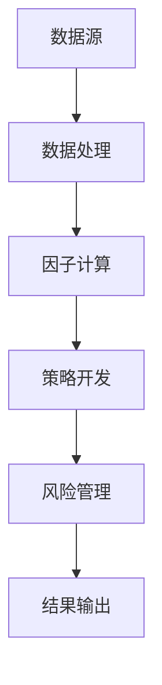
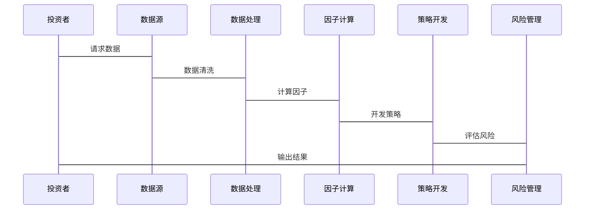

                 


# 价值投资与量化投资的融合

> **关键词**：价值投资、量化投资、融合、金融数据分析、机器学习  
> 
> **摘要**：本文探讨了价值投资与量化投资的融合，分析了两种投资方法的优缺点，并提出了融合的方法和实际应用。通过数学模型和实例，展示了如何将基本面分析与量化技术结合，提升投资决策的科学性和效率。

---

## 第一章: 投资概述与基本概念

### 1.1 投资的基本概念
#### 1.1.1 投资的定义与分类
- 投资是指将资金投入到某种资产中，以期获得收益的行为。
- 分类：股票、债券、基金、房地产等。

#### 1.1.2 价值投资的核心理念
- 格雷厄姆的价值投资理论：寻找被市场低估的股票。
- 巴菲特的投资哲学：长期持有优质资产。

#### 1.1.3 量化投资的基本原理
- 量化投资依赖数学模型和算法。
- 常见量化模型：因子模型、算法交易。

### 1.2 价值投资与量化投资的对比
#### 1.2.1 价值投资的特点与优势
- 重视基本面分析。
- 长期投资策略。

#### 1.2.2 量化投资的特点与优势
- 数据驱动。
- 高效性和纪律性。

#### 1.2.3 两种投资方法的异同点分析
- 价值投资注重内在价值，量化投资依赖数据模式。

### 1.3 价值投资与量化投资的融合背景
#### 1.3.1 当前金融市场的复杂性
- 市场波动加剧，传统方法不足。
- 量化技术快速发展。

#### 1.3.2 传统投资方法的局限性
- 人为情绪影响决策。
- 数据处理效率低。

#### 1.3.3 量化技术的快速发展
- 计算机技术进步。
- 数据量激增。

### 1.4 融合投资的目标与意义
#### 1.4.1 提高投资决策的科学性
- 结合基本面分析和数据模式。

#### 1.4.2 降低投资风险
- 利用量化模型分散风险。

#### 1.4.3 提升投资效率
- 自动化交易和数据分析。

### 1.5 本章小结
本章介绍了价值投资和量化投资的基本概念，分析了它们的优缺点，并探讨了融合的背景和意义。

---

## 第二章: 价值投资的核心理论与实践

### 2.1 价值投资的理论基础
#### 2.1.1 格雷厄姆的价值投资理论
- 安全边际：购买价格低于内在价值。
- 避免市场波动干扰。

#### 2.1.2 巴菲特的投资哲学
- 寻找具有持续竞争优势的企业。
- 长期持有优质资产。

#### 2.1.3 价值投资的关键指标分析
- 市盈率（P/E）、市净率（P/B）、股息率等。

### 2.2 价值投资的实践方法
#### 2.2.1 基本面分析的核心步骤
- 行业分析、财务分析、管理团队评估。

#### 2.2.2 安全边际的概念与应用
- 确保购买价格低于内在价值。
- 降低市场波动风险。

#### 2.2.3 价值投资的风险控制策略
- 分散投资、定期评估、避免过度集中。

### 2.3 价值投资的案例分析
#### 2.3.1 经典投资案例解读
- 巴菲特投资可口可乐的案例。

#### 2.3.2 案例中的经验与教训
- 选择具有持续竞争优势的企业。

### 2.4 本章小结
本章详细讲解了价值投资的理论基础和实践方法，分析了实际案例，帮助读者理解价值投资的核心思想。

---

## 第三章: 量化投资的理论与技术实现

### 3.1 量化投资的理论基础
#### 3.1.1 量化投资的定义与特点
- 数据驱动、系统化、高效性。

#### 3.1.2 常用的量化模型与算法
- 因子模型：CAPM、Fama-French三因子模型。
- 算法交易：统计套利、高频交易。

#### 3.1.3 数据驱动的投资决策
- 利用大数据分析市场趋势。

### 3.2 量化投资的关键技术
#### 3.2.1 数据采集与处理技术
- 数据源：股票价格、财务数据、市场情绪。
- 数据清洗与预处理。

#### 3.2.2 量化策略的开发与测试
- 策略回测、风险控制、绩效评估。

#### 3.2.3 风险管理与绩效评估
- 风险指标：VaR、夏普比率。
- 策略优化：参数调整、组合优化。

### 3.3 量化投资的数学模型
#### 3.3.1 因子模型的构建与应用
- 因子选择：市值、价值、动量因子。
- 因子权重计算：回归分析。

#### 3.3.2 时间序列分析与预测
- ARIMA模型、GARCH模型。
- 预测股票价格趋势。

#### 3.3.3 机器学习在量化投资中的应用
- 监督学习：预测股价。
- 非监督学习：聚类分析市场状态。

### 3.4 量化投资的案例分析
#### 3.4.1 简单量化策略的实现
- 基于动量策略的交易系统。

#### 3.4.2 复杂量化模型的实践
- 使用机器学习预测市场波动。

### 3.5 本章小结
本章介绍了量化投资的理论基础和技术实现，详细讲解了常用模型和算法，并通过案例展示了实际应用。

---

## 第四章: 价值投资与量化投资的融合点

### 4.1 融合的理论基础
#### 4.1.1 价值投资与量化投资的互补性
- 价值投资提供基本面信息，量化投资提供数据支持。

#### 4.1.2 融合的必要性
- 充分利用两种方法的优势。

### 4.2 融合的方法与策略
#### 4.2.1 在量化模型中融入基本面因子
- 构建混合因子模型。

#### 4.2.2 用量化方法筛选价值股
- 基于机器学习分析价值因子。

#### 4.2.3 混合策略的开发与优化
- 策略开发：结合基本面分析和量化信号。
- 策略优化：参数调整、风险控制。

### 4.3 融合系统的架构设计
#### 4.3.1 系统功能模块
- 数据获取与处理、策略开发、风险管理。

#### 4.3.2 系统架构图（Mermaid）


### 4.4 融合系统的实现
#### 4.4.1 数据流分析
- 数据流：从原始数据到策略输出的处理流程。

#### 4.4.2 核心功能模块实现
- 因子计算：使用Python和Pandas处理数据。
- 策略开发：结合基本面因子和量化信号。

### 4.5 本章小结
本章探讨了价值投资与量化投资的融合方法，设计了融合系统的架构，并详细讲解了实现过程。

---

## 第五章: 系统分析与架构设计方案

### 5.1 问题场景介绍
- 投资者需要同时考虑基本面和量化信号。
- 如何构建一个高效的系统来实现这一点。

### 5.2 项目介绍
- 项目目标：构建一个融合价值投资和量化投资的系统。
- 项目范围：涵盖数据获取、策略开发、风险控制。

### 5.3 系统功能设计（领域模型）
#### 5.3.1 实体关系图（Mermaid）
```mermaid
erd
    客户 --- 投资组合
    投资组合 --> 股票
    股票 --> 基本面数据
    股票 --> 量化信号
```

### 5.4 系统架构设计（架构图）


### 5.5 系统接口设计
- 数据接口：与数据源对接。
- 策略接口：与量化模型对接。

### 5.6 系统交互设计（序列图）


### 5.7 本章小结
本章详细设计了融合系统的架构，包括功能模块、数据流和系统交互。

---

## 第六章: 项目实战与代码实现

### 6.1 环境安装
- 安装Python、Pandas、NumPy、Scikit-learn。

### 6.2 核心实现代码
```python
import pandas as pd
import numpy as np

# 示例：计算价值因子（低PE策略）
def calculate_value_factor(stock_data):
    stock_data['PE'] = stock_data['市盈率']
    stock_data['Value Factor'] = stock_data['PE'].rank(pct=True)
    return stock_data

# 示例：构建量化因子（动量策略）
def momentum_strategy(stock_data, window=20):
    stock_data['Momentum'] = stock_data['收盘价'].rolling(window).mean()
    stock_data['Momentum Factor'] = stock_data['Momentum'].rank(pct=True)
    return stock_data

# 示例：融合策略（加权平均）
def combined_strategy(stock_data):
    value_factor = calculate_value_factor(stock_data)['Value Factor']
    momentum_factor = momentum_strategy(stock_data)['Momentum Factor']
    combined_factor = (value_factor + momentum_factor) / 2
    return combined_factor
```

### 6.3 代码应用解读与分析
- 计算价值因子：基于市盈率排序。
- 构建量化因子：基于动量策略排序。
- 融合策略：加权平均两种因子。

### 6.4 实际案例分析
- 数据来源：某时间段的股票数据。
- 策略实现：计算价值和动量因子，结合两种因子生成投资信号。

### 6.5 策略回测与优化
- 回测分析：评估策略的收益和风险。
- 参数优化：调整窗口大小、因子权重。

### 6.6 本章小结
本章通过实际案例展示了如何将价值投资和量化投资融合，并通过代码实现策略。

---

## 第七章: 结论与展望

### 7.1 结论
- 融合价值投资和量化投资可以提升投资效率和决策科学性。
- 系统化方法和工具是实现融合的关键。

### 7.2 展望
- 人工智能和大数据在投资中的应用前景广阔。
- 更多融合方法的探索和实践。

### 7.3 本章小结
本文总结了价值投资与量化投资融合的优势，并展望了未来的发展方向。

---

## 附录

### 附录A: 数据源与工具安装
- 数据源：Yahoo Finance、Bloomberg。
- 工具：Python、Pandas、NumPy。

### 附录B: 核心代码实现
- 提供完整的策略实现代码。

### 附录C: 参考文献
- 格雷厄姆的《聪明的投资者》。
- 巴菲特的股东大会讲话。
- 量化投资的经典论文。

---

## 作者：AI天才研究院/AI Genius Institute & 禅与计算机程序设计艺术 /Zen And The Art of Computer Programming

