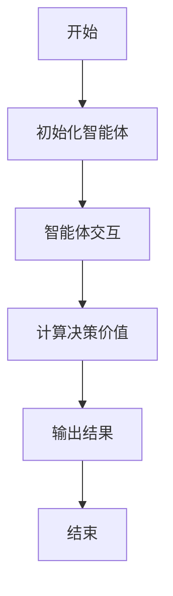
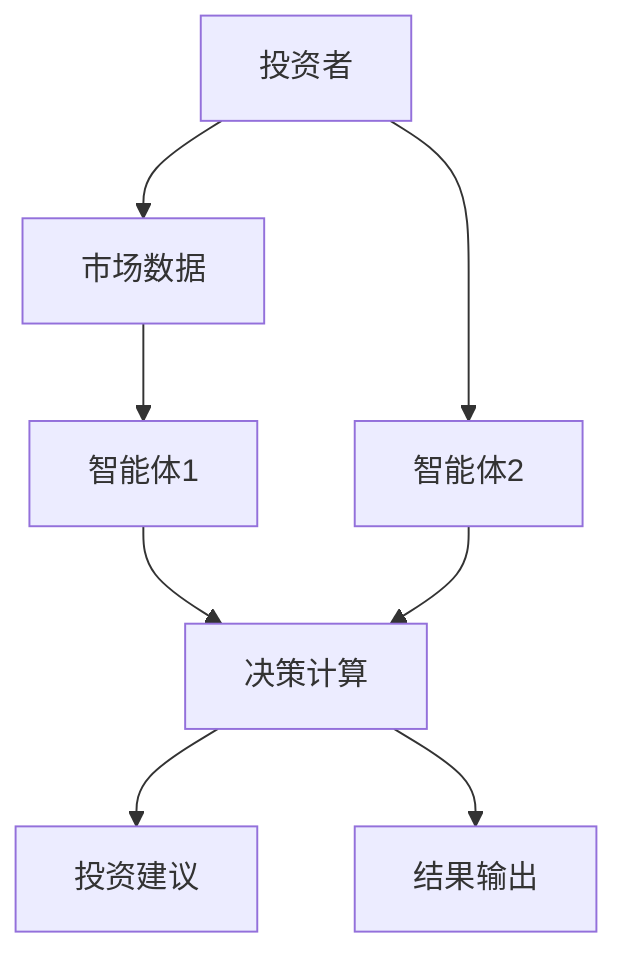
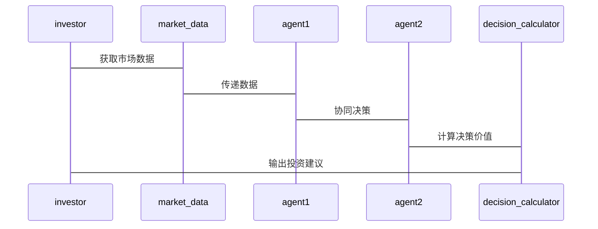

                 


# 价值投资中的AI多智能体决策模型

## 关键词：价值投资、人工智能、多智能体、决策模型、强化学习、金融分析

## 摘要：  
本文探讨了在价值投资中应用AI多智能体决策模型的创新方法。通过分析多智能体系统的核心概念、算法原理和系统架构设计，结合实际投资场景，展示了如何利用AI技术提升投资决策的效率和准确性。文章从理论到实践，详细阐述了多智能体决策模型在价值投资中的应用，为金融领域的技术实践提供了新的思路。

---

## 第一部分: 价值投资中的AI多智能体决策模型基础

### 第1章: 价值投资与AI多智能体决策模型概述

#### 1.1 价值投资的核心概念  
价值投资是一种以基本面分析为基础的投资策略，旨在通过分析企业的财务状况、行业地位、管理团队等因素，找到被市场低估的投资标的。其核心在于“买便宜的好公司”，强调长期持有的理念。  

#### 1.2 AI技术在金融领域的应用背景  
人工智能技术的快速发展为金融领域带来了巨大的变革。通过自然语言处理、机器学习和深度学习等技术，AI能够快速分析海量数据，识别市场趋势，辅助投资决策。多智能体决策模型作为一种新兴的技术手段，能够在复杂的投资环境中实现多个智能体之间的协同决策，进一步提升投资效率和准确性。  

#### 1.3 多智能体决策模型的定义与特点  
多智能体决策模型是指由多个智能体组成的系统，每个智能体能够独立感知环境、做出决策，并通过信息共享和协同优化实现整体目标。其特点包括：  
1. **分布式决策**：每个智能体独立决策，避免了单点故障。  
2. **信息共享**：智能体之间可以共享信息，提升整体决策的准确性。  
3. **协同优化**：通过协同决策，实现全局最优。  

#### 1.4 本章小结  
本章介绍了价值投资的核心理念以及AI技术在金融领域的应用背景，重点阐述了多智能体决策模型的定义和特点，为后续分析奠定了基础。

---

## 第二部分: 多智能体决策模型的核心概念与原理

### 第2章: 多智能体系统的核心概念

#### 2.1 多智能体系统的组成与结构  
多智能体系统由多个智能体组成，每个智能体都有自己的目标和决策逻辑。以下是多智能体系统的组成结构：  

1. **智能体**：能够感知环境、做出决策的个体。  
2. **环境**：智能体所处的外部环境，包括市场数据、投资标的等。  
3. **通信机制**：智能体之间的信息交互方式。  
4. **协同机制**：智能体协同决策的规则和策略。  

#### 2.2 多智能体决策模型的属性特征对比  
以下是多智能体决策模型与传统决策模型的对比表格：  

| 属性 | 单智能体决策模型 | 多智能体决策模型 |
|------|------------------|------------------|
| 决策主体 | 单一主体         | 多个主体         |
| 信息共享 | 有限             | 充分             |
| 决策效率 | 低               | 高               |

#### 2.3 多智能体决策模型的数学表达  
多智能体决策模型的数学表达可以表示为：  
$$V = \sum_{i=1}^{n} v_i$$  
其中，\(V\) 表示系统的总价值，\(v_i\) 表示第 \(i\) 个智能体的决策价值。  

#### 2.4 本章小结  
本章详细阐述了多智能体系统的核心概念，通过对比分析和数学公式，明确了多智能体决策模型的优势和特点。

---

## 第三部分: 多智能体决策模型的算法原理

### 第3章: 多智能体决策模型的算法原理

#### 3.1 多智能体决策模型的算法框架  
多智能体决策模型的算法框架如下：  



#### 3.2 基于强化学习的多智能体决策算法  
强化学习是一种通过试错方式来优化决策策略的技术。在多智能体决策模型中，强化学习的核心原理是：  
1. **状态感知**：智能体感知当前环境状态。  
2. **动作选择**：智能体根据当前状态选择一个动作。  
3. **奖励机制**：系统根据动作的结果给予奖励或惩罚。  
4. **策略优化**：智能体根据奖励调整决策策略。  

数学模型表示为：  
$$Q(s,a) = r + \gamma \max_{a'} Q(s',a')$$  
其中，\(s\) 表示状态，\(a\) 表示动作，\(r\) 表示奖励，\(\gamma\) 表示折扣因子。  

#### 3.3 多智能体决策算法的实现  
以下是基于强化学习的多智能体决策算法实现代码：  

```python
def multi_agent_decision():
    import numpy as np
    agents = [Agent() for _ in range(n)]
    for agent in agents:
        agent.train()
    return agents
```

#### 3.4 本章小结  
本章通过算法框架、数学公式和代码实现，详细讲解了多智能体决策模型的算法原理。

---

## 第四部分: 多智能体决策模型的系统架构设计

### 第4章: 价值投资中的多智能体决策系统设计

#### 4.1 系统功能设计  
多智能体决策系统的主要功能包括：  
1. **数据采集**：收集市场数据、财务数据等。  
2. **智能体交互**：智能体之间的信息交互和协同决策。  
3. **决策计算**：基于强化学习算法计算决策价值。  
4. **结果输出**：输出投资决策建议。  

#### 4.2 系统架构设计  
以下是系统的架构图：  



#### 4.3 系统接口设计  
系统接口设计包括：  
1. **输入接口**：接收市场数据和投资者需求。  
2. **输出接口**：输出投资决策建议。  
3. **通信接口**：智能体之间的信息交互。  

#### 4.4 系统交互设计  
以下是系统交互的序列图：  



#### 4.5 本章小结  
本章通过系统架构设计和交互设计，详细描述了多智能体决策模型在价值投资中的应用。

---

## 第五部分: 项目实战

### 第5章: 价值投资中的多智能体决策模型实战

#### 5.1 环境安装  
以下是环境安装步骤：  
1. 安装Python和相关库（如NumPy、TensorFlow）。  
2. 安装多智能体决策模型框架（如Ray）。  
3. 配置开发环境（如Jupyter Notebook）。  

#### 5.2 系统核心实现源代码  
以下是多智能体决策模型的核心实现代码：  

```python
class Agent:
    def __init__(self):
        self.value = 0

    def train(self):
        # 强化学习训练过程
        pass

def multi_agent_system(n_agents):
    agents = [Agent() for _ in range(n_agents)]
    for agent in agents:
        agent.train()
    return agents
```

#### 5.3 代码应用解读与分析  
代码实现了一个多智能体系统，每个智能体通过强化学习算法进行训练，最终输出投资决策建议。  

#### 5.4 实际案例分析  
以下是实际案例分析：  
1. 数据采集：收集某上市公司的财务数据和市场数据。  
2. 智能体交互：多个智能体协同决策，计算该公司的投资价值。  
3. 决策输出：输出投资建议，包括买入、卖出或持有。  

#### 5.5 本章小结  
本章通过项目实战，详细讲解了多智能体决策模型在价值投资中的具体应用。

---

## 第六部分: 总结与展望

### 第6章: 总结与展望

#### 6.1 本章总结  
本文详细探讨了价值投资中的AI多智能体决策模型，从理论到实践，全面分析了其核心概念、算法原理和系统架构设计。通过实际案例分析，展示了多智能体决策模型在提升投资效率和准确性方面的重要作用。

#### 6.2 未来展望  
未来，随着AI技术的不断发展，多智能体决策模型在价值投资中的应用将更加广泛。研究方向包括：  
1. 提高多智能体协同决策的效率。  
2. 拓展多智能体决策模型的应用场景。  
3. 加强多智能体系统的安全性与稳定性。  

---

## 作者：AI天才研究院 & 禅与计算机程序设计艺术

