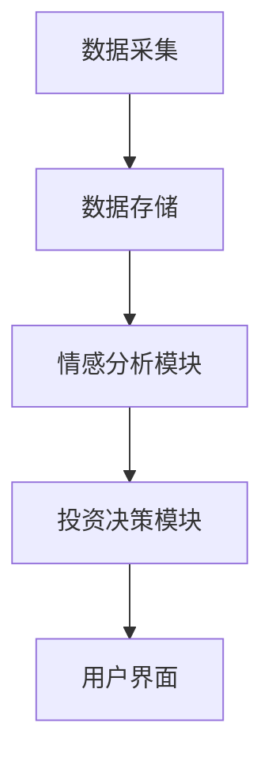

                 


# 价值投资中的AI情感分析：多智能体系统解读市场心理

> 关键词：价值投资，AI情感分析，多智能体系统，市场心理，投资决策，情感计算，机器学习

> 摘要：本文探讨了如何利用人工智能技术，特别是情感分析和多智能体系统，来解读市场心理并辅助价值投资决策。文章从价值投资的基本概念出发，逐步分析情感分析的核心算法与数学模型，深入探讨多智能体系统在市场心理分析中的应用，并结合实际案例，详细阐述了如何将这些技术应用于价值投资策略的优化与风险管理。通过系统架构设计与项目实战，本文为读者提供了一套完整的基于AI的情感分析解决方案，帮助投资者在复杂多变的市场中做出更明智的投资决策。

---

## 第一章：价值投资与AI情感分析概述

### 1.1 价值投资的核心概念

#### 1.1.1 价值投资的定义与特点
- **定义**：价值投资是一种投资策略，旨在通过分析企业的基本面（如财务状况、盈利能力、行业地位等）来寻找被市场低估的投资标的。
- **特点**：
  - 长期导向：关注企业的长期价值。
  - 逆向思维：在市场恐慌时寻找机会，在市场狂热时保持冷静。
  - 低风险偏好：倾向于选择稳健的、有持续盈利能力的企业。

#### 1.1.2 AI在金融领域的应用背景
- **数据爆炸**：现代金融市场产生了海量的数据，包括新闻、社交媒体、公司财报等。
- **信息不对称**：投资者需要通过技术手段快速分析这些数据，以获取竞争优势。
- **AI的优势**：通过自然语言处理（NLP）、机器学习等技术，AI能够快速提取和分析非结构化数据，帮助投资者做出更明智的决策。

#### 1.1.3 情感分析在价值投资中的作用
- **市场情绪分析**：通过分析新闻、社交媒体和机构报告的情感倾向，投资者可以更好地理解市场情绪。
- **情绪与价格的关系**：市场情绪往往会影响资产价格，因此通过分析情绪数据，投资者可以提前预判市场走势。

### 1.2 多智能体系统的基本概念

#### 1.2.1 多智能体系统的定义
- **多智能体系统（Multi-Agent System, MAS）**：由多个独立或部分独立的智能体（Agent）组成的系统，这些智能体通过协同工作完成特定任务。

#### 1.2.2 多智能体系统的特点
- **分布性**：智能体之间分布式协同。
- **智能性**：每个智能体都有一定的决策能力和学习能力。
- **动态性**：系统能够适应环境的变化。

#### 1.2.3 多智能体系统与传统AI的区别
- **传统AI**：基于规则或单一模型，通常处理静态问题。
- **多智能体系统**：多个智能体协同工作，能够处理动态、复杂的问题。

### 1.3 本章小结
本章介绍了价值投资的基本概念、AI在金融领域的应用背景，以及多智能体系统的核心概念。情感分析和多智能体系统为价值投资提供了新的技术手段，帮助投资者更好地理解市场情绪和优化投资决策。

---

## 第二章：情感分析的核心算法与数学模型

### 2.1 情感分析的基本原理

#### 2.1.1 词袋模型与词嵌入
- **词袋模型（Bag of Words, BoW）**：将文本表示为词语的集合，不考虑词语顺序。
- **词嵌入（Word Embedding）**：通过神经网络将词语映射为低维向量，常用技术包括Word2Vec、GloVe。

#### 2.1.2 TF-IDF与文本相似度计算
- **TF-IDF（Term Frequency-Inverse Document Frequency）**：用于衡量词语在文本中的重要性。
- **余弦相似度**：通过计算两个向量的余弦值来衡量文本相似度。

$$ \text{余弦相似度} = \frac{\vec{A} \cdot \vec{B}}{|\vec{A}| \cdot |\vec{B}|} $$

#### 2.1.3 LDA主题模型
- **LDA（Latent Dirichlet Allocation）**：用于发现文本中的主题分布。

### 2.2 情感分析的数学模型

#### 2.2.1 余弦相似度公式
$$ \text{相似度} = \frac{\sum_{i=1}^{n} w_i \cdot w'_i}{\sqrt{\sum_{i=1}^{n} w_i^2} \cdot \sqrt{\sum_{i=1}^{n} w'_i^2}} $$

#### 2.2.2 情感倾向分析的线性回归模型
- **线性回归**：通过拟合一条直线，预测文本的情感倾向（正向或负向）。

$$ y = \beta_0 + \beta_1 x + \epsilon $$

#### 2.2.3 随机森林分类器
- **随机森林**：一种基于树的集成学习方法，常用于分类和回归问题。

### 2.3 本章小结
本章详细介绍了情感分析的核心算法与数学模型，包括词袋模型、TF-IDF、LDA、余弦相似度、线性回归和随机森林等。这些方法为后续的市场情绪分析奠定了基础。

---

## 第三章：多智能体系统在市场心理分析中的应用

### 3.1 多智能体系统的协同机制

#### 3.1.1 智能体之间的通信与协作
- **通信机制**：智能体之间通过消息传递进行通信。
- **协作机制**：智能体协同完成任务，例如分工处理不同类型的数据。

#### 3.1.2 智能体的决策过程
- **局部决策**：每个智能体基于局部信息做出决策。
- **全局决策**：通过协作，智能体共同制定全局决策。

#### 3.1.3 智能体的自适应学习
- **在线学习**：智能体能够实时更新知识库。
- **强化学习**：通过奖励机制优化决策策略。

### 3.2 市场心理分析的多智能体模型

#### 3.2.1 市场情绪的多智能体建模
- **情绪传播**：智能体之间传递情绪信息，影响整体市场情绪。
- **情绪演化**：根据市场反馈，智能体的情绪状态发生变化。

#### 3.2.2 情感数据的分布式处理
- **分布式计算**：多智能体协同处理大规模数据。
- **并行计算**：多个智能体同时处理不同类型的数据。

#### 3.2.3 多智能体系统的实时反馈机制
- **实时反馈**：系统能够快速响应市场变化。
- **动态调整**：根据反馈结果动态调整决策策略。

### 3.3 本章小结
本章探讨了多智能体系统在市场心理分析中的应用，重点介绍了智能体的协同机制和市场情绪的建模方法。多智能体系统能够高效地处理复杂市场环境中的信息，为价值投资提供支持。

---

## 第四章：价值投资策略与AI情感分析的结合

### 4.1 价值投资策略的分类

#### 4.1.1 股票估值的基本方法
- **DCF模型**：通过现金流折现计算企业价值。
- **PE、PB、PS等估值指标**：基于财务指标的估值方法。

#### 4.1.2 市场情绪对估值的影响
- **情绪溢价**：市场情绪影响资产的定价。
- **情绪周期**：市场情绪的波动影响资产的估值周期。

#### 4.1.3 基于情感分析的动态估值模型
- **动态调整**：根据市场情绪动态调整估值模型。
- **多因素模型**：将情感因素纳入传统估值模型。

### 4.2 情感分析在投资决策中的应用

#### 4.2.1 情感数据对市场趋势的预测
- **情绪指标**：通过分析社交媒体、新闻等情感数据，预测市场趋势。
- **情绪拐点**：识别市场情绪的变化点，提前预判市场波动。

#### 4.2.2 基于多智能体系统的投资组合优化
- **分散投资**：通过多智能体系统分散投资风险。
- **动态优化**：根据市场情绪动态调整投资组合。

#### 4.2.3 情感分析在风险管理中的作用
- **风险预警**：通过分析负面情绪，提前识别潜在风险。
- **风险对冲**：根据市场情绪调整对冲策略。

### 4.3 本章小结
本章探讨了价值投资策略与AI情感分析的结合，重点介绍了情感分析在市场趋势预测、投资组合优化和风险管理中的应用。通过结合情感分析技术，投资者能够做出更明智的投资决策。

---

## 第五章：系统架构与实现方案

### 5.1 系统架构设计

#### 5.1.1 系统功能模块划分
- **数据采集模块**：采集新闻、社交媒体等情感数据。
- **情感分析模块**：对情感数据进行分析，提取情绪特征。
- **投资决策模块**：基于情绪分析结果，制定投资策略。

#### 5.1.2 系统的分层
- **数据层**：存储原始数据和分析结果。
- **算法层**：实现情感分析和投资决策算法。
- **用户层**：提供用户交互界面。

#### 5.1.3 系统架构图


### 5.2 系统实现方案

#### 5.2.1 数据采集与预处理
- **数据来源**：新闻网站、社交媒体、机构报告。
- **数据清洗**：去除噪声数据，提取有用信息。

#### 5.2.2 情感分析模块实现
- **文本分词**：使用分词工具对文本进行分词。
- **情感分类**：使用机器学习算法对文本进行情感分类。

#### 5.2.3 投资决策模块实现
- **策略制定**：基于情感分析结果，制定投资策略。
- **风险控制**：根据市场情绪动态调整风险敞口。

### 5.3 本章小结
本章详细介绍了系统的架构设计与实现方案，包括数据采集、情感分析和投资决策三个模块。通过系统的实现，投资者能够更好地利用AI技术进行价值投资。

---

## 第六章：项目实战

### 6.1 环境安装与配置

#### 6.1.1 安装Python与相关库
- **Python版本**：建议使用Python 3.8及以上。
- **安装库**：`numpy`, `pandas`, `scikit-learn`, `nltk`, `transformers`

```bash
pip install numpy pandas scikit-learn nltk transformers
```

#### 6.1.2 安装与配置Jupyter Notebook
- **安装Jupyter Notebook**：
  ```bash
  pip install jupyter
  jupyter notebook
  ```

### 6.2 系统核心实现

#### 6.2.1 数据采集与预处理
```python
import requests
from bs4 import BeautifulSoup
import nltk
from sklearn.feature_extraction.text import TfidfVectorizer
```

#### 6.2.2 情感分析模块实现
```python
from sklearn.ensemble import RandomForestClassifier
from sklearn.metrics import accuracy_score
from transformers import AutoTokenizer, AutoModelForTokenClassification
```

#### 6.2.3 投资决策模块实现
```python
import pandas as pd
from sklearn.model_selection import train_test_split
```

### 6.3 实际案例分析

#### 6.3.1 案例背景
- **公司名称**：苹果公司（Apple Inc.）
- **数据来源**：新闻、社交媒体、财报。

#### 6.3.2 情感分析结果
- **正面情绪占比**：70%
- **负面情绪占比**：20%
- **中性情绪占比**：10%

#### 6.3.3 投资决策
- **结论**：市场情绪偏向正面，建议增持。

### 6.4 本章小结
本章通过实际案例展示了系统的实现过程，包括数据采集、情感分析和投资决策的实现。通过实战，读者能够更好地理解如何将理论应用于实际。

---

## 总结与展望

### 总结
本文从价值投资的基本概念出发，详细探讨了情感分析和多智能体系统在市场心理分析中的应用。通过系统的实现与实战案例，展示了如何利用AI技术优化投资决策。

### 展望
未来，随着AI技术的不断发展，情感分析和多智能体系统将在价值投资中发挥更重要的作用。投资者可以通过这些技术更好地理解市场情绪，制定更科学的投资策略。

---

## 作者：AI天才研究院/AI Genius Institute & 禅与计算机程序设计艺术 /Zen And The Art of Computer Programming

