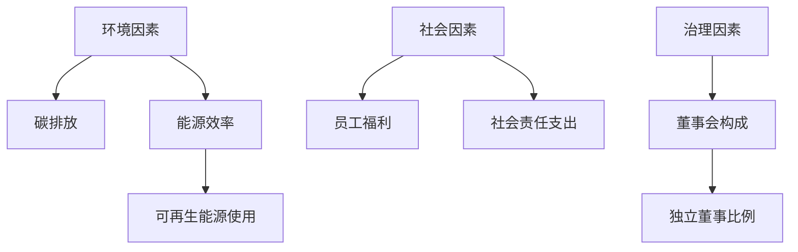
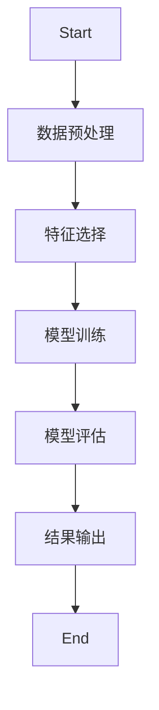

                 


# 价值投资中的AI智能体ESG因素量化分析

> 关键词：人工智能, 价值投资, ESG因素, 量化分析, AI智能体

> 摘要：本文探讨了在价值投资中，如何利用人工智能技术对ESG（环境、社会、治理）因素进行量化分析。文章详细介绍了ESG概念、AI在金融投资中的应用、ESG量化指标体系、基于机器学习的ESG评分算法、系统架构设计、项目实战案例以及AI智能体在ESG分析中的优势。通过结合理论与实践，本文为投资者提供了基于AI的ESG量化分析方法和工具，帮助他们在投资决策中更好地考虑ESG因素。

---

## 第一部分：背景与核心概念

### 第1章：ESG概念与价值投资背景

#### 1.1 ESG的定义与重要性
- **环境（Environmental）**：关注企业的碳排放、能源使用效率、环保政策遵循情况等。
- **社会（Social）**：涉及员工权益、社会责任、社区关系、产品安全等方面。
- **治理（Governance）**：包括公司治理结构、董事会构成、高管薪酬、透明度等。

#### 1.2 价值投资的核心理念
- 长期投资视角，寻找具有持续竞争优势的企业。
- ESG因素对投资价值的影响：企业治理、社会责任、环保表现等影响企业长期价值。

#### 1.3 为什么需要AI量化分析？
- 数据量大：ESG数据来源广泛，结构复杂。
- 模型复杂：需要处理非结构化数据（如新闻、报告）和结构化数据（如财务数据）。
- 高效性需求：AI能够快速处理和分析海量数据，提供实时评分。

---

### 第2章：AI在金融投资中的应用

#### 2.1 AI技术在金融分析中的作用
- 数据处理与特征提取：从非结构化数据中提取关键信息。
- 预测模型构建：基于历史数据预测股票价格、风险等。
- 投资组合优化：利用AI算法优化资产配置。

#### 2.2 ESG量化分析的挑战与机遇
- **挑战**：数据标准化难、多目标优化复杂、模型解释性要求高。
- **机遇**：AI技术能够处理复杂数据，发现传统方法难以捕捉的规律。

---

## 第二部分：ESG因素的量化分析方法

### 第3章：ESG量化指标体系

#### 3.1 ESG指标的分类与特征
- 环境指标：碳排放强度、可再生能源使用比例等。
- 社会指标：员工满意度、社会责任支出等。
- 治理指标：董事会多样性、高管薪酬结构等。

#### 3.2 ESG指标的对比分析
| 指标类别 | 具体指标 | 数据来源 | 难度系数 |
|----------|----------|----------|----------|
| 环境     | 碳排放强度 | 公司财报、环保报告 | 高       |
| 社会     | 员工福利   | 公司年报、社会责任报告 | 中       |
| 治理     | 董事会多样性 | 公司治理结构 | 中       |

#### 3.3 ESG指标的实体关系图


---

### 第4章：基于机器学习的ESG评分算法

#### 4.1 算法概述
- 使用机器学习模型对ESG数据进行特征提取和评分。
- 常见算法：随机森林、支持向量机（SVM）、深度学习模型（如LSTM）。

#### 4.2 算法流程图


#### 4.3 算法实现代码示例
```python
import pandas as pd
from sklearn.ensemble import RandomForestRegressor
from sklearn.metrics import mean_absolute_error

# 数据预处理
df = pd.read_csv('esg_data.csv')
df = df.dropna()

# 特征选择
features = ['carbon_emission', 'employee_welfare', 'board_diversity']
target = 'esg_score'

# 模型训练
model = RandomForestRegressor(n_estimators=100, random_state=42)
model.fit(df[features], df[target])

# 模型评估
predictions = model.predict(df[features])
print(mean_absolute_error(df[target], predictions))
```

#### 4.4 数学模型与公式
- 模型损失函数：$$L = \frac{1}{n}\sum_{i=1}^{n}(y_i - \hat{y}_i)^2$$
- 模型预测公式：$$\hat{y} = \text{模型预测值}$$

---

### 第5章：系统架构与实现

#### 5.1 系统架构设计
```mermaid
graph TD
    User --> API Gateway
    API Gateway --> 数据采集模块
    数据采集模块 --> 数据存储模块
    数据存储模块 --> 特征工程模块
    特征工程模块 --> 模型训练模块
    模型训练模块 --> 结果展示模块
    结果展示模块 --> User
```

#### 5.2 系统功能设计
- 数据采集：从多种数据源获取ESG相关数据。
- 特征工程：提取和处理特征。
- 模型训练：构建和训练机器学习模型。
- 结果展示：可视化ESG评分和分析结果。

---

### 第6章：项目实战与案例分析

#### 6.1 项目背景
- 数据来源：公开ESG报告、公司财报、新闻媒体等。
- 项目目标：构建一个实时ESG评分系统。

#### 6.2 数据预处理与特征提取
```python
import numpy as np
import pandas as pd

# 数据清洗
df = pd.read_csv('esg_data.csv')
df = df.dropna()

# 特征提取
features = df.columns.drop('esg_score')
X = df[features]
y = df['esg_score']
```

#### 6.3 模型训练与评估
```python
from sklearn.model_selection import train_test_split
from sklearn.metrics import classification_report

# 数据分割
X_train, X_test, y_train, y_test = train_test_split(X, y, test_size=0.2, random_state=42)

# 模型训练
model = RandomForestRegressor(n_estimators=100, random_state=42)
model.fit(X_train, y_train)

# 模型评估
y_pred = model.predict(X_test)
print(classification_report(y_test, y_pred))
```

#### 6.4 实际案例分析
- 以某公司为例，展示如何利用AI模型计算其ESG评分，并分析评分结果对企业投资价值的影响。

---

## 第三部分：结论与展望

### 第7章：结论与最佳实践

#### 7.1 结论
- AI技术在ESG量化分析中具有显著优势，能够帮助投资者更准确地评估企业价值。
- 综合考虑ESG因素的投资策略能够在长期带来更好的回报。

#### 7.2 最佳实践
- 数据来源要多样化，确保模型的泛化能力。
- 定期更新模型，适应市场变化。
- 结合多种算法，优化模型性能。

### 第8章：未来展望

- 更智能化的ESG评分系统：结合自然语言处理技术，分析非结构化数据。
- 区块链技术的应用：提高数据透明度和不可篡改性。
- 全球化视角：构建跨国企业的ESG评分体系。

---

## 作者信息

作者：AI天才研究院/AI Genius Institute & 禅与计算机程序设计艺术 /Zen And The Art of Computer Programming

---

以上是关于《价值投资中的AI智能体ESG因素量化分析》的完整目录和文章内容，希望对您有所帮助！

