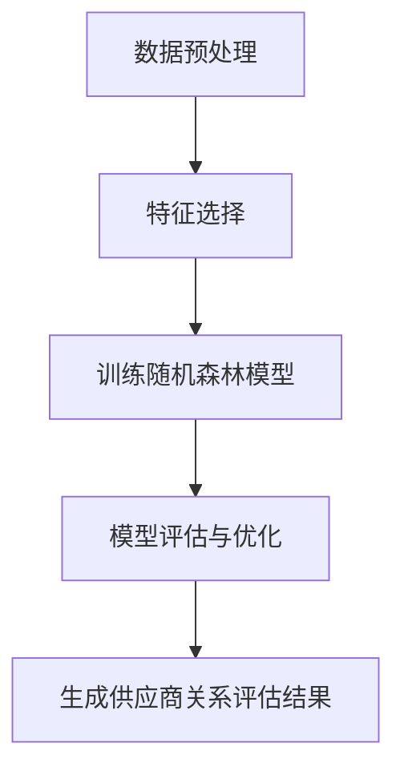
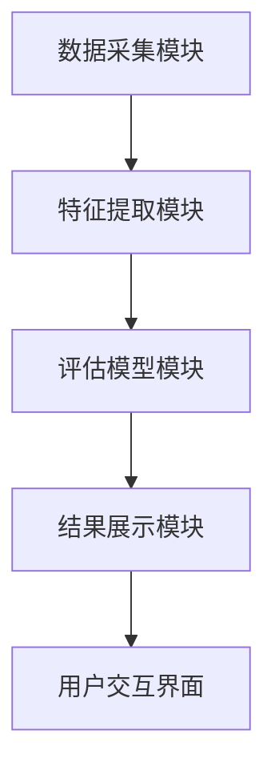
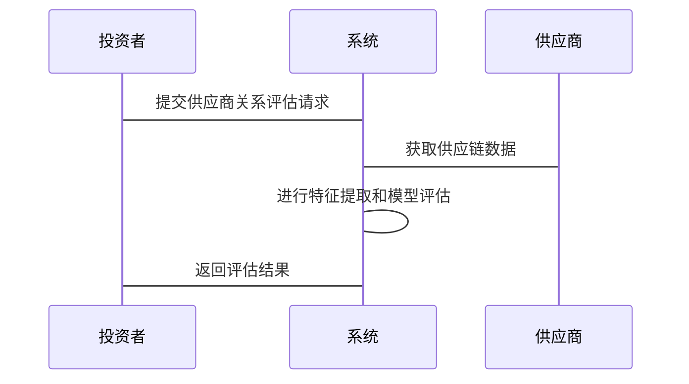

                 


# 价值投资中的AI智能体供应商关系评估系统

---

## 关键词：  
价值投资、人工智能、供应商关系评估、AI智能体、金融分析、系统架构

---

## 摘要：  
本文探讨了如何利用人工智能技术构建供应商关系评估系统，以支持价值投资决策。通过分析AI智能体在金融领域的应用，提出了基于机器学习的供应商关系评估模型，并详细阐述了系统的算法原理、数学模型和架构设计。结合实际案例，展示了如何通过AI技术提升价值投资的效率和准确性。

---

## 第一部分：价值投资与供应商关系评估的背景

### 第1章：价值投资与供应商关系评估的背景

#### 1.1 价值投资的核心概念  
价值投资是一种长期投资策略，强调通过深入分析企业的基本面，寻找被市场低估的投资标的。供应商关系作为企业运营的重要组成部分，其稳定性、合作深度和潜在风险直接影响企业的长期价值。传统供应商关系评估方法依赖人工经验，存在主观性强、效率低、覆盖面有限等问题。

#### 1.2 供应商关系在价值投资中的重要性  
供应商是企业供应链的核心，其质量和稳定性直接影响企业的成本、交付能力和抗风险能力。在价值投资中，供应商关系评估可以帮助投资者识别企业的竞争优势和潜在风险，从而做出更明智的投资决策。

#### 1.3 传统供应商关系评估的局限性  
传统供应商关系评估方法通常基于简单的财务指标和主观判断，难以全面捕捉供应商关系的动态变化。此外，传统方法难以处理大规模数据，且缺乏对供应商关系的量化分析能力。

#### 1.4 AI技术在供应商关系评估中的潜力  
人工智能技术可以通过自然语言处理（NLP）、机器学习和大数据分析，从海量数据中提取供应商关系的关键特征，并构建预测模型，从而实现对供应商关系的量化评估和动态监控。

---

## 第二部分：AI智能体与供应商关系评估系统的核心概念

### 第2章：AI智能体与供应商关系评估系统的核心概念

#### 2.1 AI智能体的基本原理  
AI智能体是一种能够感知环境、自主决策并采取行动的智能系统。在金融领域，AI智能体可以用于数据挖掘、模式识别和决策支持。AI智能体的核心技术包括自然语言处理（NLP）、机器学习、强化学习和知识图谱。

#### 2.2 供应商关系评估系统的构建逻辑  
供应商关系评估系统需要从企业公开数据、供应链数据和市场新闻中提取特征，构建供应商关系的量化模型，并通过实时监控提供动态评估结果。

#### 2.3 核心概念对比分析  
| **传统供应商关系评估** | **AI智能体供应商关系评估** |
|---------------------------|-----------------------------|
| 依赖人工经验判断           | 基于大数据和机器学习模型     |
| 评估范围有限               | 全面覆盖供应链数据           |
| 主观性强                   | 客观量化评估                 |
| 静态评估                   | 动态实时监控                 |

#### 2.4 ER实体关系图架构  
```mermaid
er
    %% ER图：供应商关系评估系统
    矩形，align: center
    actor 投资者
    actor 企业
    actor 供应商
    entity 供应商关系
    entity 供应链数据
    entity 市场数据
    boundary 供应商关系评估系统
    投资者 --> 供应商关系评估系统: 提交评估请求
    企业 --> 供应商关系评估系统: 提供供应链数据
    供应商 --> 供应商关系评估系统: 提供市场数据
    供应商关系评估系统 --> 供应商关系: 生成评估结果
```

---

## 第三部分：算法原理讲解

### 第3章：基于机器学习的供应商关系评估算法

#### 3.1 算法选择与原理  
本文采用随机森林算法进行供应商关系评估。随机森林是一种基于决策树的集成学习算法，具有高准确性和抗过拟合能力，适合处理多分类问题。

#### 3.2 算法流程图  


#### 3.3 核心代码实现  
```python
import pandas as pd
from sklearn.ensemble import RandomForestClassifier
from sklearn.metrics import accuracy_score

# 数据预处理
data = pd.read_csv('suppliers_data.csv')
X = data.drop('label', axis=1)
y = data['label']

# 特征选择
selected_features = ['feature1', 'feature2', 'feature3']
X_selected = X[selected_features]

# 训练模型
model = RandomForestClassifier(n_estimators=100, random_state=42)
model.fit(X_selected, y)

# 模型评估
y_pred = model.predict(X_selected)
print("Accuracy:", accuracy_score(y, y_pred))
```

#### 3.4 数学模型与公式  
随机森林的预测公式为：  
$$ y = \text{sign}\left(\sum_{i=1}^{n} w_i \cdot h(x, i)\right) $$  
其中，$w_i$ 是第 $i$ 棵决策树的权重，$h(x, i)$ 是第 $i$ 棵决策树的预测结果。

---

## 第四部分：系统分析与架构设计方案

### 第4章：供应商关系评估系统的架构设计

#### 4.1 系统功能模块设计  
供应商关系评估系统包括以下功能模块：  
1. 数据采集模块：从企业、供应商和市场数据中提取特征。  
2. 特征提取模块：使用NLP和统计方法提取关键特征。  
3. 评估模型模块：基于机器学习算法构建供应商关系评估模型。  
4. 结果展示模块：生成可视化报告和预警信息。  

#### 4.2 系统架构图  


#### 4.3 系统交互流程图  


---

## 第五部分：项目实战

### 第5章：基于AI智能体的供应商关系评估系统实现

#### 5.1 环境搭建  
- 安装Python和相关库：`pandas`, `scikit-learn`, `numpy`, `matplotlib`。  
- 数据集获取：从企业公开数据、供应链数据和市场新闻中获取供应商关系相关数据。

#### 5.2 核心代码实现  
```python
import pandas as pd
from sklearn.ensemble import RandomForestClassifier
from sklearn.metrics import accuracy_score

# 数据预处理
data = pd.read_csv('suppliers_data.csv')
X = data.drop('label', axis=1)
y = data['label']

# 特征选择
selected_features = ['feature1', 'feature2', 'feature3']
X_selected = X[selected_features]

# 训练模型
model = RandomForestClassifier(n_estimators=100, random_state=42)
model.fit(X_selected, y)

# 模型评估
y_pred = model.predict(X_selected)
print("Accuracy:", accuracy_score(y, y_pred))
```

#### 5.3 实际案例分析  
以某制造业企业为例，通过模型预测其供应商关系的稳定性，评估结果为高风险预警，提示投资者需关注该企业的供应链风险。

---

## 第六部分：总结与展望

### 第6章：总结与展望

#### 6.1 小结  
本文提出了基于AI智能体的供应商关系评估系统，结合机器学习算法和大数据分析，为价值投资提供了新的工具和方法。

#### 6.2 注意事项  
- 数据质量对模型性能影响重大，需确保数据的准确性和完整性。  
- 模型的可解释性需进一步优化，以便投资者理解评估结果的依据。  

#### 6.3 拓展阅读  
- 建议阅读《机器学习实战》和《金融数据分析与机器学习》等书籍，深入了解AI在金融领域的应用。

---

## 作者：  
AI天才研究院（AI Genius Institute）  
禅与计算机程序设计艺术（Zen And The Art of Computer Programming）

