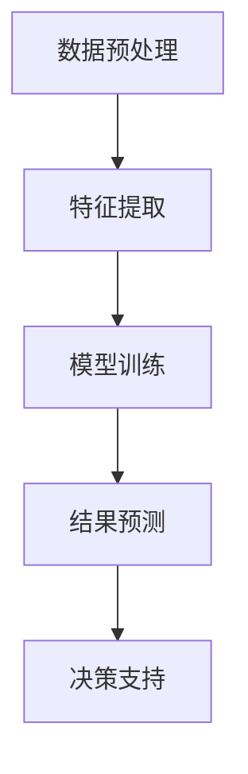
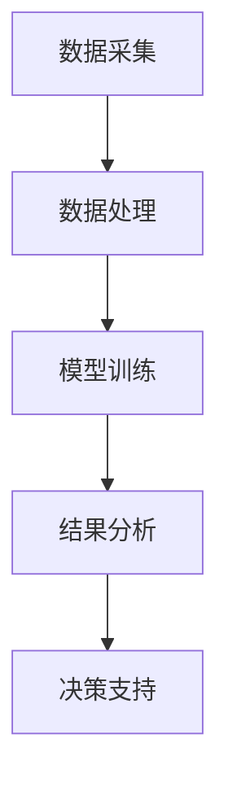
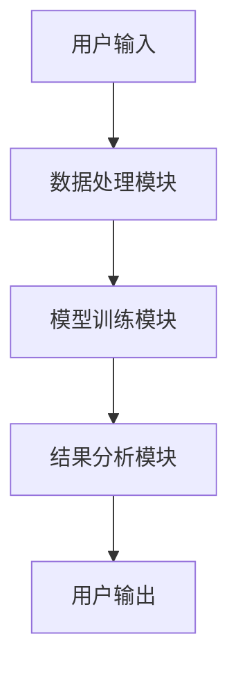

                 


# 价值投资中的AI智能体创新能力评估系统

> 关键词：价值投资，AI智能体，创新能力评估，系统架构，项目实战

> 摘要：本文探讨了在价值投资领域中，如何利用AI智能体的能力评估系统来提升投资决策的效率和准确性。通过分析系统的背景、核心概念、算法原理、系统架构、项目实战等方面，深入挖掘AI技术在金融投资中的潜力和应用。

---

# 第1章 价值投资与AI智能体概述

## 1.1 价值投资的基本概念

### 1.1.1 价值投资的定义与核心思想
价值投资是一种以基本面分析为基础的投资策略，强调以低于市场价的折扣价买入具有内在价值的资产。其核心思想是寻找被市场低估的优质资产，长期持有，等待其价值回归。

### 1.1.2 价值投资的核心要素
- **内在价值**：资产的真实价值，不依赖于市场情绪。
- **安全边际**：买入价格与内在价值的差距，提供安全空间。
- **长期视角**：关注企业的长期盈利能力，而非短期波动。

### 1.1.3 价值投资的哲学基础
价值投资的哲学基础来源于格雷厄姆和多德的投资理论，强调安全边际和理性分析，避免情绪化决策。

## 1.2 AI智能体的基本原理

### 1.2.1 AI智能体的定义与分类
AI智能体是一种能够感知环境、做出决策并执行操作的智能系统。根据智能水平，AI智能体可以分为：
1. **反应式智能体**：基于当前输入做出反应。
2. **认知式智能体**：具备推理、规划和学习能力。
3. **情感式智能体**：能够理解和模拟人类情感。

### 1.2.2 AI智能体的核心技术
- **机器学习**：通过数据训练模型，实现模式识别和预测。
- **自然语言处理**：理解文本信息，提取关键词和情感。
- **强化学习**：通过奖励机制优化决策策略。

### 1.2.3 AI智能体的应用领域
- 金融投资：股票筛选、风险评估。
- 医疗健康：疾病诊断、药物研发。
- 智能客服：自然语言交互、问题解答。

## 1.3 价值投资与AI智能体的结合

### 1.3.1 价值投资中的数据特征
- **财务数据**：收入、利润、负债等。
- **市场数据**：股价、成交量、市场情绪。
- **文本数据**：公司公告、新闻报道。

### 1.3.2 AI智能体在投资决策中的作用
- 数据处理与分析：快速处理大量数据，提取关键信息。
- 模型构建与预测：建立预测模型，评估资产价值。
- 决策支持：提供投资建议，优化投资组合。

### 1.3.3 价值投资中的AI智能体创新方向
- 数据驱动的内在价值评估。
- 情感分析辅助投资决策。
- 自适应学习优化投资策略。

---

# 第2章 创新能力评估系统的核心概念与背景

## 2.1 问题背景与问题描述

### 2.1.1 当前价值投资中的主要挑战
- 数据量大：难以快速处理和分析。
- 市场波动：需要实时动态调整策略。
- 信息不对称：如何获取高质量数据。

### 2.1.2 AI智能体在投资决策中的创新潜力
- 提高数据处理效率。
- 实现实时动态分析。
- 利用机器学习优化投资策略。

### 2.1.3 创新能力评估系统的必要性
- 提供科学的投资决策依据。
- 降低投资风险。
- 提高投资效率。

## 2.2 核心概念与核心要素

### 2.2.1 创新能力评估系统的定义
创新能力评估系统是一种基于AI技术，对价值投资中的创新潜力进行量化评估的系统。

### 2.2.2 系统的核心要素与属性
- **数据源**：多源异构数据的获取与整合。
- **模型构建**：基于机器学习的预测模型。
- **决策支持**：提供可操作的投资建议。

### 2.2.3 系统的边界与外延
- 系统边界：仅限于价值投资领域。
- 系统外延：可扩展到其他投资领域。

## 2.3 系统的核心要素组成

### 2.3.1 数据源与数据处理
- 数据预处理：清洗、归一化。
- 特征提取：提取关键特征，如财务指标、市场情绪。

### 2.3.2 模型构建与优化
- 选择合适的机器学习算法。
- 模型训练与调优。

### 2.3.3 结果分析与决策支持
- 模型结果的解读。
- 投资建议的生成。

---

# 第3章 创新能力评估系统的原理与算法

## 3.1 系统原理与核心算法

### 3.1.1 系统的工作原理
系统通过数据预处理、特征提取、模型训练和结果预测，实现对投资标的创新能力评估。

### 3.1.2 算法选择与优化
- 算法选择：随机森林、支持向量机（SVM）。
- 算法优化：超参数调优。

### 3.1.3 算法的数学模型
模型选择随机森林作为分类器，其数学表达如下：
$$ y = \sum_{i=1}^{n} w_i x_i $$

## 3.2 算法原理讲解

### 3.2.1 算法流程图


### 3.2.2 算法实现代码
```python
def preprocess_data(data):
    # 数据预处理代码
    return processed_data

def extract_features(data):
    # 特征提取代码
    return features

def train_model(features, labels):
    # 模型训练代码
    return model

def predict(model, new_features):
    # 结果预测代码
    return predictions
```

## 3.3 数学模型与公式

### 3.3.1 基本公式
$$ y = f(x) $$
其中，$x$ 是输入特征，$y$ 是输出结果。

### 3.3.2 优化目标
$$ \min \sum (y_{\text{pred} \)

---

# 第4章 系统分析与架构设计方案

## 4.1 系统分析

### 4.1.1 问题场景介绍
系统需要处理大量金融数据，提供实时分析和投资建议。

### 4.1.2 项目介绍
本项目旨在开发一个基于AI的创新能力评估系统，辅助价值投资者做出决策。

## 4.2 系统架构设计

### 4.2.1 系统功能设计
- 数据采集模块：收集多源数据。
- 数据处理模块：清洗和预处理。
- 模型训练模块：构建预测模型。
- 结果分析模块：生成投资建议。

### 4.2.2 系统架构图


### 4.2.3 系统交互设计


---

# 第5章 项目实战

## 5.1 环境安装
安装Python、Pandas、Scikit-learn等库。

## 5.2 系统核心实现源代码

### 5.2.1 数据预处理代码
```python
import pandas as pd

def preprocess_data(data):
    # 删除缺失值
    data = data.dropna()
    # 标准化处理
    from sklearn.preprocessing import StandardScaler
    scaler = StandardScaler()
    data_scaled = scaler.fit_transform(data)
    return data_scaled
```

### 5.2.2 模型训练代码
```python
from sklearn.ensemble import RandomForestClassifier
from sklearn.metrics import accuracy_score

def train_model(features, labels):
    model = RandomForestClassifier()
    model.fit(features, labels)
    return model
```

## 5.3 实际案例分析
以某公司股票为例，展示数据处理、模型训练和结果预测的全过程。

---

# 第6章 最佳实践与总结

## 6.1 最佳实践
- 定期更新模型。
- 结合人工分析。
- 注意数据质量和来源。

## 6.2 小结
本文详细介绍了价值投资中的AI智能体创新能力评估系统，从理论到实践，展示了如何利用AI技术提升投资决策的效率和准确性。

## 6.3 注意事项
- 数据隐私问题。
- 模型的可解释性。
- 系统的实时性要求。

## 6.4 拓展阅读
推荐相关书籍和论文，供读者深入学习。

---

# 作者

作者：AI天才研究院 / AI Genius Institute & 禅与计算机程序设计艺术 / Zen And The Art of Computer Programming

---

希望这篇文章能满足您的需求！如果需要进一步调整或补充，请随时告诉我。

