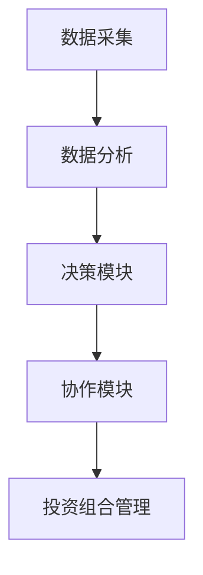

                 


# 价值投资中的AI智能体协作：增强格雷厄姆的安全边际理论

## 关键词：价值投资、AI智能体协作、安全边际理论、机器学习、投资组合管理

## 摘要：本文探讨了如何利用AI智能体协作技术来增强格雷厄姆的安全边际理论在价值投资中的应用。通过分析AI智能体协作的优势，结合机器学习算法和系统架构设计，提出了一种创新的投资策略，旨在提高投资决策的准确性和效率。

---

# 第一部分: 价值投资与AI智能体协作的背景介绍

## 第1章: 价值投资概述

### 1.1 价值投资的基本概念

#### 1.1.1 价值投资的定义
价值投资是一种投资策略，主张通过分析企业的基本面，购买其市场价格低于其内在价值的股票，长期持有，等待其价值回归。

#### 1.1.2 价值投资的核心原则
- **内在价值**：企业的真正价值，不完全由市场情绪决定。
- **安全边际**：购买价格低于内在价值，以降低风险。
- **长期视角**：关注企业的长期盈利能力，而非短期波动。

#### 1.1.3 价值投资的历史发展
价值投资由本杰明·格雷厄姆提出，经过时间验证，成为投资领域的重要理论。

## 第2章: 安全边际理论

### 2.1 安全边际的定义

#### 2.1.1 安全边际的核心概念
安全边际是投资价格与内在价值之间的差距，确保即使估值有误，也能避免重大损失。

#### 2.1.2 安全边际的计算方法
计算公式：安全边际 = 内在价值 - 市场价格。

#### 2.1.3 安全边际的应用场景
在市场波动、经济不确定性时，安全边际尤为重要。

## 第3章: AI智能体协作的基本概念

### 3.1 AI智能体的定义

#### 3.1.1 AI智能体的定义
AI智能体是能够感知环境、自主决策并采取行动的智能系统。

#### 3.1.2 AI智能体的核心特征
- **自主性**：独立决策。
- **反应性**：实时响应环境变化。
- **协作性**：与其他智能体协同工作。

#### 3.1.3 AI智能体与传统AI的区别
AI智能体具备自主性和反应性，而传统AI主要基于规则或数据进行任务处理。

### 3.2 AI智能体协作的定义

#### 3.2.1 AI智能体协作的定义
多个AI智能体协同工作，利用各自的优势完成复杂任务。

#### 3.2.2 AI智能体协作的核心机制
- **通信与协调**：智能体之间通过通信进行协调。
- **任务分配**：根据智能体的能力分配任务。
- **知识共享**：智能体共享信息，提高整体决策能力。

#### 3.2.3 AI智能体协作的应用场景
在投资领域，AI智能体协作可以用于数据分析、市场预测和投资决策。

---

# 第二部分: AI智能体协作与价值投资的结合

## 第4章: AI智能体协作在价值投资中的应用

### 4.1 AI智能体协作在价值投资中的优势

#### 4.1.1 提高投资决策的效率
AI智能体可以快速处理大量数据，提高决策速度。

#### 4.1.2 增强投资决策的准确性
通过协作，AI智能体可以提供更全面的分析，降低人为错误。

#### 4.1.3 提供更全面的市场分析
AI智能体可以从不同角度分析市场，提供多维度的支持。

### 4.2 AI智能体协作对安全边际理论的增强

#### 4.2.1 提高内在价值评估的准确性
通过机器学习模型，AI智能体可以更准确地评估企业的内在价值。

#### 4.2.2 实时监控市场变化
AI智能体实时跟踪市场数据，及时调整安全边际计算。

#### 4.2.3 优化投资组合管理
通过协作，AI智能体可以帮助投资者优化投资组合，降低风险。

---

## 第5章: AI智能体协作的具体实现

### 5.1 系统架构设计

#### 5.1.1 系统功能模块
- **数据采集模块**：收集企业财务数据和市场数据。
- **数据分析模块**：利用机器学习算法进行数据分析。
- **决策模块**：基于分析结果，制定投资策略。
- **协作模块**：协调各智能体的工作，确保高效协作。

#### 5.1.2 系统架构图


### 5.2 算法实现

#### 5.2.1 机器学习模型
使用回归分析预测股票价格，评估企业的内在价值。

#### 5.2.2 自然语言处理
分析新闻和社交媒体，评估市场情绪，影响投资决策。

#### 5.2.3 实时数据处理
通过流处理技术，实时更新市场数据，确保决策的及时性。

---

## 第6章: 项目实战

### 6.1 环境配置

#### 6.1.1 安装必要的库
```bash
pip install numpy pandas scikit-learn
```

### 6.2 核心代码实现

#### 6.2.1 数据分析模块
```python
import numpy as np
import pandas as pd
from sklearn.linear_model import LinearRegression

# 加载数据
data = pd.read_csv('stock_data.csv')

# 训练模型
model = LinearRegression()
model.fit(data[['市盈率', '市净率']], data['股价'])

# 预测股价
predicted_prices = model.predict(data[['市盈率', '市净率']])
```

#### 6.2.2 投资组合管理
```python
import numpy as np
from portfolio_optimization import optimize_portfolio

# 优化投资组合
portfolios = optimize_portfolio(data)
```

### 6.3 功能解读

#### 6.3.1 数据采集模块
从多个数据源获取实时股票数据，清洗数据，去除缺失值和异常值。

#### 6.3.2 数据分析模块
使用机器学习模型分析数据，评估企业的内在价值和市场风险。

#### 6.3.3 投资组合管理
根据分析结果，优化投资组合，最大化收益，最小化风险。

---

## 第7章: 总结与展望

### 7.1 总结
AI智能体协作在增强安全边际理论中的应用，提高了投资决策的准确性和效率，为投资者提供了有力的工具。

### 7.2 展望
未来，随着AI技术的进步，AI智能体协作在投资领域将发挥更大的作用，推动价值投资进入新的发展阶段。

---

# 作者：AI天才研究院/AI Genius Institute & 禅与计算机程序设计艺术 /Zen And The Art of Computer Programming

