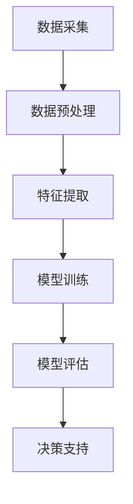
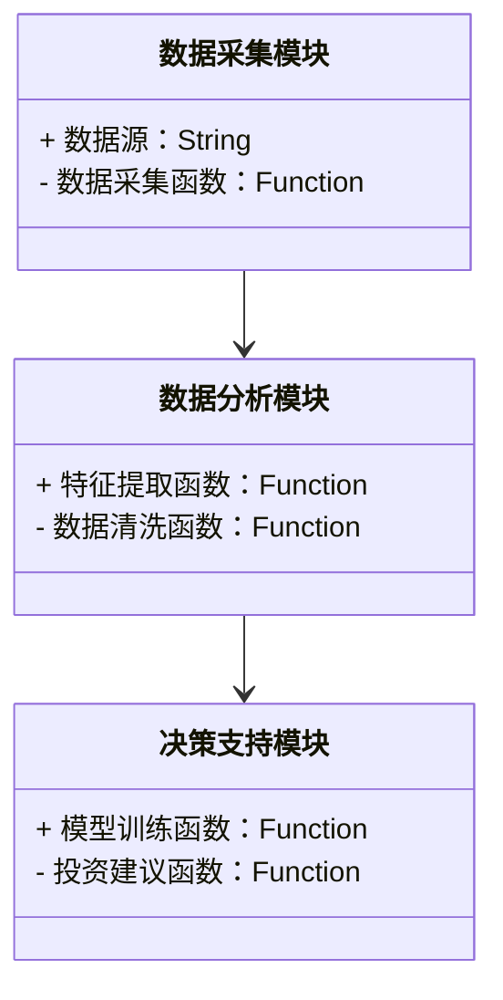

                 


# 价值投资中的AI智能体品牌权益分析系统

> 关键词：价值投资，AI智能体，品牌权益分析，系统架构，算法原理

> 摘要：本文详细探讨了如何利用AI智能体技术进行品牌权益分析，为价值投资者提供科学决策支持。文章从理论基础、算法原理、系统架构到项目实战，全面解析了该系统的构建与应用，旨在为投资者和相关技术人士提供实用参考。

---

# 第1章：价值投资与AI智能体的结合

## 1.1 价值投资的背景与核心理念

### 1.1.1 价值投资的定义与核心思想

价值投资是一种投资策略，核心在于寻找市场价格低于其内在价值的资产进行投资。其核心理念包括：

1. **安全边际**：买入价格低于内在价值。
2. **长期视角**：关注企业的长期盈利能力。
3. **基本面分析**：通过对企业财务状况、行业地位等多维度分析来评估其价值。

### 1.1.2 传统价值投资的局限性

传统价值投资依赖于人工分析，存在以下问题：

1. **主观性**：分析结果受分析师经验与主观判断影响。
2. **效率低下**：面对海量数据，人工分析耗时耗力。
3. **一致性不足**：不同分析师对同一企业的估值可能差异较大。

### 1.1.3 AI技术在价值投资中的应用潜力

AI技术可以通过以下方式提升价值投资效率：

1. **数据处理能力**：AI能够快速处理海量数据，提取关键信息。
2. **模式识别**：通过机器学习算法发现数据中的潜在规律。
3. **量化分析**：将品牌权益量化，提供客观的估值依据。

---

## 1.2 品牌权益分析的定义与重要性

### 1.2.1 品牌权益的构成要素

品牌权益由以下要素构成：

1. **品牌认知度**：消费者对品牌的记忆和识别能力。
2. **品牌忠诚度**：消费者对品牌的偏好和重复购买意愿。
3. **品牌美誉度**：消费者对品牌的正面评价和信任程度。

### 1.2.2 品牌权益分析在投资决策中的作用

品牌权益分析能够帮助投资者：

1. **评估企业长期价值**：通过品牌权益量化企业市场地位。
2. **识别投资机会**：发现被低估的品牌资产。
3. **优化投资组合**：根据品牌权益动态调整投资策略。

### 1.2.3 品牌权益分析的挑战与解决方案

品牌权益分析的挑战包括：

1. **数据多样性**：品牌相关数据来源广泛且复杂。
2. **数据隐私**：品牌数据可能涉及企业机密。
3. **模型准确性**：如何确保AI模型的预测准确性。

---

## 1.3 AI智能体在品牌权益分析中的应用前景

### 1.3.1 AI智能体的基本概念

AI智能体是一种具有感知环境、做出决策并采取行动的智能系统。其核心能力包括：

1. **数据感知**：通过多种数据源获取信息。
2. **智能决策**：基于数据分析做出最优选择。
3. **自主学习**：通过反馈不断优化自身模型。

### 1.3.2 AI智能体在品牌权益分析中的优势

AI智能体的优势体现在：

1. **高效性**：快速处理海量数据。
2. **客观性**：基于数据的客观分析。
3. **可扩展性**：能够适应不同规模的分析任务。

### 1.3.3 未来发展趋势与潜力

未来，AI智能体在品牌权益分析中的应用将更加广泛，可能的发展方向包括：

1. **实时分析**：实时监控品牌动态，提供即时反馈。
2. **多模态分析**：结合文本、图像等多种数据源进行分析。
3. **个性化服务**：为不同投资者提供定制化分析服务。

---

# 第2章：品牌权益分析的核心概念与框架

## 2.1 品牌权益分析的理论基础

### 2.1.1 品牌价值的多维度评估

品牌价值可以从以下几个维度进行评估：

1. **财务表现**：企业盈利能力、市场占有率等。
2. **市场反馈**：消费者满意度、品牌忠诚度等。
3. **行业地位**：品牌在行业中的排名和影响力。

### 2.1.2 品牌影响力的量化方法

品牌影响力的量化方法包括：

1. **品牌指数模型**：通过量化指标评估品牌影响力。
2. **情感分析**：通过文本挖掘技术分析消费者对品牌的看法。

### 2.1.3 品牌权益分析的边界与外延

品牌权益分析的边界包括：

1. **数据范围**：分析的数据来源和范围。
2. **时间范围**：分析的时间跨度。
3. **目标范围**：分析的目标品牌或行业。

---

## 2.2 品牌权益分析的核心要素

### 2.2.1 品牌认知度

品牌认知度是指消费者对品牌的记忆和识别能力。其计算公式为：

$$
\text{品牌认知度} = \frac{\text{识别出品牌的消费者数量}}{\text{目标市场总人数}} \times 100\%
$$

### 2.2.2 品牌忠诚度

品牌忠诚度反映了消费者对品牌的偏好和重复购买意愿。其计算公式为：

$$
\text{品牌忠诚度} = \frac{\text{重复购买某品牌产品的消费者数量}}{\text{目标市场总人数}} \times 100\%
$$

### 2.2.3 品牌美誉度

品牌美誉度衡量了消费者对品牌的正面评价和信任程度。其计算公式为：

$$
\text{品牌美誉度} = \frac{\text{对品牌有正面评价的消费者数量}}{\text{目标市场总人数}} \times 100\%
$$

---

## 2.3 品牌权益分析框架的构建

### 2.3.1 框架设计的原则

1. **数据驱动**：基于实际数据进行分析。
2. **可操作性**：框架应具有实际操作性。
3. **可扩展性**：框架应能够适应不同品牌和行业。

### 2.3.2 框架的组成部分

1. **数据采集模块**：负责收集品牌相关数据。
2. **数据分析模块**：对数据进行清洗、处理和分析。
3. **决策支持模块**：根据分析结果提供投资建议。

### 2.3.3 框架的适用场景与限制

1. **适用场景**：适用于品牌众多、数据丰富的行业。
2. **限制**：依赖于高质量的数据输入，对数据质量和完整性要求较高。

---

# 第3章：AI智能体品牌权益分析系统的算法原理

## 3.1 数据采集与预处理

### 3.1.1 数据源的选择与获取

数据源包括：

1. **公开数据**：如企业财报、新闻报道。
2. **社交媒体数据**：如微博、Twitter上的用户评论。
3. **行业报告**：如市场调研报告。

### 3.1.2 数据清洗与特征提取

数据清洗步骤包括：

1. **去除重复数据**：删除重复的记录。
2. **处理缺失值**：对缺失值进行插值或删除。
3. **异常值处理**：识别并处理异常值。

特征提取可以通过以下方法实现：

1. **文本特征提取**：使用TF-IDF或Word2Vec提取文本特征。
2. **数值特征提取**：对数值数据进行标准化或归一化处理。

---

## 3.2 品牌权益分析模型的构建

### 3.2.1 神经网络模型的结构设计

神经网络模型可以采用以下结构：

1. **输入层**：接收品牌相关数据。
2. **隐藏层**：进行特征提取和非线性变换。
3. **输出层**：输出品牌权益的评估结果。

### 3.2.2 模型训练与优化

模型训练采用以下步骤：

1. **数据预处理**：清洗和归一化数据。
2. **模型初始化**：初始化神经网络的权重和偏置。
3. **前向传播**：计算模型的输出。
4. **反向传播**：计算损失函数的梯度并更新权重。
5. **模型优化**：采用随机梯度下降等优化算法。

### 3.2.3 模型评估与调优

模型评估采用以下指标：

1. **准确率**：模型预测正确的比例。
2. **召回率**：模型预测出的正例中实际为正例的比例。
3. **F1分数**：综合准确率和召回率的调和平均数。

---

## 3.3 基于AI智能体的决策支持算法

### 3.3.1 算法流程图

以下是基于AI智能体的决策支持算法流程图：



### 3.3.2 算法实现的数学模型

以下是模型训练的数学模型：

$$
\text{损失函数} = \frac{1}{n}\sum_{i=1}^{n} (y_i - \hat{y_i})^2
$$

其中，$y_i$ 是真实值，$\hat{y_i}$ 是预测值，$n$ 是样本数量。

### 3.3.3 算法的优化与改进

算法优化可以通过以下方式实现：

1. **参数调整**：调整学习率、批量大小等超参数。
2. **模型结构优化**：尝试不同的网络结构，如更深的网络或更复杂的模型。
3. **数据增强**：通过数据增强技术增加训练数据的多样性。

---

# 第4章：系统架构与设计方案

## 4.1 系统功能模块设计

### 4.1.1 数据采集模块

数据采集模块负责从多种数据源采集品牌相关数据，包括：

1. **网络爬虫**：从社交媒体、新闻网站等平台抓取数据。
2. **API接口**：通过API获取公开数据。

### 4.1.2 数据分析模块

数据分析模块负责对采集到的数据进行清洗、处理和分析，包括：

1. **数据清洗**：去除重复数据和异常值。
2. **特征提取**：提取有助于模型训练的特征。
3. **模型训练**：使用机器学习算法训练品牌权益分析模型。

### 4.1.3 决策支持模块

决策支持模块根据模型输出的结果为投资者提供决策支持，包括：

1. **品牌价值评估**：输出品牌价值的量化评估结果。
2. **投资建议**：根据品牌价值和市场趋势提供投资建议。

---

## 4.2 系统架构设计

### 4.2.1 分层架构设计

系统采用分层架构设计，包括：

1. **数据层**：负责数据的存储和管理。
2. **业务逻辑层**：负责业务逻辑的实现。
3. **表现层**：负责用户界面的展示。

### 4.2.2 模块间交互关系

以下是模块间交互关系的类图：



### 4.2.3 系统的可扩展性设计

系统的可扩展性设计包括：

1. **模块化设计**：各个模块相对独立，便于后续扩展。
2. **接口标准化**：模块间交互通过标准化接口进行，便于新增功能。

---

## 4.3 系统接口设计

### 4.3.1 数据接口规范

数据接口规范包括：

1. **输入格式**：数据以JSON格式输入。
2. **输出格式**：结果以JSON格式输出。
3. **接口调用**：通过RESTful API进行接口调用。

### 4.3.2 系统交互流程

以下是系统交互流程的序列图：

```mermaid
sequenceDiagram
    用户 --> 数据采集模块：请求数据采集
    数据采集模块 --> 数据预处理模块：发送原始数据
    数据预处理模块 --> 数据分析模块：发送处理后的数据
    数据分析模块 --> 决策支持模块：发送分析结果
    决策支持模块 --> 用户：返回投资建议
```

---

# 第5章：项目实战

## 5.1 环境安装与配置

### 5.1.1 安装Python环境

使用Anaconda安装Python 3.8及以上版本。

### 5.1.2 安装依赖库

安装以下依赖库：

1. **数据处理库**：pandas、numpy。
2. **机器学习库**：scikit-learn、tensorflow。
3. **可视化库**：matplotlib、seaborn。

---

## 5.2 核心代码实现

### 5.2.1 数据采集代码

以下是数据采集代码示例：

```python
import requests
from bs4 import BeautifulSoup

def scrape_data(url):
    response = requests.get(url)
    soup = BeautifulSoup(response.text, 'html.parser')
    data = []
    for item in soup.find_all('div', class_='brand-item'):
        name = item.find('h3').text
        value = item.find('p').text
        data.append({'name': name, 'value': value})
    return data

# 示例调用
url = 'https://example.com/brands'
data = scrape_data(url)
print(data)
```

### 5.2.2 数据分析代码

以下是数据分析代码示例：

```python
import pandas as pd
from sklearn.model

