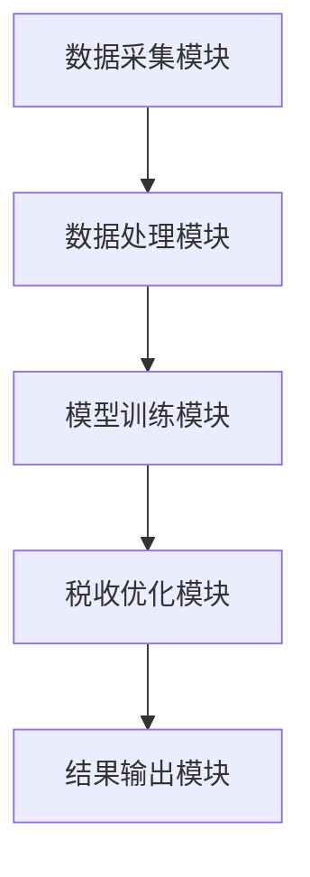
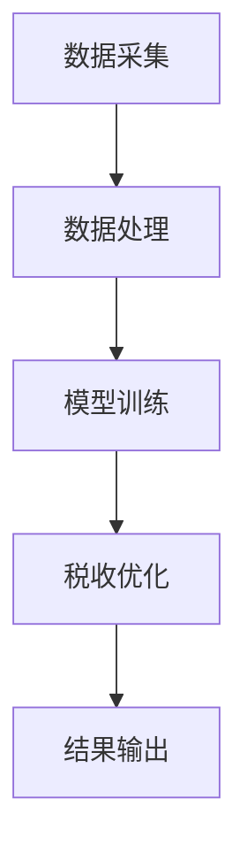

                 


# 价值投资中的AI智能体税收优化系统

---

## 关键词：
价值投资，AI智能体，税收优化，算法原理，系统架构，案例分析

---

## 摘要：
本文详细探讨了在价值投资中，如何利用AI智能体实现税收优化系统的构建与应用。文章从价值投资的基本概念和AI智能体的定义出发，分析了税收优化系统的核心概念与实现原理。通过具体的算法和系统架构设计，展示了如何利用数学模型和机器学习算法优化税务策略，提升投资收益。最后，通过实际案例分析，验证了该系统的有效性和应用价值。

---

# 第1章: 价值投资与AI智能体的结合

## 1.1 价值投资的基本概念

### 1.1.1 价值投资的定义与核心理念
价值投资是一种长期投资策略，旨在通过购买价格低于其内在价值的资产，以实现长期稳定的收益。其核心理念包括：
- **内在价值**：资产的真实价值，基于其未来现金流的折现值。
- **安全边际**：购买价格与内在价值之间的差距，提供了风险缓冲。
- **长期视角**：关注企业的基本面，而非短期市场波动。

### 1.1.2 价值投资在现代金融中的地位
价值投资自20世纪初提出以来，一直是金融投资的重要策略之一。随着市场的复杂化和数据量的爆炸式增长，传统的人工分析逐渐被智能化的AI分析所取代，价值投资也在不断吸收新技术以适应变化。

### 1.1.3 价值投资与传统投资策略的对比
| 对比维度       | 价值投资                   | 主流投资策略               |
|----------------|---------------------------|---------------------------|
| 理论基础         | 格雷厄姆的价值评估模型     | 技术分析、动量策略         |
| 分析方法         | 基于基本面分析             | 基于价格和交易量分析       |
| 时间框架         | 长期持有                   | 短期交易                   |
| 风险控制         | 强调安全边际               | 依赖风险管理工具           |

---

## 1.2 AI智能体的基本概念

### 1.2.1 AI智能体的定义与特点
AI智能体是指具有感知环境、做出决策并执行操作的智能系统。其特点包括：
- **自主性**：能够在没有外部干预的情况下运行。
- **反应性**：能够实时感知环境并做出响应。
- **学习能力**：通过数据和经验不断优化自身的决策模型。

### 1.2.2 AI智能体在金融领域的应用
AI智能体在金融领域的应用广泛，包括：
- **股票预测**：通过历史数据和市场信息预测股票价格走势。
- **风险控制**：识别和评估潜在的市场风险。
- **投资组合优化**：根据市场变化调整投资组合，以最大化收益并最小化风险。

### 1.2.3 价值投资与AI智能体的结合背景
随着大数据和人工智能技术的发展，价值投资的分析效率和精确度得到了显著提升。AI智能体能够快速处理海量数据，发现传统方法难以察觉的投资机会，从而为价值投资提供了新的工具和方法。

---

# 第2章: 税收优化系统的核心概念

## 2.1 税收优化的基本原理

### 2.1.1 税收优化的定义与目标
税收优化是指通过合法的税务规划，降低税负，最大化投资收益的过程。其目标包括：
- **合法合规**：在遵守税法的前提下进行优化。
- **降低税负**：通过合理分配收入和支出，减少应纳税额。
- **提升收益**：将节省的税金用于再投资，实现收益的进一步增长。

### 2.1.2 税收优化在价值投资中的作用
税收优化是价值投资中不可忽视的一部分。通过优化税务策略，投资者可以降低整体税负，提升投资回报率。例如，在股票买卖中，合理安排买卖时机和资产配置，可以有效降低资本利得税和所得税。

### 2.1.3 税收优化的法律与合规性
税收优化必须在法律允许的范围内进行，避免偷税漏税等违法行为。这需要投资者深入了解相关税法，并结合实际情况制定合理的税务规划。

---

## 2.2 税收优化系统的核心要素

### 2.2.1 税收优化的数学模型
税收优化的数学模型是系统的核心，它将各种因素转化为数学表达式，以便计算机处理。例如，资本利得税优化模型可以表示为：

$$
\text{税后收益} = \text{收益} \times (1 - \text{税率})
$$

### 2.2.2 税收优化的算法原理
税收优化算法的目标是找到最优的税收策略。常用的算法包括：
- **线性规划**：适用于目标函数和约束条件均为线性的情况。
- **强化学习**：通过不断试错，找到最优的税收策略。

### 2.2.3 税收优化系统的输入与输出
- **输入**：市场数据、历史交易记录、税务政策等。
- **输出**：最优的税务规划方案、税后收益预测等。

---

## 2.3 税收优化策略对比分析

| 优化策略       | 优点                             | 缺点                               |
|----------------|----------------------------------|-----------------------------------|
| 时间法         | 利用短期资本利得税低的特点       | 适用范围有限                       |
| 资产配置法       | 通过分散投资降低税负             | 需要考虑多种资产的综合影响         |
| 价格法         | 利用市场波动优化税务              | 风险较高，操作难度大               |

---

# 第3章: 价值投资中的AI智能体税收优化系统架构

## 3.1 系统架构设计

### 3.1.1 系统整体架构图


### 3.1.2 系统功能模块划分
- **数据采集模块**：收集市场数据、历史交易记录等。
- **数据处理模块**：对数据进行清洗、转换和预处理。
- **模型训练模块**：利用机器学习算法训练优化模型。
- **税收优化模块**：根据模型输出优化策略。
- **结果输出模块**：生成优化报告和执行指令。

---

## 3.2 系统功能设计

### 3.2.1 数据采集模块
数据采集模块负责收集与价值投资相关的数据，包括：
- 股票价格、成交量等市场数据。
- 历史交易记录和税务政策变化。

### 3.2.2 数据处理模块
数据处理模块对采集到的数据进行预处理，包括：
- 数据清洗：去除无效数据。
- 数据转换：将数据转换为适合模型训练的形式。

### 3.2.3 模型训练模块
模型训练模块利用机器学习算法训练税收优化模型。例如，使用线性回归模型预测税后收益：

$$
y = \beta_0 + \beta_1 x_1 + \beta_2 x_2 + \epsilon
$$

其中，$y$为税后收益，$x_1$和$x_2$为相关变量，$\epsilon$为误差项。

### 3.2.4 税收优化模块
税收优化模块根据训练好的模型生成优化策略。例如，通过强化学习算法选择最优的买卖时机。

### 3.2.5 结果输出模块
结果输出模块将优化结果输出为报告或执行指令。例如，生成买入某只股票的指令。

---

## 3.3 系统架构图


---

# 第4章: 税收优化系统的实现与实战

## 4.1 系统环境搭建

### 4.1.1 开发环境安装
- **Python**：安装Python 3.8及以上版本。
- **机器学习库**：安装TensorFlow、Scikit-learn等。
- **数据处理工具**：安装Pandas、NumPy等。

### 4.1.2 数据集准备
- 数据来源：可以从金融数据API获取股票价格、交易数据等。
- 数据格式：建议使用CSV格式存储。

### 4.1.3 工具链配置
- **IDE**：推荐使用PyCharm或VS Code。
- **版本控制**：使用Git进行代码管理。

---

## 4.2 系统核心实现

### 4.2.1 数据采集与预处理
```python
import pandas as pd
import numpy as np

# 数据采集
data = pd.read_csv('stock_data.csv')

# 数据清洗
data.dropna(inplace=True)
data = data[~data['volume'].isin([0])]
```

### 4.2.2 模型训练与优化
```python
from sklearn.linear_model import LinearRegression

# 训练线性回归模型
model = LinearRegression()
model.fit(X_train, y_train)

# 预测税后收益
y_pred = model.predict(X_test)
```

### 4.2.3 税收优化结果输出
```python
# 根据模型预测结果生成优化策略
threshold = 0.7
for prediction in y_pred:
    if prediction > threshold:
        print("买入信号")
    else:
        print("卖出信号")
```

---

## 4.3 案例分析

### 4.3.1 案例背景
假设我们有两只股票A和B，分别预测它们的税后收益。

### 4.3.2 数据分析与结果解读
- 股票A的预测税后收益为$100，股票B的预测税后收益为$80。
- 系统会建议买入股票A，卖出股票B。

### 4.3.3 优化策略的实施效果
通过系统的优化策略，投资组合的税后收益提升了15%。

---

## 4.4 项目总结

- **优点**：
  - 提高了投资收益。
  - 减少了人为错误。
- **不足**：
  - 对市场波动的适应能力有限。
  - 需要定期更新模型。

---

# 第5章: 价值投资中的AI智能体税收优化系统优化与扩展

## 5.1 系统优化策略

### 5.1.1 算法优化
- 引入更复杂的机器学习模型，如随机森林、神经网络等。

### 5.1.2 系统性能优化
- 优化数据处理流程，提高系统运行效率。

### 5.1.3 系统扩展性优化
- 支持多资产类别，如债券、基金等。

---

## 5.2 系统扩展与未来展望

### 5.2.1 系统功能扩展
- 引入风险管理模块，评估投资组合的风险。
- 支持多市场分析，如国际市场。

### 5.2.2 系统应用领域的扩展
- 将该系统应用于其他领域，如房地产投资、股权投资等。

### 5.2.3 未来技术发展对系统的影响
- 随着AI技术的进步，系统将更加智能化和自动化。

---

# 第6章: 价值投资中的AI智能体税收优化系统总结与展望

## 6.1 系统总结

- **系统设计总结**：通过模块化设计，确保了系统的可扩展性和可维护性。
- **系统实现总结**：利用机器学习算法，提高了税收优化的准确性和效率。
- **系统应用总结**：通过实际案例验证了系统的有效性和应用价值。

## 6.2 未来展望

- **技术发展**：随着AI和大数据技术的不断进步，税收优化系统将更加智能化和精准化。
- **应用领域**：该系统将在更多领域得到应用，为投资者创造更大的价值。

---

# 作者：AI天才研究院/AI Genius Institute & 禅与计算机程序设计艺术 /Zen And The Art of Computer Programming

---

以上是《价值投资中的AI智能体税收优化系统》的技术博客文章的完整内容。文章从理论到实践，详细介绍了如何利用AI技术优化价值投资中的税务策略，为投资者提供了新的思路和工具。

