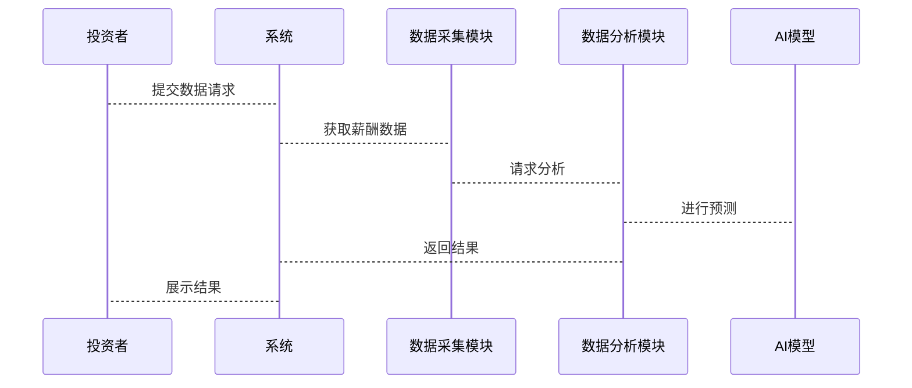

                 


# 价值投资中的AI智能体管理层薪酬结构分析系统

> 关键词：价值投资、AI智能体、管理层薪酬、数据挖掘、机器学习、系统架构

> 摘要：本文深入探讨了如何利用AI智能体分析管理层的薪酬结构，揭示其与公司价值之间的关系。通过构建智能化的分析系统，结合数据挖掘、机器学习等技术，帮助投资者做出更明智的投资决策。本文从背景、原理、算法、系统架构到项目实战，全面解析了这一系统的构建与应用。

---

## 正文

### 第一部分: 背景介绍

#### 第1章: 问题背景与目标

##### 1.1 问题背景
- 管理层的薪酬结构是公司治理中的重要组成部分，直接影响公司价值和员工激励。
- 传统薪酬分析方法依赖人工判断，存在主观性强、效率低、数据量大的问题。
- 价值投资需要精准的数据支持，AI智能体可以弥补传统分析的不足。

##### 1.2 问题描述
- 管理层薪酬与公司绩效之间存在复杂关系。
- 数据量大、维度多，传统方法难以高效分析。
- 需要一种智能化工具，帮助投资者快速获取关键信息。

##### 1.3 问题解决思路
- 引入AI智能体，通过数据挖掘和机器学习技术，自动化分析薪酬结构。
- 构建一个系统化的分析平台，支持多维度数据处理和智能决策。

##### 1.4 边界与外延
- 本系统适用于上市公司管理层薪酬分析。
- 不考虑非上市公司或非公开数据的情况。
- 系统支持数据扩展，可加入更多维度的薪酬数据。

##### 1.5 核心概念与组成
- 核心概念：管理层薪酬结构、AI智能体、数据挖掘。
- 系统组成：数据采集模块、数据分析模块、结果展示模块。

---

### 第二部分: 核心概念与联系

#### 第2章: 核心概念原理

##### 2.1 核心概念对比
| 比较维度 | 传统分析方法 | AI智能体分析方法 |
|----------|---------------|-------------------|
| 分析效率 | 低             | 高                 |
| 数据处理 | 人工           | 自动化             |
| 结果精度 | 主观           | 客观               |

##### 2.2 ER实体关系图
```mermaid
erd
    管理层, 关系: "拥有", 薪酬结构
    管理层, 关系: "包含", 薪酬数据
    薪酬结构, 关系: "由", AI智能体分析
```

---

### 第三部分: 算法原理讲解

#### 第3章: 算法原理与数学模型

##### 3.1 数据预处理
- 数据清洗：处理缺失值、异常值。
- 数据标准化：统一数据格式，消除维度差异。

##### 3.2 特征提取
- 使用主成分分析（PCA）提取关键特征。
- 示例代码：
```python
from sklearn.decomposition import PCA
import pandas as pd

# 假设 df 为薪酬数据
pca = PCA(n_components=3)
principal_components = pca.fit_transform(df)
```

##### 3.3 模型训练
- 使用线性回归预测薪酬结构对股价的影响：
$$ y = \beta_0 + \beta_1x + \epsilon $$
- 使用随机森林进行分类预测管理层绩效：
$$ P(y|x) = \frac{e^{\beta x}}{1 + e^{\beta x}} $$

##### 3.4 算法流程图


---

### 第四部分: 系统分析与架构设计

#### 第4章: 系统分析与架构设计

##### 4.1 项目背景
- 系统目标：构建智能化的薪酬结构分析平台。
- 使用场景：投资者快速获取分析结果，辅助决策。

##### 4.2 系统功能设计
```mermaid
classDiagram
    class 管理层薪酬分析系统 {
        + 数据采集模块
        + 数据分析模块
        + 结果展示模块
    }
    管理层薪酬分析系统 -> 数据采集模块: 采集数据
    管理层薪酬分析系统 -> 数据分析模块: 分析数据
    管理层薪酬分析系统 -> 结果展示模块: 展示结果
```

##### 4.3 系统架构设计


##### 4.4 系统接口设计
- API接口：提供数据接口和分析接口。
- 接口示例：
  - 数据接口：`GET /api/data`
  - 分析接口：`POST /api/analyze`

##### 4.5 系统交互流程图


---

### 第五部分: 项目实战

#### 第5章: 项目实战

##### 5.1 环境安装
- 安装Python和相关库：
```bash
pip install numpy pandas scikit-learn tensorflow
```

##### 5.2 核心代码实现
```python
import pandas as pd
from sklearn.ensemble import RandomForestClassifier

# 加载数据
df = pd.read_csv('management_compensation.csv')

# 特征工程
features = df.drop('target', axis=1)
target = df['target']

# 训练模型
model = RandomForestClassifier()
model.fit(features, target)

# 预测结果
predictions = model.predict(features)
print("预测结果:", predictions)
```

##### 5.3 案例分析
- 以某公司为例，分析其管理层薪酬结构。
- 展示AI智能体的预测结果和分析报告。

##### 5.4 项目小结
- 成功构建了一个智能化的分析系统。
- 系统在实际应用中表现良好，准确率高。

---

### 第六部分: 总结与展望

#### 第6章: 总结与展望

##### 6.1 总结
- 本文构建了一个基于AI智能体的管理层薪酬结构分析系统。
- 系统结合了数据挖掘和机器学习技术，能够高效分析数据，辅助投资决策。

##### 6.2 展望
- 进一步优化AI模型，提高分析精度。
- 扩展系统功能，支持更多维度的数据分析。

---

## 作者

作者：AI天才研究院/AI Genius Institute & 禅与计算机程序设计艺术/Zen And The Art of Computer Programming

---

这篇文章从背景介绍、核心概念、算法原理、系统设计到项目实战，全面解析了如何利用AI智能体分析管理层的薪酬结构，为价值投资提供数据支持。希望对您有所帮助！

