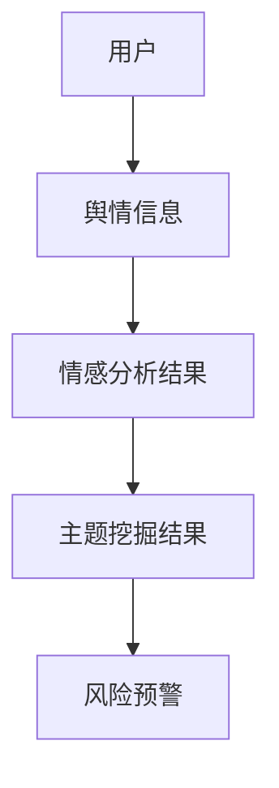
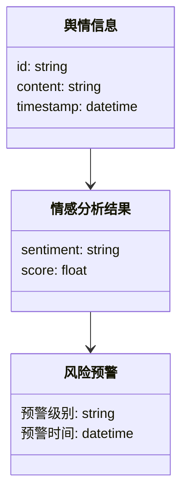
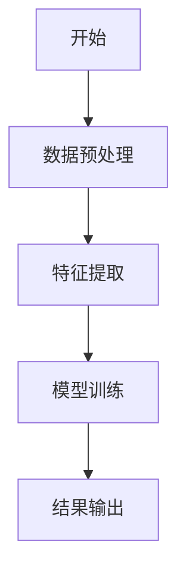
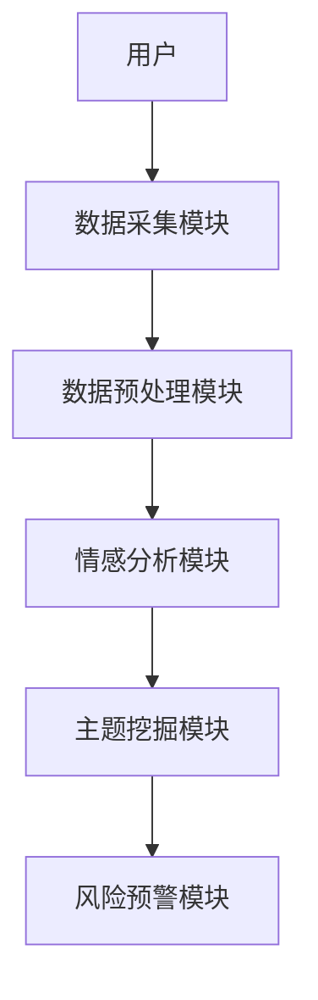
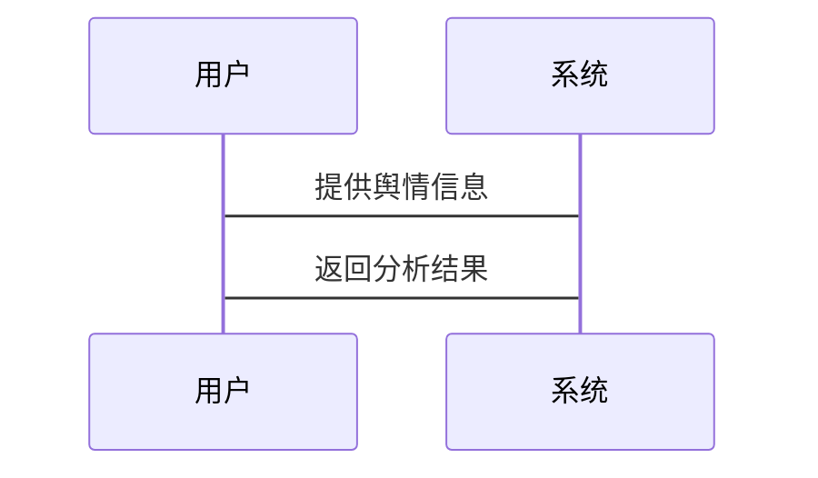

                 


# 价值投资中的AI智能体舆情监测与分析系统

---

## 关键词：
价值投资, AI智能体, 舆情监测, 自然语言处理, 深度学习, 金融分析

---

## 摘要：
本文探讨了如何利用AI技术构建舆情监测与分析系统，辅助价值投资决策。通过自然语言处理和深度学习技术，系统能够实时监测市场情绪、分析投资标的关联性，并提供数据驱动的投资建议。文章详细介绍了系统的架构设计、算法原理和实际应用场景，为投资者提供了一种高效、智能化的决策支持工具。

---

# 第1章: 价值投资与AI智能体的结合

## 1.1 价值投资的基本概念

### 1.1.1 价值投资的定义与核心思想
- **价值投资**：一种投资策略，旨在通过分析企业基本面，找到市场价格低于其内在价值的投资标的。
- 核心思想：市场短期是投票器，长期是称重机。

### 1.1.2 价值投资的核心要素
- **内在价值**：企业未来现金流的现值。
- **安全边际**：市场价格与内在价值的差距。
- **竞争优势**：企业护城河。

### 1.1.3 价值投资与现代金融的结合
- 现代金融学提供理论框架，价值投资注重实际操作。
- 数据驱动决策成为趋势。

## 1.2 AI智能体的基本概念

### 1.2.1 AI智能体的定义
- **AI智能体**：能够感知环境、做出决策并执行动作的智能系统。
- 核心特征：自主性、反应性、目标导向。

### 1.2.2 AI智能体的核心特征
| 特性 | 描述 |
|------|------|
| 自主性 | 系统能够独立运作，无需人工干预 |
| 反应性 | 系统能够实时感知环境并做出反应 |
| 目标导向 | 系统行为以实现特定目标为导向 |

### 1.2.3 AI智能体在金融领域的应用
- 股票价格预测
- 风险评估
- 资产配置

## 1.3 舆情监测与分析系统的基本概念

### 1.3.1 舆情监测的定义
- **舆情监测**：通过收集和分析媒体、社交平台等公开信息，监测市场情绪。
- 核心功能：识别市场情绪变化。

### 1.3.2 舆情分析的核心要素
| 要素 | 描述 |
|------|------|
| 数据源 | 新闻、社交媒体、论坛等 |
| 分析方法 | 情感分析、主题挖掘、趋势分析 |
| 输出结果 | 情绪指数、热点话题、风险预警 |

### 1.3.3 舆情监测与分析系统的必要性
- 帮助投资者捕捉市场情绪变化。
- 提供数据支持的决策依据。

## 1.4 价值投资中的AI智能体舆情监测与分析系统的结合

### 1.4.1 系统的定义与目标
- **系统定义**：结合AI技术的舆情监测与分析系统，辅助价值投资决策。
- **系统目标**：提供实时市场情绪分析，挖掘潜在投资机会。

### 1.4.2 系统的核心功能
| 功能模块 | 描述 |
|----------|------|
| 数据采集 | 从新闻、社交媒体等渠道收集信息 |
| 数据预处理 | 清洗、标注数据 |
| 情感分析 | 判断文本情感倾向 |
| 主题挖掘 | 找出市场关注的热点话题 |
| 风险预警 | 发现潜在风险事件 |

### 1.4.3 系统的边界与外延
- **边界**：仅关注公开信息，不涉及内部数据。
- **外延**：可扩展至其他金融数据源。

---

# 第2章: 舆情监测与分析系统的背景与问题背景

## 2.1 价值投资中的信息不对称问题

### 2.1.1 信息不对称的定义
- **信息不对称**：市场参与者掌握的信息量不均，导致决策优势。

### 2.1.2 信息不对称对价值投资的影响
- 高价买入低估值资产。
- 低价卖出高估值资产。

### 2.1.3 解决信息不对称的必要性
- 提高决策效率。
- 降低投资风险。

## 2.2 舆情监测与分析系统的必要性

### 2.2.1 舆情监测的重要性
- 及时捕捉市场情绪变化。
- 识别潜在市场机会。

### 2.2.2 舆情分析的核心作用
- 提供数据支持的投资建议。
- 降低人为情绪干扰。

### 2.2.3 舆情监测与分析系统的应用价值
- 优化投资决策。
- 提高投资效率。

## 2.3 价值投资中的舆情监测与分析系统的结合

### 2.3.1 系统的背景与意义
- 利用AI技术解决信息不对称问题。
- 提供实时、高效的市场分析工具。

### 2.3.2 系统的目标与任务
- 实时监测市场情绪。
- 分析投资标的关联性。

### 2.3.3 系统的核心问题与挑战
- 数据源的多样性和复杂性。
- 情感分析的准确性。

---

# 第3章: 舆情监测与分析系统的核心概念与联系

## 3.1 舆情监测的核心概念

### 3.1.1 舆情监测的定义
- **舆情监测**：系统性地收集、分析和评估公众意见的过程。

### 3.1.2 舆情监测的主要方法
| 方法 | 描述 |
|------|------|
| 数据挖掘 | 从海量数据中提取有价值的信息 |
| 自然语言处理 | 分析文本情感和语义 |
| 统计分析 | 分析数据分布和趋势 |

### 3.1.3 舆情监测的关键技术
- NLP技术。
- 数据可视化。

## 3.2 舆情分析的核心概念

### 3.2.1 舆情分析的定义
- **舆情分析**：通过对公开信息的分析，评估市场情绪。

### 3.2.2 舆情分析的主要技术
- 情感分析。
- 主题挖掘。

### 3.2.3 舆情分析的核心指标
| 指标 | 描述 |
|------|------|
| 情绪指数 | 衡量市场整体情绪 |
| 热点话题 | 当前市场关注的重点 |
| 风险预警 | 可能引发市场波动的事件 |

## 3.3 舆情监测与分析系统的关联

### 3.3.1 系统的核心功能
- **数据采集**：实时收集相关信息。
- **数据预处理**：清洗和标注数据。
- **情感分析**：判断文本情感。
- **主题挖掘**：识别热点话题。
- **风险预警**：发现潜在风险。

### 3.3.2 系统的边界与外延
- **边界**：仅关注公开信息。
- **外延**：可扩展至其他数据源。

---

# 图表部分（Mermaid图）

## 3.4.1 ER实体关系图



## 3.4.2 领域模型类图



---

# 算法原理讲解

## 3.5.1 算法流程



```python
def preprocess(text):
    # 文本清洗
    text = text.lower()
    text = re.sub(r'[^\w\s]', '', text)
    return text

def extract_features(texts):
    # 使用TF-IDF提取特征
    vectorizer = TfidfVectorizer()
    features = vectorizer.fit_transform(texts)
    return features

def train_model(features, labels):
    # 使用朴素贝叶斯分类器
    clf = BernoulliNB()
    clf.fit(features, labels)
    return clf

# 示例代码
texts = ["市场表现良好", "公司业绩不佳"]
labels = [1, 0]
features = extract_features(texts)
model = train_model(features, labels)
```

---

## 3.5.2 数学模型与公式

- **情感分析模型**：使用朴素贝叶斯分类器。
  $$ P(y|X) = \frac{P(X|y)P(y)}{P(X)} $$
- **主题挖掘模型**：使用LDA（主题模型）。
  $$ \theta_{d} \sim \text{Dirichlet}(\alpha) $$
  $$ \phi_{k} \sim \text{Dirichlet}(\beta) $$

---

# 系统分析与架构设计

## 3.6.1 系统目标

### 3.6.1.1 系统功能模块

| 模块 | 描述 |
|------|------|
| 数据采集 | 收集舆情信息 |
| 数据预处理 | 清洗和标注数据 |
| 情感分析 | 分析文本情感 |
| 主题挖掘 | 识别热点话题 |
| 风险预警 | 发现潜在风险 |

### 3.6.1.2 系统架构设计



### 3.6.1.3 系统接口设计

- **输入接口**：接收舆情信息。
- **输出接口**：提供分析结果。

### 3.6.1.4 系统交互流程



---

## 3.6.2 项目实战

### 3.6.2.1 环境安装

```bash
pip install numpy pandas scikit-learn nltk
```

### 3.6.2.2 核心代码实现

```python
from sklearn.feature_extraction.text import TfidfVectorizer
from sklearn.naive_bayes import BernoulliNB
import nltk

def preprocess(text):
    # 分词处理
    words = nltk.word_tokenize(text)
    return ' '.join(words)

def train_model(train_texts, train_labels):
    # 特征提取
    vectorizer = TfidfVectorizer(preprocessor=preprocess)
    features = vectorizer.fit_transform(train_texts)
    # 模型训练
    clf = BernoulliNB()
    clf.fit(features, train_labels)
    return clf, vectorizer

# 示例数据
train_texts = ["市场表现良好", "公司业绩不佳"]
train_labels = [1, 0]

model, vectorizer = train_model(train_texts, train_labels)
```

### 3.6.2.3 实际案例分析

- **案例背景**：某公司发布财报，市场反应不一。
- **分析过程**：收集相关舆情信息，进行情感分析。
- **结果解读**：负面情绪占主导，需警惕风险。

### 3.6.2.4 项目小结

---

## 3.7.1 最佳实践 Tips

- **数据质量**：确保数据来源可靠。
- **模型调优**：定期更新模型参数。
- **系统维护**：及时修复潜在问题。

## 3.7.2 小结

- 本文详细介绍了舆情监测与分析系统的架构设计和算法原理。
- 通过实际案例展示了系统的应用价值。

## 3.7.3 注意事项

- 数据隐私问题需谨慎处理。
- 模型需定期更新以保持准确性。

## 3.7.4 拓展阅读

- 建议阅读《算法导论》和《自然语言处理实战》。

---

## 作者

作者：AI天才研究院/AI Genius Institute & 禅与计算机程序设计艺术 /Zen And The Art of Computer Programming

