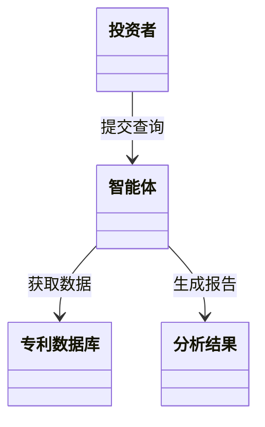
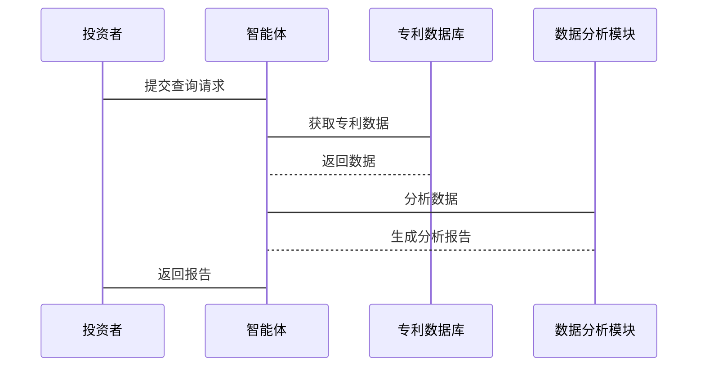

                 


# 价值投资中的AI驱动专利分析：多智能体系统的优势

## 关键词：价值投资、AI驱动、专利分析、多智能体系统、投资决策

## 摘要：本文探讨了如何利用人工智能（AI）技术，特别是多智能体系统，来提升专利分析在价值投资中的应用。通过分析多智能体系统的优势，本文展示了如何利用AI技术提高专利分析的效率和准确性，从而为投资者提供更可靠的决策支持。

---

# 第一部分：价值投资中的AI驱动专利分析基础

## 第1章：价值投资与专利分析概述

### 1.1 价值投资的基本概念

#### 1.1.1 价值投资的定义与核心理念
价值投资是一种以长期收益为导向的投资策略，关注企业的内在价值而非短期市场波动。其核心理念是寻找被市场低估的企业，长期持有以实现超额收益。  
$$ \text{价值投资的核心公式：} \text{内在价值} = \frac{\text{未来现金流}}{\text{贴现率}} $$  

#### 1.1.2 价值投资的核心要素与分析框架
- **核心要素**：企业财务状况、行业地位、竞争优势、管理层质量、成长潜力。
- **分析框架**：通过DCF模型（ discounted cash flow model ）评估企业内在价值。

#### 1.1.3 价值投资在现代金融中的地位与作用
价值投资在现代金融中占据重要地位，尤其是在市场波动加剧的环境下，其长期稳定收益的特点受到投资者的青睐。

### 1.2 专利分析的基本概念

#### 1.2.1 专利分析的定义与方法
专利分析是通过对专利数据的整理、挖掘和分析，评估企业的技术创新能力和市场竞争力。  
$$ \text{专利分析的关键指标包括：数量、质量、技术领域分布等。} $$  

#### 1.2.2 专利分析在商业决策中的价值
专利分析能够为企业的技术布局、竞争态势、研发方向提供数据支持，帮助投资者评估企业的长期发展潜力。

#### 1.2.3 专利分析的核心指标与评价体系
- **核心指标**：专利数量、专利质量（技术领域影响力）、专利布局（地域分布）。
- **评价体系**：通过加权评分模型对企业的专利组合进行综合评估。

### 1.3 AI驱动专利分析的背景与意义

#### 1.3.1 传统专利分析的局限性
传统专利分析依赖人工筛选和经验判断，存在效率低、覆盖面窄、主观性强等问题。

#### 1.3.2 AI技术在专利分析中的优势
AI技术能够快速处理海量专利数据，挖掘隐含关系，提供客观、全面的分析结果。  
$$ \text{AI专利分析的优势：} \text{自动化、智能化、高精度。} $$  

#### 1.3.3 多智能体系统在专利分析中的应用前景
多智能体系统通过协同学习和分布式计算，能够更高效地处理复杂专利数据，为价值投资提供更精准的支持。

---

## 第2章：多智能体系统与价值投资的结合

### 2.1 多智能体系统的定义与特点

#### 2.1.1 多智能体系统的定义
多智能体系统是由多个相互作用的智能体组成的系统，每个智能体都有自己的目标和行为规则。

#### 2.1.2 多智能体系统的核心特点
- **分布性**：智能体独立运作，协同完成任务。
- **智能性**：具备感知、推理和决策能力。
- **动态性**：系统能够适应环境变化。

#### 2.1.3 多智能体系统与传统AI的区别
传统AI依赖中央控制系统，而多智能体系统强调去中心化和分布式计算。

### 2.2 多智能体系统在价值投资中的应用

#### 2.2.1 多智能体系统在专利分析中的优势
- **高效性**：多个智能体同时处理不同领域的专利数据。
- **准确性**：通过协同学习提高分析结果的准确性。

#### 2.2.2 多智能体系统在价值投资中的具体应用场景
- **专利趋势预测**：分析技术发展动态，预测未来专利布局。
- **竞争分析**：识别竞争对手的技术优势和短板。

#### 2.2.3 多智能体系统如何提升投资决策的准确性
通过实时数据分析和多维度评估，多智能体系统能够提供更全面的投资决策支持。

### 2.3 多智能体系统与价值投资结合的案例

#### 2.3.1 案例背景：科技行业的专利分析
以科技行业为例，多智能体系统可以分析专利布局、技术发展趋势，帮助投资者评估企业的创新能力和市场竞争力。

#### 2.3.2 分析过程
1. 数据收集：从专利数据库中获取相关数据。
2. 数据处理：清洗、标注和结构化处理。
3. 分析评估：利用多智能体系统进行深度分析，生成评估报告。

---

## 第3章：价值投资中的专利分析需求与挑战

### 3.1 价值投资中的专利分析需求

#### 3.1.1 专利分析在价值投资中的核心需求
- **技术评估**：评估企业的技术优势和市场竞争力。
- **风险评估**：识别潜在的技术风险和法律风险。

#### 3.1.2 不同类型企业的专利分析需求差异
- 初创企业：关注专利数量和布局。
- 成熟企业：关注专利质量和技术创新能力。

#### 3.1.3 专利分析对投资决策的影响
专利分析能够帮助投资者识别高潜力企业，降低投资风险。

### 3.2 专利分析中的主要挑战

#### 3.2.1 数据获取与处理的难度
专利数据分散、格式多样，处理成本高。

#### 3.2.2 专利分析的复杂性与不确定性
专利分析涉及多个技术领域，分析难度大且结果具有不确定性。

#### 3.2.3 多智能体系统在实际应用中的技术挑战
- **算法优化**：如何提高多智能体系统的协同效率。
- **数据隐私**：如何确保数据处理的安全性。

---

## 第4章：AI驱动专利分析的核心

### 4.1 AI驱动专利分析的算法原理

#### 4.1.1 基于联邦学习的专利分析算法
联邦学习是一种分布式机器学习技术，能够在不共享原始数据的情况下进行模型训练。  
$$ \text{联邦学习公式：} \text{损失函数} = \sum_{i=1}^{n} \mathcal{L}_i(\theta) $$  

#### 4.1.2 基于强化学习的专利分析算法
强化学习通过智能体与环境的交互，逐步优化决策策略。  
$$ \text{强化学习公式：} \text{Q值} = r + \gamma \max Q(s, a) $$  

#### 4.1.3 算法实现步骤
1. 数据预处理：清洗、标注、结构化。
2. 模型训练：选择合适的算法进行训练。
3. 模型评估：验证模型的准确性和稳定性。

### 4.2 多智能体系统在专利分析中的应用

#### 4.2.1 多智能体系统的设计与实现
- **系统架构**：采用分布式架构，每个智能体负责不同的任务。
- **协同机制**：通过消息传递实现智能体之间的协同。

#### 4.2.2 多智能体系统的优势
- **高效性**：多个智能体同时处理数据，提高分析效率。
- **智能性**：通过协同学习，提升分析结果的准确性。

---

## 第5章：系统分析与架构设计方案

### 5.1 问题场景介绍

#### 5.1.1 项目背景
以科技行业为例，设计一个基于多智能体系统的专利分析系统。

#### 5.1.2 项目目标
通过多智能体系统实现高效的专利分析，为价值投资提供支持。

### 5.2 系统功能设计

#### 5.2.1 领域模型（Mermaid类图）


#### 5.2.2 系统架构设计（Mermaid架构图）


### 5.3 系统接口设计

#### 5.3.1 API接口
- **输入接口**：接收投资者的查询请求。
- **输出接口**：返回分析结果。

#### 5.3.2 接口实现
使用RESTful API，实现数据的传输和处理。

### 5.4 系统交互流程（Mermaid序列图）


---

## 第6章：项目实战

### 6.1 环境安装与配置

#### 6.1.1 安装Python
```bash
python --version
pip install --upgrade pip
```

#### 6.1.2 安装依赖库
```bash
pip install numpy pandas scikit-learn
```

### 6.2 系统核心实现源代码

#### 6.2.1 数据预处理
```python
import pandas as pd

def preprocess_patents(data):
    # 数据清洗
    data = data.dropna()
    # 数据标注
    data['technology'] = data['technology'].str.lower()
    return data
```

#### 6.2.2 多智能体协同学习实现
```python
import numpy as np

class Agent:
    def __init__(self, id):
        self.id = id
        self.data = None

    def process(self):
        if self.data is not None:
            # 数据分析
            result = self.data.describe()
            return result
        return None

# 初始化智能体
agents = [Agent(i) for i in range(4)]
```

### 6.3 代码应用解读与分析

#### 6.3.1 数据预处理的作用
数据预处理能够提高分析结果的准确性，确保数据的完整性和一致性。

#### 6.3.2 多智能体协同学习的优势
通过多智能体协同学习，可以更高效地处理复杂数据，提高分析效率。

### 6.4 实际案例分析

#### 6.4.1 案例背景
以某科技企业为例，分析其专利布局和技术创新能力。

#### 6.4.2 分析结果
通过多智能体系统分析，发现该企业在人工智能领域的专利布局较为集中，具有较高的技术竞争力。

### 6.5 项目小结

#### 6.5.1 项目总结
通过本次项目，验证了多智能体系统在专利分析中的优势，提高了分析效率和准确性。

#### 6.5.2 项目经验
在实际应用中，需要关注数据质量和算法优化，以提高系统的性能和稳定性。

---

## 第7章：总结与展望

### 7.1 本书总结
本书系统介绍了AI驱动专利分析的核心概念、算法原理和实际应用，展示了多智能体系统在价值投资中的巨大潜力。

### 7.2 未来挑战与展望

#### 7.2.1 当前挑战
- 数据隐私问题
- 算法优化问题

#### 7.2.2 未来展望
随着AI技术的不断发展，多智能体系统在专利分析中的应用将更加广泛，为价值投资提供更强大的支持。

### 7.3 最佳实践 tips

#### 7.3.1 投资者建议
- 关注企业的专利布局和技术创新能力。
- 结合多智能体系统的分析结果，制定投资策略。

#### 7.3.2 开发者建议
- 持续优化多智能体系统的算法，提高分析效率。
- 加强数据安全保护，确保系统的安全性。

---

## 作者：AI天才研究院/AI Genius Institute & 禅与计算机程序设计艺术/Zen And The Art of Computer Programming

