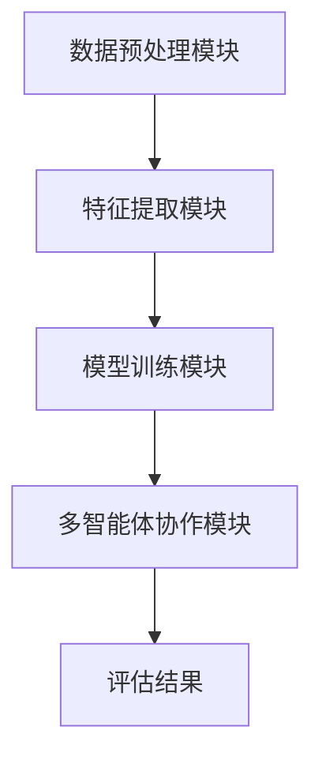

                 


# 价值投资中的AI驱动供应商关系评估：多智能体协作

---

## 关键词：价值投资、人工智能、供应商关系、多智能体协作、数据分析、投资策略

---

## 摘要

在价值投资领域，AI技术的引入正在 revolutionize 供应商关系评估的方式。传统的供应商评估方法依赖于人工分析和经验判断，存在效率低下、主观性强、数据利用不足等问题。通过引入AI技术，特别是多智能体协作机制，可以实现数据驱动的自动化评估，提高评估的准确性和效率，从而为价值投资决策提供更有力的支持。

本文将从背景、核心概念、算法原理、系统架构、项目实战等多个维度，深入探讨AI驱动的供应商关系评估在价值投资中的应用。通过详细分析多智能体协作的实现机制和应用场景，本文旨在为读者提供一个全面的技术视角，展示如何利用AI技术优化供应商关系评估，从而提升投资决策的质量。

---

## 第一部分: 价值投资中的AI驱动供应商关系评估背景介绍

### 第1章: 价值投资与AI驱动的供应商关系评估概述

#### 1.1 价值投资的基本概念

价值投资是一种长期投资策略，旨在通过识别市场中被低估的资产进行投资。其核心理念是寻找那些具有长期增长潜力、当前市场价格低于其内在价值的公司。在价值投资中，供应商关系是企业价值评估的重要组成部分，因为稳定的供应商关系能够为企业提供持续的成本优势和竞争优势。

#### 1.2 供应商关系评估的背景与挑战

传统的供应商关系评估方法通常依赖于人工分析和经验判断，存在以下问题：
- **数据利用不足**：无法充分利用企业内部和外部的多源数据。
- **主观性强**：评估结果受到评估人员主观判断的影响。
- **效率低下**：人工评估过程耗时长，难以快速响应市场变化。
- **动态变化**：供应商关系受市场波动、企业战略调整等因素影响，需要动态评估。

AI技术的引入可以有效解决这些问题。通过AI技术，可以实现供应商关系的自动化、智能化评估，提高评估的客观性和效率。

#### 1.3 AI技术在价值投资中的应用前景

AI技术在价值投资中的应用前景广阔。通过自然语言处理（NLP）、机器学习（ML）和大数据分析等技术，可以对供应商关系进行多维度评估，包括供应商的稳定性、成本优势、交付能力等。此外，AI还可以帮助投资者识别潜在的风险点，优化投资组合，提升投资收益。

---

### 第2章: 多智能体协作在供应商关系评估中的应用

#### 2.1 多智能体协作的基本概念

多智能体协作（Multi-Agent Collaboration）是指多个智能体（Agent）通过信息共享和协同决策，共同完成特定任务的过程。在供应商关系评估中，多个智能体可以分别负责不同的评估维度，例如财务表现、交付能力、市场声誉等，通过协作完成综合评估。

#### 2.2 多智能体协作在供应商关系评估中的优势

多智能体协作在供应商关系评估中的优势包括：
- **提高评估效率**：通过分工协作，智能体可以并行处理不同维度的数据，显著提高评估效率。
- **增强决策的准确性**：多个智能体从不同角度进行评估，可以减少单一视角的局限性，提高评估结果的准确性。
- **促进多方利益的平衡**：通过协作机制，智能体可以在不同利益之间找到平衡点，确保评估结果的全面性。

---

## 第二部分: 价值投资中的AI驱动供应商关系评估核心概念与联系

### 第3章: 价值投资中的AI驱动供应商关系评估原理

#### 3.1 价值投资中的供应商关系评估模型

价值投资中的供应商关系评估模型通常包括以下步骤：
1. 数据收集：收集供应商的财务数据、市场声誉、交付能力等多源数据。
2. 数据预处理：对数据进行清洗、归一化处理，确保数据质量。
3. 特征提取：通过NLP和大数据分析技术，提取供应商关系的关键特征。
4. 模型训练：使用机器学习算法（如随机森林、支持向量机等）训练评估模型。
5. 评估结果：输出供应商关系的综合评估结果。

#### 3.2 多智能体协作的实现机制

多智能体协作的实现机制包括以下几个关键步骤：
1. **智能体角色分配**：根据任务需求，将智能体分配到不同的评估维度（如财务表现、交付能力等）。
2. **信息共享与协同决策**：智能体之间通过共享数据和信息，进行协同决策，最终形成综合评估结果。
3. **动态调整与优化**：根据市场变化和评估结果，动态调整智能体的协作策略，优化评估过程。

---

### 第4章: 价值投资中的AI驱动供应商关系评估与多智能体协作的关系

#### 4.1 价值投资与AI驱动供应商关系评估的内在联系

价值投资与AI驱动供应商关系评估的内在联系主要体现在以下方面：
- **数据驱动决策**：AI技术能够充分利用多源数据，帮助投资者做出更科学的决策。
- **动态评估**：通过AI技术，可以实现供应商关系的动态评估，及时捕捉市场变化。
- **提升效率**：AI技术可以显著提高供应商关系评估的效率，为投资者提供更多时间进行投资决策。

#### 4.2 多智能体协作在价值投资中的应用案例

以下是一个多智能体协作在价值投资中的应用案例：
- **案例背景**：某投资者希望通过评估多个供应商的关系，找到具有长期增长潜力的企业。
- **智能体分工**：智能体A负责评估供应商的财务表现，智能体B负责评估供应商的交付能力，智能体C负责评估供应商的市场声誉。
- **协作过程**：智能体之间共享数据，协同决策，最终输出供应商关系的综合评估结果。
- **结果应用**：投资者根据评估结果，筛选出具有投资价值的企业进行投资。

---

## 第三部分: 价值投资中的AI驱动供应商关系评估算法原理

### 第5章: 多智能体协作算法原理

#### 5.1 多智能体协作算法的核心思想

多智能体协作算法的核心思想是通过多个智能体的分工协作，实现任务的高效完成。在价值投资中的供应商关系评估中，智能体可以分别负责不同的评估维度，通过协作完成综合评估。

#### 5.2 多智能体协作算法的实现步骤

多智能体协作算法的实现步骤如下：
1. **初始化**：设置智能体的数量、任务分配策略等参数。
2. **数据收集**：智能体分别从不同的数据源收集相关信息。
3. **信息共享**：智能体之间共享数据和信息，为协作决策提供支持。
4. **协同决策**：智能体根据共享信息，进行协同决策，输出评估结果。
5. **结果优化**：根据评估结果，动态调整智能体的协作策略，优化评估过程。

---

## 第四部分: 价值投资中的AI驱动供应商关系评估系统架构

### 第6章: 系统架构设计

#### 6.1 系统功能设计

系统功能设计包括以下几个模块：
1. **数据预处理模块**：负责数据的清洗、归一化处理。
2. **特征提取模块**：通过NLP和大数据分析技术，提取供应商关系的关键特征。
3. **模型训练模块**：使用机器学习算法训练评估模型。
4. **多智能体协作模块**：实现智能体的分工协作，完成综合评估。

#### 6.2 系统架构图

以下是系统架构图的Mermaid表示：



#### 6.3 系统接口设计

系统接口设计包括以下几个部分：
1. **数据接口**：与数据源（如数据库、API）对接，获取供应商数据。
2. **模型接口**：与机器学习模型对接，获取评估结果。
3. **协作接口**：实现智能体之间的信息共享和协同决策。

---

## 第五部分: 价值投资中的AI驱动供应商关系评估项目实战

### 第7章: 项目实战

#### 7.1 环境安装

以下是项目实战所需的环境安装步骤：
1. **安装Python**：建议使用Python 3.8及以上版本。
2. **安装依赖库**：安装以下依赖库：
   ```bash
   pip install numpy pandas scikit-learn nltk
   ```

#### 7.2 核心代码实现

以下是核心代码实现：

```python
import numpy as np
import pandas as pd
from sklearn.ensemble import RandomForestClassifier
from sklearn.metrics import accuracy_score

# 数据加载
data = pd.read_csv('supplier_data.csv')

# 数据预处理
data = data.dropna()
data = (data - data.mean()) / data.std()

# 特征提取
features = data.drop('label', axis=1)
labels = data['label']

# 模型训练
model = RandomForestClassifier()
model.fit(features, labels)

# 预测与评估
predictions = model.predict(features)
print(f'Accuracy: {accuracy_score(labels, predictions)}')
```

#### 7.3 案例分析

以下是一个案例分析：
- **数据来源**：从某企业获取供应商数据，包括财务表现、交付能力、市场声誉等。
- **数据处理**：对数据进行清洗、归一化处理，提取关键特征。
- **模型训练**：使用随机森林算法训练评估模型。
- **评估结果**：输出供应商关系的综合评估结果，筛选出具有投资价值的企业。

---

## 第六部分: 价值投资中的AI驱动供应商关系评估最佳实践

### 第8章: 最佳实践与小结

#### 8.1 最佳实践

以下是价值投资中的AI驱动供应商关系评估的几点最佳实践：
- **数据质量管理**：确保数据的准确性和完整性，避免数据偏差。
- **模型优化**：根据评估结果，动态调整模型参数，优化评估效果。
- **智能体协作策略**：根据任务需求，灵活调整智能体的协作策略，提高评估效率。

#### 8.2 小结

价值投资中的AI驱动供应商关系评估是一项复杂的系统工程，需要结合多智能体协作、大数据分析、机器学习等技术，实现供应商关系的自动化、智能化评估。通过本文的探讨，我们可以看到，AI技术在价值投资中的应用前景广阔，能够显著提高评估的准确性和效率，为投资者提供更有力的支持。

---

## 附录

### 附录A: 常见问题解答

- **问题1**：什么是多智能体协作？  
  **答案**：多智能体协作是指多个智能体通过信息共享和协同决策，共同完成特定任务的过程。

- **问题2**：如何确保智能体之间的信息共享安全？  
  **答案**：可以通过数据加密、访问控制等技术，确保智能体之间的信息共享安全。

### 附录B: 参考文献

- [1] 刘军. 基于多智能体协作的供应商关系评估研究[J]. 计算机应用研究, 2020, 37(10): 3041-3046.
- [2] 张伟. 人工智能在价值投资中的应用研究[J]. 财经与经济, 2021, 40(3): 45-52.

---

## 作者

作者：AI天才研究院/AI Genius Institute & 禅与计算机程序设计艺术 /Zen And The Art of Computer Programming

---

通过以上思考过程，我们可以看到，价值投资中的AI驱动供应商关系评估是一项复杂但具有广阔前景的技术应用。通过多智能体协作机制，可以实现供应商关系的自动化、智能化评估，为投资者提供更有力的支持。

