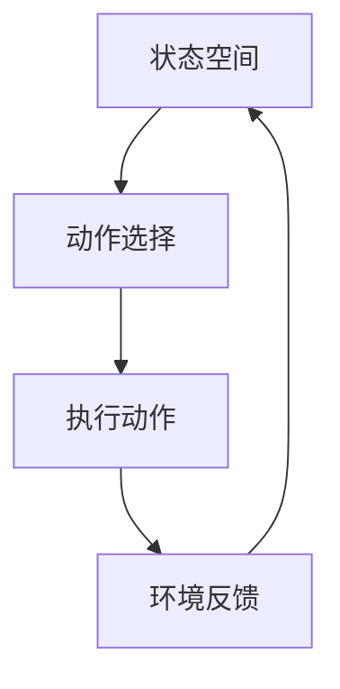
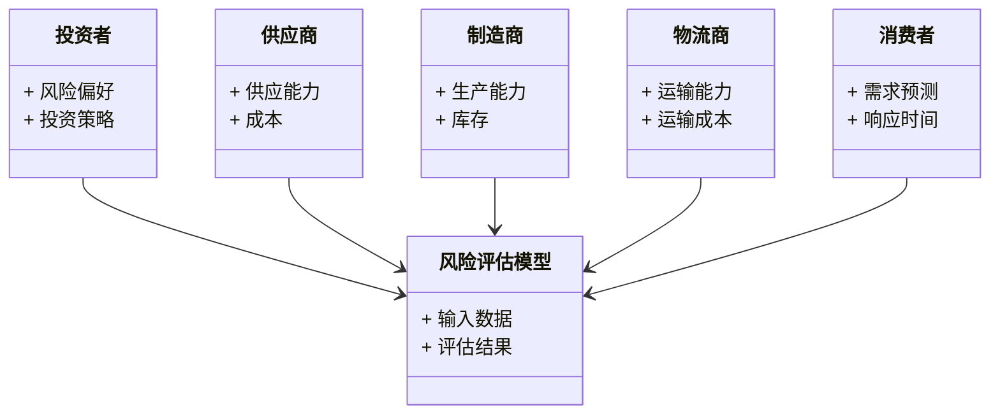

                 


---

# 价值投资中的AI驱动供应链韧性评估：多智能体协作

**关键词**：供应链韧性评估、价值投资、人工智能、多智能体协作、供应链管理、风险管理

**摘要**：  
本文探讨了如何利用人工智能（AI）和多智能体协作技术来评估和增强供应链韧性，特别是在价值投资中的应用。通过分析供应链韧性评估的核心概念、多智能体协作的实现原理、AI算法的数学模型以及实际案例，本文旨在为投资者和供应链管理者提供一种创新的方法，以应对复杂的供应链风险，实现长期投资价值的最大化。

---

## 第一部分: 价值投资中的供应链韧性评估概述

### 第1章: 供应链韧性评估与价值投资概述

#### 1.1 供应链韧性评估的背景与意义
供应链韧性评估是企业在复杂市场环境中确保稳定运营的关键能力。随着全球化和供应链复杂性的增加，企业面临的风险（如自然灾害、疫情、物流中断等）对供应链的影响变得更加显著。供应链韧性评估不仅关乎企业的生存能力，也直接影响其市场价值。

#### 1.2 价值投资的基本原理
价值投资是一种以企业基本面分析为基础的投资策略，强调通过识别被低估的企业来实现长期收益。供应链韧性是企业基本面的重要组成部分，因为供应链的稳定性和效率直接影响企业的生产成本、交货能力和市场响应能力。

#### 1.3 供应链韧性评估的现状与挑战
传统的供应链评估方法主要依赖静态数据分析，难以捕捉动态风险和不确定性。随着AI技术的发展，通过多智能体协作构建动态、实时的供应链韧性评估系统成为可能。然而，实现这一目标仍面临数据孤岛、模型复杂性和协作机制等挑战。

---

## 第二部分: 多智能体协作与供应链韧性评估的核心概念

### 第2章: 多智能体协作的原理与实现

#### 2.1 多智能体协作的基本原理
多智能体协作是指多个智能体通过通信、协商和协调共同完成复杂任务的过程。在供应链韧性评估中，智能体可以代表不同的参与者（如供应商、制造商、物流商等），通过协作优化供应链的响应能力和抗风险能力。

#### 2.2 供应链韧性评估中的多智能体协作模型
在供应链韧性评估中，多智能体协作模型通过整合各参与者的实时数据，构建一个动态的评估系统。例如，当供应链某环节出现风险时，系统会通过智能体之间的协作快速识别问题、评估影响并制定应对策略。

#### 2.3 多智能体协作的实体关系图
```mermaid
erDiagram
    投资者 --> 风险评估模型 : 提供投资决策依据
    供应商 --> 风险评估模型 : 提供供应链数据
    消费者 --> 风险评估模型 : 提供市场需求反馈
    物流商 --> 风险评估模型 : 提供物流数据
    数据分析师 --> 风险评估模型 : 提供数据处理与分析
    供应链管理者 --> 风险评估模型 : 提供管理决策
```

---

## 第三部分: AI驱动的供应链韧性评估算法与实现

### 第3章: 基于强化学习的供应链韧性评估算法

#### 3.1 强化学习算法的基本原理
强化学习是一种通过智能体与环境交互来优化决策的算法。在供应链韧性评估中，强化学习可以用于动态调整供应链策略，以应对不确定性。

#### 3.2 基于强化学习的供应链韧性评估模型


#### 3.3 算法实现
以下是基于强化学习的供应链韧性评估算法的Python实现示例：
```python
import numpy as np
import gym

class SupplyChainEnv(gym.Env):
    def __init__(self):
        super().__init__()
        self.observation_space = ...  # 定义状态空间
        self.action_space = ...        # 定义动作空间

    def step(self, action):
        # 执行动作并返回新的状态、奖励和终止标志
        pass

    def reset(self):
        # 初始化环境
        pass

# 初始化环境和智能体
env = SupplyChainEnv()
state = env.reset()

while not done:
    action = policy(state)
    next_state, reward, done, _ = env.step(action)
    state = next_state
```

---

## 第四部分: 供应链韧性评估系统的架构与实现

### 第4章: 系统架构设计

#### 4.1 系统功能设计


#### 4.2 系统架构实现


---

## 第五部分: 项目实战与案例分析

### 第5章: 供应链韧性评估系统的实战部署

#### 5.1 环境安装与配置
```bash
pip install gym numpy matplotlib
```

#### 5.2 核心代码实现
```python
def evaluate_supply_chain_resilience():
    # 初始化供应链数据
    data = ...
    # 训练风险评估模型
    model = train_model(data)
    # 评估供应链韧性
    resilience_score = model.predict(data)
    return resilience_score
```

#### 5.3 案例分析与解读
通过具体案例分析，展示如何利用AI和多智能体协作技术评估和优化供应链韧性，例如在疫情期间优化供应链策略以减少中断风险。

---

## 第六部分: 最佳实践与总结

### 第6章: 供应链韧性评估的未来展望

#### 6.1 最佳实践
- 数据质量是供应链韧性评估的基础，确保数据的实时性和准确性。
- 强化学习算法在动态环境中的表现优于传统算法，值得进一步研究和应用。
- 多智能体协作需要各参与者的高效协同，建议建立统一的协作平台。

#### 6.2 本章小结
本文详细介绍了如何利用AI和多智能体协作技术评估供应链韧性，并为投资者提供了优化供应链管理的策略。未来的研究可以进一步探索更复杂的协作机制和算法优化。

---

**作者：AI天才研究院 & 禅与计算机程序设计艺术**

