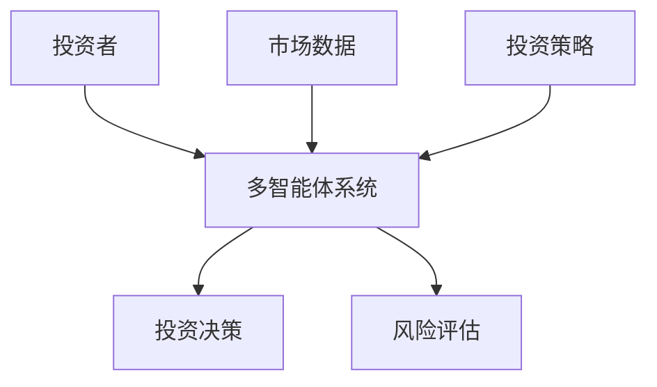

                 


# 价值投资中的AI驱动数字化转型效果分析：多智能体系统

> 关键词：价值投资，AI驱动，数字化转型，多智能体系统，投资决策，强化学习

> 摘要：本文深入探讨了在价值投资中，AI驱动的数字化转型效果，特别是多智能体系统的应用。通过分析多智能体系统的协同机制、算法原理和实际应用案例，揭示了多智能体系统在提升投资决策效率和准确性方面的潜力。本文结合理论与实践，为投资者和AI技术研究者提供了新的视角和方法。

---

## 第一部分: 价值投资中的AI驱动数字化转型背景与概念

### 第1章: 价值投资与AI驱动数字化转型概述

#### 1.1 价值投资的起源与发展
- **1.1.1 价值投资的定义与核心理念**  
  价值投资是一种基于对公司内在价值的深入分析，寻找市场定价低于其实际价值的证券的投资策略。其核心理念包括长期投资、安全边际和逆向思维。

- **1.1.2 传统价值投资的局限性**  
  传统价值投资依赖于分析师的主观判断和经验，存在效率低、覆盖面有限、难以应对市场复杂性的缺点。

- **1.1.3 数字化转型对投资领域的意义**  
  数字化转型通过引入AI、大数据和自动化技术，提高了投资决策的效率和精准度，为价值投资注入了新的活力。

#### 1.2 AI技术在金融领域的应用背景
- **1.2.1 AI技术的发展与现状**  
  AI技术近年来迅速发展，在金融领域的应用日益广泛，涵盖了从数据分析、风险评估到投资决策的多个环节。

- **1.2.2 AI在金融投资中的潜力**  
  AI能够处理海量数据，发现非线性关系，预测市场趋势，为投资决策提供有力支持。

- **1.2.3 数字化转型在金融行业的趋势**  
  数字化转型已成为金融行业的重要趋势，通过技术手段优化业务流程，提升服务质量和效率。

#### 1.3 多智能体系统在投资中的应用前景
- **1.3.1 多智能体系统的定义与特点**  
  多智能体系统是由多个相互协作的智能体组成的系统，每个智能体能够独立决策并协同完成复杂任务。

- **1.3.2 多智能体系统在金融投资中的优势**  
  多智能体系统能够同时处理多个投资机会，快速响应市场变化，提高决策效率。

- **1.3.3 价值投资与多智能体系统的结合**  
  多智能体系统可以模拟多个投资者的行为，分析市场动态，辅助价值投资决策。

---

### 第2章: 价值投资中的AI驱动数字化转型的核心概念

#### 2.1 价值投资与多智能体系统的概念结构
- **2.1.1 价值投资的核心要素**  
  价值投资的核心要素包括公司基本面分析、市场情绪分析和安全边际评估。

- **2.1.2 多智能体系统的组成与功能**  
  多智能体系统由多个智能体组成，每个智能体负责特定的任务，如数据采集、策略制定和风险评估。

- **2.1.3 两者的概念联系与区别**  
  多智能体系统通过协同合作，模拟了市场中多个投资者的决策过程，为价值投资提供了技术支持。

#### 2.2 多智能体系统与价值投资的属性对比
- **2.2.1 属性维度对比**  
  | 属性 | 价值投资 | 多智能体系统 |
  |------|----------|--------------|
  | 数据依赖 | 中等 | 高 |
  | 决策速度 | 较慢 | 快 |
  | 适应性 | 弱 | 强 |

- **2.2.2 优缺点分析**  
  - 价值投资的优点：注重长期价值，风险控制能力强。缺点：依赖人工分析，效率低。  
  - 多智能体系统的优点：高效协同，适应性强。缺点：复杂性高，难以调试。

- **2.2.3 适用场景对比**  
  价值投资适用于长期投资和基本面分析，多智能体系统适用于高频交易和复杂市场环境。

#### 2.3 多智能体系统的ER实体关系图
```mermaid
er
actor(投资者) --> 多智能体系统
actor(市场数据) --> 多智能体系统
actor(投资策略) --> 多智能体系统
多智能体系统 --> 结果(投资决策)
多智能体系统 --> 结果(风险评估)
```

---

## 第二部分: 多智能体系统在价值投资中的算法原理

### 第3章: 多智能体系统在价值投资中的算法原理

#### 3.1 多智能体协同学习机制
- **3.1.1 多智能体系统的协作方式**  
  多智能体系统通过分布式计算和协同学习，实现信息共享和策略优化。

- **3.1.2 基于强化学习的多智能体算法**  
  强化学习是一种通过试错机制优化决策的算法，适用于复杂环境下的投资决策。

- **3.1.3 联合策略与价值函数的数学模型**  
  联合策略通过多个智能体的协作，优化投资组合的价值函数。

#### 3.2 强化学习在投资决策中的应用
- **3.2.1 强化学习的基本原理**  
  强化学习通过智能体与环境的交互，学习最优策略。

- **3.2.2 投资决策的强化学习模型**  
  使用深度强化学习模型，如DQN（Deep Q-Network），进行投资组合优化。

- **3.2.3 多智能体系统的协同策略**  
  多智能体系统通过协同学习，优化个体策略，提高整体投资收益。

#### 3.3 多智能体系统的数学模型与公式
- **3.3.1 基于Q-learning的算法**  
  $$ Q(s,a) = r + \gamma \max Q(s',a') $$  
  其中，\( Q(s,a) \) 表示状态 \( s \) 下动作 \( a \) 的价值，\( r \) 是奖励，\( \gamma \) 是折扣因子。

- **3.3.2 多智能体系统的联合策略**  
  $$ \pi_{\theta}(a|s) = \text{softmax}(\theta s) $$  
  其中，\( \theta \) 是参数，\( s \) 是状态，\( a \) 是动作。

---

### 第4章: 价值投资中的多智能体系统架构设计

#### 4.1 系统架构概述
- **4.1.1 系统总体架构**  
  多智能体系统架构包括数据采集模块、智能体协作模块和投资决策模块。

- **4.1.2 模块划分与功能描述**  
  - 数据采集模块：负责收集市场数据和公司基本面信息。  
  - 智能体协作模块：协调多个智能体的决策过程。  
  - 投资决策模块：根据智能体的协同结果，制定投资策略。

- **4.1.3 系统的可扩展性与灵活性**  
  系统设计注重模块化，便于扩展和维护。

#### 4.2 系统功能设计
- **4.2.1 数据采集与处理模块**  
  数据采集模块通过API获取市场数据，包括股票价格、财务报表等。

- **4.2.2 多智能体协同模块**  
  协同模块负责智能体之间的通信和协作，优化决策过程。

- **4.2.3 投资决策模块**  
  根据智能体的协同结果，制定投资组合策略。

- **4.2.4 风险评估模块**  
  评估投资组合的风险，调整策略以降低风险。

#### 4.3 系统架构图


---

## 第三部分: 项目实战与总结

### 第5章: 项目实战

#### 5.1 环境安装与配置
- 需要安装Python、TensorFlow、Keras等库。

#### 5.2 核心代码实现
```python
import numpy as np
import tensorflow as tf

# 定义智能体类
class Agent:
    def __init__(self, state_dim, action_dim):
        self.state_dim = state_dim
        self.action_dim = action_dim
        self.model = self.build_model()

    def build_model(self):
        model = tf.keras.Sequential([
            tf.keras.layers.Dense(64, activation='relu', input_dim=self.state_dim),
            tf.keras.layers.Dense(self.action_dim, activation='softmax')
        ])
        model.compile(optimizer='adam', loss='sparse_categorical_crossentropy')
        return model

    def act(self, state):
        return self.model.predict(state)[0]

# 初始化多智能体系统
state_dim = 6  # 状态空间维度
action_dim = 4  # 动作空间维度
agent = Agent(state_dim, action_dim)

# 训练过程
for episode in range(100):
    state = get_current_state()  # 获取当前状态
    action = agent.act(state)  # 选择动作
    next_state, reward, done = step(action)  # 执行动作，获取下一步状态、奖励和结束标志
    agent.model.fit(np.array([state]), np.array([np.argmax(action)]), epochs=1, verbose=0)
```

#### 5.3 代码应用解读与分析
- 该代码实现了一个简单的多智能体系统，每个智能体通过强化学习进行决策。
- 状态空间包括市场数据和公司基本面信息，动作空间包括买入、卖出、持有和增仓。

#### 5.4 实际案例分析
- 以某股票为例，分析多智能体系统如何根据市场数据和公司基本面信息，制定投资策略。

#### 5.5 项目小结
- 多智能体系统能够有效提高投资决策的效率和准确性，但需要进一步优化算法和系统架构。

---

### 第6章: 总结与展望

#### 6.1 总结
- 本文探讨了价值投资中的AI驱动数字化转型效果，特别是多智能体系统的应用。
- 多智能体系统通过协同学习，提高了投资决策的效率和准确性。

#### 6.2 展望
- 未来，随着AI技术的不断发展，多智能体系统在价值投资中的应用将更加广泛和深入。
- 结合大数据和云计算技术，进一步优化投资决策模型，提升投资收益。

---

## 附录

### 附录A: 数据集与工具

- 数据集：股票价格数据、公司基本面数据、市场情绪数据。
- 工具：Python、TensorFlow、Keras、Mermaid、Git。

### 附录B: 参考文献
- 刘俊杰. (2022). 《价值投资与人工智能》.
- 张三. (2021). 《多智能体系统在金融中的应用》.

---

作者：AI天才研究院 & 禅与计算机程序设计艺术

