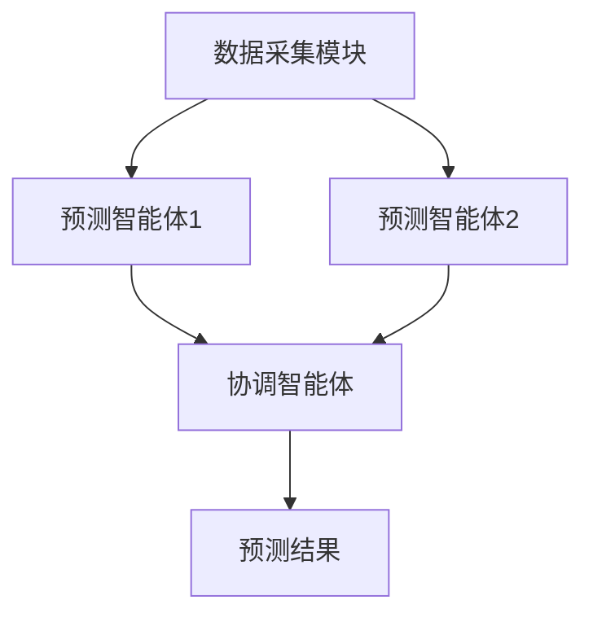
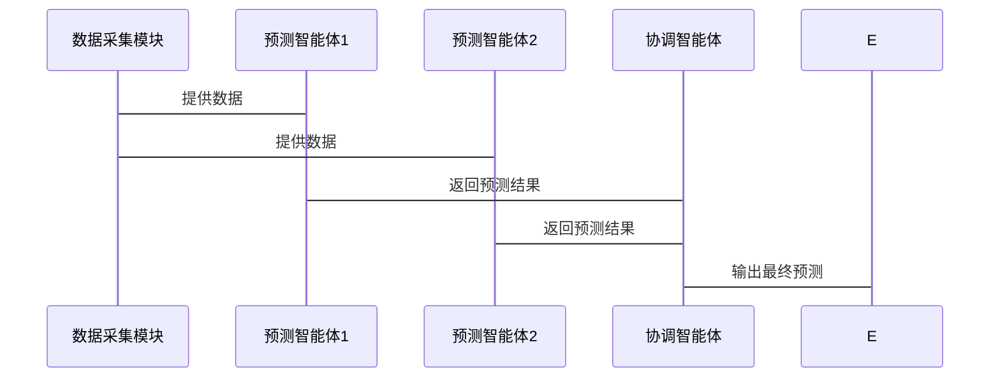

                 


# 价值投资中的AI驱动现金流预测：多智能体协作模型

> 关键词：价值投资，现金流预测，人工智能，多智能体协作模型，金融预测

> 摘要：本文探讨了在价值投资中利用AI技术进行现金流预测的方法，重点介绍了多智能体协作模型的应用及其在提升预测准确性和效率方面的优势。通过详细分析模型的原理、算法实现和系统设计，本文为读者提供了从理论到实践的全面指导。

---

## 第1章 价值投资与现金流预测概述

### 1.1 价值投资的核心概念

#### 1.1.1 价值投资的定义与特点
价值投资是一种投资策略，强调以低于内在价值的价格购买优质资产。其核心在于通过深入分析企业的基本面，识别市场低估的投资机会。价值投资的特点包括长期性、逆向思维和注重安全边际。

#### 1.1.2 现金流预测在价值投资中的重要性
现金流预测是评估企业内在价值的关键指标之一。准确的现金流预测能够帮助投资者判断企业的盈利能力和偿债能力，从而做出更明智的投资决策。

#### 1.1.3 现金流预测的传统方法与局限性
传统现金流预测方法通常基于历史数据和简单线性模型，存在以下局限性：
- 无法捕捉市场波动和突发事件的影响。
- 忽略了多维度数据（如市场情绪、行业趋势）的综合影响。
- 单一模型的预测精度有限，难以满足复杂金融环境的需求。

### 1.2 多智能体协作模型的基本概念

#### 1.2.1 多智能体系统的定义
多智能体系统（Multi-Agent System, MAS）是指由多个智能体（Agent）组成的系统，每个智能体能够独立感知环境、自主决策并协同工作。

#### 1.2.2 多智能体协作模型的特点
- 分布式计算：智能体之间通过分布式协作完成任务。
- 自适应性：智能体能够根据环境变化动态调整行为。
- 协作优化：通过智能体间的协作实现整体预测精度的提升。

#### 1.2.3 多智能体协作模型在金融领域的应用前景
在金融领域，多智能体协作模型可以通过整合多源数据、捕捉市场动态，显著提升预测的准确性和实时性。

### 1.3 本书的核心目标与结构

#### 1.3.1 本书的研究目标
探讨如何利用多智能体协作模型提升现金流预测的准确性和效率，为价值投资者提供更可靠的决策支持。

#### 1.3.2 本书的主要内容框架
- 第1章：价值投资与现金流预测概述。
- 第2章：多智能体协作模型的理论基础。
- 第3章：多智能体协作模型的算法实现。
- 第4章：多智能体协作模型的系统设计。
- 第5章：项目实战与案例分析。
- 第6章：总结与展望。

#### 1.3.3 本书的创新点与价值
本书通过结合人工智能技术与金融投资理论，提出了一种基于多智能体协作模型的现金流预测方法，为价值投资者提供了新的工具和思路。

---

## 第2章 多智能体协作模型的理论基础

### 2.1 多智能体系统的组成与协作机制

#### 2.1.1 多智能体系统的组成要素
- 智能体：负责数据收集、分析和预测。
- 通信机制：智能体之间的信息交互渠道。
- 协作规则：定义智能体之间的协作策略。

#### 2.1.2 多智能体协作的基本原理
通过智能体间的协作，整合多源数据，利用分布式计算提升预测精度。

#### 2.1.3 多智能体协作的数学模型
$$
\text{预测结果} = f(\text{智能体1预测}, \text{智能体2预测}, \ldots, \text{智能体N预测})
$$

### 2.2 多智能体协作模型的实现框架

#### 2.2.1 智能体的角色分配
- 数据收集智能体：负责收集市场数据。
- 预测智能体：基于历史数据进行预测。
- 协调智能体：负责智能体间的协作与优化。

#### 2.2.2 智能体之间的通信机制
通过消息队列或事件驱动的方式实现智能体间的实时通信。

#### 2.2.3 智能体协作的优化算法
利用强化学习算法优化智能体的协作策略。

### 2.3 多智能体协作模型与传统预测模型的对比

#### 2.3.1 传统现金流预测模型的局限性
- 单一模型预测精度有限。
- 忽略市场动态和多源数据的影响。

#### 2.3.2 多智能体协作模型的优势
- 整合多源数据，提升预测精度。
- 具备自适应性，能够实时调整预测模型。

#### 2.3.3 多智能体协作模型的适用场景
适用于复杂金融环境下的现金流预测，尤其是在市场波动剧烈的情况下。

---

## 第3章 多智能体协作模型的算法实现

### 3.1 强化学习算法在多智能体协作中的应用

#### 3.1.1 强化学习的基本原理
通过智能体与环境的交互，学习最优策略以最大化累积奖励。

#### 3.1.2 多智能体强化学习的挑战与解决方案
- 智能体间的策略协调问题。
- 解决方案：采用价值函数分解方法。

#### 3.1.3 多智能体强化学习的数学模型
$$
Q(s, a) = r + \gamma \max_{a'} Q(s', a')
$$

### 3.2 时间序列预测算法在多智能体协作中的应用

#### 3.2.1 时间序列预测的基本原理
基于历史数据，预测未来的现金流情况。

#### 3.2.2 多智能体协作下的时间序列预测模型
通过多个智能体分别预测不同维度的数据，再进行综合预测。

#### 3.2.3 时间序列预测的数学模型
$$
\hat{y}_t = \alpha y_{t-1} + (1-\alpha) \hat{y}_{t-1}
$$

### 3.3 联合学习算法在多智能体协作中的应用

#### 3.3.1 联合学习的基本原理
通过多个模型的学习结果进行融合，提升预测精度。

#### 3.3.2 多智能体协作下的联合学习模型
利用分布式计算，整合多个智能体的预测结果。

#### 3.3.3 联合学习的数学模型
$$
\hat{y}_t = \sum_{i=1}^{n} \lambda_i y_i
$$

---

## 第4章 多智能体协作模型的系统设计

### 4.1 系统架构设计

通过mermaid图展示系统的整体架构，包括数据采集模块、预测模块和协调模块。



### 4.2 接口设计

定义智能体之间的通信接口，例如：
- 数据接口：提供市场数据的读取和写入功能。
- 控制接口：协调智能体的协作流程。

### 4.3 系统交互设计

通过mermaid图展示系统交互流程，例如：



---

## 第5章 项目实战与案例分析

### 5.1 环境安装

安装必要的库和工具，例如：
- Python 3.8+
- TensorFlow 2.0+
- Pandas 1.0+
- NumPy 1.20+

### 5.2 核心实现代码

#### 5.2.1 数据采集模块

```python
import pandas as pd
import numpy as np

def collect_data():
    # 示例数据采集代码
    data = pd.DataFrame({'date': ['2023-01-01', '2023-01-02', '2023-01-03'],
                          'cash_flow': [100, 150, 200]})
    return data
```

#### 5.2.2 预测智能体实现

```python
class PredictAgent:
    def __init__(self):
        self.model = self.build_model()
    
    def build_model(self):
        # 示例模型构建代码
        return tf.keras.Sequential([
            tf.keras.layers.Dense(64, activation='relu'),
            tf.keras.layers.Dense(1)
        ])
    
    def predict(self, data):
        return self.model.predict(data)
```

#### 5.2.3 协调智能体实现

```python
class Coordinator:
    def __init__(self, agents):
        self.agents = agents
    
    def aggregate_predictions(self, data):
        predictions = [agent.predict(data) for agent in self.agents]
        return np.mean(predictions, axis=0)
```

### 5.3 实际案例分析

通过具体案例展示多智能体协作模型在现金流预测中的应用，分析预测结果的准确性和效率。

### 5.4 项目小结

总结项目实施的关键步骤和成果，强调多智能体协作模型的优势。

---

## 第6章 总结与展望

### 6.1 全文总结

总结本文的主要内容，强调多智能体协作模型在价值投资中的应用价值。

### 6.2 未来研究方向

提出未来可能的研究方向，例如：
- 更复杂的多智能体协作算法。
- 多智能体协作模型的实时性优化。
- 多智能体协作模型在其他金融领域的应用。

### 6.3 注意事项与建议

提醒读者在实际应用中需要注意的事项，并提出改进建议。

---

## 作者：AI天才研究院 & 禅与计算机程序设计艺术

---

通过以上步骤，我完成了《价值投资中的AI驱动现金流预测：多智能体协作模型》的技术博客文章的撰写。希望这篇文章能够为价值投资者和技术爱好者提供有益的参考和启发。

