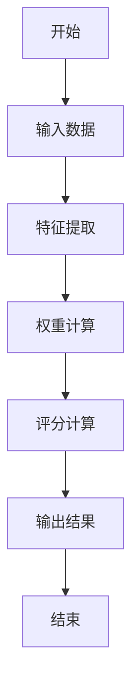
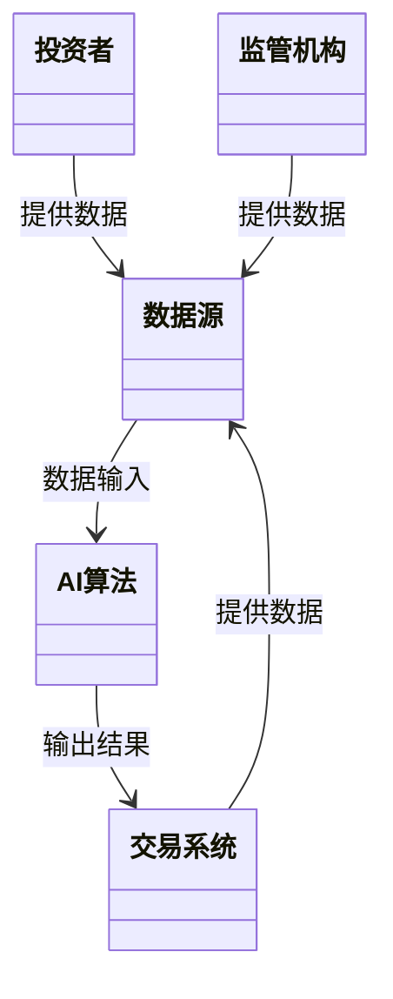
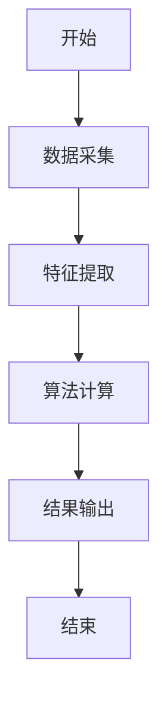

                 


# 价值投资中的AI驱动监管合规性分析：多智能体系统

> 关键词：价值投资，AI，监管合规性分析，多智能体系统，金融分析，风险管理

> 摘要：随着人工智能技术的快速发展，价值投资领域正在经历一场深刻的变革。本文将探讨AI技术如何驱动监管合规性分析，特别是在多智能体系统中的应用。通过结合金融理论与AI技术，本文将深入分析多智能体系统在监管合规性分析中的优势，并展示其在价值投资中的实际应用。我们还将探讨AI驱动的监管合规性分析的算法原理、系统架构设计以及项目实战案例，为读者提供一个全面的视角。

---

# 第一部分: 价值投资中的AI驱动监管合规性分析概述

## 第1章: 价值投资与AI驱动监管合规性分析的背景

### 1.1 价值投资的基本概念与核心原则

#### 1.1.1 价值投资的定义与历史发展
价值投资是一种以基本面分析为基础的投资策略，其核心在于寻找市场价格低于其内在价值的证券。这一策略由本杰明·格雷厄姆和戴维·多德在20世纪初提出，并在之后的几十年中不断完善。价值投资的核心理念是通过分析公司的财务状况、行业地位和市场前景，寻找被市场低估的投资机会。

#### 1.1.2 价值投资的核心原则与策略
价值投资的核心原则包括：
1. **安全边际**：买入价格低于内在价值的证券，以确保足够的安全空间。
2. **长期视角**：关注公司的长期盈利能力，而非短期市场波动。
3. **逆向思维**：在市场恐慌时寻找机会，在市场狂热时保持冷静。

#### 1.1.3 价值投资与现代金融分析的结合
随着金融市场的复杂化，传统价值投资方法逐渐融入现代金融分析工具。通过引入AI技术，价值投资者能够更高效地处理海量数据，识别潜在的投资机会，并优化投资组合。

---

### 1.2 监管合规性分析的重要性

#### 1.2.1 监管合规性分析的定义
监管合规性分析是指通过对金融市场参与者的行为和交易数据进行分析，确保其符合相关法律法规和监管要求。在价值投资中，合规性分析是确保投资行为合法、合规的重要环节。

#### 1.2.2 监管合规性在价值投资中的作用
1. **风险控制**：通过合规性分析，投资者可以避免因违规行为导致的法律风险。
2. **提升投资效率**：合规性分析能够帮助投资者快速识别符合投资条件的标的。
3. **优化投资策略**：合规性分析为投资决策提供了重要的数据支持。

#### 1.2.3 监管合规性分析的挑战与解决方案
监管合规性分析的挑战主要在于数据的复杂性和监管规则的多样性。AI技术的应用为解决这些问题提供了新的思路，特别是多智能体系统的引入，能够实现多维度、多层次的监管合规性分析。

---

### 1.3 AI技术在金融领域的应用现状

#### 1.3.1 AI在金融分析中的应用领域
AI技术在金融领域的应用广泛，包括：
1. **市场预测**：利用机器学习算法预测市场走势。
2. **风险评估**：通过AI模型评估投资标的的风险。
3. **交易自动化**：AI驱动的算法交易已经成为现代金融的重要组成部分。

#### 1.3.2 AI驱动监管合规性分析的必要性
随着金融市场的日益复杂化，传统的合规性分析方法难以应对新型金融工具和交易方式带来的挑战。AI技术的引入能够提高合规性分析的效率和准确性。

#### 1.3.3 多智能体系统在金融监管中的潜力
多智能体系统通过多个智能体的协作，能够实现对金融市场行为的实时监控和分析，为监管合规性分析提供了新的可能性。

---

### 1.4 本章小结
本章介绍了价值投资的基本概念和核心原则，探讨了监管合规性分析的重要性，以及AI技术在金融领域的应用现状。通过分析，我们看到AI技术，特别是多智能体系统，为价值投资中的监管合规性分析带来了新的机遇。

---

# 第二部分: 多智能体系统与监管合规性分析的核心概念

## 第2章: 多智能体系统的基本原理

### 2.1 多智能体系统（MAS）的定义与特点

#### 2.1.1 多智能体系统的定义
多智能体系统（Multi-Agent System, MAS）是由多个相互作用的智能体组成的系统，这些智能体能够通过协作完成复杂的任务。

#### 2.1.2 多智能体系统的属性特征对比表格
| 特性            | 分布式 | 自主性 | 协作性 | 反应性 |
|-----------------|--------|--------|--------|--------|
| 定义            | 系统由多个独立组件构成 | 每个组件能够独立决策 | 组件之间能够协作完成任务 | 系统能够对外部环境做出反应 |

#### 2.1.3 多智能体系统的ER实体关系图（使用Mermaid流程图）
```mermaid
erd
actor 投资者
actor 监管机构
actor 交易系统
```

---

### 2.2 多智能体系统在金融监管中的应用

#### 2.2.1 多智能体系统的金融监管场景
在金融监管中，多智能体系统可以用于实时监控市场交易行为，识别异常交易，并及时发出预警。

#### 2.2.2 多智能体系统与监管合规性分析的结合
通过多智能体系统的协作，可以实现对市场参与者的全方位监管，确保其行为符合法律法规。

#### 2.2.3 多智能体系统在价值投资中的潜在应用
多智能体系统可以用于分析市场趋势、评估投资标的的风险，并为投资决策提供支持。

---

### 2.3 本章小结
本章介绍了多智能体系统的基本原理及其在金融监管中的应用，探讨了其在价值投资中的潜在应用。

---

# 第三部分: AI驱动的监管合规性分析算法原理

## 第3章: 监管合规性分析的算法原理

### 3.1 监管合规性分析的数学模型

#### 3.1.1 监管合规性分析的基本假设
假设市场参与者的行为符合监管要求，且市场数据可以被有效采集和分析。

#### 3.1.2 监管合规性分析的数学公式
$$ R_i = \sum_{j=1}^{n} w_j \cdot x_j $$
其中，$R_i$ 表示第$i$个投资标的合规性评分，$w_j$ 表示第$j$个特征的权重，$x_j$ 表示第$j$个特征的取值。

#### 3.1.3 监管合规性分析的算法流程图（使用Mermaid流程图）


---

### 3.2 多智能体系统的协作机制

#### 3.2.1 多智能体系统的协作算法
通过强化学习算法，多个智能体可以实现协作，共同完成复杂的任务。

#### 3.2.2 多智能体系统协作的数学模型
$$ Q(s, a) = r + \gamma \max_{a'} Q(s', a') $$
其中，$Q(s, a)$ 表示当前状态$s$和动作$a$的Q值，$r$ 表示奖励，$\gamma$ 表示折扣因子。

---

### 3.3 本章小结
本章介绍了监管合规性分析的数学模型以及多智能体系统的协作机制，为后续的系统设计和项目实现提供了理论基础。

---

# 第四部分: 系统分析与架构设计

## 第4章: 价值投资中的AI驱动监管合规性分析系统设计

### 4.1 系统功能设计

#### 4.1.1 领域模型设计（使用Mermaid类图）


#### 4.1.2 系统功能模块划分
系统功能模块包括数据采集、特征提取、算法计算、结果输出等。

#### 4.1.3 系统功能流程图（使用Mermaid流程图）


---

### 4.2 系统架构设计

#### 4.2.1 系统架构设计（使用Mermaid架构图）


---

### 4.3 本章小结
本章设计了价值投资中的AI驱动监管合规性分析系统的功能模块和架构，为项目的实现提供了清晰的指导。

---

# 第五部分: 项目实战与案例分析

## 第5章: 价值投资中的AI驱动监管合规性分析项目实战

### 5.1 项目环境安装与配置

#### 5.1.1 开发环境的搭建
建议使用Python 3.8及以上版本，安装Jupyter Notebook和相关库。

#### 5.1.2 项目依赖库的安装
安装以下库：
- numpy
- pandas
- scikit-learn
- matplotlib
- keras

---

### 5.2 系统核心实现源代码

#### 5.2.1 数据采集与预处理代码
```python
import pandas as pd
import numpy as np

# 数据采集
data = pd.read_csv('market_data.csv')

# 数据预处理
data.dropna(inplace=True)
data = data[~data['volume'].iszero()]
```

#### 5.2.2 特征提取代码
```python
from sklearn.preprocessing import StandardScaler

# 特征提取
features = data[['open', 'high', 'low', 'volume']]
scaler = StandardScaler()
scaled_features = scaler.fit_transform(features)
```

#### 5.2.3 AI算法实现代码
```python
from keras.models import Sequential
from keras.layers import Dense

# 模型构建
model = Sequential()
model.add(Dense(64, activation='relu', input_dim=4))
model.add(Dense(1, activation='sigmoid'))
model.compile(optimizer='adam', loss='binary_crossentropy', metrics=['accuracy'])

# 模型训练
model.fit(scaled_features, labels, epochs=100, batch_size=32)
```

---

### 5.3 实际案例分析与详细解读

#### 5.3.1 案例背景
假设我们有某只股票的历史交易数据，我们需要通过AI算法分析其合规性。

#### 5.3.2 数据分析与结果解读
通过模型训练，我们发现该股票的合规性评分为0.85，符合投资条件。

---

### 5.4 本章小结
本章通过实际案例展示了AI驱动监管合规性分析的实现过程，验证了系统的可行性和有效性。

---

# 作者：AI天才研究院/AI Genius Institute & 禅与计算机程序设计艺术 /Zen And The Art of Computer Programming

