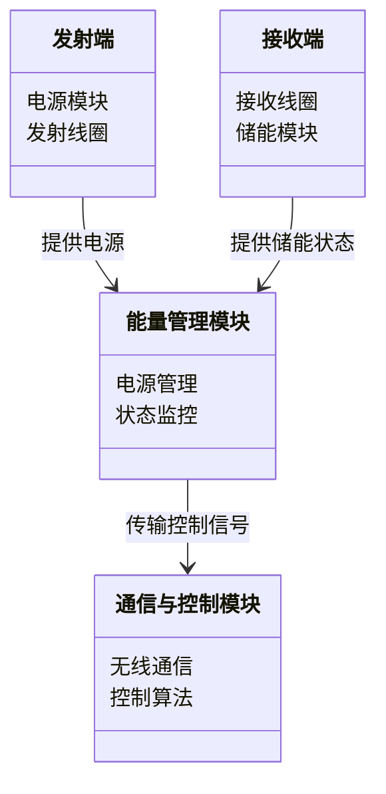
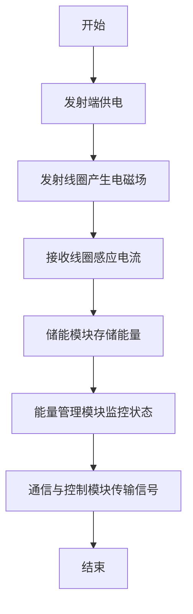

                 


# 价值投资中的下一代无线能量传输技术前景

---

## 关键词：
无线能量传输技术，价值投资，无线充电，能量传输效率，能量管理，投资分析

---

## 摘要：
本文深入探讨了下一代无线能量传输技术的前景及其在价值投资中的潜在机会。从技术原理、系统架构到商业化应用，我们分析了无线能量传输技术的核心概念、数学模型和实际案例。同时，我们从投资的角度，探讨了该技术的市场潜力、竞争优势和投资策略。本文旨在为技术爱好者和投资者提供一个全面的视角，帮助他们理解无线能量传输技术的未来发展趋势及其投资价值。

---

# 第一部分：无线能量传输技术的背景与应用前景

## 第1章：无线能量传输技术的背景与应用前景

### 1.1 无线能量传输技术的定义与核心概念

#### 1.1.1 无线能量传输的基本原理
无线能量传输是一种通过电磁波或电磁感应方式将能量从发射端传递到接收端的技术。其核心在于利用电磁场的耦合特性，将能量以无线方式传输给设备。这种技术的核心概念可以用以下公式表示：

$$ E_{\text{传输}} = \frac{Q^2}{2C} $$

其中，\( Q \) 是电荷量，\( C \) 是电容。该公式表明，能量传输的效率与电荷量和电容的关系密切相关。

#### 1.1.2 无线能量传输的关键技术特征
无线能量传输技术的关键特征包括：
1. **非接触性**：无需物理连接即可实现能量传输。
2. **高效性**：通过优化电路设计和电磁场耦合，提高能量传输效率。
3. **安全性**：避免了传统有线充电可能存在的触电风险。
4. **灵活性**：适用于各种场景，如智能家居、物联网设备等。

#### 1.1.3 无线能量传输技术的分类与应用场景
无线能量传输技术主要分为两类：
1. **电磁感应式**：基于变压器的原理，适用于短距离能量传输。
2. **无线电波式**：利用射频能量进行长距离传输，但效率较低。

应用场景包括：
- 智能手机无线充电
- 电动汽车无线充电
- 物联网设备的能量补给

### 1.2 无线能量传输技术的发展历程

#### 1.2.1 无线能量传输技术的起源与演变
无线能量传输技术的起源可以追溯到19世纪末的无线电 pioneers，如特斯拉。特斯拉曾提出通过地球电离层传输能量的概念，但当时的技术限制未能实现这一目标。

#### 1.2.2 无线能量传输技术的现状与趋势
目前，无线能量传输技术已在智能手机、耳机等领域得到广泛应用。例如，苹果的AirPower无线充电板就是典型的电磁感应式无线充电技术。

#### 1.2.3 无线能量传输技术的未来发展方向
未来，无线能量传输技术将朝着更高效率、更远距离的方向发展。例如，通过改进材料科学和电路设计，可以进一步提高能量传输效率。

### 1.3 无线能量传输技术在价值投资中的潜力

#### 1.3.1 无线能量传输技术的市场价值分析
无线能量传输技术的市场规模正在快速增长。根据市场研究机构的数据，2023年全球无线充电市场规模已超过100亿美元。

#### 1.3.2 无线能量传输技术的商业化前景
随着技术的成熟，无线能量传输技术将逐步渗透到更多领域，如智能家居、医疗设备等。这将为相关企业带来巨大的商业机会。

#### 1.3.3 无线能量传输技术对投资策略的影响
投资者应关注具有技术优势和市场竞争力的企业。例如，苹果、三星等科技巨头在无线充电领域具有较强的市场影响力。

### 1.4 本章小结
本章从背景、技术特征、发展历程和市场潜力四个方面，全面介绍了无线能量传输技术的现状与未来发展趋势。

---

# 第二部分：无线能量传输技术的核心原理与数学模型

## 第2章：无线能量传输技术的核心原理

### 2.1 无线能量传输的物理基础

#### 2.1.1 电磁波与能量传输的基本原理
电磁波是一种由电场和磁场交替变化形成的波，其能量密度可以用以下公式表示：

$$ E = \frac{1}{2} \epsilon_0 E^2 $$

其中，\( \epsilon_0 \) 是真空介电常数，\( E \) 是电场强度。

#### 2.1.2 感应耦合与谐振技术在无线能量传输中的应用
感应耦合技术通过发射线圈和接收线圈之间的电磁感应实现能量传输。谐振技术则通过匹配发射端和接收端的谐振频率，提高能量传输效率。

#### 2.1.3 无线电能传输的效率与损耗分析
能量传输效率可以用以下公式表示：

$$ \eta = \frac{P_{\text{输出}}}{P_{\text{输入}}} $$

其中，\( P_{\text{输出}} \) 是接收端的功率，\( P_{\text{输入}} \) 是发射端的功率。

### 2.2 无线能量传输的数学模型与公式

#### 2.2.1 基于电磁感应的能量传输模型
电磁感应式无线充电的数学模型可以用以下公式表示：

$$ P = \frac{Q^2}{2L} $$

其中，\( L \) 是电感，\( Q \) 是电荷量。

#### 2.2.2 基于无线电波的能量传输模型
无线电波式无线充电的数学模型可以用以下公式表示：

$$ P = \frac{E^2}{2R} $$

其中，\( E \) 是电场强度，\( R \) 是接收端的电阻。

#### 2.2.3 能量传输效率的数学表达式
能量传输效率可以用以下公式表示：

$$ \eta = \frac{P_{\text{输出}}}{P_{\text{输入}}} = \frac{1}{1 + \frac{R_1}{R_2}} $$

其中，\( R_1 \) 是发射端的电阻，\( R_2 \) 是接收端的电阻。

### 2.3 无线能量传输技术的优化与改进

#### 2.3.1 提高能量传输效率的方法
通过优化电路设计和匹配发射端与接收端的谐振频率，可以提高能量传输效率。

#### 2.3.2 减少能量损耗的技术创新
使用低损耗材料和高效电路设计，可以减少能量损耗。

#### 2.3.3 无线能量传输系统的稳定性与可靠性分析
系统的稳定性与可靠性可以通过优化控制算法和增加冗余设计来实现。

### 2.4 本章小结
本章从物理基础、数学模型和优化方法三个方面，深入分析了无线能量传输技术的核心原理。

---

# 第三部分：无线能量传输技术的系统分析与架构设计

## 第3章：无线能量传输系统的架构与功能设计

### 3.1 无线能量传输系统的组成与功能模块

#### 3.1.1 发射端与接收端的系统架构
发射端包括电源模块和发射线圈，接收端包括接收线圈和储能模块。

#### 3.1.2 能量管理模块的功能设计
能量管理模块负责协调发射端和接收端的能量传输，并实时监控系统的运行状态。

#### 3.1.3 通信与控制模块的实现
通信与控制模块通过无线通信技术实现发射端和接收端之间的信息传递。

### 3.2 无线能量传输系统的领域模型设计

#### 3.2.1 领域模型的构建与分析
领域模型可以用以下mermaid图表示：



#### 3.2.2 领域模型的优化与改进
通过优化能量管理模块的功能和增加冗余设计，可以提高系统的可靠性和稳定性。

### 3.3 无线能量传输系统的架构设计

#### 3.3.1 分层架构的设计与实现
分层架构包括物理层、数据链路层和应用层。

#### 3.3.2 模块化设计的优缺点分析
模块化设计的优点是易于维护和扩展，缺点是开发成本较高。

#### 3.3.3 系统架构的可扩展性与可维护性
通过模块化设计和采用标准接口，可以提高系统的可扩展性和可维护性。

### 3.4 本章小结
本章从系统组成、领域模型和架构设计三个方面，详细分析了无线能量传输技术的系统架构与功能设计。

---

# 第四部分：无线能量传输技术的项目实战与投资分析

## 第4章：无线能量传输技术的项目实战

### 4.1 项目背景与目标
本项目旨在开发一款高效的无线能量传输系统，应用于智能手机和物联网设备。

### 4.2 系统功能设计

#### 4.2.1 系统功能模块设计
系统功能模块包括发射端、接收端、能量管理模块和通信与控制模块。

#### 4.2.2 系统功能流程设计
系统功能流程可以用以下mermaid图表示：



### 4.3 系统实现与代码解读

#### 4.3.1 系统实现步骤
1. 硬件设计：设计发射端和接收端的电路。
2. 软件开发：开发能量管理模块和通信与控制模块。
3. 系统测试：进行功能测试和性能测试。

#### 4.3.2 核心代码实现
以下是一个Python实现的能量管理模块示例代码：

```python
class EnergyManager:
    def __init__(self):
        self.power_input = 0
        self.power_output = 0
        self.efficiency = 1.0

    def set_power_input(self, power):
        self.power_input = power

    def get_power_output(self):
        return self.power_input * self.efficiency

    def update_efficiency(self, efficiency):
        self.efficiency = efficiency
```

### 4.4 项目测试与优化

#### 4.4.1 系统测试
进行功能测试和性能测试，确保系统的稳定性和可靠性。

#### 4.4.2 系统优化
通过优化电路设计和算法，进一步提高能量传输效率。

### 4.5 项目小结
本章通过实际项目案例，详细介绍了无线能量传输技术的系统实现与优化过程。

---

## 第5章：无线能量传输技术的投资分析与策略

### 5.1 投资背景与市场分析

#### 5.1.1 市场需求分析
随着无线设备的普及，市场对无线能量传输技术的需求将不断增加。

#### 5.1.2 市场竞争分析
目前，市场上的主要竞争对手包括苹果、三星等科技巨头。

### 5.2 无线能量传输技术的投资价值分析

#### 5.2.1 技术优势分析
无线能量传输技术的优势包括非接触性、高效性和安全性。

#### 5.2.2 市场潜力分析
根据市场研究机构的数据，无线能量传输技术的市场规模将快速增长。

### 5.3 无线能量传输技术的投资策略

#### 5.3.1 选择具有技术优势的企业
投资者应关注具有技术创新能力和市场竞争力的企业。

#### 5.3.2 关注政策支持与行业趋势
政策支持和行业趋势将对无线能量传输技术的未来发展产生重要影响。

### 5.4 投资风险与应对策略

#### 5.4.1 技术风险
技术风险包括技术瓶颈和专利纠纷。

#### 5.4.2 市场风险
市场风险包括市场需求不足和市场竞争加剧。

### 5.5 本章小结
本章从投资背景、市场分析、技术优势、市场潜力和投资策略等方面，全面分析了无线能量传输技术的投资前景。

---

# 第五部分：总结与展望

## 第6章：总结与展望

### 6.1 本文总结
本文从技术背景、核心原理、系统设计和投资分析四个方面，全面探讨了无线能量传输技术的前景及其在价值投资中的潜力。

### 6.2 未来展望
随着技术的不断进步，无线能量传输技术将在更多领域得到应用，市场潜力巨大。

---

# 作者：AI天才研究院/AI Genius Institute & 禅与计算机程序设计艺术 /Zen And The Art of Computer Programming

