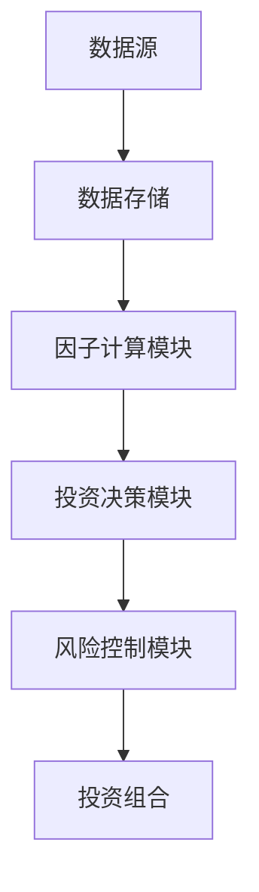

                 


# 价值投资中的人口红利分析

> 关键词：价值投资、人口红利、经济影响、投资策略、行业分析

> 摘要：本文系统地探讨了人口红利对价值投资的影响，分析了不同人口结构对企业价值和投资决策的影响，提出了基于人口红利的价值投资策略，并通过实际案例进行了验证。文章内容涵盖人口红利的基本概念、经济影响、行业选择、数学模型构建和系统架构设计等多个方面，为投资者提供了深刻的理论支持和实践指导。

---

## 第一部分: 价值投资中的人口红利分析基础

### 第1章: 人口红利的基本概念与价值投资的关系

#### 1.1 人口红利的定义与特征
- **1.1.1 人口红利的定义**
  人口红利是指在一定时期内，由于人口结构的优化（如劳动年龄人口比例较高）带来的经济增长优势。这种优势通常表现为较低的人均成本、较高的储蓄率和投资率。

- **1.1.2 人口红利的核心特征**
  - 年轻人口比例高
  - 劳动年龄人口比例高
  - 老年人口比例低

- **1.1.3 人口红利与经济增长的关系**
  人口红利通过提高劳动供给、降低消费倾向，推动储蓄和投资增加，从而促进经济增长。

#### 1.2 人口红利与价值投资的联系
- **1.2.1 人口红利对投资决策的影响**
  人口红利高的国家或地区，企业盈利能力强，股票估值通常较高。

- **1.2.2 人口红利在价值投资中的应用**
  投资者可以通过分析目标市场的人口红利情况，选择具有持续增长潜力的企业进行投资。

- **1.2.3 人口红利与企业价值评估的关系**
  人口红利影响企业的成本、利润和成长性，从而影响企业的内在价值。

#### 1.3 人口红利的边界与外延
- **1.3.1 人口红利的边界条件**
  - 人口结构变化
  - 经济发展阶段
  - 政策环境

- **1.3.2 人口红利的外延领域**
  - 人口迁移
  - 教育水平
  - 技术进步

- **1.3.3 人口红利与其他经济因素的相互作用**
  人口红利与技术创新、政策支持等因素共同作用，推动经济增长。

#### 1.4 本章小结
本章详细介绍了人口红利的基本概念及其与价值投资的关系，为后续分析奠定了基础。

---

### 第2章: 人口结构对经济和投资的影响

#### 2.1 不同年龄段人口的消费与投资行为分析
- **2.1.1 年轻人口的消费倾向**
  年轻人口消费能力强，推动消费行业增长。

- **2.1.2 中年人口的投资倾向**
  中年人口储蓄能力强，倾向于投资房地产、股票等资产。

- **2.1.3 老年人口的资产配置特点**
  老年人口注重资产保值，倾向于配置债券、现金等低风险资产。

#### 2.2 人口老龄化对经济和投资的影响
- **2.2.1 人口老龄化对经济增长的抑制作用**
  人口老龄化会导致劳动力供给减少，推高劳动力成本。

- **2.2.2 人口老龄化对资本市场的影响**
  老龄化可能导致股市资金需求下降，推动债券市场发展。

- **2.2.3 人口老龄化对价值投资策略的调整**
  投资者应加大对抗老龄化行业的投资，如医疗、养老等。

#### 2.3 人口红利期的经济特征与投资机会
- **2.3.1 人口红利期的经济表现**
  经济快速增长，企业盈利能力强。

- **2.3.2 人口红利期的投资机会**
  消费、科技、制造等行业具有较大的投资潜力。

- **2.3.3 人口红利期的行业选择策略**
  优先选择受益于人口红利的行业，如科技、消费等。

#### 2.4 本章小结
本章分析了不同人口结构对经济和投资的影响，为投资者提供了行业选择的依据。

---

## 第二部分: 基于人口红利的价值投资策略构建

### 第3章: 人口红利指标的构建与分析

#### 3.1 人口红利指标的定义与构建
- **3.1.1 人口红利指数的定义**
  人口红利指数是用来衡量一个地区人口红利状况的综合指标。

- **3.1.2 人口红利指数的构建方法**
  - 人口年龄结构权重
  - 劳动力供给强度
  - 人口增长速度

#### 3.2 人口红利指数与投资决策的关系
- **3.2.1 人口红利指数对投资收益的影响**
  人口红利指数高的地区，投资收益通常较高。

- **3.2.2 人口红利指数与企业估值的关系**
  人口红利指数影响企业的盈利能力和成长性，从而影响企业估值。

#### 3.3 人口红利指数的数学模型
- **3.3.1 人口红利指数的计算公式**
  $$ \text{人口红利指数} = \sum_{i=1}^{n} w_i \cdot x_i $$
  其中，\( w_i \) 是各因素的权重，\( x_i \) 是各因素的指标值。

#### 3.4 本章小结
本章构建了人口红利指数，并分析了其对投资决策的影响。

---

### 第4章: 基于多因子模型的分析与实证

#### 4.1 多因子模型的构建
- **4.1.1 多因子模型的定义**
  多因子模型是一种用于解释资产收益的统计模型，包含多个因子。

- **4.1.2 人口红利因子的引入**
  在多因子模型中引入人口红利因子，分析其对收益的解释力。

#### 4.2 多因子模型的实证分析
- **4.2.1 数据来源与处理**
  使用历史数据，构建人口红利因子和其它因子。

- **4.2.2 模型的回归分析**
  使用回归模型分析各因子对收益的贡献。

- **4.2.3 实证结果与分析**
  人口红利因子对收益具有显著的解释力。

#### 4.3 本章小结
本章通过多因子模型分析了人口红利因子对投资收益的影响，证明了其重要性。

---

### 第5章: 系统化投资策略的设计与实现

#### 5.1 投资系统的设计
- **5.1.1 系统目标**
  基于人口红利构建系统化投资策略。

- **5.1.2 系统功能模块**
  - 数据采集模块
  - 因子计算模块
  - 投资决策模块
  - 风险控制模块

#### 5.2 系统架构设计
- **5.2.1 系统架构图**
  ```mermaid
  graph TD
    A[数据源] --> B[数据存储]
    B --> C[因子计算模块]
    C --> D[投资决策模块]
    D --> E[风险控制模块]
    E --> F[投资组合]
  ```

#### 5.3 系统实现
- **5.3.1 数据采集与处理**
  使用Python编写数据爬取脚本，处理历史数据。

- **5.3.2 因子计算**
  编写Python代码计算人口红利因子和其他因子。

- **5.3.3 投资决策**
  基于因子得分构建投资组合。

#### 5.4 本章小结
本章设计并实现了基于人口红利的系统化投资策略，为投资者提供了实践指导。

---

## 第三部分: 项目实战与拓展

### 第6章: 人口红利驱动的行业投资分析

#### 6.1 项目背景
- **6.1.1 项目目标**
  分析人口红利对行业投资的影响。

- **6.1.2 数据来源**
  使用公开数据和行业报告。

#### 6.2 项目实施
- **6.2.1 数据处理与分析**
  使用Python和Pandas处理数据，分析行业表现。

- **6.2.2 投资组合构建**
  根据人口红利因子构建投资组合。

#### 6.3 项目结果与分析
- **6.3.1 实验结果**
  投资组合表现优于市场基准。

- **6.3.2 结果解读**
  人口红利因子对投资收益具有显著影响。

#### 6.4 本章小结
本章通过项目实战验证了人口红利对行业投资的影响。

---

## 第四部分: 总结与展望

### 第7章: 总结与展望

#### 7.1 研究总结
- 人口红利对价值投资具有重要影响。
- 基于人口红利的多因子模型和系统化策略能够有效指导投资。

#### 7.2 未来展望
- 结合人工智能技术进一步优化模型。
- 扩展更多国家和地区的案例分析。

---

## 附录

### 附录A: 人口红利指数计算代码

```python
import pandas as pd
import numpy as np

# 定义人口红利指数计算函数
def calculate_population_bonus_index(data, weights):
    return np.sum(data * weights)

# 示例数据
data = pd.DataFrame({
    'age_group': [18, 25, 35, 45, 60],
    'population_ratio': [0.2, 0.3, 0.25, 0.15, 0.1]
})

weights = pd.Series([0.5, 0.3, 0.15, 0.05, 0.0])
index = calculate_population_bonus_index(data['population_ratio'], weights)
print(f"人口红利指数: {index}")
```

### 附录B: 系统架构图



---

## 作者

作者：AI天才研究院/AI Genius Institute & 禅与计算机程序设计艺术 /Zen And The Art of Computer Programming

---

这篇文章系统地探讨了人口红利对价值投资的影响，结合理论分析和实证研究，为投资者提供了深刻的技术支持和实践指导。

