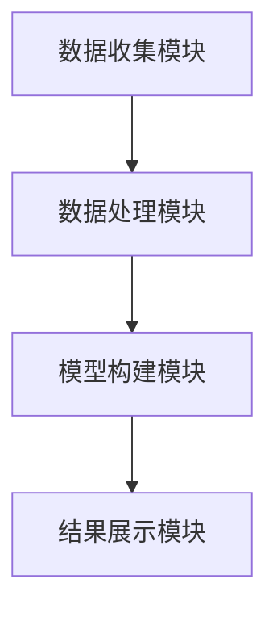

                 


```markdown
# 价值投资中的人口趋势分析

## 关键词
人口趋势分析, 价值投资, 统计分析, 投资策略, 数学模型

## 摘要
本文探讨了人口趋势分析在价值投资中的应用，通过分析出生率、寿命、迁移率等人口指标，揭示其对经济和社会的影响，进而指导投资决策。文章详细介绍了人口趋势分析的方法，包括时间序列分析和回归分析，并通过案例展示了如何将这些分析应用于实际投资策略。

---

## 第1章: 人口趋势分析的背景与价值投资概述

### 1.1 人口趋势分析的背景

#### 1.1.1 人口学的基本概念
人口学研究人口的数量、结构和分布，关注出生率、死亡率、迁移率等指标。这些指标影响社会经济发展，进而影响市场和投资。

#### 1.1.2 人口趋势对经济和社会的影响
- **出生率**：影响劳动力供给和消费市场。
- **死亡率**：影响医疗需求和养老金系统。
- **平均寿命**：影响劳动参与率和退休年龄。

#### 1.1.3 价值投资的基本原理
价值投资强调购买被市场低估的资产，关注长期基本面。人口趋势分析提供了长期经济和社会变化的视角，帮助投资者识别结构性机会。

### 1.2 人口趋势分析与价值投资的关系

#### 1.2.1 人口趋势对投资决策的影响
- 人口增长可能导致房地产价格上涨。
- 老龄化社会推动医疗行业增长。

#### 1.2.2 价值投资中的长期视角
价值投资强调长期趋势，人口趋势分析提供了长期经济变化的视角。

#### 1.2.3 人口趋势分析在投资中的应用
通过分析人口趋势，投资者可以预测行业趋势，发现潜在投资机会。

### 1.3 本章小结
人口趋势分析为价值投资提供了重要的长期视角，帮助投资者识别结构性机会和风险。

---

## 第2章: 人口趋势的核心指标与分析方法

### 2.1 人口学中的核心指标

#### 2.1.1 出生率与死亡率
- **出生率**：影响劳动力供给和消费市场。
- **死亡率**：影响医疗需求和养老金系统。

#### 2.1.2 平均寿命与人口结构
- 平均寿命延长可能增加医疗支出和退休基金需求。
- 年轻人口比例高的国家可能经济增长更快。

#### 2.1.3 人口迁移与城市化
- 城市化提高劳动效率，促进经济发展。
- 人口迁移影响房地产市场和劳动力市场。

### 2.2 人口趋势分析的主要方法

#### 2.2.1 时间序列分析
- **定义**：研究数据随时间的变化趋势。
- **应用**：预测未来人口数量。

#### 2.2.2 回归分析
- **定义**：研究变量之间的关系。
- **应用**：分析人口指标对经济的影响。

#### 2.2.3 情景分析法
- **定义**：假设不同情景，分析其影响。
- **应用**：评估政策变化对经济的影响。

### 2.3 人口趋势分析的工具与数据来源

#### 2.3.1 数据来源
- **政府统计数据**：如国家统计局数据。
- **学术研究**：大学和研究机构的研究报告。
- **国际组织报告**：如联合国的人口报告。

#### 2.3.2 数据分析工具
- **Excel**：常用的数据处理工具。
- **Python**：强大的数据分析库如Pandas和NumPy。
- **R**：统计分析语言。

#### 2.3.3 数据可视化工具
- **Tableau**：数据可视化工具。
- **Power BI**：微软的数据分析工具。

### 2.4 本章小结
本章介绍了人口趋势分析的核心指标和主要方法，为后续分析奠定了基础。

---

## 第3章: 人口趋势预测的数学模型

### 3.1 线性回归模型

#### 3.1.1 线性回归的基本原理
- **定义**：研究变量之间线性关系的统计方法。
- **公式**：$y = \beta_0 + \beta_1x + \epsilon$

#### 3.1.2 应用案例
- 分析出生率与GDP的关系。

### 3.2 时间序列分析

#### 3.2.1 时间序列分析的基本原理
- **定义**：研究数据随时间的变化模式。
- **方法**：移动平均法、指数平滑法。

#### 3.2.2 应用案例
- 预测未来人口数量。

### 3.3 情景分析法

#### 3.3.1 定义
- 假设不同情景，分析其影响。

#### 3.3.2 应用案例
- 分析政策变化对人口迁移的影响。

### 3.4 本章小结
本章介绍了几种常用的人口趋势预测方法，并通过案例展示了其应用。

---

## 第4章: 系统架构设计

### 4.1 系统功能设计

#### 4.1.1 数据收集模块
- **功能**：收集人口统计数据。

#### 4.1.2 数据处理模块
- **功能**：清洗和整理数据。

#### 4.1.3 模型构建模块
- **功能**：建立人口趋势预测模型。

#### 4.1.4 结果展示模块
- **功能**：展示预测结果。

### 4.2 系统架构设计



### 4.3 本章小结
本章设计了一个完整的系统架构，用于进行人口趋势分析。

---

## 第5章: 项目实战

### 5.1 环境配置

#### 5.1.1 安装Python和相关库
```bash
pip install numpy pandas matplotlib
```

### 5.2 核心实现源代码

#### 5.2.1 数据收集与处理
```python
import pandas as pd
data = pd.read_csv('population.csv')
```

#### 5.2.2 模型构建
```python
from sklearn.linear_model import LinearRegression
model = LinearRegression()
model.fit(X, y)
```

### 5.3 实际案例分析
分析某国人口趋势，预测未来人口数量。

### 5.4 本章小结
本章通过具体案例展示了如何进行人口趋势分析。

---

## 第6章: 最佳实践与投资策略

### 6.1 关键点总结

#### 6.1.1 数据来源的可靠性
- 确保数据准确性和可靠性。

#### 6.1.2 模型的适用性
- 根据具体情况选择合适的模型。

### 6.2 投资策略建议

#### 6.2.1 关注老龄化社会
- 投资医疗和养老服务行业。

#### 6.2.2 青少年比例高的国家
- 投资教育和科技行业。

### 6.3 注意事项
- 定期更新模型和数据。
- 考虑其他因素如政策变化和经济波动。

### 6.4 拓展阅读
- 《价值投资入门》
- 《人口学基础》

### 6.5 本章小结
本章总结了人口趋势分析的关键点，并提出了投资策略建议。

---

## 结论

本文通过分析人口趋势，揭示其对经济和社会的影响，并指导价值投资。未来研究可以进一步结合其他因素，如技术进步和政策变化，进行更全面的分析。

---

## 作者

作者：AI天才研究院 & 禅与计算机程序设计艺术
```

