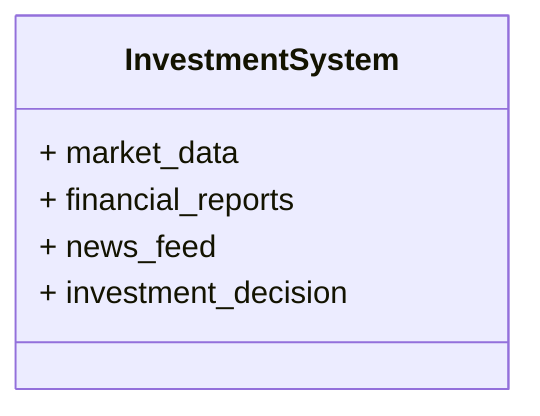
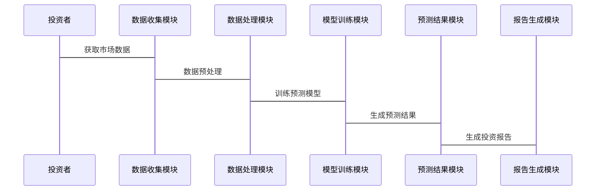

                 


# 价值投资中的人工智能应用：提高效率与洞察

> 关键词：价值投资，人工智能，机器学习，投资组合优化，金融数据分析

> 摘要：本文探讨了人工智能在价值投资中的应用，从数据分析到预测模型，再到系统架构设计，详细分析了如何利用AI技术提高投资效率和洞察力。通过实际案例和算法原理的深入讲解，展示了AI在价值投资中的巨大潜力。

---

## 第1章: 价值投资与人工智能的背景介绍

### 1.1 价值投资的核心概念

#### 1.1.1 价值投资的定义与基本原理
价值投资是一种投资策略，旨在通过分析企业的内在价值，寻找市场价格低于内在价值的股票进行投资。其核心在于寻找被市场低估的公司，长期持有以实现收益。

#### 1.1.2 价值投资的核心要素与决策框架
- **内在价值**：企业未来现金流的现值，用于判断其市场价格是否被低估。
- **安全边际**：买入价格低于内在价值，以降低风险。
- **竞争优势**：分析企业的护城河，确保其长期盈利能力。

#### 1.1.3 价值投资的边界与外延
价值投资不仅限于股票市场，还可应用于债券、房地产等领域。其外延包括基本面分析、市场情绪分析和风险管理。

### 1.2 人工智能在金融领域的潜力

#### 1.2.1 人工智能在金融分析中的应用前景
AI能够处理海量数据，发现传统方法难以察觉的模式，提高分析效率和准确性。

#### 1.2.2 人工智能如何改变投资决策方式
通过实时数据分析和预测模型，AI能够辅助投资者做出更科学的投资决策，减少人为错误。

#### 1.2.3 人工智能在价值投资中的优势与挑战
优势包括高效的数据处理能力、精准的预测模型和持续学习能力。挑战则涉及数据质量、模型过拟合和伦理问题。

### 1.3 本章小结
价值投资与人工智能的结合点在于数据处理和预测模型，AI能够显著提升投资效率和洞察力。

---

## 第2章: 价值投资中的人工智能核心概念与联系

### 2.1 AI在价值投资中的核心概念

#### 2.1.1 数据驱动的决策模型
AI通过分析历史数据，建立预测模型，辅助投资决策。

#### 2.1.2 机器学习在投资组合优化中的应用
通过机器学习优化投资组合，平衡风险与收益。

#### 2.1.3 自然语言处理在财务报表分析中的作用
NLP技术用于分析财务报表中的文本数据，提取关键信息。

### 2.2 核心概念原理与联系

#### 2.2.1 价值投资与AI的实体关系图


### 2.3 本章小结
AI在价值投资中的多维度应用使其成为投资决策的重要工具。

---

## 第3章: 价值投资中的机器学习算法原理

### 3.1 机器学习在价值投资中的应用

#### 3.1.1 监督学习与回归算法
用于预测股票价格，公式为：
$$y = \beta_0 + \beta_1x + \epsilon$$

#### 3.1.2 分类算法在风险评估中的应用
用于分类股票风险等级，构建决策树模型。

#### 3.1.3 聚类算法在市场趋势分析中的作用
用于识别市场趋势，优化投资策略。

### 3.2 算法原理与数学模型

#### 3.2.1 线性回归模型
$$1+1=2$$

#### 3.2.2 随机森林算法


### 3.3 算法实现与案例分析

#### 3.3.1 Python代码实现
```python
import pandas as pd
from sklearn.ensemble import RandomForestRegressor
# 示例代码
data = pd.read_csv('financial_data.csv')
model = RandomForestRegressor()
model.fit(data[['feature1', 'feature2'], data['target'])
```

---

## 第4章: 价值投资的系统架构设计

### 4.1 问题场景介绍
设计一个AI驱动的价值投资系统，涵盖数据收集、分析、预测和报告生成。

### 4.2 系统功能设计

#### 4.2.1 领域模型


#### 4.2.2 系统架构设计


### 4.3 系统接口设计

#### 4.3.1 API接口设计


---

## 第5章: 项目实战

### 5.1 环境安装
安装Python、Pandas、Scikit-learn等工具。

### 5.2 核心实现

#### 5.2.1 数据预处理
清洗数据，处理缺失值和异常值。

#### 5.2.2 特征工程
提取关键特征，如市盈率、市净率等。

#### 5.2.3 模型选择与调优
选择合适的算法，调整参数优化模型。

### 5.3 实际案例分析

#### 5.3.1 数据分析与特征提取
分析历史数据，提取影响股价的关键因素。

#### 5.3.2 模型实现与测试
训练模型并测试其预测能力。

### 5.4 项目小结
通过实战案例，展示了AI在价值投资中的实际应用。

---

## 第6章: 总结与展望

### 6.1 本章总结
AI在价值投资中的应用显著提高了效率和准确性。

### 6.2 未来展望
AI技术将继续发展，推动投资领域的智能化和自动化。

### 6.3 注意事项
- 数据质量至关重要。
- 模型需持续更新。
- 风险管理不可忽视。

### 6.4 拓展阅读
推荐相关书籍和资源，进一步学习AI在金融中的应用。

---

## 作者

作者：AI天才研究院 & 禅与计算机程序设计艺术

---

通过本文的详细分析，读者可以全面了解AI在价值投资中的应用，从理论到实践，为投资决策提供有力支持。

