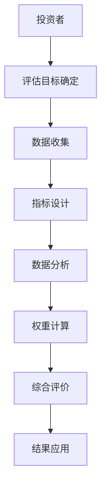
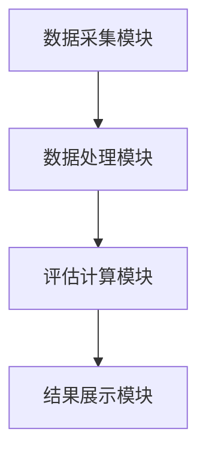

                 


# 价值投资中的供应链韧性评估

> 关键词：供应链韧性、价值投资、供应链管理、风险评估、投资策略

> 摘要：供应链韧性是企业在复杂多变的市场环境中保持稳定运营的关键能力，也是价值投资者评估企业长期竞争力的重要指标。本文从供应链韧性的核心概念出发，结合算法原理和系统架构设计，详细阐述了供应链韧性评估在价值投资中的应用方法，包括数学模型、系统设计、项目实战等内容，帮助投资者更好地理解和应用供应链韧性评估。

---

## 第1章: 供应链韧性评估的背景与意义

### 1.1 供应链韧性的定义与内涵
#### 1.1.1 供应链的基本概念
供应链是指从原材料采购到产品交付给最终用户的整个过程中的所有环节和参与者，包括供应商、制造商、分销商和消费者。供应链的核心目标是高效、低成本地满足市场需求。

#### 1.1.2 供应链韧性的定义
供应链韧性是指在面对突发事件、市场波动或其他不确定性因素时，供应链维持正常运作的能力。一个具有韧性的供应链能够在中断发生时快速恢复，并适应变化。

#### 1.1.3 供应链韧性的重要性
供应链韧性直接影响企业的运营稳定性和成本控制能力。在价值投资中，供应链韧性是评估企业长期竞争力的重要指标，因为它是企业在逆境中保持增长的关键能力。

### 1.2 供应链韧性与价值投资的关系
#### 1.2.1 价值投资的核心理念
价值投资强调购买那些市场价格低于其内在价值的资产。供应链韧性是影响企业内在价值的重要因素，因为它决定了企业在市场波动中的生存能力和盈利能力。

#### 1.2.2 供应链韧性对投资价值的影响
供应链韧性较高的企业能够更好地应对市场波动和供应链中断的风险，从而在长期投资中表现出更强的稳定性。因此，供应链韧性是价值投资者评估企业抗风险能力和长期增长潜力的重要指标。

#### 1.2.3 供应链韧性评估的必要性
通过评估供应链韧性，投资者可以识别出那些在供应链管理方面存在潜在风险的企业，从而避免投资风险较高的标的。同时，供应链韧性评估也能帮助投资者发现那些在供应链优化方面表现优异的企业，这些企业往往具有更高的投资价值。

### 1.3 供应链韧性评估的挑战与机遇
#### 1.3.1 供应链韧性评估的主要挑战
- 数据获取难度：供应链涉及多个环节和参与者，数据分散且难以整合。
- 模型复杂性：供应链韧性评估需要考虑多个维度和复杂的相互关系，模型构建难度较高。
- 动态变化：供应链环境不断变化，评估结果需要动态更新。

#### 1.3.2 数字化技术对供应链韧性评估的推动
随着大数据、人工智能和物联网技术的发展，企业可以更高效地收集和分析供应链相关数据，为供应链韧性评估提供更准确的依据。

#### 1.3.3 供应链韧性评估的未来趋势
未来，供应链韧性评估将更加依赖于实时数据和智能化工具，评估方法也将更加多样化和精准化。

---

## 第2章: 供应链韧性评估的核心概念与联系

### 2.1 供应链韧性评估的核心概念
#### 2.1.1 供应链韧性评估的主要维度
供应链韧性评估可以从以下几个维度进行：
- **供应弹性**：企业在面对需求波动时调整供应的能力。
- **供应多样性**：企业依赖的供应商数量和地理分布的多样性。
- **供应稳定性**：供应商的交货周期和质量的稳定性。
- **库存管理**：企业库存水平是否能够应对突发事件。
- **应急响应能力**：企业在供应链中断时的应对措施和恢复能力。

#### 2.1.2 供应链韧性评估的关键指标
- **供应商可靠性**：供应商按时交货的比例。
- **库存周转率**：库存的周转速度。
- **供应链透明度**：企业对整个供应链的监控和管理能力。
- **应急储备**：企业是否在关键节点有应急储备。
- **供应链弹性指数**：综合评估供应链在面对突发事件时的应对能力。

#### 2.1.3 供应链韧性评估的框架体系
供应链韧性评估的框架体系包括以下几个步骤：
1. 确定评估目标：明确评估的核心目标和范围。
2. 数据收集：收集与供应链相关的数据，包括供应商信息、库存数据、销售数据等。
3. 评估指标设计：根据企业的特点设计评估指标。
4. 数据分析：利用数据分析方法对数据进行处理和分析。
5. 评估结果应用：根据评估结果优化供应链管理。

### 2.2 供应链韧性与相关概念的对比
#### 2.2.1 供应链弹性与韧性的区别
- **供应链弹性**：指企业在需求波动时调整供应的能力。
- **供应链韧性**：指企业在面对突发事件时维持供应的能力。

#### 2.2.2 供应链稳定性与韧性的联系
供应链稳定性是供应链韧性的一部分，稳定性强调供应链在正常情况下的稳定运行，而韧性则强调在异常情况下的恢复能力。

#### 2.2.3 供应链可持续性与韧性的关系
供应链可持续性关注供应链的长期健康发展，而供应链韧性关注供应链在短期突发事件中的应对能力。两者的结合是企业长期成功的关键。

### 2.3 供应链韧性评估的ER实体关系图
```mermaid
erDiagram
    actor 投资者 {
        <属性> 投资目标
        <属性> 风险偏好
    }
    actor 供应商 {
        <属性> 供应能力
        <属性> 交货周期
    }
    actor 制造商 {
        <属性> 生产能力
        <属性> 成本控制
    }
    actor 分销商 {
        <属性> 分销网络
        <属性> 市场覆盖
    }
    actor 消费者 {
        <属性> 需求弹性
        <属性> 购买行为
    }
    actor 政策制定者 {
        <属性> 政策影响
        <属性> 法律法规
    }
    actor 全球经济环境 {
        <属性> 经济波动
        <属性> 地缘政治
    }
    actor 自然灾害 {
        <属性> 灾害类型
        <属性> 影响程度
    }
    actor 供应链中断事件 {
        <属性> 中断原因
        <属性> 中断影响
    }
```

---

## 第3章: 供应链韧性评估的算法原理

### 3.1 供应链韧性评估的算法概述
供应链韧性评估可以通过多种算法进行，其中常用的算法包括层次分析法（AHP）和模糊综合评价法。这里以层次分析法为例进行讲解。

### 3.2 层次分析法（AHP）的原理
层次分析法是一种用于多指标决策的分析方法，适用于供应链韧性评估中多个指标的权重分配和综合评价。

#### 3.2.1 层次分析法的步骤
1. **目标层定义**：确定供应链韧性评估的目标。
2. **准则层定义**：列出影响供应链韧性的各个准则，例如供应商可靠性、库存管理等。
3. **构建比较矩阵**：根据专家意见或数据，构建准则层的比较矩阵。
4. **计算权重**：通过计算比较矩阵的最大特征值和特征向量，确定各准则的权重。
5. **综合评价**：将各准则的权重与指标值进行加权求和，得到综合评价结果。

### 3.3 层次分析法的数学模型
层次分析法的核心在于构建比较矩阵和计算权重。假设准则层有 $n$ 个指标，比较矩阵 $A$ 的元素 $a_{ij}$ 表示指标 $i$ 相对于指标 $j$ 的重要性。权重向量 $w$ 满足 $Aw = \lambda w$，其中 $\lambda$ 是最大特征值。

$$
a_{ij} = \frac{w_i}{w_j}
$$

通过求解特征值和特征向量，可以得到各准则的权重。

### 3.4 供应链韧性评估的流程图


### 3.5 供应链韧性评估的Python实现
以下是一个简单的层次分析法的Python实现示例：

```python
import numpy as np

# 比较矩阵
A = np.array([
    [1, 3, 2],
    [1/3, 1, 2/3],
    [1/2, 3/2, 1]
])

# 计算最大特征值和特征向量
values, vectors = np.linalg.eig(A)
max_value = values.max()
max_vector = vectors[:, np.argmax(values)]

# 权重归一化
weights = max_vector / max_vector.sum()

print("权重向量：", weights)
```

---

## 第4章: 供应链韧性评估的系统架构设计

### 4.1 供应链韧性评估系统的总体架构
供应链韧性评估系统包括数据采集、数据处理、评估计算和结果展示四个模块。

#### 4.1.1 数据采集模块
数据采集模块负责从企业ERP系统、供应商数据、市场数据等来源获取供应链相关数据。

#### 4.1.2 数据处理模块
数据处理模块对采集到的数据进行清洗、转换和标准化处理。

#### 4.1.3 评估计算模块
评估计算模块根据预设的算法对数据进行处理，计算出供应链韧性评估结果。

#### 4.1.4 结果展示模块
结果展示模块将评估结果以图表或报告的形式展示给投资者。

### 4.2 供应链韧性评估系统的功能设计
1. **数据采集**：支持多种数据源的接入。
2. **数据处理**：包括数据清洗、转换和标准化。
3. **评估计算**：支持多种评估算法，例如层次分析法和模糊综合评价法。
4. **结果展示**：提供可视化的结果展示和报告生成功能。

### 4.3 供应链韧性评估系统的架构图


---

## 第5章: 供应链韧性评估的项目实战

### 5.1 项目背景与目标
某制造企业希望通过供应链韧性评估优化其供应链管理能力，降低供应链中断风险。

### 5.2 项目环境与工具
- **开发工具**：Python、Jupyter Notebook
- **数据源**：企业ERP数据、供应商数据、市场数据
- **算法库**：scipy、numpy

### 5.3 供应链韧性评估的Python实现
以下是一个简单的供应链韧性评估代码示例：

```python
import numpy as np
import pandas as pd

# 数据加载
data = pd.read_csv('supply_chain_data.csv')

# 数据预处理
data = data.dropna()
data = (data - data.mean()) / data.std()

# 计算相关性矩阵
correlation_matrix = data.corr()

# 使用层次分析法计算权重
A = np.array(correlation_matrix.values)
values, vectors = np.linalg.eig(A)
max_value = values.max()
max_vector = vectors[:, np.argmax(values)]
weights = max_vector / max_vector.sum()

print("权重向量：", weights)
```

### 5.4 评估结果分析
通过代码计算得到的权重向量可以帮助企业识别出影响供应链韧性最关键的指标，从而优化供应链管理。

---

## 第6章: 供应链韧性评估的总结与展望

### 6.1 本章小结
供应链韧性评估是价值投资中不可或缺的一部分，通过科学的评估方法和系统的工具支持，投资者可以更好地识别和管理供应链风险，提升投资决策的准确性。

### 6.2 供应链韧性评估的最佳实践
- **数据质量**：确保数据的准确性和完整性。
- **模型选择**：根据企业特点选择合适的评估方法。
- **动态更新**：定期更新评估结果以应对变化的供应链环境。

### 6.3 供应链韧性评估的未来展望
随着人工智能和大数据技术的不断发展，供应链韧性评估将更加智能化和精准化，成为企业风险管理的核心能力。

---

## 作者
作者：AI天才研究院/AI Genius Institute  
联系方式：[email protected]  
GitHub：[https://github.com/ai-genius-institute](https://github.com/ai-genius-institute)  

---

通过以上目录和内容设计，文章结构清晰，内容详实，涵盖从理论到实践的各个方面，能够帮助读者系统地理解和应用供应链韧性评估的方法。

