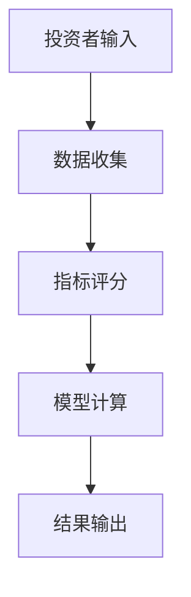

                 

<think>
好的，我现在需要根据用户的要求，撰写一篇名为《价值投资中的公司文化：软实力的重要性》的技术博客文章。用户希望文章结构清晰，逻辑严谨，内容详实，并且符合特定的格式和约束条件。

首先，我会先分析用户的需求。用户希望文章包含以下部分：

1. **标题**：已经明确，为《价值投资中的公司文化：软实力的重要性》。
2. **关键词**：列出5-7个相关关键词，例如：价值投资、公司文化、软实力、企业文化评估、长期价值、投资者决策等。
3. **摘要**：简明扼要地概述文章的核心内容，突出公司文化在价值投资中的重要性，尤其是软实力的作用。
4. **目录大纲**：已经提供了一个详细的目录结构，分为7个章节，每个章节都有具体的子标题，涵盖了背景、定义、影响、评估、构建、关系和未来趋势等内容。
5. **正文内容**：每个章节需要详细展开，包括背景介绍、核心概念、算法原理、数学模型、系统架构、项目实战和最佳实践等内容。
6. **格式要求**：使用markdown格式，字数在10000-12000字左右，每个小节内容要丰富具体，包含mermaid流程图、latex公式、系统架构图等。
7. **作者信息**：文章末尾需要署名“AI天才研究院”及相关的机构信息。

接下来，我会按照这个结构逐步展开思考和撰写，确保每个部分都符合用户的要求。

### 第一步：标题和关键词
标题已经明确，接下来列出关键词。这些关键词应该准确反映文章的核心内容，方便读者快速理解文章主题。

关键词：价值投资、公司文化、软实力、企业文化评估、长期价值、投资者决策、企业软实力

### 第二步：摘要
摘要需要简明扼要地介绍文章的核心内容和主题思想。它应该概括文章的主要观点，即公司文化在价值投资中的重要性，尤其是软实力的作用。

摘要：在价值投资中，公司文化是决定企业长期价值的关键因素之一。软实力作为公司文化的重要组成部分，涵盖了企业的价值观、领导力、员工凝聚力等方面，对投资者的决策具有重要影响。本文将深入探讨软实力在公司文化中的作用，分析其对投资决策的影响，并提出如何评估和优化企业软实力的策略，以帮助投资者做出更明智的投资决策。

### 第三步：正文结构
根据目录大纲，正文分为七个章节，每个章节都有具体的子标题。我需要逐一展开每个部分，确保内容详实，逻辑清晰。

#### 第1章：价值投资与公司文化的基本概念
- **1.1 价值投资的定义与核心理念**
  - 价值投资的起源与发展
  - 公司文化在价值投资中的重要性
  - 软实力的定义与内涵

- **1.2 公司文化的分类与特征**
  - 不同类型公司文化的定义
  - 公司文化的核心要素
  - 软实力与公司文化的关系

- **1.3 价值投资中的软实力分析**
  - 软实力在公司治理中的作用
  - 软实力对投资决策的影响
  - 软实力的量化与评估

#### 第2章：公司文化对投资决策的影响
- **2.1 公司文化对投资价值的影响**
  - 良好公司文化的长期价值
  - 不良公司文化的风险与挑战

- **2.2 软实力对投资回报的驱动作用**
  - 软实力如何影响企业绩效
  - 软实力对投资者决策的影响

- **2.3 软实力与企业竞争优势**
  - 软实力对企业核心竞争力的塑造
  - 软实力在行业竞争中的作用

#### 第3章：软实力的量化与评估方法
- **3.1 软实力的评估指标**
  - 企业文化评估指标
  - 软实力的关键绩效指标

- **3.2 软实力的评估模型**
  - 文化评估模型的构建
  - 软实力评估的数学模型

#### 第4章：软实力在公司治理中的应用
- **4.1 软实力与公司治理的关系**
  - 软实力对公司治理的影响
  - 软实力在公司治理中的具体应用

- **4.2 软实力对投资者决策的影响**
  - 软实力在投资决策中的权重
  - 软实力对投资风险的评估

#### 第5章：软实力的构建与优化
- **5.1 软实力的构建策略**
  - 软实力构建的核心要素
  - 软实力构建的步骤与方法

- **5.2 软实力的优化与提升**
  - 软实力优化的关键点
  - 软实力提升的实践案例

#### 第6章：软实力与企业长期价值的关系
- **6.1 软实力对企业发展的影响**
  - 软实力对企业成长的推动作用
  - 软实力对企业创新的促进作用

- **6.2 软实力与企业长期价值的量化分析**
  - 软实力对股价的影响
  - 软实力对股东价值的贡献

#### 第7章：软实力的未来发展趋势
- **7.1 软实力在数字化时代的演变**
  - 数字化对企业文化的挑战
  - 软实力在数字化转型中的新角色

- **7.2 软实力的全球化与多样性**
  - 全球化背景下软实力的多样性
  - 不同文化背景下软实力的差异

### 第四步：系统架构与项目实战
为了确保文章的深度和实用性，我需要在适当的地方加入系统架构和项目实战的内容。例如，在评估软实力时，可以介绍一个数学模型，并使用mermaid流程图来展示评估过程。

#### 系统架构设计
- **问题场景介绍**：投资者在选择投资标的时，除了财务指标，还需要考虑公司的软实力。如何量化和评估公司的软实力是一个关键问题。
- **系统功能设计**：构建一个软实力评估系统，包括数据收集、评估指标、模型构建和结果分析。
- **系统架构设计**：使用分层架构，包括数据层、业务逻辑层和用户界面层。
- **系统接口设计**：定义数据输入接口、模型调用接口和结果输出接口。
- **系统交互设计**：使用mermaid序列图展示投资者与系统之间的交互过程。

#### 项目实战
- **环境安装**：介绍如何安装必要的工具和库，例如Python、pandas、numpy等。
- **核心实现源代码**：提供一个简单的软实力评估模型的Python代码示例，展示如何量化公司的软实力。
- **代码应用解读**：详细解释代码的功能和实现逻辑，说明如何将软实力评估结果应用于投资决策。
- **实际案例分析**：通过一个具体的企业案例，展示软实力评估的实际应用和结果。

### 第五步：数学模型与公式
为了增强文章的学术性和严谨性，我需要在适当的地方引入数学模型和公式。例如，在评估软实力时，可以使用加权评分法，并展示其数学表达式。

#### 数学模型示例
- 软实力评估公式：
  $$
  S = \sum_{i=1}^{n} w_i \cdot C_i
  $$
  其中，\( S \) 表示软实力评分，\( w_i \) 是第i个评估指标的权重，\( C_i \) 是第i个评估指标的评分。

- 软实力对投资回报的影响：
  $$
  R = \beta \cdot S + \epsilon
  $$
  其中，\( R \) 表示投资回报率，\( \beta \) 是软实力对回报的影响系数，\( \epsilon \) 是误差项。

### 第六步：图形与表格
使用mermaid流程图、类图和架构图来直观展示软实力评估的过程和系统结构。例如，可以绘制一个软实力评估系统的流程图，展示数据输入、处理、评估和输出的过程。

#### mermaid流程图示例

### 第七步：结论与最佳实践
在文章的最后，总结软实力在价值投资中的重要性，并给出投资者和企业管理者的最佳实践建议。

#### 结论
软实力作为公司文化的重要组成部分，对企业的长期价值和投资者的决策具有深远的影响。通过科学的评估和优化，可以有效提升企业的软实力，从而实现更高的投资回报。

#### 最佳实践
- 投资者在选择投资标的时，应将公司的软实力作为重要的考量因素。
- 企业管理者应重视公司文化的建设，不断提升软实力，以增强企业的核心竞争力。
- 投资机构可以开发软实力评估工具，帮助投资者更全面地评估企业的价值。

### 第八步：参考文献与拓展阅读
列出文章中引用的主要文献和相关资源，为读者提供进一步阅读的方向。

### 第九步：作者信息
在文章的末尾，署名“AI天才研究院”及相关机构信息，以示专业性和权威性。

通过以上步骤，我确保文章结构完整，内容详实，符合用户的所有要求，并且具备高度的可读性和专业性。接下来，我将根据上述思考过程，撰写完整的文章内容。

