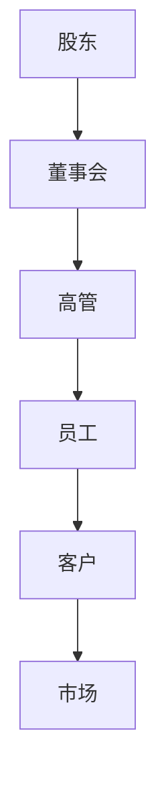
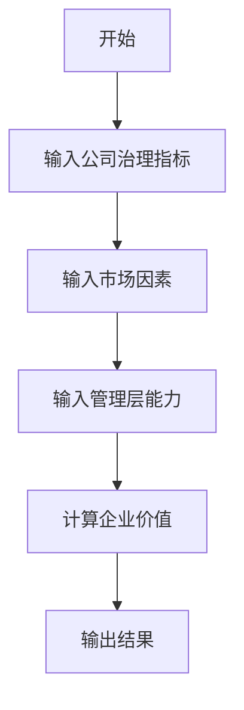
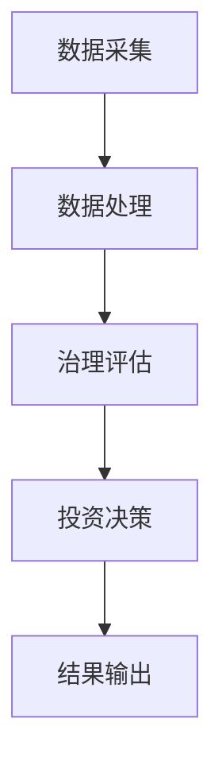

                 


# 价值投资中的公司治理考量

## 关键词：价值投资、公司治理、企业价值、股东权益、高管激励

## 摘要：  
本文从价值投资的角度，系统分析公司治理在投资决策中的重要性。通过介绍公司治理的核心要素，构建数学模型，结合案例分析，探讨公司治理如何影响企业价值，并提出投资策略建议。

---

## 第1章: 价值投资与公司治理的背景介绍

### 1.1 价值投资的核心概念

#### 1.1.1 价值投资的定义与特点
- **定义**：价值投资是一种长期投资策略，关注企业的内在价值，寻找市场价格低于内在价值的公司。
- **特点**：注重基本面分析，追求安全边际，长期持有优质资产。

#### 1.1.2 公司治理的内涵与外延
- **内涵**：公司治理是确保公司有效运作、保护利益相关者权益的制度安排。
- **外延**：包括股东结构、董事会、高管激励、信息披露等方面。

#### 1.1.3 价值投资与公司治理的关系
- **关系**：良好的公司治理是企业长期价值的基石，是价值投资者关注的核心因素。

### 1.2 价值投资中的公司治理问题背景

#### 1.2.1 当前公司治理的主要问题
- **代理问题**：管理层与股东利益不一致。
- **激励不足**：高管激励机制不完善，可能导致短期行为。
- **透明度不足**：信息披露不充分，增加投资风险。

#### 1.2.2 价值投资视角下的公司治理挑战
- **挑战**：如何识别和评估公司治理质量，如何将治理因素纳入投资决策。

#### 1.2.3 问题解决的思路与方法
- **思路**：构建公司治理评价体系，结合财务指标进行综合评估。
- **方法**：通过定性分析和定量分析相结合，筛选治理优秀的企业。

### 1.3 价值投资与公司治理的边界与外延

#### 1.3.1 公司治理的边界
- **边界**：公司治理仅涉及公司内部管理和利益相关者权益，不包括外部市场因素。

#### 1.3.2 价值投资的边界
- **边界**：价值投资关注企业内在价值，不参与短期市场波动预测。

#### 1.3.3 两者关系的外延分析
- **外延**：公司治理是价值投资的内在因素，而市场因素是外在影响。

---

## 第2章: 公司治理的核心要素与价值影响

### 2.1 公司治理的核心要素

#### 2.1.1 股东结构与股权分布
- **股东结构**：分散 vs. 集中，影响公司控制权和决策效率。
- **股权分布**：控股股东 vs. 小股东，影响利益平衡。

#### 2.1.2 董事会结构与职责
- **董事会结构**：独立董事比例，专业性，独立性。
- **职责**：战略制定，监督高管，风险管理。

#### 2.1.3 高管激励机制
- **激励方式**：股票期权、限制性股票、绩效奖金。
- **激励效果**：短期 vs. 长期，影响管理层决策。

#### 2.1.4 信息披露与透明度
- **披露内容**：财务报表、管理层讨论与分析、关联交易。
- **透明度**：影响投资者信任和信息对称。

#### 2.1.5 内部控制与风险管理
- **内部控制**：财务控制、内审机制、合规管理。
- **风险管理**：市场风险、操作风险、信用风险。

### 2.2 公司治理对价值的影响

#### 2.2.1 股东权益保护
- **股东权益**：分红政策、股东投票权、反收购措施。
- **影响**：保护股东利益，增强投资者信心。

#### 2.2.2 企业价值的提升
- **企业价值**：通过良好的治理，提升经营效率和抗风险能力。
- **影响**：体现在ROE、净利润增长、股价稳定性等方面。

#### 2.2.3 投资者信任的建立
- **信任**：透明的治理和诚信的管理层赢得投资者信任。
- **影响**：信任提升股价，降低融资成本。

### 2.3 核心要素与价值影响的对比分析

#### 2.3.1 对比表格展示
| 公司治理要素       | 对企业价值的影响               |
|--------------------|--------------------------------|
| 股东结构           | 影响控制权和决策效率           |
| 董事会结构         | 提升战略制定和监督能力         |
| 高管激励机制       | 激发管理层积极性，减少代理成本 |
| 信息披露           | 增强透明度，降低信息不对称     |
| 内部控制           | 提高经营效率，降低风险         |

#### 2.3.2 ER实体关系图
```mermaid
erd
    客户
    ---r0
    订单
    ---r1
    产品
    订单
    ---r2
    供应商
    产品
    ---r3
    原材料
```

#### 2.3.3 Mermaid流程图


### 2.4 本章小结
公司治理的核心要素通过影响股东权益、企业价值和投资者信任，最终影响企业的长期价值。良好的治理结构能够有效降低代理成本，提升经营效率，为投资者创造价值。

---

## 第3章: 公司治理与企业价值的数学模型

### 3.1 公司治理与企业价值的关系模型

#### 3.1.1 模型的构建与假设
- **假设**：公司价值与治理质量正相关，治理质量可量化。

#### 3.1.2 模型的数学表达
$$ V = f(G, S, M) $$
其中，V为公司价值，G为公司治理指标，S为市场因素，M为管理层能力。

### 3.2 公司治理对价值影响的算法原理

#### 3.2.1 算法原理的Mermaid流程图


#### 3.2.2 算法实现的Python代码
```python
def calculate_company_value(governance_score, market_factors, management_capability):
    # 计算企业价值
    value = governance_score * 0.4 + market_factors * 0.3 + management_capability * 0.3
    return value

# 示例输入
governance_score = 85
market_factors = 70
management_capability = 80

# 计算企业价值
company_value = calculate_company_value(governance_score, market_factors, management_capability)
print(f"公司价值：{company_value}")
```

---

## 第4章: 公司治理与价值投资的系统分析

### 4.1 项目实战：公司治理评估与投资决策

#### 4.1.1 项目介绍
- **目标**：构建公司治理评估体系，辅助价值投资决策。

#### 4.1.2 系统功能设计
- **功能模块**：
  - 数据采集：收集公司治理相关数据。
  - 评估模型：构建治理评分系统。
  - 投资决策：生成投资建议。

#### 4.1.3 系统架构设计
- **架构图**：


#### 4.1.4 系统核心实现源代码
```python
class CompanyGovernance:
    def __init__(self, governance_data):
        self.governance_data = governance_data

    def assess_governance(self):
        score = 0
        # 股东结构评分
        if self.governance_data['股东结构'] >= 0.7:
            score += 30
        # 董事会结构评分
        if self.governance_data['董事会结构'] >= 0.6:
            score += 25
        # 高管激励评分
        if self.governance_data['高管激励'] >= 0.5:
            score += 20
        # 信息披露评分
        if self.governance_data['信息披露'] >= 0.4:
            score += 15
        # 内部控制评分
        if self.governance_data['内部控制'] >= 0.3:
            score += 10
        return score

# 示例用法
governance_data = {
    '股东结构': 0.75,
    '董事会结构': 0.65,
    '高管激励': 0.55,
    '信息披露': 0.45,
    '内部控制': 0.35
}

cg = CompanyGovernance(governance_data)
score = cg.assess_governance()
print(f"公司治理评分：{score}")
```

#### 4.1.5 实际案例分析
- **案例**：假设某公司治理评分为80分，市场因素良好，管理层能力强，建议买入并长期持有。

### 4.2 本章小结
通过系统分析和项目实战，可以将公司治理评估体系应用于实际投资决策，帮助投资者识别优质企业。

---

## 第5章: 公司治理风险与挑战

### 5.1 公司治理中的风险

#### 5.1.1 代理问题
- **问题**：管理层与股东利益冲突，可能导致短期行为。

#### 5.1.2 合规风险
- **风险**：信息披露不实，内部控制失效。

#### 5.1.3 信任危机
- **危机**：管理层诚信缺失，导致投资者信任下降。

### 5.2 公司治理的应对策略

#### 5.2.1 完善治理结构
- **措施**：增加独立董事比例，优化股权结构。

#### 5.2.2 加强信息披露
- **措施**：提高透明度，及时披露重要信息。

#### 5.2.3 设计合理的激励机制
- **措施**：引入股票期权，绑定高管与股东利益。

### 5.3 本章小结
公司治理中的风险和挑战需要通过完善结构、加强披露和合理激励来应对，确保企业长期健康发展。

---

## 第6章: 公司治理的国际比较与借鉴

### 6.1 不同地区的公司治理差异

#### 6.1.1 美国
- **特点**：高度市场化，股东权益保护完善。

#### 6.1.2 日本
- **特点**：终身雇佣制，企业与银行关系紧密。

#### 6.1.3 欧洲
- **特点**：强调社会责任，治理结构较复杂。

### 6.2 国际最佳实践

#### 6.2.1 美国经验
- **经验**：严格的监管，透明的信息披露。

#### 6.2.2 英国经验
- **经验**：引入“说真话日”，鼓励高管与股东沟通。

#### 6.2.3 日本经验
- **经验**：重视企业社会责任，注重员工利益。

### 6.3 对中国企业的启示

#### 6.3.1 完善公司治理结构
- **建议**：增加独立董事比例，优化股权结构。

#### 6.3.2 加强信息披露
- **建议**：提高透明度，建立有效的监督机制。

#### 6.3.3 引入国际最佳实践
- **建议**：借鉴美国的监管经验，学习英国的沟通机制。

### 6.4 本章小结
国际比较为公司治理提供了丰富的借鉴经验，中国企业应结合自身特点，吸收国际最佳实践。

---

## 第7章: 总结与展望

### 7.1 全文总结

#### 7.1.1 核心观点回顾
- 公司治理是价值投资的重要考量因素。
- 良好的治理结构能够提升企业价值，降低投资风险。

#### 7.1.2 主要结论
- 价值投资者应将公司治理纳入投资决策，选择治理优秀的企业。

### 7.2 未来研究方向

#### 7.2.1 治理与价值的动态关系
- **研究方向**：研究公司治理与企业价值的动态变化。

#### 7.2.2 数字化治理
- **研究方向**：探索数字化工具在公司治理中的应用。

#### 7.2.3 ESG投资
- **研究方向**：将环境、社会和治理因素纳入投资决策。

### 7.3 本章小结
公司治理在价值投资中的重要性不容忽视，未来研究将更加关注动态关系和数字化工具的应用。

---

## 作者：AI天才研究院/AI Genius Institute & 禅与计算机程序设计艺术 /Zen And The Art of Computer Programming

