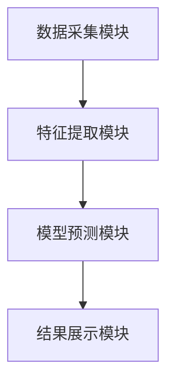

                 


# 价值投资中的周期性：理解行业和经济周期

**关键词**：价值投资、周期性、经济周期、行业周期、投资策略、技术分析

**摘要**：  
本文深入探讨了周期性在价值投资中的重要性，分析了行业周期和经济周期的相互作用，并结合实际案例，详细介绍了如何通过周期性分析制定有效的投资策略。文章从基本概念出发，逐步分析周期性对投资决策的影响，结合数学模型和系统架构，提供了实用的工具和方法，帮助投资者更好地理解周期性，抓住投资机会，规避风险。

---

## 第一部分：引言

### 第1章：周期性在价值投资中的重要性

#### 1.1 周期性的定义与核心概念
周期性是指事物在时间和空间上呈现规律性波动的特性。在价值投资中，周期性主要体现在行业和经济的整体波动上。  
- **周期性定义**：周期性是指变量（如价格、利润、经济指标等）在一定时间内重复出现的波动模式。  
- **周期性与价值投资的关系**：价值投资者通过识别周期性波动，可以在市场低估时买入优质资产，在高估时卖出，从而实现超额收益。

#### 1.2 价值投资的核心理念
价值投资强调购买被市场低估的资产，长期持有，等待其价值回归。周期性分析是价值投资的重要工具，因为它可以帮助投资者识别市场的短期波动，并抓住长期趋势中的机会。

#### 1.3 本文的研究意义
本文旨在通过分析行业和经济周期，为投资者提供一套系统化的周期性分析框架，帮助其在不同周期阶段制定最优投资策略。

---

## 第二部分：行业周期分析

### 第2章：行业周期的基本理论

#### 2.1 行业生命周期的四个阶段
行业的生命周期通常分为四个阶段：初创阶段、成长阶段、成熟阶段和衰退阶段。

| 阶段 | 特点 | 投资策略 |
|------|------|----------|
| 初创阶段 | 高增长，高风险 | 寻找具有创新商业模式的企业 |
| 成长阶段 | 市场扩大，竞争加剧 | 选择具有竞争优势的企业 |
| 成熟阶段 | 市场饱和，增长放缓 | 重视分红和稳定的现金流 |
| 衰退阶段 | 市场萎缩，企业盈利能力下降 | 减持或退出 |

#### 2.2 行业周期的影响因素
行业周期受多种因素影响，包括技术进步、市场需求、政策变化和竞争格局等。

#### 2.3 行业周期的识别方法
- **历史数据分析法**：通过分析行业历史数据，识别行业周期的波动规律。
- **K线图分析法**：通过股票价格走势判断行业周期。
- **财务指标分析法**：通过ROE、净利润增长率等指标判断行业周期。

### 第3章：行业周期与投资策略

#### 3.1 不同行业周期阶段的投资策略
- **初创阶段**：寻找具有创新能力和巨大市场潜力的企业。
- **成长阶段**：关注市场份额扩大、利润率提升的企业。
- **成熟阶段**：选择具有稳定现金流和高分红的龙头企业。
- **衰退阶段**：避免投资衰退行业，或寻找转型成功的个股。

#### 3.2 行业周期与企业竞争优势
在不同行业周期阶段，企业竞争优势的表现不同。例如，在成长阶段，技术创新是竞争优势的核心；在成熟阶段，成本控制和品牌影响力是关键。

#### 3.3 行业周期与估值分析
行业周期影响企业的估值。例如，在衰退阶段，企业估值可能被低估，为投资者提供买入机会。

---

## 第三部分：经济周期分析

### 第4章：经济周期的基本理论

#### 4.1 经济周期的四个阶段
经济周期通常分为衰退、复苏、繁荣和衰退。

#### 4.2 经济周期对投资的影响
- **衰退阶段**：市场情绪低落，资产价格被低估。
- **复苏阶段**：经济逐渐恢复，市场情绪好转。
- **繁荣阶段**：市场情绪高涨，资产价格可能被高估。
- **衰退阶段**：市场情绪恐慌，资产价格大幅波动。

### 第5章：行业周期与经济周期的综合分析

#### 5.1 经济周期对行业周期的影响
经济周期通过影响市场需求、政策环境和技术进步等因素，对行业周期产生深远影响。

#### 5.2 行业周期与经济周期的互动关系
- 在经济衰退阶段，某些行业的需求可能下降（如奢侈品），而其他行业的需求可能上升（如防御性行业）。
- 在经济繁荣阶段，周期性行业的表现通常优于防御性行业。

---

## 第四部分：基于周期的价值投资策略

### 第6章：防御性投资策略

#### 6.1 防御性行业的特征
防御性行业通常在经济衰退阶段表现稳定，例如公用事业、医疗保健和消费品行业。

#### 6.2 防御性投资的适用场景
在经济衰退阶段，防御性行业可以提供稳定的投资回报。

### 第7章：周期性股票的投资机会

#### 7.1 周期性股票的定义
周期性股票是指那些收益和行业周期高度相关的股票，例如原材料、工业和科技行业的股票。

#### 7.2 周期性股票的投资策略
- **低估值买入**：在行业周期低谷时，寻找被市场低估的周期性股票。
- **高景气卖出**：在行业周期高峰时，卖出高估的周期性股票。

### 第8章：利用周期波动获利

#### 8.1 周期性波动的特征
周期性波动通常表现为价格的剧烈波动，投资者可以通过波段操作获利。

#### 8.2 波段操作的策略
- **短期波动**：关注市场情绪和短期事件的影响。
- **中期波动**：分析行业和经济周期的变化。

---

## 第五部分：系统架构与算法实现

### 第9章：周期性分析的系统架构

#### 9.1 系统功能设计
- 数据采集模块：采集行业和经济指标数据。
- 特征提取模块：提取周期性特征。
- 模型预测模块：预测周期性变化。
- 结果展示模块：展示分析结果。

#### 9.2 系统架构图


### 第10章：周期性分析的算法实现

#### 10.1 基于ARIMA模型的周期性预测
- **ARIMA模型**：自回归积分滑动平均模型，适用于时间序列数据的预测。
- **Python代码实现**
  ```python
  from statsmodels.tsa.arima.model import ARIMA
  import pandas as pd
  import matplotlib.pyplot as plt

  # 示例数据：假设data是时间序列数据
  model = ARIMA(data, order=(5,1,0))
  model_fit = model.fit()

  # 预测未来5步
  forecast = model_fit.forecast(steps=5)
  ```

#### 10.2 周期性分析的数学模型
- **ARIMA模型公式**
  $$
  \phi(B)X_t = \theta(B)\epsilon_t
  $$
  其中，$B$ 是后移算子，$\phi(B)$ 和 $\theta(B)$ 分别是自回归和滑动平均多项式。

---

## 第六部分：项目实战

### 第11章：行业周期分析实战

#### 11.1 项目背景
以科技行业为例，分析其周期性波动。

#### 11.2 数据准备
- 数据来源：历史股价、财务数据、行业报告。

#### 11.3 数据分析与建模
使用ARIMA模型预测科技行业的周期性变化。

#### 11.4 结果展示
通过图表展示分析结果，并制定相应的投资策略。

---

## 第七部分：总结与展望

### 第12章：总结

#### 12.1 本文的核心观点
周期性分析是价值投资的重要工具，可以帮助投资者在不同周期阶段制定最优策略。

#### 12.2 本文的创新点
- 提供了系统化的周期性分析框架。
- 结合数学模型和实际案例，展示了周期性分析的实践应用。

### 第13章：展望

#### 13.1 未来的研究方向
- 更复杂周期模型的构建。
- 多因素周期性分析的应用。

#### 13.2 致谢
感谢读者的支持和关注。

---

**作者：AI天才研究院/AI Genius Institute & 禅与计算机程序设计艺术 /Zen And The Art of Computer Programming**

