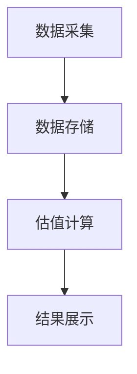
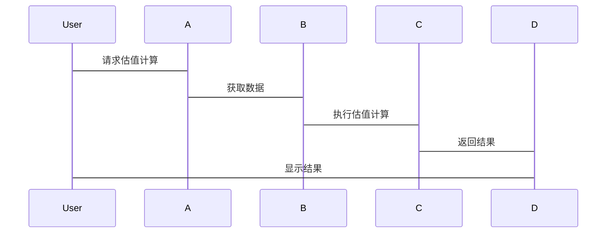

                 


# 价值投资中的周期股估值策略

## 关键词：价值投资、周期股、估值策略、DCF模型、市盈率、市净率

## 摘要：  
价值投资是一种长期投资策略，强调以低于内在价值的价格购买优质资产。周期股因其受经济周期影响较大，常被视为价值投资的理想标的。本文将深入探讨周期股的估值策略，结合数学模型和实际案例，分析如何利用DCF模型、市盈率、市净率等方法进行周期股的估值，帮助投资者识别低估机会，制定科学的投资决策。

---

## 第一部分：周期股估值策略的背景与基础

### 第1章：周期股与价值投资概述

#### 1.1 周期股的基本概念
- **1.1.1 什么是周期股**  
  周期股是指受经济周期波动显著影响的股票，常见于制造业、材料行业、能源等行业。周期股的盈利能力通常随经济周期波动，价格也会随之出现较大波动。

- **1.1.2 周期股的分类与特点**  
  周期股可以分为强周期性和弱周期性股票。强周期性股票受经济波动影响较大，如建筑材料公司；弱周期性股票受经济波动影响较小，如部分技术制造业。

- **1.1.3 周期股在价值投资中的重要性**  
  在经济低谷时，周期股可能被市场低估，为价值投资者提供投资机会。周期股的周期性波动使其成为价值投资的理想标的。

#### 1.2 价值投资的基本原理
- **1.2.1 价值投资的核心理念**  
  价值投资强调购买价格低于内在价值的资产。投资者通过分析公司的基本面，寻找市场低估的股票。

- **1.2.2 价值投资与周期股的结合**  
  周期股在经济低谷时可能被低估，价值投资者可以通过买入低估的周期股，在经济复苏时获得超额收益。

- **1.2.3 价值投资的长期视角**  
  价值投资强调长期持有，避免短期市场波动的干扰。周期股的周期性波动为长期投资者提供了耐心持有、等待价值回归的机会。

#### 1.3 周期股投资的挑战与机遇
- **1.3.1 周期性波动的挑战**  
  周期股的价格波动较大，投资者需要具备较高的风险承受能力，同时要识别周期性波动的底部。

- **1.3.2 周期股投资的潜在收益**  
  在经济低谷时买入低估的周期股，经济复苏时卖出，可以获得较高的收益。

- **1.3.3 如何应对周期性波动**  
  通过基本面分析和估值模型，识别周期股的合理估值区间，避免在市场高点买入，耐心等待周期性底部的机会。

---

## 第二部分：周期股估值的核心概念与方法

### 第2章：周期股估值的基本原理

#### 2.1 周期股估值的核心概念
- **2.1.1 市盈率（P/E）与市净率（P/B）**  
  市盈率=股价/每股收益，市净率=股价/每股净资产。这两个指标可以帮助投资者评估股票的估值水平。

- **2.1.2 周期性调整的必要性**  
  周期股的估值需要考虑其周期性波动，避免在市场高点或低点进行简单的横向比较。

- **2.1.3 估值的动态变化**  
  周期股的估值需要动态调整，结合行业周期和公司基本面变化进行评估。

#### 2.2 周期股估值的关键指标
- **2.2.1 盈利能力分析**  
  通过ROE（净资产收益率）和ROA（资产收益率）等指标评估公司的盈利能力。

- **2.2.2 财务杠杆与流动性**  
  高杠杆的公司可能在经济低谷时面临更大的风险，而流动性好的公司更容易在周期波动中保持稳定。

- **2.2.3 行业周期与市场地位**  
  行业周期和公司的市场地位影响其盈利能力和抗风险能力，从而影响其估值。

---

## 第三部分：周期股估值的算法与数学模型

### 第3章：周期股估值的数学模型

#### 3.1 常见估值模型概述
- **3.1.1 市盈率模型**  
  通过比较股票的市盈率与行业平均市盈率，评估其估值水平。

- **3.1.2 市净率模型**  
  通过比较股票的市净率与行业平均市净率，评估其估值水平。

- **3.1.3 现金流折现模型（DCF）**  
  DCF模型通过将未来现金流折现，计算股票的内在价值。

#### 3.2 市盈率与市净率的比较
- **3.2.1 市盈率的计算与应用**  
  市盈率=股价/每股收益，适用于盈利稳定的公司，但在周期股中，需考虑周期性波动的影响。

- **3.2.2 市净率的计算与应用**  
  市净率=股价/每股净资产，适用于净资产较多的公司，如银行、制造业。

- **3.2.3 市盈率与市净率的优缺点对比**  
  | 指标 | 优点 | 缺点 |
  |------|------|------|
  | 市盈率 | 直接反映盈利能力 | 不适用于亏损公司 |
  | 市净率 | 反映资产价值 | 不反映盈利能力 |

#### 3.3 现金流折现模型（DCF）的详细讲解
- **3.3.1 DCF模型的基本原理**  
  DCF模型通过预测未来现金流，并将其折现为现值，评估股票的内在价值。

- **3.3.2 DCF模型的数学公式**  
  $$DCF = \sum_{t=1}^{n} \frac{CF_t}{(1+r)^t} + \frac{TV}{(1+r)^n}$$  
  其中，$CF_t$为第t年的现金流，$r$为折现率，$TV$为终值。

- **3.3.3 DCF模型的步骤与应用**  
  1. 预测未来现金流。
  2. 选择合适的折现率。
  3. 计算现值，得出内在价值。
  4. 与市场价格进行比较，判断是否低估或高估。

---

## 第四部分：周期股估值的系统分析与架构设计

### 第4章：周期股估值系统的构建

#### 4.1 系统功能设计
- **4.1.1 数据采集模块**  
  采集周期股的财务数据、行业数据和市场数据。

- **4.1.2 估值计算模块**  
  使用DCF模型、市盈率、市净率等方法进行估值。

- **4.1.3 结果展示模块**  
  展示估值结果，提供可视化分析。

#### 4.2 系统架构设计


#### 4.3 系统接口设计
- 数据接口：与数据库或API对接，获取数据。
- 计算接口：接受输入数据，执行估值计算。
- 展示接口：将结果以图表或表格形式展示。

#### 4.4 系统交互设计


---

## 第五部分：周期股估值的项目实战

### 第5章：周期股估值的实战分析

#### 5.1 环境安装
- 安装Python、Pandas、Matplotlib等工具。

#### 5.2 核心实现源代码
```python
import pandas as pd
import numpy as np

def calculate_dcf(cash_flows, discount_rate, terminal_value):
    dcf = 0
    for t, cf in enumerate(cash_flows):
        if t == 0:
            dcf += cf
        else:
            dcf += cf / (1 + discount_rate) ** t
    dcf += terminal_value / (1 + discount_rate) ** len(cash_flows)
    return dcf

# 示例数据
cash_flows = [100, 150, 200, 250]
discount_rate = 0.1
terminal_value = 300

dcf_value = calculate_dcf(cash_flows, discount_rate, terminal_value)
print(f"DCF Value: {dcf_value:.2f}")
```

#### 5.3 案例分析与解读
- 选择某周期性公司，分析其财务数据，计算DCF模型的内在价值。
- 比较市场价格与内在价值，判断是否低估。

---

## 第六部分：周期股估值的最佳实践与总结

### 第6章：总结与注意事项

#### 6.1 最佳实践
- 结合多种估值方法，如DCF、市盈率、市净率，进行交叉验证。
- 长期关注行业周期和公司基本面变化。
- 风险管理，避免过度集中投资单一周期性行业。

#### 6.2 小结
周期股估值需要结合数学模型和实际案例分析，通过动态调整和多方法验证，才能准确识别低估机会，制定科学的投资策略。

#### 6.3 注意事项
- 市场波动较大时，周期股价格可能严重偏离内在价值。
- 需要长期关注行业和公司基本面变化，及时调整估值模型。

#### 6.4 拓展阅读
推荐阅读格雷厄姆的《证券分析》和彼得·林奇的《选股之道》，深入理解价值投资的精髓。

---

## 作者：AI天才研究院/AI Genius Institute & 禅与计算机程序设计艺术 /Zen And The Art of Computer Programming

